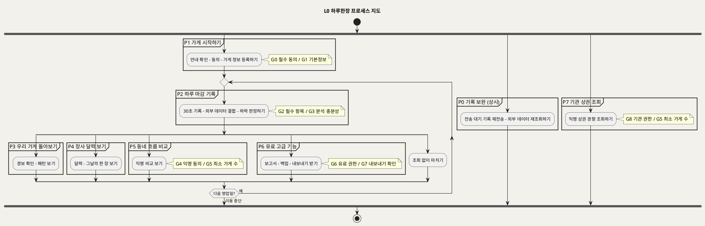
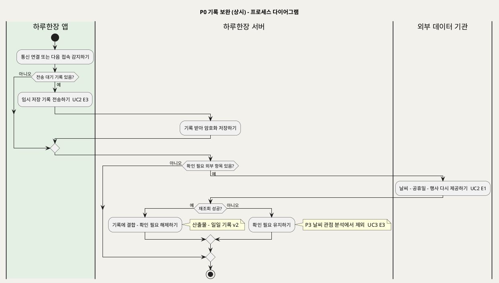
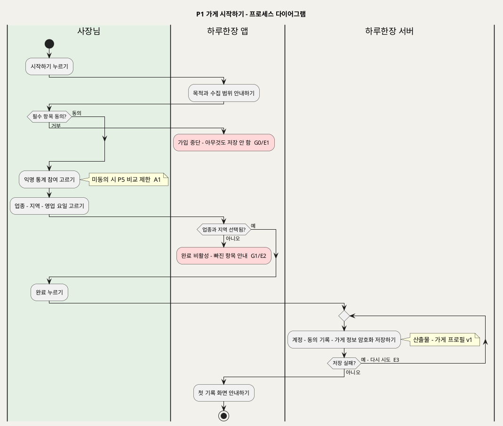
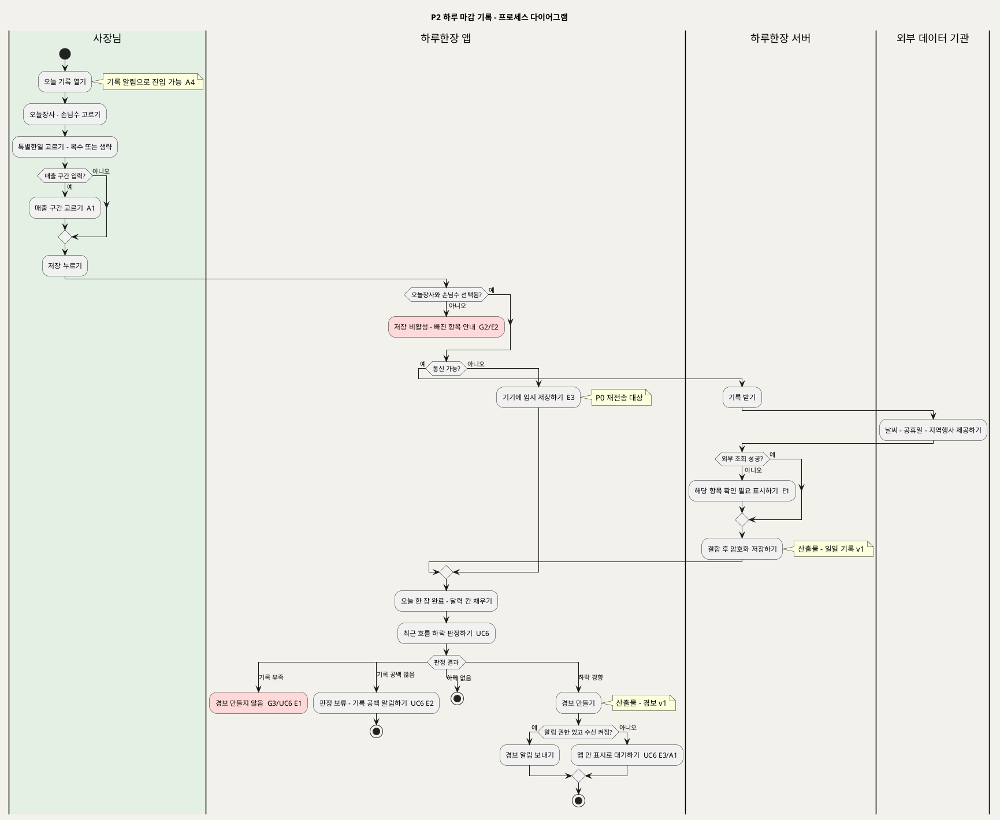
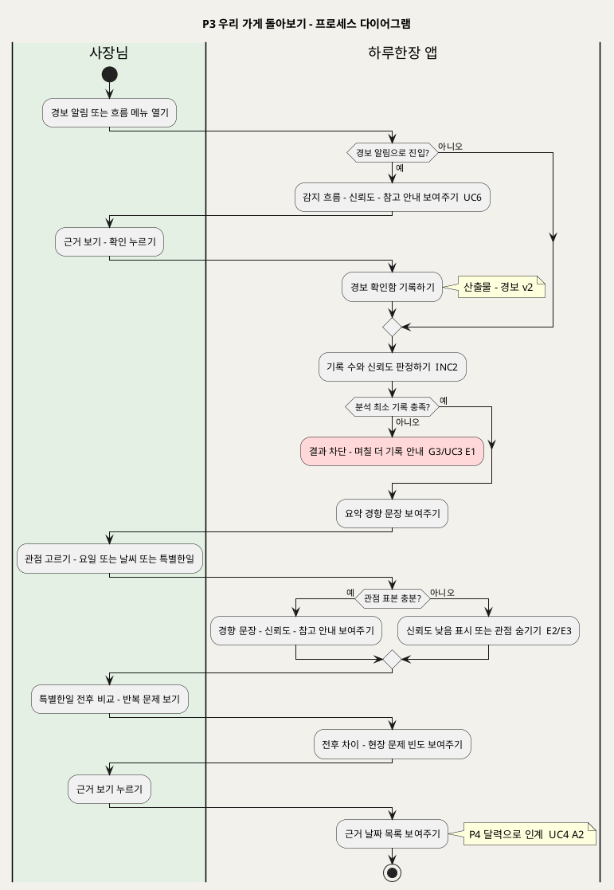
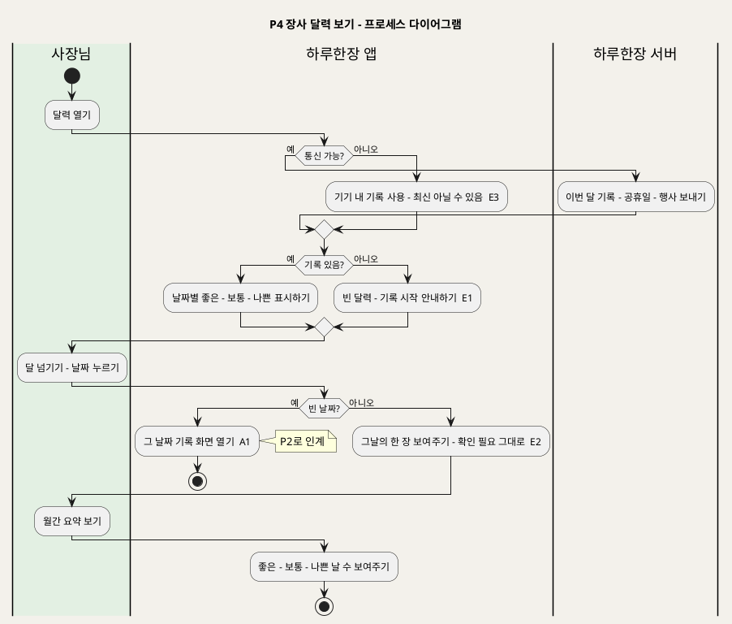
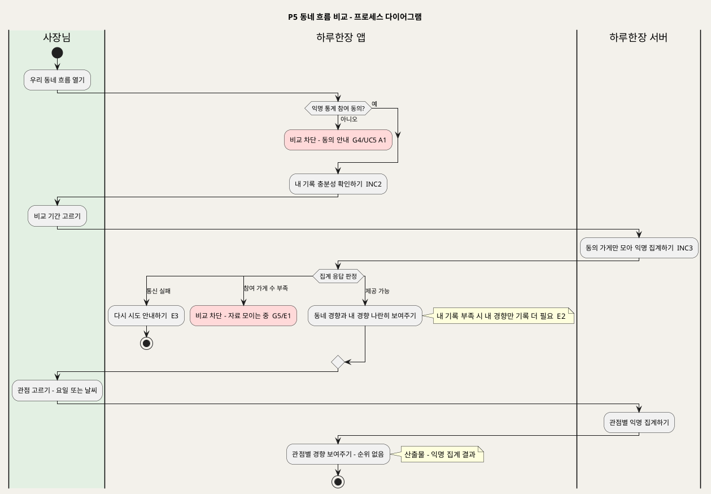
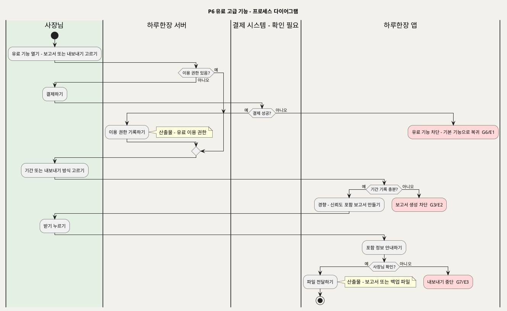
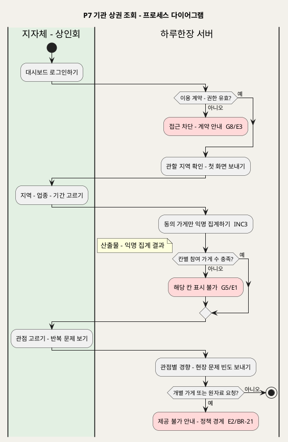
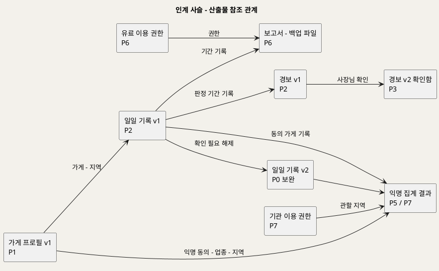

# SD_01 프로세스 설계서 — 하루한장
**하루한장 · 프로세스 설계 · BPMN 2.0 의미를 PlantUML activity 로 표기**

---

> **문서 식별**: `design/SD_01_프로세스설계서_하루한장.md`
> **작성일**: 2026-10-02
> **입력**: `design/UC_00_개요_하루한장.md`(§3 목록·§4 Actor·§5 L1 다이어그램), `design/UC_01`~`UC_08` 전건(기본·대체·예외흐름, 업무규칙, Sequence Diagram)
> **원천(SoT)**: `Intent-Specify.md` — UC가 답하지 않는 제약·리스크 확인용
> **작성 프롬프트**: `design/분석설계 프롬프트 - 프로세스.md`
> **다이어그램**: 10개 전부 렌더 검증 완료(HTTP 200 · image/svg+xml · Syntax Error 없음 · 링크 복호 소스 = 코드블록 일치 · URL 4096자 이하).
> **하류 문서**: SD_02 화면 설계, SD_03 데이터 설계, SD_04 모듈 설계 — 이 문서의 게이트·인계 계약을 입력으로 쓴다.

---

## 목차

1. 범위·설계 원칙
2. 프로세스 지도 (L0)
3. P0 기록 보완 (상시)
4. P1 가게 시작하기
5. P2 하루 마감 기록
6. P3 우리 가게 돌아보기
7. P4 장사 달력 보기
8. P5 동네 흐름 비교
9. P6 유료 고급 기능
10. P7 기관 상권 조회
11. 프로세스 간 인계 계약
12. 게이트 맵
13. 원천 추적성
14. 미해결·확인 필요

---

## 1. 범위·설계 원칙

### 1-1 왜 유스케이스만으로는 부족한가

사장님이 실제로 겪는 것은 "가입한다 → 매일 밤 30초씩 기록한다 → 어느 날 경보가 온다 → 흐름을 돌아본다"는 **하나의 시간축**이다. 유스케이스는 이를 목표 단위 8개로 잘라 두었으므로, 어디서 멈추고 무엇이 다음 단계로 넘어가는지는 프로세스로 다시 이어 붙여야 보인다.

| 질문 | 유스케이스가 답하지 않는 것 | 이 문서(프로세스)가 답하는 것 |
|---|---|---|
| 순서 | UC2 기록과 UC6 경보가 어떤 시점에 연결되는가 | 기록 저장 직후 같은 프로세스(P2) 안에서 하락 판정이 이어진다 |
| 차단 | "기록 부족" 예외가 UC3·UC5·UC6·UC7에 흩어져 있다 | 하나의 게이트 G3로 통합하고 해제 주체(사장님의 기록 누적)를 지정한다 |
| 인계 | 일일 기록이 어떤 항목을 갖춰야 분석·비교·보고서가 쓸 수 있는가 | §11 인계 계약에 필수 항목과 무효 조건을 고정한다 |
| 상시 처리 | UC2 E1·E3의 "나중에 재조회·재전송"은 누가 언제 하는가 | 사장님 행위 밖의 상시 프로세스 P0로 분리한다 |
| 주체 | 기관(UC8)과 사장님(UC1~7)의 흐름이 섞이는가 | 별도 프로세스 P7로 두고, 공유 지점은 익명 집계 결과 하나뿐임을 명시한다 |

### 1-2 도출 원칙

1. **UC를 쪼개거나 발명하지 않는다.** 프로세스는 UC를 묶거나 순서를 바꿀 뿐이다. 유일한 분할은 UC6(판정 1단계는 P2, 확인 2~4단계는 P3)이며 근거는 §1-3에 적었다.
2. **모든 IPO 행은 UC의 기본흐름 단계 또는 Sequence 메시지로 역추적된다.** `근거` 열에 `UC2 기본흐름 5 · INC1` 형식으로 지목한다.
3. **Sequence의 `alt` 중 "처리 중단·출력 차단"으로 끝나는 것만 게이트로 승격한다.** 재시도·표시 방식 변경·부분 저장은 프로세스 내부 분기로 둔다(§12-3에 승격하지 않은 분기 목록).
4. **사용자 관점으로 이름 붙인다.** "UC3 실행"이 아니라 "우리 가게 돌아보기"다.
5. **원천에 없는 것을 만들지 않는다.** 응답시간·동시성·보존기간 등 원천에 없는 비기능 요구는 §14에 미해결로 남긴다.

### 1-3 UC → 프로세스 매핑

| 프로세스 | 명칭 | 성격 | 포함 UC | 주 사용자 |
|:--:|---|---|---|---|
| P0 | 기록 보완 | 상시(사용자 행위 밖) | UC2 E1·E3 후속 처리 | 하루한장 서버·앱 |
| P1 | 가게 시작하기 | 1회 | UC1 (+INC1 안내·동의, INC2 기본정보, EXT1 익명 통계 동의) | 사장님 |
| P2 | 하루 마감 기록 | 매일 | UC2 (+INC1 외부 환경데이터, EXT1 매출 구간), UC6 기본흐름 1 | 사장님 |
| P3 | 우리 가게 돌아보기 | 수시 | UC3 (+INC2 신뢰도 판정), UC6 기본흐름 2~4 | 사장님 |
| P4 | 장사 달력 보기 | 수시 | UC4 | 사장님 |
| P5 | 동네 흐름 비교 | 수시 | UC5 (+INC2, INC3 익명화) | 사장님 |
| P6 | 유료 고급 기능 | 선택 | UC7 (UC7a 상세보고서, UC7b 백업·내보내기, INC4 권한 확인) | 사장님 |
| P7 | 기관 상권 조회 | 계약 기관 | UC8 (+INC3, INC5 권한 확인) | 지자체·상인회 |

**묶은 근거**

- **UC2 + UC6 판정(P2)**: UC6 기본흐름 1단계의 계기가 "사장님이 오늘 기록을 저장한다(UC2)"이고, UC6 Sequence의 첫 메시지 `1. 오늘 기록 저장(UC2)` 직후 `최근 흐름 하락 판정 요청`이 이어진다. 사장님 입장에서 저장과 판정은 한 번의 앉은 자리에서 일어나므로 같은 프로세스로 묶었다.
- **UC3 + UC6 확인(P3)**: UC6 기본흐름 3단계 "근거 보기 → 장사 패턴(UC3)으로 이어준다"와 UC_00 L1의 `UC3 ..> UC6 <<extend>>` 관계에 따라, 경보를 열어 본 사장님은 같은 자리에서 패턴 확인으로 넘어간다. 두 UC 모두 «include» 기록 충분성·신뢰도 판정(INC2)을 공유한다.
- **UC1의 include·extend(P1)**: UC1 §4에서 안내·동의와 기본정보 등록은 «include»(항상)이고, 익명 통계 동의는 «extend»(사장님 선택)이므로 같은 프로세스의 내부 분기로 둔다.

**분리한 근거**

- **UC6을 두 프로세스로 나눔**: UC6 기본흐름 1(판정)은 기록 저장 시점에, 2~4(알림 누르기·근거·확인)는 알림을 받은 뒤 사장님이 원하는 때에 일어난다. 시간축이 다르므로 P2와 P3로 나눴다(UC6 §7 "계기를 기록 저장 행위로 두었다").
- **UC4를 P3와 분리(P4)**: UC4는 «include» 신뢰도 판정이 없어 기록이 없어도 열린다(UC4 사전조건 2, E1). P3의 게이트 G3를 통과하지 않아도 되는 흐름이므로 별도 프로세스로 둔다. P3와는 «extend»(근거 보기, UC3 기본흐름 5)로만 연결된다.
- **UC5를 P3와 분리(P5)**: UC5는 서버의 익명 집계(INC3)와 익명 통계 동의 게이트 G4가 필요하다. 기기 내 분석만 쓰는 P3와 처리 위치·차단 조건이 다르다(UC5 §7).
- **UC8 분리(P7)**: 주 사용자가 지자체·상인회로 다르고(UC8 액터), 사장님 흐름과 공유하는 것은 익명 집계 결과뿐이다.
- **P0 분리**: UC2 E1 "다음 접속 시 재조회", E3 "연결 시 전송"은 사장님 행위가 없는 후속 처리이므로 상시 프로세스로 둔다.

### 1-4 BPMN 2.0 - PlantUML 표기 대응표

| BPMN 2.0 요소 | PlantUML 구문 | 규약 |
|---|---|---|
| Pool · Lane | `\|레인명\|` · `\|#E3F0E3\|레인명\|` | 레인 = 수행 주체(액터·시스템·외부기관). 한 도면 3~5개 |
| Start Event | `start` | 도면당 **1개** |
| Task | `:작업명;` | 동사로 끝낸다. 명사 나열 금지 |
| Sub-Process | `partition "P1 요청 접수" { … }` | L0 지도에서 프로세스 덩어리를 표현할 때 |
| Exclusive Gateway (XOR) | `if (조건) then (분기) … else (분기) … endif` | 2갈래 |
| Exclusive Gateway 3갈래 이상 | `switch (판정) case (…) … endswitch` | 게이트 판정에 권장 |
| Parallel Gateway (AND) | `fork` / `fork again` / `end fork` | 동시 수행 |
| Inclusive 분기 | `split` / `split again` / `end split` | |
| Loop Activity | `repeat … repeat while (조건) is (예) not (아니오)` | 보완·재시도 |
| End Event | `stop` | 정상 종료 |
| Terminate End Event | `kill` | **게이트 차단 종료에 쓴다** — 정상 종료와 시각적으로 구분된다 |
| Error Boundary Event | 게이트 분기 → 담당 레인 전환 → `#FFD9D9:중단 사유  E1;` → `kill` | 예외흐름 ID를 작업명에 **병기** |
| Data Object | `note right: 산출물 - intake_snapshot v1` | 인계물 표기 |
| Text Annotation | `note` | |

표기 주: 렌더 서버(plantuml.sumzip.com)는 `kill` 을 별도 기호 없이 **흐름이 끊기는 지점**으로 그린다. 그래서 차단 종료는 `#FFD9D9` 붉은 작업 상자 + 나가는 화살표 없음으로 식별한다. 정상 종료 `stop` 은 이중 원으로 그려진다.

공통 레인: **사장님**(소상공인) · **하루한장 앱**(기기 내 통계분석 포함 — UC3 §7) · **하루한장 서버** · **외부 데이터 기관**(기상청·공공데이터포털, 지자체 지역행사·상권정보) · **결제 시스템**(UC7, 자료 없음 — 확인 필요) · **지자체 - 상인회**(UC8).

## 2. 프로세스 지도 (L0)

사장님의 본류(P1 → P2 반복 → P3~P6 선택)와, 사장님 행위 밖에서 도는 P0·P7을 한 장에 담았다. 굵은 덩어리 하나가 한 프로세스이며 게이트는 note로 표시했다.

**[「L0 하루한장 프로세스 지도」 PlantUML 뷰어로 열기](https://plantuml.sumzip.com/plantuml/svg/eNqdVE1P20AQvedXjOiFHKoCKaWCQ1GrwqWH_gW3hGAR7Cg24lAhhXRBKUmVoNYloTFyRAIEpZIhJjVS-UPe8X_orO18QINa9ZBovbtv3ps3M7uo6VJW39xIx7R1WclIWWkD3knv11NZdVNZeaWm1Sw8WkosTb9-OXJDW5NW1C1ZScGqlNaSMV3W00l4MwW-UeUn575Rx-MW-F8Zb9SRubjfBDzL8TKLBXSxVTW7HgOgYISUVQUm3k6DZ-e8qxJgkcAHFMhz7Qn4QNcA5tEo8LwDfs1A04XHwMs1NKu06IMsg3cd4F8uecMMsQuE3KafoupJyMqpNX0eloVChoVqP8ATWCZi1-ZdNwxBgGwyk5T0gHdU4EyUHPCzgmdXAlTD7CskjYkpdArRNinDmst7OeCfbTQdn9ngXdm-0aYTEce8Bb9UIc6h2FDuPcEzfcG-8YNftIXgBPAeQ2YC9trB6jKAaZm0rEdaRnUnAI9sftrpW8XLJTQYpTrib6Dfu7oVHg489kvnPiNPg5sL0b3tIRdIKUlWxjA-Bao-5jvAix1utWAMV3RC9fvp8rwlSkFNI3D_wTcrqslZE3yzwk8Z8BvmXVfu8KF5zS92o5OxFPd8pxwiyKBRZgGv67hXGvRcofoP4p4B1i1-Qqiu5bmfgv7Yb901g-R0LWR10dj2JR7uikXeoX36JwDtfv-b4CFPrySsJMFzd4OEhX1A8jw2bP-Ikjrco3YVPY43w8ZMKiuD_grHA7bWZBr5SV5sokmw6g7JRvPXizjIGkxitRAX-mhlOnjUBmwe8OJ5PJj8AfGoT1P9ySHBWGME_LhDT0F8-ARYDPcawEs5kUx0GY870f6YgROHQVajD8KDAuZETM_JARGThxBCh_RhO0SHNCv-txb8Gf5eVZ73gw6rMq6NhL_Bm6jpaia2SJ_0Iv8GX_2Xqg==)** — 클릭 시 브라우저로 연결됩니다.

## 3. P0 기록 보완 (상시)

### 3-1 단계별 IPO

| # | 단계 | Input | Process | Output | 근거 |
|:--:|---|---|---|---|---|
| 0.1 | 전송 대기 기록 재전송 | 기기 임시 저장 기록(전송 대기) | 통신 연결 시 서버로 전송하고 암호화 저장 | 일일 기록 v1(서버 저장) | UC2 예외흐름 E3 · UC2 Sequence `기기에 임시 저장` · BR-HRH-03 |
| 0.2 | 외부 데이터 재조회 | '확인 필요' 표시된 일일 기록 | 날씨·공휴일·지역행사를 다시 조회해 결합 | 일일 기록 v2(확인 필요 해제) 또는 v1 유지 | UC2 예외흐름 E1 "다음 접속 시 재조회" · INC1 · BR-HRH-07 |
| 0.3 | 확인 필요 유지 | 재조회 실패 결과 | '확인 필요' 상태를 그대로 둔다(추정값 금지) | 일일 기록 v1 유지 | UC4 예외흐름 E2 · UC3 예외흐름 E3 · BR-HRH-13 |

### 3-2 프로세스 다이어그램

**[「P0 기록 보완」 PlantUML 뷰어로 열기](https://plantuml.sumzip.com/plantuml/svg/eNp9k71u2lAUx3c_xZGylKFSEm9kaNQI5ix9ALcYsELsyDjt4oHSK0RDIlEJJyYxyKhUIRGVnMShHvpEvue-Q891cEVp080f5_4_fsfebTqa7RwfNpTmgWEeabZ2CG-1dwc12zo2K3tWw7Jho6yWt0qvVyaada1ifTDMGlS1RlNXHMNp6LC_CWkS8ckI-EOMQwYv8NNH7AUFeAliwPgkQJbgyRR4b4qjGM_j9EfCxzPF3Sip5c2S6grP519nwgtw_A3Qu3OVLJ5SFJ1H7IWAF1F6HwH3-_xk8CRzChh-wc4ZpFEfr1ukQBl2FKNK7iHDzgT4aYse5dFw3KVDrwrg1HWTZvxuQQEo4phRUtJqSet8NhN4kgR4s7cNJXWHptdysoDfM1eq5PWjK_QYFRgIPxHDwVI2z6YTMnL2GO910Z8WFN2sGFXl36qyiBh6OEpAeAwvSWyY8EWL7r7z25tn-rjLIX4WEWnBsvpp3MpS8naIgxktJX14FEGMo59yQeefsT3PmGYcAvlytfnW_5pnuMdznETikjbC7uj0eqbffPCiD7RG4d1I3z-6CS8m6xyUPGNajg62Uas7RcB2hIuAz2VeSi2DL4m_36bhv7hmnmvwgnDlK1k32FdhCYdYYdgHvmDIZGCqKqEQVolDpQ9BGmZ7e2adTcc6Unbpmn6uX6JlxEk=)** — 클릭 시 브라우저로 연결됩니다.

### 3-3 설계 주의

P0가 실패를 조용히 삼키면 '확인 필요' 기록이 영구히 남고, P3의 날씨 관점 분석 표본이 계속 줄어 G3(분석 충분성)에 걸리는 날씨 관점이 늘어난다. 반대로 재조회 실패 시 근사값을 채워 넣으면 BR-HRH-13(추정값 금지)을 어기고 잘못된 경향이 만들어진다. 재조회는 "성공하면 v2, 실패하면 v1 유지" 두 결과만 허용한다.

재조회 주기·최대 재시도 횟수·임시 저장 보존 기간은 UC에 없다(§14).

## 4. P1 가게 시작하기

### 4-1 단계별 IPO

| # | 단계 | Input | Process | Output | 근거 |
|:--:|---|---|---|---|---|
| 1.1 | 수집 목적 안내 | 시작하기 누름 | 데이터 활용 목적·수집 범위를 쉬운 문장으로 표시 | 안내 화면 | UC1 기본흐름 1 · INC1 · BR-HRH-04 |
| 1.2 | 필수 동의 받기 | 사장님 동의 선택 | 동의 항목·시각 임시 보관, 거부 시 **G0** 차단 | 동의 기록(임시) | UC1 기본흐름 2 · 예외흐름 E1 · BR-HRH-02 |
| 1.3 | 익명 통계 참여 고르기 | 참여 여부 선택 | 선택 결과 임시 보관(미동의 시 P5 제한 안내) | 익명 동의 여부 | UC1 기본흐름 3 · 대체흐름 A1 · EXT1 |
| 1.4 | 가게 기본정보 고르기 | 업종·지역·영업 요일 버튼 선택 | 업종·지역 선택 여부 확인, 빠지면 **G1** 차단 | 기본정보(임시) | UC1 기본흐름 4 · 예외흐름 E2 · INC2 · BR-HRH-01 |
| 1.5 | 가게 프로필 저장 | 완료 누름 + 1.2~1.4 결과 | 계정 생성, 동의 기록·가게 정보 암호화 저장, 실패 시 재시도 | 가게 프로필 v1 | UC1 기본흐름 5 · 예외흐름 E3 · BR-HRH-03 |

### 4-2 프로세스 다이어그램

**[「P1 가게 시작하기」 PlantUML 뷰어로 열기](https://plantuml.sumzip.com/plantuml/svg/eNp9U8tu2lAQ3fsrRsoGFlVCURchi6ZtoNv8glscsHAAgdNsWBBiKlSQEiQcTAXIaUCQlKg8TEokvsgz_oeOMbRQ0S4sXd9758yZc849zKpiRj07VYRsQk6mxYx4Ch_Ej4lYJnWWjL5LKakM7ESCkUD47dqNbFyMps7lZAxORCUrCaqsKhIcB8Ae5u1xBajcpHbV0Q17NoQX4NQ0vG2SNqMvHcByh1oW3Vj2zxm2-0JuJxyM7IWDOSoMqN3FspETFqSE0AYMljTsWrw6EHK8hXd9R-fjLpA-ygkhfLgn88KezIFKBvWqgOMaNTU-LWHB8jC4cq2JfAI-R9f4Ojj6I9cDXjWoZbz2gxqXkuDzfv2CxCOCzx4N8SnvFwC2tAcWKXK0f7QfYgWoXQTqVLHc59lJ13Bg2eNLvGIyZt4rKXHLPsD7vd1w4ICrE7KiCFIyKp9sUAxRa4oPRXA-T-0Jlw9nVB-APTFXSiRTqgQZORZXQ4A_Zh5jV344fgX4rNnTa27aZKoAbwKMVy_St6JLq5en-qO7MC54E-hrjVrzdegtU7qKeQgLnT0I0kznsoXX_d-6kVFaieZOXy6R0fGvSUQNDe8qLj2nwakYMQt8NqmnrXzwPGN5Arvhl_-VZ4n0z2hoTRxrOSEjpSVRZaAQy0im7nb0pOIivG3x_yq5po4TixnUHGPmNGpLy1b58YDgPC4r7nRLO8sdp-KOL2cXw7voHHI2gT_XdggH_cBWbeixbh0VhvTUxMH8DxHvzXA-4VNga-Bp_H3FnnnivfVX1LNqKi0csmj8uH8BAoIPZQ==)** — 클릭 시 브라우저로 연결됩니다.

### 4-3 설계 주의

G0는 "동의 전에는 어떤 정보도 저장하지 않는다"(BR-HRH-02)의 실행 지점이다. 1.2~1.4의 결과를 서버에 단계별로 먼저 보내면, 1.4에서 사장님이 앱을 닫았을 때 동의 없는 부분 정보가 남는다. 그래서 1.5에서 한 번에 저장하고, 실패 시에도 부분 저장 없이 재시도한다(UC1 E3). SD_03에서는 가게 프로필이 동의 기록 없이 존재할 수 없도록 제약을 걸어야 한다.

1.3의 익명 동의는 P5·P7의 G4·G5 입력이다. 이 값을 누락하면 동의하지 않은 가게가 익명 집계에 들어간다(BR-HRH-16 위반).

## 5. P2 하루 마감 기록

### 5-1 단계별 IPO

| # | 단계 | Input | Process | Output | 근거 |
|:--:|---|---|---|---|---|
| 2.1 | 기록 화면 열기 | 사장님 진입(직접 또는 기록 알림) | 오늘 날짜와 세 묶음 버튼을 한 화면에 표시 | 기록 화면 | UC2 기본흐름 1 · 대체흐름 A4 · BR-HRH-05 |
| 2.2 | 오늘장사·손님수 고르기 | 버튼 선택 | 선택 강조 | 오늘장사·손님수 값 | UC2 기본흐름 2·3 |
| 2.3 | 특별한일 고르기 | 버튼 복수 선택 또는 생략 | 선택 강조 | 특별한일 목록 | UC2 기본흐름 4 |
| 2.4 | 매출 구간 고르기(선택) | 사장님 선택 | 구간 1개 기록 | 매출 구간 | UC2 대체흐름 A1 · EXT1 · BR-HRH-06 |
| 2.5 | 저장 요청·필수 확인 | 저장 누름 | 오늘장사·손님수 선택 확인, 빠지면 **G2** 차단 | 저장 요청 | UC2 기본흐름 5 · 예외흐름 E2 · BR-HRH-05 |
| 2.6 | 외부 데이터 결합·저장 | 저장 요청, 가게 프로필(지역) | 날씨·공휴일·지역행사 조회·결합 후 암호화 저장. 조회 실패 시 '확인 필요', 통신 불가 시 기기 임시 저장 | 일일 기록 v1 | UC2 Sequence `기록 전송`~`결합 후 암호화 저장` · E1 · E3 · INC1 · BR-HRH-03·07 |
| 2.7 | 완료 표시 | 저장 결과 | "오늘 한 장 완료"와 달력 칸 채움 표시 | 완료 화면 | UC2 기본흐름 5 · BR-HRH-12 |
| 2.8 | 하락 경향 판정 | 최근 일일 기록 | 기기 안에서 신뢰도와 하락 경향 판정, 부족하면 **G3** 차단(경보 없음), 공백 많으면 보류 | 판정 결과 | UC6 기본흐름 1 · 예외흐름 E1·E2 · INC2 · BR-HRH-08·10·17 |
| 2.9 | 경보 생성·알림 | 하락 경향 판정 | 경보를 만들고 알림. 권한 없음·수신 꺼짐이면 앱 안 표시 | 경보 v1 | UC6 기본흐름 1 · 예외흐름 E3 · 대체흐름 A1 · BR-HRH-18 |

### 5-2 프로세스 다이어그램

**[「P2 하루 마감 기록」 PlantUML 뷰어로 열기](https://plantuml.sumzip.com/plantuml/svg/eNqFVdFuElsUfZ-v2Ikv8nBTW25uYnnQqtRXX_wAbGlLimBg1BceEI8NAhqMTDvoTDNEkGowGcpQIcEfmr3PP9x9ZgYLyM1NeJiZs89ea6-1zuFuUU8V9OdPs1rxOJN7liqknsKT1N7xYSH_PLd_P5_NF-DGbnx3M3lvoaJ4lNrPv8zkDuEglS2mNT2jZ9PwaAukYeKXC8B-1Xeb4E9c7NjwF8iWwI5FYkK1LmC9S7ZHp57_c4LnF1rpRjK-eysZL1FlQOc9rJslLWClbZPZxZo570NnHj8ltFxeT0Mhc3ikb_9eMhr4dUbWjGGA-oLO34DvlrHWA9j5e96IuzMG86GTJsNQlVuPHOyFbbdlbYojIQ2L7Nn1ApfjaKxq0WxirQX02sbzcULLHMBN7HfpygJ_PPBdAYyKTu9ODPSjdA5uklmNaQDby0XXjWFnM6GlWT8uNQTWq8wypqVz-5kDZuyUmS5gVcz5lUJxFT9eIGNYCigsjkbt8sJsJBzJXJsXy4z-QAR2ePfB7Qe3f4NOhWyzXUM1-9RhPdnYH_j9G6NWseIBPNzaSG4leOdxJpuNKCsy8mRMdSeSflWIlQGEhZeipASKTET3czAoV1J7gldlwHcuR0UKV_nse-WgGisOtS6Ymj8aS8tTZrGj_TKd_ZCnb5XB5FhqzTDn7f4DOJAvRKKOKz81eG3IO1eJr1GMeUjDw_p0roxsG2RP-E3QpxbIDxbVrZABQHJTsQhVUuNeutLgHZ85MUZLmhPZ5lQF0l9zXgw5VVwOEA6CQe1ZEM9Qsheb6-xck5RQZf7RWZNzKpjdEiSTjK_CPrrFlQNyBJ10ABtlev0qsnoNwPys8jcIPrYFfmmoANUHfCiAphOgIYvjhoeNxpb_cwbSbuJXEdwb9i-QjSY5xpzR4_v_JLTiy4y-d8TJCpaAtfNHs5i2l1JTz4NzVabOcDHI_uUvHHl8DzXwY5ezwRxrZDc4uPENbhs5EoR3qRObj-6Q973n6uDwRrjcDXumCt1SYXjvLBCG8FgU9fyzqHM0Gp2dRC3_XGO28rQXC7OxQPx_ohDVcgaiKAdkwL9qhCZU-aoBvgjUiaSZRf3marCvAaO9asyKF-Gujz27ra6BKOLqvuVo8I4lEeIbO0uZD2bml9BN7S4_8n_OvyQjYE0=)** — 클릭 시 브라우저로 연결됩니다.

### 5-3 설계 주의

P2는 서비스 전체 데이터의 유일한 1차 입구다(UC2 우선순위 근거). 외부 조회 대기(2.6)가 사장님 화면을 붙잡으면 30초 기록(BR-HRH-05)이 깨지고 원천이 경고한 "사장님의 기록 중단"으로 이어진다. 따라서 2.7 완료 표시는 외부 데이터 결합 성공 여부와 관계없이 나가야 하며, 외부 조회 실패와 통신 불가는 게이트가 아니라 '확인 필요'·'전송 대기' 상태로 저장을 계속한다.

2.8의 G3는 경보 출력만 막는다. 기록 저장(2.6)은 이미 끝난 뒤이므로 G3가 저장을 되돌려서는 안 된다. 판정 기준(기간·하락 폭·최소 기록 수)은 미확정이며(§14), 이 값이 없으면 2.8을 구현할 수 없다.

## 6. P3 우리 가게 돌아보기

### 6-1 단계별 IPO

| # | 단계 | Input | Process | Output | 근거 |
|:--:|---|---|---|---|---|
| 3.1 | 경보 열어 보기(경보 진입 시) | 경보 v1 | 감지 흐름·신뢰도·참고 안내 표시 | 경보 화면 | UC6 기본흐름 2 · BR-HRH-09 |
| 3.2 | 경보 근거 보기·확인 | 근거 보기·확인 누름 | 판정 기간 기록 흐름 표시, 경보를 '확인함'으로 기록 | 경보 v2(확인함) | UC6 기본흐름 3·4 · 대체흐름 A2 |
| 3.3 | 분석 충분성 판정 | 일일 기록 전체 | 기록 수·신뢰도 판정, 부족하면 **G3** 차단 | 신뢰도 | UC3 기본흐름 1 · 예외흐름 E1 · INC2 · BR-HRH-08 |
| 3.4 | 요약·관점별 경향 보기 | 관점 선택(요일·날씨·특별한일) | 기기 내 집계, 경향 문장·신뢰도 표시. 관점 표본 부족·날씨 확인 필요 날짜는 신뢰도 낮음 또는 숨김 | 경향 문장 | UC3 기본흐름 1·2 · 예외흐름 E2·E3 · 대체흐름 A1 · BR-HRH-09·10·11 |
| 3.5 | 특별한일 전후 비교 | 특별한일 선택 | 전후 기록 차이 계산 | 전후 경향 | UC3 기본흐름 3 |
| 3.6 | 반복 운영 문제 보기 | 보기 선택 | 현장 문제 빈도·요일 집계 | 반복 문제 목록 | UC3 기본흐름 4 |
| 3.7 | 근거 날짜 보기 | 근거 보기 누름 | 근거 날짜 목록 표시, 달력(P4)으로 인계 | 근거 날짜 목록 | UC3 기본흐름 5 · UC4 대체흐름 A2 |

### 6-2 프로세스 다이어그램

**[「P3 우리 가게 돌아보기」 PlantUML 뷰어로 열기](https://plantuml.sumzip.com/plantuml/svg/eNqNVEFPGmEQve-vmMSLHkwrmCbCobYITS-NF38AragbEQxge-FAyLahQiNNWF3trlmr6NKQZhXUJcE_tDP7HzrfsugSbdPbJjvvzZv3Zr7FYildKO1sZaXippzbThfSW_A-_WFzvZDfya0m8tl8AaZS0dRc8nWooriRXs1_knPrsJbOFjNSSS5lM7AcBTqy8bwLrl1xrxqAew1SFez1XceGWfBaCp7opDi0ewZYPyOjT_t999bBY0sqTyWjqefJaJmqXTpuY10rS742KeZe3TEHkNrA8yGg1sTdFnhGE88VwE4Lv_K_A9EjLpU9VcNTy1N15mDEZVmS12B6goH0IcsAulDo-PPLGShtZHIwTVptRgKIuXaTLipj-lmguok_bdzzv23H7ZlMU8NqH5iRDrp0OhTTwUriRZzxYfmC7XboXtrwYMGhSoYDWFOwPVLMkMeaBXIkeQTwVAu4Gk8Mrg1guXwpAwV5faMUA6radKNjd8gtAuDHiJThaHgwTqBeI-1sRsrkVuU19tNnAqppdFgJDeg1mmSqow4Ab98lInHfPbxRSOH6a52-NGCMvunQyeWkfY8aAu9OamlhaYHHsd3ekB20sG6xSuzYNDABv7XuCUeuwpvos5VEFJJzYshNOZsdy6ajFql3Yj5vvw3YdYRd4RA4_pD7MbdfIbMJnNjIaxEgUxj3K4RVk1rW_ULtDrCniBSM4d8XacTpfdex5wgP2JvHKzSh8H9XKP6UfbEHLFZ_k9EQramuj0UHeqhmMYMfWzLyLBmNB55N-BEeEMhUvB9MOlDc66bIw9awd-1rNvVgX590IRYgOUm-X7HSmuIHESAHNV_sP2KZOInQJTzVbFzMSV0w-a-O2JRJ8vAdLM_zu9JFsz2-cYPdVsRxzsOrCL8n-W1pka3h9-4PEPe-0g==)** — 클릭 시 브라우저로 연결됩니다.

### 6-3 설계 주의

P3의 모든 출력은 원천이 가장 강하게 경고한 "분석 결과의 오해"와 "과도한 의존"에 노출된다. 경향 문장이 "비 때문에 손님이 줄었다"처럼 원인을 단정하면 BR-HRH-09 위반이며, 이는 SD_02의 문장 템플릿 단계에서 막아야 한다. G3는 결과 화면 전체를, 관점 표본 부족(UC3 E2)은 해당 관점만 막는 두 단계 구조이므로, 하나의 "충분" 플래그로 뭉치면 관점 단위 차단이 사라진다.

3.2에서 경보를 '확인함'으로 바꾸지 않으면 같은 경보가 매일 반복 노출되어 비교·불안 스트레스(원천 `[부정적 영향]`)를 키운다.

## 7. P4 장사 달력 보기

### 7-1 단계별 IPO

| # | 단계 | Input | Process | Output | 근거 |
|:--:|---|---|---|---|---|
| 4.1 | 달력 열기 | 메뉴 진입 또는 P3 근거 날짜 | 이번 달 기록·공휴일·행사 조회. 통신 불가 시 기기 내 기록 사용 | 월 달력 | UC4 기본흐름 1 · 대체흐름 A2 · 예외흐름 E1·E3 · BR-HRH-12 |
| 4.2 | 달 넘기기 | 이전·다음 달 선택 | 해당 달 기록 상태 표시 | 월 달력 | UC4 기본흐름 2 |
| 4.3 | 그날의 한 장 보기 | 날짜 선택 | 기록 상세 표시. 빈 날짜면 P2로 인계, '확인 필요'는 그대로 표시 | 일 상세 또는 P2 진입 | UC4 기본흐름 3 · 대체흐름 A1 · 예외흐름 E2 · BR-HRH-13 |
| 4.4 | 월간 요약 보기 | 요약 선택 | 좋은·보통·나쁜 날 수와 자주 있던 특별한일 표시 | 월간 요약 문장 | UC4 기본흐름 4 · BR-HRH-10 |

### 7-2 프로세스 다이어그램

**[「P4 장사 달력 보기」 PlantUML 뷰어로 열기](https://plantuml.sumzip.com/plantuml/svg/eNp9k8FO21AQRffvK0ZiAwukhnTlLEqLnDW_4DZOYhFsZBt140UaWZWLWRTJBpPaKJREBSmLQBw1legP-Y3_ofOMXUWQdhd5Zu6c--5k17IV0z4-7DHrQNOPFFM5hPfKh4OOaRzrrT2jZ5iw0aw3a_K7lQ6rq7SMj5regbbSs1Rma3ZPhf3XgFcTHEyB-1M-mgCfp9lyBtuQBy6_jtFd4smYimNMUjxPs59LfnXLnA253nwl1x2apHnuRw4rqJhU6uCF0GkwJw8jfnObhzH1AYb3DtPasJl_XqA_gmzW5yeTN1tgd1UdNjHythjAsxk35g-uQ98lYuAPnkAFEufXCXFm80Uep5g8CubzL4WVecoHT-tfiAkAlfzTstDlvofRWKyUqFv4prlKWlgb3pEqLmLBWvR_BfQiejIPk1MAud5gqt7S2oWnaq4oPvck8cEIf8R87gJ-9zHpkzBx0juIH4MIP8WQn9GimHgL9HWU_JdXBbX9l9MnZ2eE5xH80zCR1Sqy1YhEOMDdqDQrFgso4J7LJ__Nq1hcNL8wRidR6ZRE-WXA79LyBADe1kQOumGrYGqdri3B_g6dFmCyzOYulSzbOFofCl0bKScREI84VPFkeDHFm8fySC9DUqGqi8MARPtpX0iDvLPWP34LshklMAww_F3e-lrP0j9DIqDiBlZJGqywsEsb6W_5B5kp62g=)** — 클릭 시 브라우저로 연결됩니다.

### 7-3 설계 주의

P4에는 게이트가 없다. 기록이 없어도 빈 달력을 보여주는 것이 UC4의 의도(E1 "오늘부터 한 장씩 채워보세요")이며, 여기에 G3를 걸면 기록을 막 시작한 사장님이 달력조차 못 보게 되어 기록 동기를 잃는다. 대신 빈 칸과 '확인 필요'를 추정값으로 채우지 않는 것(BR-HRH-13)이 핵심 제약이다.

빈 날짜 → P2 인계(4.3)는 과거 날짜 기록을 허용한다는 뜻이며(UC2 A3), SD_03에서 일일 기록의 날짜가 "저장 시각"과 별도 속성이어야 한다.

## 8. P5 동네 흐름 비교

### 8-1 단계별 IPO

| # | 단계 | Input | Process | Output | 근거 |
|:--:|---|---|---|---|---|
| 5.1 | 비교 진입·동의 확인 | 메뉴 진입, 가게 프로필(익명 동의) | 익명 통계 동의 확인, 미동의면 **G4** 차단 | 진입 허용 | UC5 기본흐름 1 · 대체흐름 A1 · BR-HRH-16 |
| 5.2 | 내 기록 충분성 확인 | 내 일일 기록 | 기기 내 신뢰도 판정(부족해도 차단하지 않고 내 경향만 '기록 더 필요') | 내 신뢰도 | UC5 Sequence `내 기록 충분성 확인` · 예외흐름 E2 · INC2 |
| 5.3 | 기간 고르기·익명 집계 | 기간, 지역·업종 | 동의 가게만 익명 집계, 참여 가게 수 미달이면 **G5** 차단, 통신 실패면 재시도 안내 | 익명 집계 결과 | UC5 기본흐름 2 · 예외흐름 E1·E3 · INC3 · BR-HRH-14·16 |
| 5.4 | 동네·내 경향 나란히 보기 | 익명 집계 결과, 내 신뢰도 | 두 경향을 신뢰도와 함께 표시(순위 없음) | 비교 화면 | UC5 기본흐름 2 · BR-HRH-09·11·15 |
| 5.5 | 관점별 비교 | 관점 선택(요일·날씨) | 관점별 익명 집계·경향 문장 표시 | 관점별 비교 | UC5 기본흐름 3 · BR-HRH-15 |

### 8-2 프로세스 다이어그램

**[「P5 동네 흐름 비교」 PlantUML 뷰어로 열기](https://plantuml.sumzip.com/plantuml/svg/eNp9VF9P2lAUf7-f4iS-jIfFKfNBfJibwrKXZS_7AAxRGhEM1PjCAyGdIZZFTKhW0xKMoJ3xoUphLHFfqOf0O-zcFmK3sL3d9pzfOb8_t12vqtmKerBXFNVdpbSfrWT34Es2t7tTKR-UtjbKxXIFFjLJzFL6XayjWshulQ-V0g5sZ4vVvFAVtZiHTyuAJxeo9SGw23ijAf7U_FEbXkLQ0fDKIm1Cx31AvU-2R2ee_2OCXUfUFtLJzKt0skaNe-oOUDdrImQlUnTp4s39X1Pp3PMn7pqoBYaJ105gWIwCMh5qQtmGF2SP8O4rBEcjf8jN7oTOwwlkm28SoBbyJe4xmwmRZ-Z8NDTUm2T2EwJYaWZzdXM1NSVOroO6w_wjOO9oYsMDeP968fPGCrxdWmPMrlIsinxpS9kWKVllbnhlA42_41gj7QGCC4PsCZPlCsCHjxvLzD2mdbaNy76rgT_s4WCuQs3CR032R2x8t-4_tvC2BXjnsAyYKqfbU1Ye25ec61X1UFFzBTYgbGfwKeojCFpt6hkJkctKc9hE0ntAej9oOdKglAxPt_iNhSfa1JDZqnRS-lFVy_tT-NT8iChQ0wQc1-nq4X9WU7eN15Ek28PjDlD_lB1fWUw_uz2d3rP84UhOx-NBRC66J_7jr-Bs4A-fIMwjfOKjid160G0CDj1mRddPoccApbKah4qyU1BTEAswoiqVxsZIt2f1bx0IDI0uO6x8Wd6AyNE_s_W9OvXaz6FKhZcdspmb2ZbysNGjjvPPrCM8DuemOzfXGGQmPSZY7m9aZMnP6Ijs1pqIy6eGS2ML759kW3wfj3LZUBGGu85a-Y_xG6FQR6I=)** — 클릭 시 브라우저로 연결됩니다.

### 8-3 설계 주의

G5(최소 참여 가게 수)는 신뢰도 장치이면서 동시에 **재식별 방지 장치**다. 같은 동네 같은 업종 가게가 2~3곳뿐이면 "익명 평균"이 곧 특정 가게의 기록이 된다. 그래서 G5는 "신뢰도 낮음" 경고로 약화하면 안 되고 출력 자체를 막아야 한다(원천 `[부정적 영향]` 개인정보 유출). 최소 가게 수는 미확정이다(§14).

내 기록 부족(5.2)은 차단이 아니다. UC5 E2는 동네 경향은 보여주고 내 경향만 비우도록 정했다. 이를 G3로 묶으면 기록이 적은 신규 사장님이 원천의 핵심 가치인 "나만 어려운 것이 아니다"를 경험하지 못한다.

## 9. P6 유료 고급 기능

### 9-1 단계별 IPO

| # | 단계 | Input | Process | Output | 근거 |
|:--:|---|---|---|---|---|
| 6.1 | 유료 기능 안내 | 메뉴 진입 | 기능 설명·이용 조건 표시 | 안내 화면 | UC7 기본흐름 1 |
| 6.2 | 기능 고르기·권한 확인 | 상세보고서 또는 백업·내보내기 선택 | 이용 권한 확인 | 권한 상태 | UC7 기본흐름 2 · 대체흐름 A1·A2 · INC4 |
| 6.3 | 결제 | 결제 요청 | 결제 결과에 따라 권한 기록, 실패·취소면 **G6** 차단 | 유료 이용 권한 | UC7 기본흐름 3 · 예외흐름 E1 · BR-HRH-19 |
| 6.4 | 기간·방식 고르기·생성 | 기간(또는 내보내기 방식), 일일 기록 | 기간 기록 충분성 확인 후 경향·신뢰도 포함 보고서 생성, 부족하면 **G3** 차단 | 보고서 초안 | UC7 기본흐름 4 · 예외흐름 E2 · BR-HRH-08·09 |
| 6.5 | 받기·내보내기 확인 | 받기 누름 | 포함 정보 안내 후 확인을 받아 파일 전달, 확인 안 하면 **G7** 차단 | 보고서 또는 백업 파일 | UC7 기본흐름 5 · 예외흐름 E3 · BR-HRH-20 |

### 9-2 프로세스 다이어그램

**[「P6 유료 고급 기능」 PlantUML 뷰어로 열기](https://plantuml.sumzip.com/plantuml/svg/eNp9VM1u2kAQvvspRuJSDhVNkVKFHhq1Mbn2FWj5s3DsCBz1wqGijkSxpbQqTmhqI9KAChIHEwjxgb6Qd_wOnbVB_BYf7PXOznw_M_ZxRcuUtYszWaiUJOU8U86cwYfMx1KhrF4o2XeqrJYhlk6mD8S3KycqxUxW_SQpBchn5EpO0CRNzsH7Q0C7w-5N8Mcd3_sKvueyRg-eQ9DU2Z2NuoeNLjCji84Eryf-k8fafaEaE5PpF2KyirUhtnvMaFWFkJWQWpSL6uDNhFZUjo0nhIC6Daz1jTWawGoT2qM7j1OI9fjqtVANrBa77weWTYWBEtiDXhWkPDzjDG4H4E9NCgK26-iYb-KgFXMKBVv1uJAjYbS0dGbUsdWNCwCrDAFS_oOLHZsgQiwKRxuAhk06g0ubK_9poeNBYOl42-RZHHxxTh_548d1VKBrN2seSa3T5r7cOUsCAIqq5aAsFYpaCrDm4tRmwxnRmBu5lk4JOzRuwVujCDuWTp8cnRxt9sTtM6NPCPx97M230Z5Rv6lPj_7TZ4DTw4R4EBEsSbLMgZWslBei-6qrKcr3XX1nX5k7QMPZ017ONLQ3qhG5AzgdsKm-6TI1729wzWcTjQ777bIrHYKrYWD1V6frj8l-dEOoHU4tDFmexy8O9XThCZwmE-JLLjsUvUMsc3-Fwur6HkWpOS3sWIREe3XyY9HzcJQXFefDtiU1ME10ZlSAyA-X0_K_Wdn-utwR3lxCVIYSK5p6vteQ1a5h93tkxquEmNww45ge9Ov5B_TcXjg=)** — 클릭 시 브라우저로 연결됩니다.

### 9-3 설계 주의

G6 미통과는 유료 기능만 막고 무료 기능(P2~P5)은 절대 막지 않는다(BR-HRH-19). 권한 확인을 공통 미들웨어로 만들 때 무료 경로까지 걸리지 않도록 SD_04에서 경계를 분리해야 한다.

G7은 원천의 "데이터 악용(평가·대출·보험)" 위험에 대한 마지막 방어선이다. 내보낸 파일은 하루한장 밖으로 나가 통제할 수 없으므로, 확인 없이 파일을 내보내는 단축 경로(예: 자동 백업이 외부로 전송)를 만들면 G7을 우회하게 된다. 결제 시스템은 원천에 근거가 없어 레인에 '확인 필요'를 달았다.

## 10. P7 기관 상권 조회

### 10-1 단계별 IPO

| # | 단계 | Input | Process | Output | 근거 |
|:--:|---|---|---|---|---|
| 7.1 | 로그인·권한 확인 | 기관 계정 | 이용 계약·권한·관할 지역 확인, 무효면 **G8** 차단 | 기관 세션 | UC8 기본흐름 1 · 예외흐름 E3 · INC5 |
| 7.2 | 지역·업종·기간 조회 | 선택 조건, 동의 가게 기록 | 동의 가게만 익명 집계, 칸별 최소 가게 수 미달은 **G5** 칸 단위 차단 | 익명 집계 결과 | UC8 기본흐름 2 · 대체흐름 A1·A2 · 예외흐름 E1 · INC3 · BR-HRH-14·16 |
| 7.3 | 관점별 경향 보기 | 관점 선택 | 관점별 익명 경향을 '경향'·'참고정보'로 표시 | 관점별 경향 | UC8 기본흐름 3 · BR-HRH-09 |
| 7.4 | 반복 운영 문제 보기 | 보기 선택 | 업종별 현장 문제 빈도를 익명으로 표시 | 반복 문제 경향 | UC8 기본흐름 4 |
| 7.5 | 원자료 요청 거부 | 개별 가게·원자료 요청 | 제공 불가 안내(정책 경계) | 거부 안내 | UC8 예외흐름 E2 · BR-HRH-21·22 |

### 10-2 프로세스 다이어그램

**[「P7 기관 상권 조회」 PlantUML 뷰어로 열기](https://plantuml.sumzip.com/plantuml/svg/eNqNk19L22AUxu_zKQ54My_EaRmb8WKipmM3Y-wbdDPaYGykjeymF51LodiClTUau1TSqdhuFWIbawT9Qjkn32HnbSqWgbKr_DvPOc_ze0-WCmYmb-5s6VJhU8ttZ_KZLfic-bK5kTd2cmsrhm7kYSqdSs8pyxMVhWxmzfiq5TZgPaMXVMnUTF2Fj68hCv0oKAF9_xYNa0BtP27WYAbihoVtl6yQ9s4Aq2fUCugwiG5CPOlIxSkllX6ppIp0UaKTOvUDVnAHaoWsLkojh5KMtRJVXRwE-MMF7sZqUWE7PHNRKvINnnZi26WTcyDLxb5VlLR1eCFmNbsQDSyy77kzG-MqINeLm52302Bm1RxXOZVpSeUsfGtbWK2QczYtAWdPry6sLsjkHUQ3d0B-B6sd0SVpR3YFdwOAd29mldQi129qui6puTVtXZKZRGx7IGIdXUJ8bLNfEa3_hx8a2A1ApNkNkgBPpJfHcn55VKZfZTGbIfsWW_DwPHgmvYz7x9RyIPJLUb-GF3wgrWv8XWZHB-w_QQfw_sMKWx-hug1xYHHIkI56YxlQxQEadql99d-wYjvA6i1wO4gPXD41wGGF2zGnV7PK3OIYUM4wVchrG1lTBtr1aehi704EnXQJUd-PBndP82HK5NUfafBn9B0cXAP2QvJcAfk5SIkeR5Pu48Nzsa6OJUoe9LcV3Lcmz0qwinx3pEkgoVPHvQbQzzp7xFOm1mxQ__KR2CSmgmlsP-ATJCe3zI2E8YTWeLk4rmfTVVn4E0BAmZ9d_jQzP_fPvi3xhX_kv9l3A9E=)** — 클릭 시 브라우저로 연결됩니다.

### 10-3 설계 주의

P7은 P5와 같은 익명 집계(INC3)를 쓰지만 차단 단위가 다르다. P5는 사장님 한 명에게 한 지역·업종만 보여주므로 미달 시 화면 전체를 막고, P7은 여러 지역·업종을 표로 보여주므로 미달 칸만 막는다(UC8 E1). 다만 칸 단위 차단은 **합계와 차감으로 숨긴 칸을 역산**할 수 있는 위험이 있다(예: 지역 합계 - 공개 칸들 = 숨긴 칸). [추론] SD_03·SD_04에서 합계 행도 같은 기준으로 처리해야 한다.

원자료 요청 거부(7.5)는 해제 주체가 없는 **정책 경계**이며 게이트 번호를 주지 않았다(§12-2).

## 11. 프로세스 간 인계 계약

| 산출물 | 생성 → 소비 | 필수 포함 항목 | 만료·무효 조건 | 근거 |
|---|---|---|---|---|
| 가게 프로필 v1 | P1 → P2·P3·P5·P6·P7(집계 대상 판정) | 계정, 필수 동의 항목·시각, 업종, 지역, 영업 요일(선택 입력 가능), 익명 통계 동의 여부 | 필수 동의 기록이 없으면 생성 불가(G0). 영업 요일 미입력 시 P3 요일 분석 전 입력 요청(UC1 A2·UC3 A1). [추론] 업종·지역이 바뀌면 이후 비교 기준이 바뀐다 | UC1 사후조건 1~4 · BR-HRH-01·02·03 |
| 일일 기록 v1/v2 | P2(생성)·P0(보완) → P3·P4·P5·P6·P7 | 가게, 기록 날짜, 오늘장사, 손님수, 특별한일 목록, 매출 구간(선택), 날씨·공휴일·지역행사 또는 '확인 필요', 전송 상태(전송 대기/저장됨) | 같은 날짜 재저장 시 이전 값을 대체(UC2 A2). '확인 필요' 항목은 날씨 관점 분석에서 제외(UC3 E3). 오늘장사·손님수 없으면 생성 불가(G2) | UC2 사후조건 1~3 · BR-HRH-05·06·07·13 |
| 경보 v1/v2 | P2 → P3 | 판정 기간, 감지 경향, 신뢰도, 생성 시각, 상태(생성/확인함) | 사장님이 확인하면 v2(확인함). 판정 기간 이후 새 판정이 나오면 [추론] 이전 경보는 대체 | UC6 사후조건 1~3 · BR-HRH-17 |
| 익명 집계 결과 | 서버 → P5·P7 | 지역, 업종, 기간, 관점, 경향, 신뢰도, 최소 가게 수 충족 여부 | 최소 가게 수 미달이면 생성·제공 불가(G5). 동의 철회 가게는 집계에서 제외(BR-HRH-16). 기간이 지나면 재집계 [추론] | UC5 사후조건 1·2 · UC8 사후조건 1·2 · BR-HRH-14·16·21 |
| 유료 이용 권한 | P6 → P6(재방문) | 가게, 기능 종류, 결제 결과, 기록 시각 | 결제 실패·취소면 생성 불가(G6). 이용 기간·만료는 자료 없음 — 확인 필요 | UC7 사후조건 1 · BR-HRH-19 |
| 보고서·백업 파일 | P6 → 사장님(시스템 밖) | 기간, 경향, 신뢰도, 포함 정보 안내 확인 여부 | 사장님 확인 없으면 생성 불가(G7). 시스템 밖으로 나간 뒤에는 통제 불가 | UC7 사후조건 2 · BR-HRH-20 |
| 기관 이용 권한 | (계약, 자료 없음) → P7 | 기관, 관할 지역, 계약 상태 | 계약 만료·권한 없음이면 무효(G8). 계약 기간은 자료 없음 — 확인 필요 | UC8 사전조건 1~3 · 예외흐름 E3 |

참고: P3의 개인 분석 결과(경향 문장)는 기기 안에서 계산해 표시만 하고 저장·인계하지 않는다(UC3 사후조건 3 "기록 데이터는 변경되지 않는다", BR-HRH-10). 따라서 인계 계약 대상이 아니다.

### 11-1 버전 참조 사슬

**[「인계 사슬」 PlantUML 뷰어로 열기](https://plantuml.sumzip.com/plantuml/svg/eNp9k0GL00AUx-_5FI_1XDRZVPAgG8X2aOhN8BK32W7YbCJJVq9F0osGVNjQ7ZIuqSKrUmFs69JD_UIzL9_BN5l0bVgRAhPm_ea9__8_yV4U22F8cuxp0ZHrv7RD-xhe2PtH_TA48XuPAy8I4VZ7t60_ebRFRId2L3jt-n04sL3I0WI39hzAyYovEsA3M3w7gxa9MLzKxWwNyFY4ZcCXAwI0zzmIIQ4gdPuHMfTc0NmP3cDX5Gr7feq0w9mAz1MoTxMxzcssgVf6c9_Sd8COwGpvkzhZ0wN8xcR0ojCjwrr6fzCDsDsgFkscJ4o2GuPnv6m23c3U_1U3oBxnZLvMvhK5q0ijOfeX-D4EvPwoo-FzxhdrQu_CbbDuK77T4PNCfE4pyiWefwN-lZZZTvw95dx8ts2SBL4oMMkpa8F-4mgIZZqSzesDXauhesXoBm70VjKedjua1YZW6yElBw-gvgG6xcsBjn5otFnVDKop00D3guentCyxyDeAKQ-X6QcsMpk2Z0kdumbWgOwgv5GLL-LdWd1rM9rsyKLKTLwf4-RMKhgN8dPwhpSKraFabT2JRCpAo8SUbEtaqhxfO6m2Ggopg7-dKaoyKzYz9xy_R3_JH-Dqaj0=)** — 클릭 시 브라우저로 연결됩니다.

## 12. 게이트 맵

### 12-1 게이트 목록

| 게이트 | 위치 | 조건(통과) | 미통과 시 결과 | 해제 주체 | 근거 UC·BR |
|:--:|---|---|---|---|---|
| G0 | P1 1.2 | 필수 항목에 동의함 | 가입 중단, 어떤 정보도 저장 안 함 | 사장님(동의) | UC1 E1 · BR-HRH-02 |
| G1 | P1 1.4 | 업종과 지역이 선택됨 | 완료 버튼 비활성, 빠진 항목 안내 | 사장님(선택) | UC1 E2 · BR-HRH-01 |
| G2 | P2 2.5 | 오늘장사와 손님수가 선택됨 | 저장 버튼 비활성, 빠진 항목 안내 | 사장님(선택) | UC2 E2 · BR-HRH-05 |
| G3 | P2 2.8 · P3 3.3 · P6 6.4 | 분석 최소 기록 수와 신뢰도 기준 충족 | 경보 미생성 / 분석 결과 차단 / 보고서 생성 차단 | 사장님(P2로 기록 누적). 기준 수치는 데이터 담당자(원천 `[핵심 인적자원]`)가 설정 | UC3 E1 · UC6 E1 · UC7 E2 · BR-HRH-08 |
| G4 | P5 5.1 | 익명 통계 제공에 동의함 | 비교 차단, 동의 안내 | 사장님(익명 동의) | UC5 A1 · UC1 A1 · BR-HRH-16 |
| G5 | P5 5.3 · P7 7.2 | 같은 지역·업종 동의 가게 수가 최소 기준 이상 | P5: 비교 화면 차단 / P7: 해당 칸 표시 불가 | 참여 가게가 늘면 자동 해제. [추론] 참여 확대는 현장 운영자(원천 `[핵심 인적자원]` 소상공인 모집), 기준 수치는 데이터 담당자 | UC5 E1 · UC8 E1 · BR-HRH-14 |
| G6 | P6 6.3 | 유료 이용 권한 있음 또는 결제 성공 | 유료 기능 차단, 기본 기능으로 복귀 | 사장님(결제) | UC7 E1 · BR-HRH-19 |
| G7 | P6 6.5 | 포함 정보 안내를 사장님이 확인함 | 내보내기 중단 | 사장님(확인) | UC7 E3 · BR-HRH-20 |
| G8 | P7 7.1 | 기관 이용 계약·권한 유효 | 접근 차단, 계약 안내 | 기관(계약 갱신). 계약 처리 주체는 자료 없음 — 확인 필요 | UC8 E3 |

UC5 A1은 대체흐름 표기이지만 결과가 "비교 대신 동의 안내", 즉 출력 차단으로 끝나므로 규율 3에 따라 게이트(G4)로 승격했다.

### 12-2 게이트 성격 분류

| 성격 | 게이트 | 하류 반영 (SD_02 / SD_03 / SD_04) |
|---|---|---|
| 입력 완결성 | G1, G2 | 화면의 비활성 버튼 / 필수 컬럼 NOT NULL / 저장 API 입력 검증 거부 |
| 동의 | G0, G4, G7 | 동의 화면·확인 대화상자 / 동의 기록 없이 가게 프로필 생성 불가 제약, 집계 대상 필터 / 동의 여부 확인 후 처리 |
| 품질·익명성 | G3, G5 | "며칠 더 기록", "자료 모이는 중" 안내 화면 / 최소 수 기준값 설정 테이블 / 기준 미달 시 결과 미반환 |
| 권한·과금 | G6, G8 | 결제·계약 안내 화면 / 권한·계약 상태 / 권한 없음 응답 |
| 정책 경계(게이트 아님) | UC8 E2 원자료 요청 거부 | 제공 범위 안내 / 원자료 조회 경로 자체를 두지 않음 / 기관용 API에 개별 가게 조회 없음 |

정책 경계는 해제 주체가 없도록 **의도된** 차단이다(BR-HRH-21). 프롬프트 기준상 해제 주체 없는 차단은 게이트가 아니므로 번호를 주지 않고 별도로 분류했다.

### 12-3 게이트로 승격하지 않은 분기

| 분기 | 처리 | 승격하지 않은 이유 |
|---|---|---|
| UC1 E3 저장 실패 | P1 1.5 재시도 루프 | 중단이 아니라 재시도 |
| UC2 E1 외부 조회 실패 | '확인 필요'로 저장 계속, P0 보완 | 저장이 계속됨 |
| UC2 E3 통신 불가 | 기기 임시 저장, P0 재전송 | 저장이 계속됨 |
| UC3 E2·E3 관점 표본 부족·날씨 확인 필요 | 관점 단위 신뢰도 낮음 표시 또는 숨김 | 화면 전체는 계속, G3의 관점 단위 적용으로 처리 |
| UC4 E1~E3 | 빈 달력·확인 필요 표시·기기 내 기록 사용 | 표시 방식 변경 |
| UC5 E2 내 기록 부족 | 내 경향만 '기록 더 필요' | 동네 경향은 계속 제공 |
| UC5 E3 통신 실패 | 다시 시도 안내 | 재시도 |
| UC6 E2 기록 공백 | 판정 보류, 기록 공백 알림 | 다음 기록 시 재판정. 차단이 아니라 보류 |
| UC6 E3·A1 알림 권한 없음·수신 꺼짐 | 앱 안 표시 | 출력 경로 변경 |

## 13. 원천 추적성

### 13-1 UC 커버리지

| UC | 프로세스 | IPO 단계 | 상태 |
|:--:|---|---|:--:|
| UC1 가입하고 정보수집에 동의한다 | P1 | 1.1~1.5 | 사상 |
| UC2 오늘 장사를 기록한다 | P2 (E1·E3 후속은 P0) | 2.1~2.7, 0.1~0.3 | 사상 |
| UC3 장사 패턴을 확인한다 | P3 | 3.3~3.7 | 사상 |
| UC4 장사 달력을 본다 | P4 | 4.1~4.4 | 사상 |
| UC5 같은 지역·업종과 비교한다 | P5 | 5.1~5.5 | 사상 |
| UC6 매출하락 조기경보를 받는다 | P2(기본흐름 1), P3(기본흐름 2~4) | 2.8~2.9, 3.1~3.2 | 사상 |
| UC7 상세보고서를 받고 데이터를 내보낸다 | P6 | 6.1~6.5 | 사상 |
| UC8 익명 상권분석 대시보드를 조회한다 | P7 | 7.1~7.5 | 사상 |

미사상 UC 0건. 공통 하위 UC도 모두 사상되었다: INC1 외부 환경데이터(2.6, 0.2) · INC2 신뢰도 판정(2.8, 3.3, 5.2, 6.4) · INC3 익명화(5.3, 7.2) · INC4 유료 권한(6.2) · INC5 기관 권한(7.1) · UC1 EXT1 익명 동의(1.3) · UC2 EXT1 매출 구간(2.4).

### 13-2 BR 부착 단계

| BR | 부착 단계 | BR | 부착 단계 |
|---|---|---|---|
| BR-HRH-01 | 1.4 | BR-HRH-12 | 2.7, 4.1 |
| BR-HRH-02 | 1.2 (G0) | BR-HRH-13 | 0.3, 4.3 |
| BR-HRH-03 | 1.5, 2.6, 0.1 | BR-HRH-14 | 5.3, 7.2 (G5) |
| BR-HRH-04 | 1.1 (전 화면 공통) | BR-HRH-15 | 5.4, 5.5 |
| BR-HRH-05 | 2.1, 2.5 (G2) | BR-HRH-16 | 5.1, 5.3, 7.2 (G4) |
| BR-HRH-06 | 2.4 | BR-HRH-17 | 2.8 |
| BR-HRH-07 | 2.6, 0.2 | BR-HRH-18 | 2.9 |
| BR-HRH-08 | 2.8, 3.3, 6.4 (G3) | BR-HRH-19 | 6.3 (G6) |
| BR-HRH-09 | 3.1, 3.4, 5.4, 6.4, 7.3 | BR-HRH-20 | 6.5 (G7) |
| BR-HRH-10 | 2.8, 3.4, 4.4 | BR-HRH-21 | 7.5 (정책 경계) |
| BR-HRH-11 | 3.4, 5.4 | BR-HRH-22 | 7.5 |

BR 22개 전부 부착되었다.

## 14. 미해결·확인 필요

**게이트 기준값(구현 차단 요인)**

| 항목 | 영향 | 출처 |
|---|---|---|
| 분석 최소 기록 수·신뢰도 기준 | G3 판정 불가 → P2 2.8, P3, P6 6.4 구현 불가 | UC3 E1 · BR-HRH-08 |
| 익명 통계 최소 참여 가게 수 | G5 판정 불가 → P5, P7 구현 불가 | UC5 E1 · BR-HRH-14 |
| 경보 판정 기간·하락 폭 | P2 2.8 구현 불가 | BR-HRH-17 |

**프로세스 공백(UC에 없어 프로세스로 만들지 않은 것)**

- 동의 철회·회원 탈퇴 프로세스: 인계 계약의 "동의 철회 가게 제외"가 전제하지만 이를 다루는 UC가 없다.
- 가게 정보(업종·지역·영업 요일) 수정 프로세스: UC1 A2(영업 요일 나중 입력) 외에는 없다.
- 기관 이용 계약 체결·갱신 프로세스와 처리 주체(G8 해제 경로).
- 유료 이용 권한의 이용 기간·만료·환불.
- 현장 운영자용 관리 기능(G5 해제를 돕는 가게 모집 활동과 연결 여부).

**비기능 요구(원천에 없음 — 지어내지 않음)**

- 기록 완료 30초(BR-HRH-05) 외의 응답시간 목표: 자료 없음 — 확인 필요
- 동시 사용자 수·가용성 목표: 자료 없음 — 확인 필요
- 데이터 보존 기간·백업 주기(원천 `[비용]`에 "백업"만 언급): 자료 없음 — 확인 필요
- P0 재조회 주기·최대 재시도 횟수·기기 임시 저장 보존 기간: 자료 없음 — 확인 필요
- 기록 알림 시각(UC2 A4): 자료 없음 — 확인 필요

---

*하루한장 SD_01 프로세스 설계서 · 입력 UC_00~UC_08 · 원천 `Intent-Specify.md`*
