# SD_02 UI/UX 설계서 — 하루한장
**하루한장 · 화면 설계 · 프로세스(SD_01) → 화면 사상 · salt 와이어프레임**

---

> **문서 식별**: `design/SD_02_UIUX설계서_하루한장.md`
> **작성일**: 2026-10-02
> **입력**: `design/SD_01_프로세스설계서_하루한장.md`(IPO · 게이트 맵 · 인계 계약), `design/UC_00`~`UC_08`(액터 · 흐름 · 업무규칙), 원천 `Intent-Specify.md`(`[핵심 장벽]` · `[부정적 영향]`)
> **시각 기준**: `design/스타일가이드_하루한장.html` v0.1(토큰·컴포넌트 규격), 그 원본 `DESIGN.md`. 스타일가이드와 상류 문서가 충돌하면 **상류 문서(BR·게이트)를 따른다**(§1-2).
> **작성 프롬프트**: `design/분석설계 프롬프트 - UI_UX.md`
> **다이어그램**: 14개 전부 렌더 검증 완료(HTTP 200 · image/svg+xml · Syntax Error 없음 · 링크 복호 소스 = 코드블록 일치 · URL 4096자 이하).
> **하류 문서**: SD_03 데이터 설계 — 각 화면 `N-2 영역별 설계`의 `데이터 바인딩` 열이 컬럼 후보 목록이다.

---

## 목차

1. 설계 원칙
2. 화면 지도와 내비게이션
3. 공통 컴포넌트
4. S1 가게 시작하기
5. S2 오늘 기록
6. S3 우리 가게 흐름
7. S4 장사 달력
8. S5 동네 흐름 비교
9. S6 더 자세히(유료)
10. S7 기관 상권 대시보드
11. 게이트 맵 → 화면 표현 사상
12. 상태 표현·접근성·오류 규약
13. 미해결·확인 필요

---

## 1. 설계 원칙

SD_01 게이트 맵(G0~G8)과 업무규칙(BR-HRH-01~22)에서 역산했다. 시각 규격은 스타일가이드를 따르되, 원칙의 근거는 상류 문서에 둔다.

| # | 원칙 | 근거 | 컴포넌트로의 귀결 |
|:--:|---|---|---|
| U1 | **막힌 곳은 버튼이 꺼지고, 이유와 푸는 법이 그 자리에 계속 보인다.** 사라지는 알림으로 막지 않는다 | SD_01 §12 G0~G8 전건, 원천 `[핵심 장벽]` 디지털 사용의 어려움 | C3 차단 블록, C4 이유 붙은 비활성 버튼 |
| U2 | **기록은 한 화면, 버튼 세 묶음, 30초.** 스크롤·타이핑 없이 끝난다 | BR-HRH-05, BR-HRH-04, UC2 기본흐름 1~5, 원천 `[핵심 장벽]` 기록 중단 | C5 기록 선택 버튼·칩, S2 하단 고정 저장 |
| U3 | **분석은 문장 + 신뢰도 + 참고 안내를 한 덩어리로만 낸다.** 숫자나 결론만 따로 내지 않는다 | BR-HRH-08·09·11, G3, 원천 `[핵심 장벽]` 분석 결과의 오해 | C6 경향 카드, C7 신뢰도 배지 |
| U4 | **비어 있는 이유를 구분해 말한다.** "확인 필요", "전송 대기", "기록 안 한 날", "입력 안 함(선택)"을 서로 다른 표지로 보인다 | BR-HRH-13, UC2 E1·E3, UC4 E1·E2, SD_01 P0 | C8 데이터 상태 표지 |
| U5 | **비교는 나란히, 순위 없이, 익명 묶음으로만.** | BR-HRH-14·15·16·21, G4·G5, 원천 `[부정적 영향]` 업체 간 비교 스트레스 | C6 경향 카드의 '나란히' 변형, S5·S7 |
| U6 | **동의·확인은 먼저, 저장·내보내기는 마지막에 한 번.** 확인 전에는 아무것도 기기 밖으로 나가지 않는다 | BR-HRH-02·20, G0·G4·G7, SD_01 §4-3 | C9 확인 시트 |
| U7 | **색만으로 말하지 않는다.** 좋음·보통·나쁨은 모양(●○–)과 글자로, 경보는 문장으로 | BR-HRH-04, 스타일가이드 원칙 05, 원천 `[핵심 장벽]` 디지털 사용의 어려움 | C11 장사 상태 표식, C10 경보 카드 |

### 1-1 원칙이 배제한 흔한 선택

| 흔한 선택 | 배제 이유 |
|---|---|
| 필수 항목 누락을 토스트로 알리기 | 사라지면 벽이 아니다(U1). 저장 버튼 비활성 + 이유 줄로 대체 |
| 홈에 KPI 위젯·차트 여러 개 | 상류에 대시보드형 개인 홈이 없다. 오늘 탭은 기록 카드 하나로 연다(U2) |
| 좋음=초록, 나쁨=빨강 신호등 색 | U7. 팔레트에도 없다(스타일가이드 Do/Don't) |
| 비교 화면에 "상위 30%" 같은 순위·백분위 | BR-HRH-15 순위 금지, 비교 스트레스(U5). **스타일가이드 §9 지역 비교 카드의 "상위 30%" 배지는 채택하지 않는다** |
| 결측 칸을 회색 placeholder로 비워 두기 | "아직 안 채움"과 "채우면 안 됨"이 구분되지 않는다(U4) |
| "비 때문에 매출 30% 감소" 같은 단정 헤드라인 | BR-HRH-09(U3) |
| 가입 단계마다 서버에 자동 저장 | 동의 없는 부분 정보가 남는다(U6, SD_01 §4-3) |
| 가입 폼에 가게 이름·휴대폰 번호 입력칸 | BR-HRH-01 최소 수집. **스타일가이드 §8 폼 예시(가게 이름·휴대폰 번호)는 채택하지 않는다.** 가입 수단은 미정(§13) |
| 매출 금액 숫자 입력칸 | BR-HRH-06 구간만, 선택 입력 |
| 특별한일 "직접 입력" 자유 텍스트 | UC2는 버튼 입력만 정의(BR-HRH-05). **스타일가이드 §7의 "＋ 직접 입력" 칩은 채택하지 않는다**(§13) |
| 한 화면에 Rausch 버튼 여러 개 | 주 행동이 흐려진다(스타일가이드 원칙 01). 화면당 Rausch는 주 버튼 1개 |

## 2. 화면 지도와 내비게이션

### 2-1 화면 목록

| 화면 | 명칭 | 대응 프로세스 | 주 사용자 | 성격 |
|:--:|---|---|---|---|
| S1 | 가게 시작하기 (단계 1 동의 · 단계 2 가게 정보) | P1 | 사장님 | 1회, 모바일 |
| S2 | 오늘 기록 (하단 탭 「오늘」) | P2 | 사장님 | 매일, 모바일, 앱 시작 화면 |
| S3 | 우리 가게 흐름 (하단 탭 「패턴」, 경보 상세 포함) | P3 | 사장님 | 수시, 모바일 |
| S4 | 장사 달력 (하단 탭 「달력」) | P4 | 사장님 | 수시, 모바일 |
| S5 | 동네 흐름 비교 (하단 탭 「비교」) | P5 | 사장님 | 수시, 모바일 |
| S6 | 더 자세히(유료) | P6 | 사장님 | 선택, 모바일 |
| S7 | 기관 상권 대시보드 | P7 | 지자체·상인회 | 계약 기관, 데스크톱 |
| — | (화면 없음) | P0 | — | 사용자 행위가 없는 상시 처리. 결과는 S2·S4의 C8 표지(`전송 대기` → `저장됨`, `확인 필요` → 값)로만 드러난다 |

**역할별 뷰**: 사장님과 기관이 같은 프로세스에서 서로 다른 판단을 하는 지점이 없다(SD_01 §1-3 — P7은 별도 프로세스, 공유물은 익명 집계 결과뿐). 따라서 역할별 이중 뷰는 두지 않고, 같은 익명 집계를 쓰는 S5(사장님)와 S7(기관)을 별도 화면으로 둔다. G5 문구만 두 화면에서 동일하게 유지한다(§11 규칙 ④).

### 2-2 내비게이션 구조

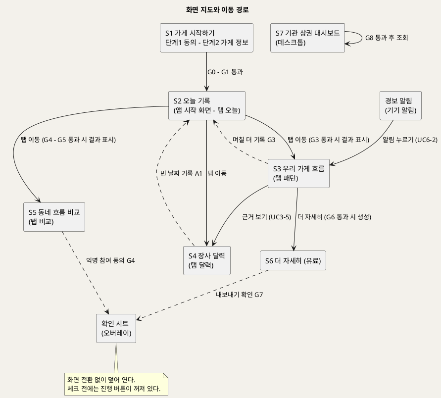

**[「화면 지도와 이동 경로」 PlantUML 뷰어로 열기](https://plantuml.sumzip.com/plantuml/svg/eNp9VMtO20AU3fsrrugmLIKaOI-qi4oWQVhWouzYGAgUEewqMeo2BBelwYigEpLQODJqeFVp5SSmDVX6Q56Zf-gdZ_Iwi-4843POvfeca8_ndCWr7-9lpNzujvpBySp7sK5s7G5ntX11c0HLaFl4tiQvRRbfTCFy75VN7eOOug1bSiaXlvQdPZMGVj8n9y7Q2zw5NWg9D9RyyWkdvO5fctWQsukNXVG3ETizEgHPyXtdE-hxgzbPWKXm9Z01lRzfeT0jAsiiVg3CMLyIjtF2hfTcGVBysBIJCEaB1lqkVAPUIVfWmhqilY5QHzUWBnb4Q-BmhyLRgIgM9NIhN-1ROWaVyY2BWpzHzDtmuIInB3gxoM1rWmhju21iXwvC8CAIsQAhzickRktUAPJoeA_lEc8_CF48wEsAOTnHYmVq9FmzCCHasMk3U2ATAWySW-G5mMLhgffLBGLm0Q60j3xpYCVy4tBSix202VFH8JPTfB5aD8OsmORmgHgu1nfEeUh4u7qyPE1h9Qq1-tx0VurzBNDprkHsIu6BKLG8uPhOwvTD4VdoPryE1HOMJRUBdvTg9QYS3vmvZHzlhzXcoFBKFgiujgvl8Ed21sDT7JgUC5DG1_GnWjFeMv4_QXki6P0eeB0H0As-fmh1QQ7HJ4gEIp5EkkpMK9NDixqdWYl7NRlt6CKQokGuR7qJcBR1YzA3J6whj0UgBZveNsRSw-sILzwB3Dv00fbrC0BKlnBcH8Cd5pWsB_L9E1CnT6vt0XeViknY-TSMFFy-GQW_GZFjKinhEvk9J3lSL0Zzsa8G0CuHXZqSqulpWNd0XdsDbUvkC-M_gW2weg1o9Qi9xz5_0gu8rDrkuDWHKNp1cf84ilbLpIQu3hrs4jPg0rDSgFO8PwNq40Y1iz4lrW4CryjN4xP-s_4BU7Q7Cw==)** — 클릭 시 브라우저로 연결됩니다.

- 실선은 전진(괄호 안은 결과 표시 조건 게이트), 점선은 되돌아가기·덮어 열기다.
- 사장님 화면 S2~S5는 하단 탭바(C1)로 서로 오가며 진입 자체는 막지 않는다. 게이트는 **화면 안의 결과·버튼**을 막는다(U1). 진입까지 막으면 사장님이 "왜 막혔는지"를 읽을 자리가 사라진다.
- S6 진입점은 S3 하단 링크(UC7 기본흐름 1 '더 자세히(유료)' 메뉴)다.
- S7은 별도 웹 진입점이며 사장님 화면과 연결되지 않는다.

### 2-3 진행 레일

사장님 화면(S2~S6) 맨 위에 고정한다. S6은 레일의 칸이 아니므로(S3에서 들어가는 하위 화면) 강조 칸 없이 표시한다. 업무 시스템의 결재 단계 대신, 사장님의 이용 단계 4칸과 각 칸의 막힘 여부를 보인다. 현재 화면 칸은 테두리로 강조한다.

| 칸 | 표시 | 상태 값 | 데이터 바인딩 | 근거 |
|:--:|---|---|---|---|
| 1 시작 | `시작 완료` | 완료(S1 이후 항상) | 가게 프로필 v1 존재(P1 1.5) | G0·G1 |
| 2 오늘 기록 | `오늘 기록 전` / `오늘 기록 완료` / `전송 대기` | 3값 | 일일 기록 v1의 오늘 날짜 존재·전송 상태(P2 2.6) | G2, UC2 E3 |
| 3 돌아보기 | `기록 6일 · 준비 중 G3` / `볼 수 있어요` | 2값 | 기록 수·신뢰도 판정(P3 3.3) | G3 |
| 4 비교 | `잠김 G4` / `자료 모이는 중 G5` / `볼 수 있어요` | 3값 | 익명 동의 여부(P1 1.3), 최소 가게 수 충족 여부(P5 5.3) | G4·G5 |

레일 칸은 누를 수 있고, 막힌 칸을 누르면 해당 화면의 C3 차단 블록으로 이동한다. S1에서는 레일 대신 `단계 1/2` 표기를 쓴다(아직 가게 프로필이 없음). S7에는 레일이 없다(단계형 여정이 아님).

## 3. 공통 컴포넌트

### 3-1 컴포넌트 목록

| ID | 컴포넌트 | 용도 | 대응 UC 단계 | 쓰는 화면 | 근거 원칙 |
|:--:|---|---|---|---|---|
| C1 | 하단 탭바 (오늘·달력·패턴·비교) | 사장님 화면 간 이동 | UC2-1, UC4-1, UC3-1, UC5-1 | S2~S5 | U2 |
| C2 | 진행 레일 | 이용 단계와 막힘 상시 표시 | UC2 사후조건, UC3 E1, UC5 A1·E1 | S2~S6 | U1 |
| C3 | 차단 블록 | 게이트 미통과 시 사유·해제 주체·다음 행동 | G0~G8 원천 예외흐름 전건 | S1~S7 | U1 |
| C4 | 이유 붙은 비활성 버튼 | 게이트가 끄는 버튼 + 아래 이유 줄 | UC1-2·4, UC2-5, UC5-2, UC7-3·5, UC8-1 | S1~S7 | U1 |
| C5 | 기록 선택 버튼(단일)·칩(다중) | 큰 버튼 선택 입력 | UC1-4, UC2-2·3·4, UC2 A1 | S1, S2 | U2 |
| C6 | 경향 카드 | 경향 문장 + 신뢰도 + 참고 안내 + 근거 보기 | UC3-1~5, UC5-2·3, UC7-4, UC8-2·3 | S3, S5, S6, S7 | U3, U5 |
| C7 | 신뢰도 배지 | 높음·보통·낮음·기록 부족 | INC2(UC3·UC5·UC6·UC7) | S3, S5, S6, S7, C10 | U3 |
| C8 | 데이터 상태 표지 | 확인 필요·전송 대기·기록 안 한 날·입력 안 함·표시 불가 | UC2 E1·E3, UC4 E1·E2, UC3 E3, UC8 E1 | S2, S3, S4, S7 | U4 |
| C9 | 확인 시트 | 동의·내보내기 확인(체크 후 진행 버튼 활성) | UC1-2·3, UC5 A1, UC7-5 | S1, S5, S6 | U6 |
| C10 | 경보 카드 | 하락 경향 경보 표시·확인 | UC6-1~4, UC6 A1·E3 | S2, S3 | U3, U7 |
| C11 | 장사 상태 표식 | ● 좋음 · ○ 보통 · – 나쁨 (모양 + 글자) | UC2-2, UC4-1·3 | S2, S3, S4 | U7 |

시각 규격(토큰)은 스타일가이드를 그대로 쓴다: 주 버튼 Rausch `#ff385c` 높이 48px(저장 버튼은 56px 전체 폭), 비활성 주 버튼 `#ffd1da`, 기록 선택 버튼 72px·라운드 14px, 칩 40px·알약형, 선택됨 ink 채움, 카드 라운드 14px + 유일한 그림자, 본문 16px 이상.

### 3-2 C2 진행 레일 · C3 차단 블록 · C4 비활성 버튼

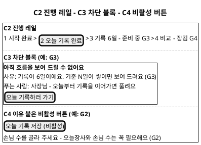

**[「C2 - C3 - C4 공통 컴포넌트」 PlantUML 뷰어로 열기](https://plantuml.sumzip.com/plantuml/svg/eNplUk1LAlEU3b9fcZdKJKTSQiICF-76A-KiqEVgLWpaWTDFI0xdaPkxxsw0oZWBgeUUBvOL5t73H7pvRsNqMVzmfpx7zrlv68TYOTZOD8viZKdsCOPAKO9DPg30LFX3GtCrkhPAKuQzQJMR1keAszY-ODqVBfySqm-TfAN8l6oWiMqKqMDG7uY_hHPOrwHVbXJbQH2JgwacwSZ_RW61hlizIJxNNHJcLc3LmUV6PSZCQ5O3cmhBITPviYiEH01ddr3wy4RCljemUnMyf7knyKrmeDypaa0IbqGOpOcLUE4TnyQ5EnDqU28MeGvjkw9UtYB6V9T16a4t6HJMtpebEyPHj7hxpF6T6yldYJqwHWeBGrcc8MVfRvWG3AoJJiFUa4a1NjAsuo2cjuQ-Yt3SciJn8NNUcvKzj9Xzrq4fTkwNqm7MGE0UfxmpOhbej4G7-L8klvzIRgC2B_jZJ8f8d8aFQWltUPHPdTyT2UHiZyZZEnTV1HTZJXwMIJyOkE9Fg4DkTItcyOA5ra1vwtIACw-DV1B8gLu26vixK-kk893aP9rjl_kNsftteQ==)** — 클릭 시 브라우저로 연결됩니다.

**C2 진행 레일**

| 구분 | 내용 |
|---|---|
| 상태 | 칸별 `완료`(ink 글자) · `진행 중`(테두리 강조) · `막힘 Gx`(error 색 글자 + 게이트 ID) · `대기`(muted) |
| 변형 | 사장님 모바일 4칸형 하나뿐. S1은 `단계 1/2` 표기로 대체, S7은 없음 |
| 동작 | 칸 누르기 → 해당 화면 이동, 막힘 칸이면 그 화면의 C3로 스크롤. 상태는 화면 진입 시마다 다시 계산(P2 2.6·P3 3.3·P5 5.3 출력) |

**C3 차단 블록**

| 구분 | 내용 |
|---|---|
| 상태 | `차단`(표시) · `해제`(사라지고 결과 영역이 그 자리에 나타남) |
| 변형 | **본인 해제형**(G0·G1·G2·G3·G4·G6·G7): 다음 행동 버튼 = 해제 행동(동의하기·기록하러 가기·결제하기 등) / **타인 해제형**(G5·G8): 다음 행동 버튼 없음 또는 «요청» 계열만(§11 규칙 ③) / **칸 단위형**(S7 G5): 표 칸 안에 축약 문구 |
| 동작 | 항상 결과 영역 **자리**에 고정 표시(토스트·자동 사라짐 금지). 세 줄 구성 고정: ① 사유(게이트 ID 병기) ② 푸는 사람 ③ 다음 행동. 문구는 §11-2 표준 문구를 그대로 쓴다 |

**C4 이유 붙은 비활성 버튼**

| 구분 | 내용 |
|---|---|
| 상태 | `활성` · `비활성 + 이유` · `누르는 중`(primary-active) |
| 변형 | 주 버튼(Rausch → `#ffd1da`), 보조 버튼(외곽선 → border-strong) |
| 동작 | 비활성 버튼 바로 아래 이유 줄을 **상시** 표시한다. 비활성 버튼을 누르거나 길게 누르면(모바일) 또는 마우스를 올리면(S7 데스크톱) 같은 문구를 다시 읽어 준다(§11 규칙 ②). 이유가 해소되면 즉시 활성으로 바뀐다 |

### 3-3 C6 경향 카드 · C7 신뢰도 배지 · C8 데이터 상태 표지 · C10 경보 카드

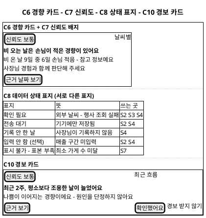

**[「C6 - C7 - C8 - C10 공통 컴포넌트」 PlantUML 뷰어로 열기](https://plantuml.sumzip.com/plantuml/svg/eNp9U1Fr01AUfr-_4oAvjunQObYJIoP9hD6WPUzcgzB9cPVpK6RtLF1TWceaNuuSkmprIxS8W9qasfqHcs_9D56TpFonCCHknnu-853znS87R4X994UPbw_F0f5hQRTeFA4PYHcT4pufuj0EvJ2oCxcew-4WoOWrz1KdmXzcBqyUdMUFfe7iyODQ0yeMUuEkQ4njVXEML169_Kfc6t_llJRcosiA_FI4nOjqdA9OQJV9bAUqNAVVU7cmoDNQ9VYS9wzAalNZDnpE7Jc4kLIlgV4N2xPstkQKCxgDz9GbAw7OYTP5SOAptkGDoIzi0KezTR2gU2M0lsfYG3Ia1-44cTgHbQfxnQO6QfBA20T2ZY5mxOn5-Mc8vpZJgyOXJ4kjuSeKYm0tk2Qb1CdJHWpT3lPyIZqu6hPIGqhhlEVXWJ0HixRSxL2jN15IliEOQ6EvbfQo2zaJn68uIzUzMuVoKN0-pRkA-1J3G6T9QDcCSsutQ-4Z5DYE-iZW-6AaBnVKF_SmBztNNaJ03-DpmwvEhqA71fcA7RpRuomoxLkQiZVPM7TtcMNo11nbk4Sp91H5wwwa8Li-rngrPNRogDMX4uk4lrT-71GWuiDl6S0im9ViyY6jswojOhvYv2b-qYvVBtBlfENN1xyuoawxF9haFv--U_9jPapJuwTtNdXXxH5ZYJ2W_Qj02SkxUjYti7XF7rdMDpZA1R3s_PZf2cFSkHjSm3BsZCS7W1iVpObNkf2umrRJ9KgLKyATLkmYLPePuVJXUZP5dPu6nZFxLBtQyasMTbmkQVHsHLx7Tf_7L2pZPzo=)** — 클릭 시 브라우저로 연결됩니다.

**C5 기록 선택 버튼·칩**

| 구분 | 내용 |
|---|---|
| 상태 | `기본`(흰 바탕 hairline) · `선택됨`(ink 채움·흰 글자) · `비활성`(S1 관할 밖 등, 사용 안 함) |
| 변형 | 단일 선택 버튼 72px 3열(오늘장사·손님수, S1 업종 대분류) · 다중 선택 칩 40px(특별한일·영업 요일) · 구간 버튼(매출 구간, 값 미정 §13) |
| 동작 | 한 번 누르면 선택, 다시 누르면 해제(다중) 또는 다른 값으로 교체(단일). 선택 즉시 C4 저장 버튼의 이유 줄을 다시 계산 |

**C6 경향 카드**

| 구분 | 내용 |
|---|---|
| 상태 | `표시`(문장+배지+참고 안내) · `관점 숨김`(UC3 E2 — 카드 대신 C8 `표본 부족` 한 줄) · `신뢰도 낮음`(배지만 바뀌고 문장 유지) |
| 변형 | **단독형**(S3·S6 개인 경향) · **나란히형**(S5 — 왼쪽 동네 익명, 오른쪽 내 가게, 순위·등수 칸 없음, U5) · **표형**(S7 — 지역·업종 칸마다 축약 문장) |
| 동작 | 문장은 "~하는 경향이 있어요"형 템플릿만 허용(BR-HRH-09). 원인 동사("때문에", "덕분에") 금지 목록을 SD_04 문장 생성 모듈에 둔다. 「근거 날짜 보기」 → S4(근거 날짜 강조) |

**C7 신뢰도 배지**: 알약형 11px/600. 값 4가지 `신뢰도 높음` · `신뢰도 보통` · `신뢰도 낮음` · `기록 부족 - 참고만`. 색 대신 글자로 구분한다(U7). 값 산출 기준은 미정(§13).

**C8 데이터 상태 표지**: 위 도면의 5종을 서로 다른 글자로 표시한다. 회색 빈칸이나 하이픈 하나로 뭉치지 않는다(U4). `확인 필요`는 P0이 재조회에 성공하면 값으로 바뀐다.

**C9 확인 시트**

| 구분 | 내용 |
|---|---|
| 상태 | `열림-미확인`(진행 버튼 비활성) · `열림-확인`(진행 버튼 활성) · `닫힘` |
| 변형 | 필수 동의형(S1 단계 1, G0) · 익명 참여 동의형(S1 단계 1 선택 항목, S5 G4) · 내보내기 확인형(S6, G7 — 포함 정보 목록 표시) |
| 동작 | 체크박스를 체크해야 Rausch 진행 버튼이 켜진다. 「동의하지 않음」은 보조 버튼으로 항상 활성(UC1 E1 경로). 시트 밖을 눌러 닫으면 아무것도 저장하지 않는다(U6) |

**C10 경보 카드**

| 구분 | 내용 |
|---|---|
| 상태 | `새 경보` · `확인함`(UC6-4 이후 접힘) · `수신 끔`(앱 안에서만 표시, UC6 A1) |
| 변형 | S2 저장 직후 앱 안 표시형(UC6 E3·A1) · S3 상단 상세형(UC6-2·3) |
| 동작 | 「근거 보기」 → S3 관점 '최근 흐름' / 「확인했어요」 → 확인함 기록 / 「경보 받지 않기」(텍스트 링크) → 수신 끔. 색은 error 글자만 쓰고 배경을 빨갛게 칠하지 않는다(스타일가이드 §11 "겁주지 않는 문장") |

**C1 하단 탭바 · C11 장사 상태 표식**은 스타일가이드 §12·§10 규격을 그대로 쓴다. C11은 ● 좋음 · ○ 보통 · – 나쁨, 반드시 글자를 함께 쓴다.

## 4. S1 가게 시작하기

### 4-1 와이어프레임

단계 1 — 수집 목적 안내와 동의. 필수 동의를 체크하지 않은 차단 상태(G0)를 그렸다.

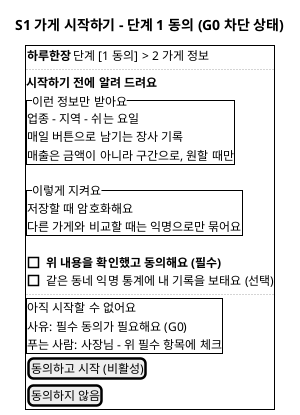

**[「S1 가게 시작하기 - 단계 1 동의」 PlantUML 뷰어로 열기](https://plantuml.sumzip.com/plantuml/svg/eNpVU81u00AQvu9TjHpKBFQtxwpVvfUBOFZBKqIHpMCBmlOIlJ9NCYklWuFt7NZOHUiUtHIlk5_KSHkiz-w7MGs7EZzWHs98P_Otj86t00_W5w9VcX5atYT13qqewet9SONGOreB-j4Nr7Ry0ySGF4D9WbqQsA_43aPAhdLxHlA84zJQu6nbflnUnokavHp7yDP4a6YVz0_gy2byZDNagUN4uWUJFS6WUBe7u4JH_yOlUNLgEkjZGI4Bf_h80I0jam92KFjiXVxM49QGjG9JSf66I2jQoZ8dlkzTBg0ezcO3CHsO8FcK1gKnYz4A51L31uSvceQDtmbMmDUNJ9SKwLyNgqz3yaegwYUuqRHzsh6J_S4yRLqK0ljmEM-Bbi-1CgFZ7tQW9Y3M8Gvmk7Ws_Vxf2GCSopXRHO0m2nO0Whpz2B_jJCnWQ14D8I9MV1tkozBY4UMnZ82sR090nc3WxQlUTALkS7bEtXsKJGhPUZDo6266CIsMcjIoad5Z1y1nc2nsGaPcgHJcsIC-WHF4JgbGK7ZiMHntnHmGQTLU7aBsEuQbYFKYNre3JwTGBxpcFBJ5t-SHB5ATF2rYbFa4cTa6jvfKQl8lmd1WhEP7wJy8Nuy7JlD2VyBo9YgP99k9mS91MzJL2Hh0jeFcCZR4j9rzSf4uV_7p4Fw4gh4FdoUnj84-vuMf4i_fW85o)** — 클릭 시 브라우저로 연결됩니다.

단계 2 — 가게 정보. 지역을 고르지 않은 차단 상태(G1)를 그렸다.

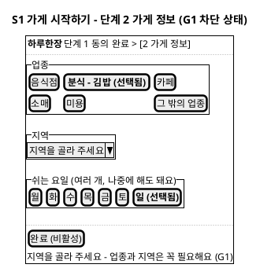

**[「S1 가게 시작하기 - 단계 2 가게 정보」 PlantUML 뷰어로 열기](https://plantuml.sumzip.com/plantuml/svg/eNp1UsFKAlEU3b-vuLhSKsHWIe76gJYygpGLwFrktDLB8imWkgqaYzklqTiF0tRIjeAXvXvnH7rOaEHQ6j3uOffcc-57iZyePtPPT7Iil87qQj_Wsxk4iIGyi-qjDlTr02PL6xjKtWEHsGYpR8LuDzzooDOH8H4MyLYYBSpdeqV-ROS3RB72DuPcikPL67DMGC42AjHARo9MA6gncViHOCT_aGpQENGoyKdC1C3TczkkkmTWqWbSoKmxUJK18VNygW2pRRHtMYRJDrySiU0r4lNoMfduDY07K3WcjPwavrl0_-Jf1ZcLaN_5NvwZmij4AydF6s5CIhVcyJSgHAvNJdBwSZL726k183qKN23gAjEapu4Un6aco78NeGXQqEXdJnidOTYkB14yL7LK8dD253u94KSqEVh7XftyqwFeGWySBvK_6YS_nOR6e2FcSK_XJ_nOyP-meVFBTuVwdU0rglrO2KNkAjtd0fg1IzwgkTk94n_xDZ5lILc=)** — 클릭 시 브라우저로 연결됩니다.

업종·지역의 실제 선택지 목록은 원천에 없다(§13). 위 업종 버튼은 배치 예시다.

### 4-2 영역별 설계

| 영역 | 내용 | 데이터 바인딩 | UX 의도 |
|---|---|---|---|
| 단계 표기 | `단계 1/2` | 화면 내부 상태 | U1 — 지금 어디인지 |
| 수집 안내 | 받는 정보 3줄, 지키는 방법 2줄 | 고정 문구(P1 1.1 Output 안내 화면) | U6, BR-HRH-01·02 |
| 필수 동의 체크 | 동의 항목 | P1 1.2 Output 동의 기록(임시) | U6, G0 |
| 익명 참여 체크 | 선택 동의 | P1 1.3 Output 익명 동의 여부 | U5, UC1 EXT1 |
| 차단 블록 | G0 사유·푸는 사람 | 체크 상태 | U1 |
| 업종 버튼 | C5 단일 선택 | P1 1.4 Output 기본정보 — 업종 | U2 |
| 지역 선택 | 드롭다운(단계 선택) | P1 1.4 Output 기본정보 — 지역 | U2 |
| 쉬는 요일 칩 | C5 다중 선택(선택 입력) | P1 1.4 Output 기본정보 — 영업 요일 | U2, UC1 A2 |
| 완료 버튼 | C4, G1 | P1 1.5 Output 가게 프로필 v1 | U1, U6 |

### 4-3 상호작용

| 조작 | 동작 | 근거 |
|---|---|---|
| 필수 동의 체크 | 차단 블록 사라짐, 「동의하고 시작」 활성 | UC1-2, G0 |
| 「동의하지 않음」 | 중단 안내 화면("동의해야 쓸 수 있어요"), 어떤 정보도 저장하지 않음 | UC1 E1, BR-HRH-02 |
| 익명 참여 미체크로 진행 | 진행 가능, 진행 레일 4칸이 `잠김 G4`로 시작 | UC1 A1 |
| 업종·지역 선택 | 「완료」 이유 줄 갱신, 둘 다 고르면 활성 | UC1-4, G1 |
| 쉬는 요일 생략 | 진행 가능, S3 요일 관점 진입 시 입력 요청 | UC1 A2, UC3 A1 |
| 「완료」 | 한 번에 저장(단계별 저장 없음), 성공 시 S2 | UC1-5, SD_01 §4-3 |
| 저장 실패 | 입력값 유지, 「다시 시도」 버튼과 이유 줄 | UC1 E3 |

### 4-4 상태 전이

`단계1-미동의(G0 차단)` → 필수 체크 → `단계1-동의` → 「동의하고 시작」 → `단계2-미완(G1 차단)` → 업종·지역 선택 → `단계2-완료 가능` → 「완료」 → `저장 중` → 성공: S2 / 실패: `저장 실패(재시도)` → `저장 중`. `단계1-미동의`에서 「동의하지 않음」 → `중단 안내`(종료).

## 5. S2 오늘 기록

### 5-1 와이어프레임

손님 수를 고르지 않아 저장이 막힌 상태(G2). 앱의 시작 화면이다.

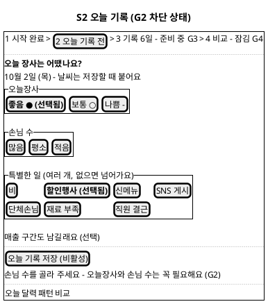

**[「S2 오늘 기록」 PlantUML 뷰어로 열기](https://plantuml.sumzip.com/plantuml/svg/eNplUsFu2kAQvfsrRjlhtUQNiXqq0ty49cIRUSlVc6hEemjoiSAZWKGCUSESDtAY6jQgTOVKTjAUJH9Nj57Zf-isDWqUHizvvp1582benFyUTj-VPp8XtYvTYkkrfSgVzyCXARpMsDWAaO3j7QhSWUZ8F00XqF6VdVvXys-0MhwAmTaNr4CGAu_acAnH_OWfppMjCtu3wx32kkYhpIEmBm4E_64ge7iNOQKGomVXPY-daGNA9ggq2v6-9urd8ZaZxlOqedjqAV0HaDlYG9C33mvt4AXd9CCjyFP4c64zB9Yc6rlxqGNwnrQcQKsNuBpyLmdp5bd7CW3CuqflVaEfJo3a8KffgRQJR9ZH2HV11UceF4FsLPnJTK5cu-pCuqBVYqpGF01W-GXARDj7yixxmOw0qZEcyakqNImXrQ0uhLRsiFVT38PvHkS-_Ryo3yA7xHkAKAYsNvIN1qsr3k08UiWU-6HRWl43Wfp_Usl0cN7DZhDfcm9yED202bQCU5guPQSJ2iR27CkTcWXQ7X2CzKp00-UUP_odKrk4m9DKhmjpRb7AjuDhutF6jWM1_V1xXVmVf7oCavTsyUbIoU3iXi9o_waF0xCihYvcP92FJNaKLQ2PTaGhAY8S2M0o_AXSEhwqrSAun83Epcu79bsEND10pnyQbVeKQCHJalW4mZOzj-958_8CpgqcBQ==)** — 클릭 시 브라우저로 연결됩니다.

### 5-2 영역별 설계

| 영역 | 내용 | 데이터 바인딩 | UX 의도 |
|---|---|---|---|
| 진행 레일 | C2 | P2 2.6·P3 3.3·P5 5.3 Output | U1 |
| 머리 | 질문 + 오늘 날짜 | 기기 날짜(P2 2.1 Output 기록 화면) | U2 |
| 오늘장사 | C5 단일 3개 + C11 표식 | P2 2.2 Output 오늘장사 값 | U2, U7 |
| 손님 수 | C5 단일 3개 | P2 2.2 Output 손님수 값 | U2 |
| 특별한 일 | C5 다중 칩 7개(UC2 기본흐름 4 목록) | P2 2.3 Output 특별한일 목록 | U2 |
| 매출 구간 링크 | 펼치면 구간 버튼 | P2 2.4 Output 매출 구간 | BR-HRH-06 |
| 저장 버튼 | C4, 56px 전체 폭, 하단 고정 | P2 2.5 Output 저장 요청 | U1, U2 |
| 완료 카드(저장 후) | "오늘 한 장 완료" + C11 + C8(`확인 필요`·`전송 대기`) | P2 2.6 Output 일일 기록 v1, 2.7 완료 화면 | U4 |
| 경보 카드(조건부) | C10 앱 안 표시형 | P2 2.9 Output 경보 v1 | U3 |
| 하단 탭바 | C1 | — | U2 |

### 5-3 상호작용

| 조작 | 동작 | 근거 |
|---|---|---|
| 기록 알림 누르기 | S2를 바로 연다 | UC2 A4 |
| 오늘장사·손님수 선택 | 선택됨 표시, 저장 버튼 이유 줄 갱신 | UC2-2·3, G2 |
| 특별한일 칩 | 다중 선택·해제 | UC2-4 |
| 「매출 구간도 남길래요」 | 구간 버튼 펼침, 고르지 않아도 저장 가능 | UC2 A1, BR-HRH-06 |
| 「오늘 기록 저장」 | 즉시 완료 카드로 전환(외부 조회 결과를 기다리지 않음) | UC2-5, SD_01 §5-3 |
| 통신 불가 상태로 저장 | 완료 카드에 C8 `전송 대기`, 레일 2칸 `전송 대기` | UC2 E3 |
| 외부 조회 실패 | 완료 카드 날씨 칸 C8 `확인 필요` | UC2 E1 |
| 오늘 이미 기록함 | 기존 선택이 채워진 화면 + 「고쳐서 저장」 | UC2 A2 |
| 저장 후 하락 경향 | 완료 카드 아래 C10 표시 | UC6-1, E3, A1 |

### 5-4 상태 전이

`미입력(G2 차단)` → 오늘장사·손님수 선택 → `저장 가능` → 저장 → `완료(저장됨)` 또는 `완료(전송 대기)` → [P0 재전송] → `완료(저장됨)`. `완료` 상태에서 판정 결과에 따라 `완료+경보` 추가. 같은 날 재진입 → `수정 가능`(기존 값 채움) → 저장 → `완료`.

## 6. S3 우리 가게 흐름

### 6-1 와이어프레임

정상 상태 — 경보를 누르고 들어와 경보 상세와 관점별 경향을 보는 화면.

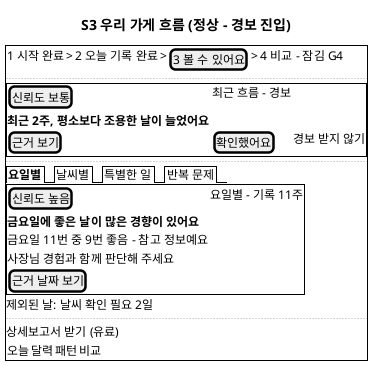

**[「S3 우리 가게 흐름 - 정상」 PlantUML 뷰어로 열기](https://plantuml.sumzip.com/plantuml/svg/eNpdUsFu00AQve9XzBEELUrbCwhVvfEBHCMORfSAFDhQcyqVQlmiEFs0RXHiBNtym6QJUg4mdoQjzA_tzP4Ds7EdUQ6W1js77715845OreN31vs3DXF63LCE9dpqnMDzfaBRjLcLUHFTLR3QQRdvJdyjyKVPH2EH1PIPJinQTFL4-b44eyDOoAZk-xReAQ0ljh34AIf87QF5E-x4oLIYr4O7xfo-YJIDtT2gsE39lEa9F2XtAHAt1arLbBRGat2EZwdwLnZ3DVud7AhvYryUDJDq1sp00cpXv_JKbCVSPH15WFb2aJw_BH35hVoOV9CeAF3HNPqhXR_wIqIgBZZKg1KKqHOX-hkbDpZvOOp66FKQ6f4_akszMP5OsyaQ2-G3olD6CAz7qEdBjonkt4alNy_OurPmg-HmsqnFHiYrwEVGkc-j_jdn6xsFzmbOLd5O5WqtxqOZSVXWLso06ALd2BQ0t5PNvpo_Vqv7U3OxtVxsuxgIl22gyRU83hwMgmNWEGcqiYADwKOSZ54LulhQOEXb22AOPMWr1O5c_fZAO12059plknFOMrtjJsuZ-ZWnbBRPS8MMu5sdPCktgsJoBpTczKsLcuMox4_hTG8SkfSN6YzCyfQjjhUnsYob22kvMJoan525lqm5KQJ1zpxHJ29fcer_Alf8sXg=)** — 클릭 시 브라우저로 연결됩니다.

차단 상태 — 기록이 기준보다 적은 경우(G3).

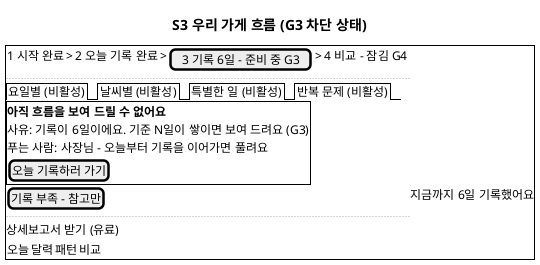

**[「S3 우리 가게 흐름 - G3 차단」 PlantUML 뷰어로 열기](https://plantuml.sumzip.com/plantuml/svg/eNplUk1v00AQve-vmGMjRKqSikOFqt5y64Vj1EMRPSAFDtScQiS3XaEo8SGh-XDBDq5Ik1TywSUuciR-kWf2P_C2dhGBgzXWm5m3M-_Nwalz_N758LapTo-bjnLeOM0Telkj-ZLwPKY8cfMfHpmwz3NNW3UkkiX3liQXZ-YiqKjWE9WiHZJeINMByZXm7x59pH18z0j8GXd9yrOEr8PNZKP2CD-X8Bc9JZm5vNYIA6rXjsqqXQKW3_dtfhrla5fqu9RW1apqbWPEIVp5hblQZa4C0XcVNPF5JMPl_7jprgGaUUD2xX96Ep9X98RxJlGwkWvbFV-82peRlsVZqYSEmniVyiQmvgx4npJ0fJLJJxmnGEvJeSxBtFeuKGH6sCWiTPrIV20CC9NhgZJ4lwh8m_7NGs1QajWvKDPIuDsk0PLU27NRpjfc860uDxrzT9fo5M970BFvjVPYZ0nNZ7dgU40NS8zI52-FyVlypNqqUXoCOrm-s-xJlq8iXnjWEVmgrpOvPfwUtpU04065N4zBYYjOsAb6RAdQ9iuqaAt6wH0czONVQPRezNGNdcZbGp1apHC7jVEOTt69xln-BubveBU=)** — 클릭 시 브라우저로 연결됩니다.

### 6-2 영역별 설계

| 영역 | 내용 | 데이터 바인딩 | UX 의도 |
|---|---|---|---|
| 진행 레일 | C2 | P3 3.3 Output 신뢰도 | U1 |
| 경보 카드(경보 진입 시) | C10 상세형 | P3 3.1 Output 경보 화면(경보 v1: 판정 기간·경향·신뢰도) | U3, U7 |
| 관점 탭 | 요일별·날씨별·특별한 일·반복 문제 | 화면 내부 상태(P3 3.4·3.5·3.6 Input) | U3 |
| 경향 카드 | C6 단독형 + C7 | P3 3.4 Output 경향 문장, 3.5 전후 경향, 3.6 반복 문제 목록 | U3 |
| 제외 일수 | C8 `확인 필요` 일수 | 일일 기록의 확인 필요 상태(P0 0.3 Output) | U4, UC3 E3 |
| 차단 블록(G3) | C3 본인 해제형 | P3 3.3 Output 신뢰도·기록 수 | U1 |
| 유료 링크 | 텍스트 링크 → S6 | — | 스타일가이드 원칙 01(Rausch 아님) |

### 6-3 상호작용

| 조작 | 동작 | 근거 |
|---|---|---|
| 경보 알림 누르기 | S3를 경보 카드 펼친 상태로 연다 | UC6-2 |
| 「확인했어요」 | 경보 확인함 기록, 카드 접힘 | UC6-4 |
| 「경보 받지 않기」 | 수신 끔, 이후 앱 안에서만 표시 | UC6 A1, BR-HRH-18 |
| 관점 탭 | 해당 관점 경향 카드 표시, 표본 부족 관점은 C8 한 줄 | UC3-2, E2 |
| 요일별 탭(쉬는 요일 미입력) | 요일 입력 요청 시트 | UC3 A1 |
| 특별한 일 탭에서 항목 선택 | 전후 차이 경향 | UC3-3 |
| 「근거 날짜 보기」·「근거 보기」 | S4를 근거 날짜 강조 상태로 연다 | UC3-5, UC6-3, UC4 A2 |
| G3 상태 「오늘 기록하러 가기」 | S2 이동 | UC3 E1, G3 |
| 「상세보고서 받기(유료)」 | S6 이동 | UC7-1 |

### 6-4 상태 전이

진입 → `판정 중` → 기록 부족: `G3 차단`(관점 탭 비활성) / 충분: `요약 표시` → 관점 선택 → `관점 표시` 또는 `관점 표본 부족`. 경보 진입 시 `요약 표시` 위에 `경보 펼침` → 확인 → `경보 접힘`. `G3 차단`은 사장님이 S2에서 기록해 기준을 넘긴 뒤 재진입하면 해제된다.

## 7. S4 장사 달력

### 7-1 와이어프레임

P4에는 게이트가 없다(SD_01 §7-3). 대신 빈 날·확인 필요·전송 대기 같은 **비어 있는 상태**를 그렸다.

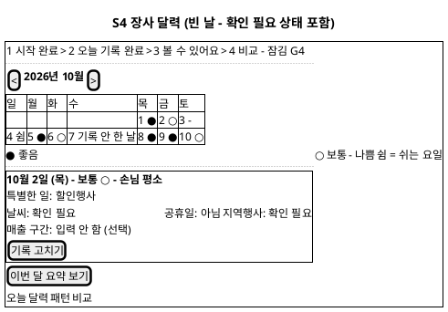

**[「S4 장사 달력」 PlantUML 뷰어로 열기](https://plantuml.sumzip.com/plantuml/svg/eNpdUsFu00AQve9XjMQlUZUoCaFAVaLe-ACOUQ5F9IAUOFBzSiK1zTZy4kgtUtw4rR0ZaFWDjFRhB8VS-ZkevbP_wIztIuhhdzU782bmvZmdfWP3g_HxXVfs73YNYbw1unvwqgm4vMKjEJQVKv8KSioxQR35UAG9sNFbg7Ylns8Ah4d66II-CbUdlEVvQ_SgDmi5uPwEuJDq6xT60KLTAHQu1cSBdH2jPnv_Ox-Dim4BTYfqmngWc-rc0wSVyHR1SpVx6afJAbxswkBUq1Sovd2hiO3XrUatsamOJdRreMHAdqtDMb1HgN4tmfmnXvDNNfqgvn-jO12b_D_yRZXef08d7uYnWdN3cyvrryJIkzFne1L4Ngvf07-MbJNkcTOd-vCsCHtevPUax4uBYBO_WOgxeU6holiPVmRUCOrgYcBtUqkXdIdqQiKfz4hIxnlDEN2cZoPJlYhJmYF5Dk5HQo1OleXQUMY4mgo9SVQkuTECbFGHPs1Pn41pvIJaxVmw9WCopEy00m6cxaMtORm1dH2A8x858AFCqOtL_OVCugrTG0mY5TFvTS5IACWUvh56ZdEulEojHxOHjA7p0UYvVj9NXrWMqf2b2WTO3v3O9O8XkcY1DbSM-SffiwGl2Nl7_4ZW-A-lHmQl)** — 클릭 시 브라우저로 연결됩니다.

### 7-2 영역별 설계

| 영역 | 내용 | 데이터 바인딩 | UX 의도 |
|---|---|---|---|
| 달 이동 | 이전·다음 달 | 화면 내부 상태(P4 4.2 Input) | — |
| 날짜 칸 | 날짜 + C11 표식, 쉬는 요일은 `쉼`, 미기록은 C8 `기록 안 한 날` | P4 4.1 Output 월 달력(일일 기록 v1 오늘장사), 가게 프로필 영업 요일 | U4, U7, BR-HRH-12·13 |
| 공휴일·행사 표시 | 날짜 칸 아래 작은 글자 | 일일 기록 v1 공휴일·지역행사 | BR-HRH-12 |
| 그날의 한 장 | 오늘장사·손님수·특별한일·날씨·공휴일·행사·매출 구간, 각 결측은 C8 | P4 4.3 Output 일 상세 | U4 |
| 기록 고치기 | 보조 버튼 → S2 수정 상태 | — | UC2 A2 |
| 월간 요약 | 좋음·보통·나쁨 날 수, 자주 있던 특별한일 | P4 4.4 Output 월간 요약 문장 | U3 |
| 오프라인 표시 | 상단 한 줄 "최신 아닐 수 있어요" | P4 4.1(기기 내 기록) | U4, UC4 E3 |

### 7-3 상호작용

| 조작 | 동작 | 근거 |
|---|---|---|
| 달 넘기기 | 해당 달 표시 | UC4-2 |
| 기록 있는 날짜 누르기 | 그날의 한 장 펼침 | UC4-3 |
| `기록 안 한 날` 누르기 | 그 날짜로 S2 기록 화면 | UC4 A1, UC2 A3 |
| S3 근거 보기로 진입 | 근거 날짜 칸 테두리 강조 | UC4 A2 |
| 「이번 달 요약 보기」 | 요약 문장 펼침 | UC4-4 |
| 기록 없는 달 | 빈 달력 + "오늘부터 한 장씩 채워보세요" + 「오늘 기록하러 가기」 | UC4 E1 |

### 7-4 상태 전이

`불러오는 중` → 통신 정상: `달력 표시` / 통신 불가: `달력 표시(최신 아닐 수 있음)` / 기록 0건: `빈 달력`. `달력 표시` → 날짜 선택 → `한 장 펼침` 또는 S2 이동(빈 날). P0 재조회 성공 시 `확인 필요` 표지가 값으로 바뀐다(재진입 시 반영).

## 8. S5 동네 흐름 비교

### 8-1 와이어프레임

익명 참여에 동의하지 않은 차단 상태(G4).

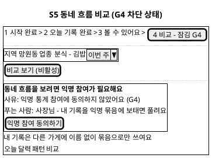

**[「S5 동네 흐름 비교 - G4 차단」 PlantUML 뷰어로 열기](https://plantuml.sumzip.com/plantuml/svg/eNpVUs1Kw0AQvu9TzNEiCmq9iIi3PoDHUkHRg1A9aDzVQqxbKU3A-lOTarZUbW2VCtGmUqFPlJl9B2c1RXsI2c3MfH-T9SNr69A63s-Lo628Jaw9K78LG8uAFw2UbdCqhs8S8EvGwxrMZNJAYQ-dHtDZqT4LUqIwKwqwAOQE1LwEakh8cuEE1vhZBPLbWPUhHoX4oKaLS4CDMVDFB2pW6Daiu5ukkk1P6Oa41oq_bMikc1AU8_OGjbo2eW-AXUX3NVbJE-SV6bEM-CnJUTzFIxh2uLBJKsKPCtDTeFMURTbBxUHEkmCGr7oRkHxP5RLw1e21KeOkpOnGVhtfIiA1xNcyJzAirx-HNui6ZN26btQLKvUpaK1MuvT5MB7IpJm8mkmUlK_rPjsAqleJT7--OdaU0JcjrN4Ao2DTXTFvanbQ8dkPlqIkQ6Mnwcf-Jyn3B3gQ8SqMQH1ls1QjJjul9Y-bYXKcxH9EG9BpY2cE7Cj--EE0sfHWyTvn04QpGONDgF0X6Do0lpilMNnwCWP0sWUy125Py8h8-Q27yHTruwc7_It9A8jtXN0=)** — 클릭 시 브라우저로 연결됩니다.

동의했지만 같은 동네·업종 참여 가게가 기준보다 적은 차단 상태(G5).

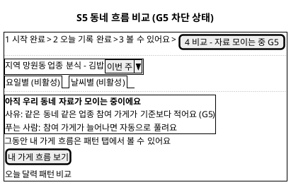

**[「S5 동네 흐름 비교 - G5 차단」 PlantUML 뷰어로 열기](https://plantuml.sumzip.com/plantuml/svg/eNplUstOwlAQ3d-vmKXEqPHBxhjjzg9waTDR6MIEXWhdAUmBa0IoCcWAUG1J0SrVlKRKVUz4os70H5xiu1AWTW7vzJlz7jmzc6kcXihXZ3lxeZhXhHKq5E9gLwvYNFA6EFk6PkvAbxl-6LCwmwXyXdRcoGo5qpoZUVgUBVgF0kzqt4AMiY8NKMI2f2tAPQfrPQgnPg6sv8V1wPEUqNYD6tfoNqC7dlLZ30jplrimxxB8dckKsN4Gclqwm81BSSwvx9w0VKk7AhxadK-zZsZT95oergE_JWkWzwi_VfSfuHAQz3ivAT1OD0RJFFaAScma4ljCAlNGhknyLcOdWLGp7f6_Tzm3jrapI2lYZryPz17q1a_Y0Ff_6uUTdXWmElTxyLQ3IfQNstQUlvwlssmfUNfjSzV8n81i88hRcRygxhR2OfGKo8iIqDWZkVQ87Dc257FsPrdjpYcvwUxe0yBzigMTohsVbScWVRLh1yQudGr87iBBJ8HHwqKGG8kAouoofoY054MT-3NAbgpYeY6XI1kCdlXz0I6DSCYW05xLLGLn5PyYt_AHZBBuSQ==)** — 클릭 시 브라우저로 연결됩니다.

정상 상태는 C6 나란히형으로 표시한다: 왼쪽 "망원동 분식 - 익명 묶음" 경향 문장 + 신뢰도, 오른쪽 "내 가게" 경향 문장 + 신뢰도. **참여 가게 수의 정확한 값, 순위, 백분위, 개별 가게 값은 표시하지 않는다**(U5, BR-HRH-15·21). 스타일가이드 §9의 "익명 23곳 기준 · 상위 30%" 표기 중 "상위 30%"는 쓰지 않는다. "익명 N곳 기준" 표기 여부는 재식별 위험 검토 후 결정한다(§13).

### 8-2 영역별 설계

| 영역 | 내용 | 데이터 바인딩 | UX 의도 |
|---|---|---|---|
| 비교 조건 바 | 지역·업종(가게 프로필에서 고정 표시) + 기간 선택 | 가게 프로필 v1 업종·지역, P5 5.3 Input 기간 | 스타일가이드 §8 세그먼트 바, U5 |
| 비교 보기 버튼 | C4, G4 | P5 5.1 Output 진입 허용 | U1 |
| 차단 블록 | C3 — G4 본인 해제형 / G5 타인 해제형(행동 버튼 없음) | P1 1.3 익명 동의 여부, P5 5.3 최소 가게 수 충족 여부 | U1 |
| 나란히 경향 | C6 나란히형 | P5 5.4 Output 비교 화면(익명 집계 결과 + 내 신뢰도) | U5 |
| 내 경향 부족 표시 | 오른쪽 칸에 C7 `기록 부족 - 참고만` | P5 5.2 Output 내 신뢰도 | U4, UC5 E2 |
| 관점 탭 | 요일별·날씨별 | P5 5.5 Output 관점별 비교 | U5 |
| 통신 실패 | 결과 영역에 "다시 시도" 보조 버튼 | — | UC5 E3 |

### 8-3 상호작용

| 조작 | 동작 | 근거 |
|---|---|---|
| 「익명 참여 동의하기」 | C9 익명 참여 동의형 시트 → 체크 → 「동의」 → 화면 재판정 | UC5 A1, G4 |
| 기간 선택 | 「비교 보기」 활성 시 익명 집계 요청 | UC5-2 |
| 「비교 보기」 | 결과 영역에 나란히 경향 또는 G5 차단 블록 | UC5-2, E1 |
| 관점 탭 | 관점별 나란히 경향 | UC5-3 |
| G5 상태 「내 가게 흐름 보기」 | S3 이동 | UC5 E3 대체 제안, SD_01 §8-3 |
| 통신 실패 「다시 시도」 | 재요청 | UC5 E3 |

### 8-4 상태 전이

`진입` → 미동의: `G4 차단` → 동의 → `조건 선택` → 「비교 보기」 → `집계 중` → 미달: `G5 차단` / 통신 실패: `재시도 대기` / 성공: `나란히 표시`(내 기록 부족이면 `나란히 표시-내 경향 부족`) → 관점 탭 → `관점 표시`. `G5 차단`은 사용자 조작으로 풀리지 않으며, 재진입 시 다시 판정한다.

## 9. S6 더 자세히(유료)

### 9-1 와이어프레임

결제가 실패해 유료 기능이 막힌 상태(G6).

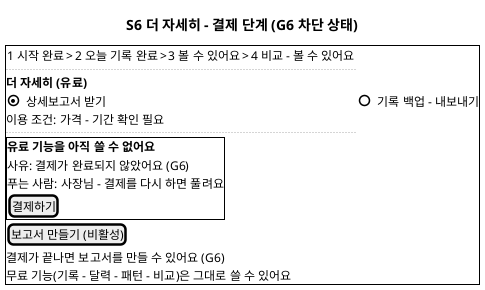

**[「S6 더 자세히 - G6 차단」 PlantUML 뷰어로 열기](https://plantuml.sumzip.com/plantuml/svg/eNplks1KI0EQx-_9FHWcYVFYd_EQRLztA-xlQTy4mIMQPeh4UiGJ7RKSWUjU6ERnhgkmJIEcOmaWHcEn6qp-B2smk8SPw3x0dXX9f_Wv3jp2do-ck4OSON4tOcLZd0pF-LkO-PcGKGySTExYgxXQT4oiH7Ax1FMJ1o91IDXkFdBFxVz4tjj9Ik7hK1DDp7AF1JH46MIZbPKzBuT1sO6BThR2g_eb3wCnL0A1j-VqdBvT_U2-8x3wWep_TVb_nHIuVlfFxu_N95wW-RGXtoX1y07JOIzTWE8jksyuHhiAC1tgz1FQTejuMlWoxpzJb94QFLDGCKir9CQugFZl_TRKTUiUVhJMp01BAqYtmSTl4N4ZZaadVa73KZBAnDCoAF0nM_i7PzN4QdUxJxdyU7l8bgk2PRrwol2ntpc3ylbbwrQSrHOj1TGGbiH9UtjHhrcYDPZfeDY9dp-xPBzFYK7KGPVSte1ZCscZbUeci-03ngxcvO6ltlhstun4JCf2jliCYSXAalZwcSjTys59mEmGiuN46YKV28z-NsYY9fnHuEMj4zSSDdemoAz6f4JuGbv-0qt5UcbdKh7u8QV9BUFmfyk=)** — 클릭 시 브라우저로 연결됩니다.

보고서를 만든 뒤 받기 전, 포함 정보 확인을 하지 않은 차단 상태(G7).

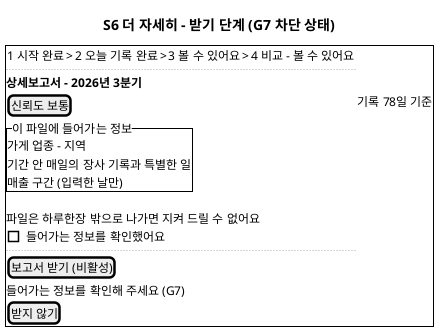

**[「S6 더 자세히 - G7 차단」 PlantUML 뷰어로 열기](https://plantuml.sumzip.com/plantuml/svg/eNp9UsFKG1EU3b-vuLhKKJU2Fu2iiLt-QJchBUtdFFIXdVxFIeqLhGRKU3SSSZ0Jo0maCApTZyIR5ovm3vcPPa8OlNLSxVvcd88759xz39aes_3J2f9YV3vbdUc5H5z6Dr1ZJ_58TjLqiV6aUZueEscX-TIm7s7zRFPp9QZJPEdFcnJkToKyajxRDXpO0g1k9JVkqHns0gFt4lRI_Al3fAIDX4Z_NteIk4yk7UOuLf1Uvp0XnRfEDzpf9Kz6X5BDtbqqXr3bhDw8cpLmSSQ6ALbyrLLOLU1rfK8hqKrSjfgq5i8aNKk5XdTAXTjZeClhZguZNFXj7YqEKRnXxaUMesRnE6jlcZM7CCPy8HxFoczvXJJBS65akJNZUwa3Chx5rEm8NvFsYglCa3cqxzeFWI4ZTOeBE228gIBQFngfUL64sU9LMmpxNLVNPo545pbVoSrMhE0yns_jObogxTb6EmR8aaG-NXid_jKS4eIs4O_pY1qD08e0VJVq_5qGp7A09CRcmn4RrI21-jvOYu0lbMIMA9E_yjX1fyIP2uMMO7Fbwj8pgy6-gDlk0wFXDVNt7ey-x5f7CeHtamc=)** — 클릭 시 브라우저로 연결됩니다.

### 9-2 영역별 설계

| 영역 | 내용 | 데이터 바인딩 | UX 의도 |
|---|---|---|---|
| 기능 선택 | 상세보고서 / 백업·내보내기 라디오 | P6 6.2 Input | UC7a·UC7b |
| 이용 조건 | 가격·기간(미정 표기) | 유료 이용 권한 조건(자료 없음) | U4 — 미정을 미정으로 |
| 차단 블록(G6) | C3 본인 해제형 | P6 6.3 Output 유료 이용 권한 | U1 |
| 보고서 만들기 | C4, G6·G3 | P6 6.4 Output 보고서 초안 | U1 |
| 보고서 머리 | 기간 + C7 + 기록 일수 | P6 6.4 Output(기간·신뢰도) | U3 |
| 포함 정보 목록 | 파일에 들어가는 항목 | P6 6.5 Input 포함 정보 안내 | U6, BR-HRH-20 |
| 확인 체크·받기 | C9 내보내기 확인형 + C4 | P6 6.5 Output 보고서·백업 파일 | U6, G7 |

### 9-3 상호작용

| 조작 | 동작 | 근거 |
|---|---|---|
| 기능 선택 | 권한 확인, 있으면 결제 단계 생략 | UC7-2, A2 |
| 「결제하기」 | 결제 진행(수단 미정), 실패·취소 시 G6 차단 블록 | UC7-3, E1 |
| 기간 선택 → 「보고서 만들기」 | 기간 기록 부족이면 G3 차단 블록(문구는 §11-2 G3 표준 문구) | UC7-4, E2 |
| 확인 체크 | 「보고서 받기」 활성 | UC7-5, E3, G7 |
| 「받지 않기」 | 파일을 만들지 않고 S3로 | UC7 E3 |
| 백업·내보내기 선택 시 | 4단계에서 기간 대신 방식 선택, 이후 같은 확인 절차 | UC7 A1 |

### 9-4 상태 전이

`기능 선택` → 권한 없음: `결제 필요` → 결제 성공: `기간 선택` / 실패: `G6 차단` → 「결제하기」 → `결제 필요`. `기간 선택` → 부족: `G3 차단` / 충분: `생성됨-미확인(G7 차단)` → 체크 → `받기 가능` → 받기 → `전달 완료`.

## 10. S7 기관 상권 대시보드

### 10-1 와이어프레임

데스크톱. 상단 80px 내비게이션(스타일가이드 §12)과 지역·업종 표. 표본 부족 칸이 막힌 상태(G5 칸 단위)를 그렸다. 개별 가게 조회 메뉴는 두지 않는다(정책 경계).

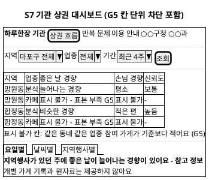

**[「S7 기관 상권 대시보드」 PlantUML 뷰어로 열기](https://plantuml.sumzip.com/plantuml/svg/eNqlU01v00AQvftXjMSFCqVcQEgIod74ARxRIxXRA1LgQMOpjeQGN0pj0wSIE6fYkfNRkkqpZGInTaTwZzjuzP4HZvJBkoobkg87b2fevt33vHeUPfiQ_fguYxwdZLJG9m02cwgvn4CaRCoxgT6dqrED6Jhk-xgn-M2H-y8eA00ngHaffAso6vMKdHmg3f6OcfzAOIZnr59r18NOX7s-Na9WbCfwakmogwr-sPYZwcjDeAQ4mFDoc01BQpfXQG4R8wnXv-s2f2o0oOHNqohnkDN2d_kg6plUv-G2NPaKLIH7gEKLhklauOpn1D6T3TUmUiJrjo18dTuDR9SZpefSWpG-dPaX1PfW3H9pqG1TYALmQ1DDX7p2JVihgra3UdshtiMsWwb2AvpewXJDbjm2yA5kUfKolmDew1J1PaTL51RwZDtOdGG0NUrTRF940vTFZxOYqqgiE1JSY8w2jE1q_QQ25W7LCaQM7V5T6N4VMbWodMvebMgOT-Vq-mIi-4WvFDhbs_-nImdsYxyfp6Cixvw1yw20uqtq-dYUTag-YNBUQ0cm2DbqmpJAuzsXW-OYVCWLO3O7HkrmGKFghrHYyyZRtb9YL5zUtXPKDwTJGdK8Ac41NYv42QNOA9UrG1ZzIP_lmsA8stSREsUqDkEeLE4MFfly0EK_iMdWILFlV6lZwY4jRBx4FY_4R2EpHPgSuRZz8WPtHb5_w7_kHz2vEbw=)** — 클릭 시 브라우저로 연결됩니다.

G8(계약 만료)은 로그인 직후 대시보드 본문 자리에 C3 타인 해제형으로 표시한다: "대시보드를 열 수 없어요 / 사유: 이용 계약이 만료됐거나 권한이 없어요 (G8) / 푸는 사람: 기관 - 이용 계약 갱신". 이때 조회 조건 바와 「조회」 버튼은 모두 비활성이다. 계약 갱신 절차가 상류에 없어 다음 행동 버튼은 두지 않고 안내 문구만 둔다(§11 규칙 ③, §13).

### 10-2 영역별 설계

| 영역 | 내용 | 데이터 바인딩 | UX 의도 |
|---|---|---|---|
| 상단 내비게이션 | 상권 흐름·반복 문제·이용 안내, 기관명(마스킹 예시 `○○구청 ○○과`) | P7 7.1 Output 기관 세션(기관·관할 지역) | 스타일가이드 §12 |
| 조회 조건 바 | 지역(관할 안만)·업종·기간 | P7 7.2 Input | UC8 A1·A2 |
| 경향 표 | 지역×업종 칸, 미달 칸은 C8 `표시 불가 - 표본 부족` | P7 7.2 Output 익명 집계 결과 | U4, U5, G5 |
| 관점 탭·경향 문장 | C6 표형 | P7 7.3 Output 관점별 경향 | U3 |
| 반복 문제 탭 | 업종별 현장 문제 빈도 경향 | P7 7.4 Output 반복 문제 경향 | UC8-4 |
| 정책 경계 문구 | "개별 가게 기록과 원자료는 제공하지 않아요" 상시 | 고정 문구(P7 7.5) | BR-HRH-21 |
| 계약 차단(G8) | C3 타인 해제형 | P7 7.1 Output 계약 상태 | U1 |

### 10-3 상호작용

| 조작 | 동작 | 근거 |
|---|---|---|
| 로그인 | 계약·권한 확인 → 대시보드 또는 G8 차단 | UC8-1, E3 |
| 관할 밖 지역 | 드롭다운에 나타나지 않음(선택 불가) | UC8 A1 |
| 업종 미선택 조회 | 지역 전체 업종 합계 | UC8 A2 |
| 「조회」 | 표 갱신, 미달 칸은 표시 불가 | UC8-2, E1 |
| 관점 탭 | 관점별 경향 문장 | UC8-3 |
| 표시 불가 칸에 마우스 올림 | §11-2 G5 표준 문구 | 규칙 ② |
| 개별 가게 조회 시도 | 해당 기능·경로 없음. API 직접 요청은 거부 안내 | UC8 E2, BR-HRH-21 |

### 10-4 상태 전이

`로그인` → 계약 무효: `G8 차단`(전 조작 비활성) / 유효: `첫 화면` → 조건 선택 → `조회 중` → `표 표시`(일부 칸 `표시 불가`) → 관점 탭 → `관점 표시`. 합계 행으로 숨긴 칸이 역산되지 않도록 합계도 같은 기준을 적용한다(SD_01 §10-3, SD_03·SD_04 이관).

## 11. 게이트 맵 → 화면 표현 사상

### 11-1 사상표

| 게이트 | 화면 | UI 표현 | 비활성화 대상 | 해제 액션 |
|:--:|---|---|---|---|
| G0 필수 동의 | S1 단계 1 | C3 본인 해제형 + C9 필수 동의형 | 「동의하고 시작」 | 필수 항목 체크(사장님) |
| G1 기본정보 | S1 단계 2 | C4 이유 줄 | 「완료」 | 업종·지역 선택(사장님) |
| G2 기록 필수 항목 | S2 | C4 이유 줄 + 레일 2칸 `오늘 기록 전` | 「오늘 기록 저장」 | 오늘장사·손님수 선택(사장님) |
| G3 분석 충분성 | S3, S6(+S2 경보 미생성) | C3 본인 해제형 + 레일 3칸 `준비 중 G3` + C7 `기록 부족` | S3 관점 탭 4개, S6 「보고서 만들기」 | 「오늘 기록하러 가기」 → S2(사장님 기록 누적) |
| G4 익명 동의 | S5 | C3 본인 해제형 + 레일 4칸 `잠김 G4` | 「비교 보기」, 기간 선택 | 「익명 참여 동의하기」 → C9(사장님) |
| G5 최소 가게 수 | S5, S7 | S5: C3 타인 해제형(행동 버튼 없음) + 레일 4칸 / S7: 칸 단위 C8 `표시 불가 - 표본 부족` | S5 관점 탭, S7 해당 칸의 상세 보기 | 직접 해제 없음. 참여 가게 증가 시 자동 해제. «요청» 기능은 상류에 없음(§13) |
| G6 유료 권한 | S6 | C3 본인 해제형 + C4 | 「보고서 만들기」 | 「결제하기」(사장님) |
| G7 내보내기 확인 | S6 | C9 내보내기 확인형 + C4 | 「보고서 받기」 | 포함 정보 확인 체크(사장님) |
| G8 기관 권한 | S7 | C3 타인 해제형(대시보드 본문 자리) | 조회 조건 바 전체, 「조회」 | 직접 해제 없음. 기관의 계약 갱신 — 절차 미정(§13) |
| 정책 경계(UC8 E2) | S7 | 상시 안내 문구, 개별 조회 메뉴 자체 없음 | (해당 기능 미제공) | 해제 없음(의도) |

G3의 P2 위치(2.8 경보 미생성)는 출력을 만들지 않는 게이트라 S2에 끌 버튼이 없다. 사장님에게는 S3·S6의 G3 표현과 레일 3칸으로만 보인다.

### 11-2 게이트 표준 문구

같은 게이트는 모든 화면에서 아래 문구를 글자 그대로 쓴다(규칙 ④). `N`은 기준 확정 전 자리표시다.

| 게이트 | 사유 문구 | 푸는 사람 문구 | 비활성 버튼 이유 줄 |
|:--:|---|---|---|
| G0 | 필수 동의가 필요해요 (G0) | 사장님 - 위 필수 항목에 체크 | 필수 항목에 동의해 주세요 (G0) |
| G1 | 업종과 지역은 꼭 필요해요 (G1) | 사장님 - 업종과 지역 고르기 | ○○을 골라 주세요 - 업종과 지역은 꼭 필요해요 (G1) |
| G2 | 오늘장사와 손님 수는 꼭 필요해요 (G2) | 사장님 - 두 가지 고르기 | ○○을 골라 주세요 - 오늘장사와 손님 수는 꼭 필요해요 (G2) |
| G3 | 기록이 ○일이에요. 기준 N일이 쌓이면 보여 드려요 (G3) | 사장님 - 오늘부터 기록을 이어가면 풀려요 | 기록이 더 쌓이면 볼 수 있어요 (G3) |
| G4 | 익명 통계 참여에 동의하지 않았어요 (G4) | 사장님 - 내 기록을 익명 묶음에 보태면 풀려요 | 익명 참여에 동의하면 볼 수 있어요 (G4) |
| G5 | 같은 동네 같은 업종 참여 가게가 기준보다 적어요 (G5) | 참여 가게가 늘어나면 자동으로 풀려요 | 자료가 모이면 볼 수 있어요 (G5) |
| G6 | 결제가 완료되지 않았어요 (G6) | 사장님 - 결제를 다시 하면 풀려요 | 결제가 끝나면 보고서를 만들 수 있어요 (G6) |
| G7 | 들어가는 정보를 확인해 주세요 (G7) | 사장님 - 확인 체크 | 들어가는 정보를 확인해 주세요 (G7) |
| G8 | 이용 계약이 만료됐거나 권한이 없어요 (G8) | 기관 - 이용 계약 갱신 | 계약이 확인되면 조회할 수 있어요 (G8) |

### 11-3 사상 규칙

1. **모든 게이트는 하나 이상의 버튼을 비활성화한다.** 위 사상표의 `비활성화 대상`이 빈 게이트는 없다(G3의 P2 위치는 출력 미생성으로, 같은 G3가 S3·S6에서 버튼을 끈다). 배너만 띄우고 진행이 가능한 표현은 쓰지 않는다.
2. **비활성 버튼에는 이유가 붙는다.** 버튼 아래 이유 줄을 상시 표시하고, 누르기·길게 누르기·마우스 올림 시 같은 문구를 다시 보인다.
3. **해제 주체가 현재 사용자가 아니면 직접 해제 버튼을 두지 않는다.** 타인 해제형(G5·G8)의 액션은 «요청 보내기»여야 하나, 상류(UC·SD_01)에 요청 기능이 없어 **버튼 없이 안내 문구만** 둔다. 요청 기능 추가 여부는 §13에서 결정한다. 직접 해제 버튼(예: "그래도 보기")은 0건이다.
4. **두 화면에 걸치는 게이트는 문구를 동일하게 유지한다.** G3(S3·S6)와 G5(S5·S7)는 §11-2 문구를 글자 그대로 쓴다.
5. **게이트는 화면 진입을 막지 않고 화면 안의 결과·버튼을 막는다.** 사장님이 막힌 이유를 읽을 자리를 남기기 위해서다(§2-2). 예외는 G8(기관 대시보드 본문 전체가 결과 영역).
6. **토스트·자동으로 사라지는 경고로 게이트를 표현하지 않는다**(프롬프트 금지 사항, U1).

## 12. 상태 표현·접근성·오류 규약

### 12-1 상태 표현 규약

| 대상 | 표현 | 금지 |
|---|---|---|
| 장사 상태 | C11 ● 좋음 · ○ 보통 · – 나쁨, 글자 병기 | 초록·노랑·빨강 신호등 색 |
| 신뢰도 | C7 글자 배지 4값 | 별점·게이지만으로 표시 |
| 결측 | C8 5종 표지(확인 필요 · 전송 대기 · 기록 안 한 날 · 입력 안 함(선택) · 표시 불가 - 표본 부족) | 회색 빈칸, 하이픈 하나로 통합 |
| 게이트 차단 | C3 세 줄 + C4, 게이트 ID 병기 | 토스트, 아이콘만 |
| 경보 | C10 error 색 글자 + 문장 | 빨간 배경 전체 칠하기, 느낌표 연발 |
| 강조색 | 화면당 Rausch 주 버튼 1개 | 보조 행동에 Rausch |

아이콘 문자는 스타일가이드의 활자 기호(● ○ – ☀︎ ☂︎ 등)만 쓰고 그림 이모지는 쓰지 않는다.

### 12-2 접근성

- 본문 16px 이상, 14px 이하는 날짜·출처 같은 보조 정보에만(스타일가이드 §3). 한글 `word-break: keep-all`.
- 터치 영역 최소 48×48px, 기록 선택 버튼 72px(U2, 스타일가이드 §6·§7).
- 명암: ink `#222222` / 흰 바탕, muted `#6a6a6a` / 흰 바탕을 본문 최소로 한다. 비활성 주 버튼(`#ffd1da` 위 흰 글자)은 명암이 낮으므로 **이유 줄을 ink 글자로** 따로 둬 정보가 버튼 색에만 의존하지 않게 한다.
- 스크린리더: C5 버튼은 `선택됨/선택 안 됨` 상태를 읽고, C4 비활성 버튼은 `사용할 수 없음, 이유: …`로 이유 줄을 함께 읽는다. C3 차단 블록은 화면 진입 시 첫 안내로 읽는다. C11 표식은 기호 대신 "좋음"을 읽는다.
- 키보드(S7 데스크톱): 조회 조건 → 조회 → 표 → 관점 탭 순서로 이동, 포커스는 2px ink 테두리(스타일가이드 §8, 빛 번짐 없음).

### 12-3 오류 규약 (전역 실패 규칙)

| 상황 | 표현 | 근거 |
|---|---|---|
| 통신 불가 중 기록 저장 | 저장은 성공으로 처리, C8 `전송 대기` + 레일 표시. 실패로 보이지 않게 | UC2 E3, SD_01 P0 |
| 외부 데이터 조회 실패 | 해당 칸 C8 `확인 필요`, 사장님 흐름은 막지 않음 | UC2 E1 |
| 서버 저장 실패(가입) | 입력값 유지 + 「다시 시도」 + 이유 줄 | UC1 E3 |
| 비교·조회 통신 실패 | 결과 영역 자리에 "연결이 불안정해요" + 「다시 시도」 보조 버튼 | UC5 E3 |
| 달력 통신 불가 | 기기 내 기록으로 표시 + "최신 아닐 수 있어요" 한 줄 | UC4 E3 |
| 공통 | 오류는 결과 영역 **자리**에 고정 문구로 표시한다. 오류 코드·기술 용어를 사장님 화면에 노출하지 않는다 | U1, BR-HRH-04 |

## 13. 미해결·확인 필요

**상류 미정 값(화면 문구·선택지에 영향)**

| 항목 | 영향 화면 | 출처 |
|---|---|---|
| 분석 최소 기록 수 N, 신뢰도 4값 산출 기준 | S3·S6 G3 문구, C7 | SD_01 §14 · BR-HRH-08 |
| 익명 통계 최소 참여 가게 수 | S5·S7 G5 | BR-HRH-14 |
| 업종·지역 선택지 목록, 지역 단위(동·구) | S1 단계 2, S5 조건 바, S7 | UC1 · UC5 특별 요구사항 |
| 매출 구간 값 | S2 매출 구간 펼침 | UC2 A1 |
| 유료 가격·기간·결제 수단, 보고서 구성·파일 형식 | S6 | UC7 |
| 가입 수단(로그인 방식) | S1 앞단 | UC1 특별 요구사항 |
| 기록 알림 시각·설정 화면 | S2 진입 | UC2 A4 |

**설계 판단이 필요한 것**

- **타인 해제 게이트의 «요청» 기능(G5·G8)**: 프롬프트 규칙 ③은 요청 액션을 요구하지만 상류에 요청 기능이 없어 넣지 않았다. G5는 "참여 가게 모집"(원천 `[핵심 인적자원]` 현장 운영자)과, G8은 기관 계약 갱신 프로세스와 연결할지 결정이 필요하다.
- **S5 "익명 N곳 기준" 표기 여부**: 스타일가이드 예시에 있으나, 작은 표본에서 참여 가게 수 노출이 재식별 단서가 될 수 있다.
- **설정 화면 부재**: 경보 수신 끄기(UC6 A1)는 C10 카드 안 링크로만 두었다. 익명 동의 철회·가게 정보 수정·탈퇴 화면은 UC·SD_01에 프로세스가 없어 만들지 않았다(SD_01 §14).

**스타일가이드와의 차이(이 문서가 상류 규칙을 우선한 항목)**

| 스타일가이드 항목 | 이 문서의 처리 | 근거 |
|---|---|---|
| §9 지역 비교 카드 "상위 30%" 배지 | 쓰지 않음 | BR-HRH-15 |
| §8 폼 예시 "가게 이름" · "휴대폰 번호" 입력 | S1에 넣지 않음 | BR-HRH-01 |
| §7 특별한 일 "＋ 직접 입력" 칩 | 넣지 않음 | UC2 기본흐름 4(버튼 입력), BR-HRH-05 |
| §11 동의 모달 문구 "매출 정보는 기기 밖으로 나가지 않고" | 쓰지 않음. 기록은 서버에 암호화 저장된다고 안내 | UC2 사후조건 1, BR-HRH-03 — 사실과 다른 약속이 됨 |
| §11 경보 카드 「비교 보기」 링크 | 「근거 보기」로 대체 | UC6-3(근거 → UC3). 경보에서 비교로 가는 흐름은 UC6에 없음 |

비기능 요구(화면 응답시간, 지원 기기·OS, 오프라인 보존 기간)는 원천·상류에 없어 정하지 않았다.

---

*하루한장 SD_02 UI/UX 설계서 · 입력 SD_01 · UC_00~UC_08 · 스타일가이드 v0.1 · 원천 `Intent-Specify.md`*
