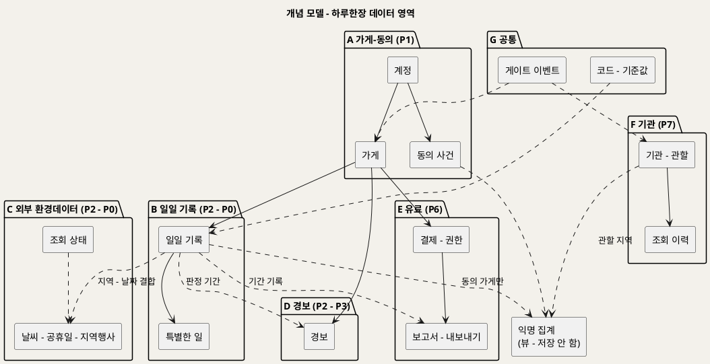
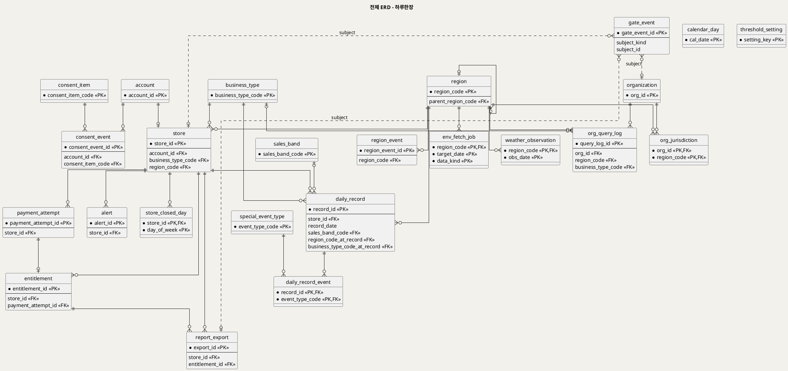
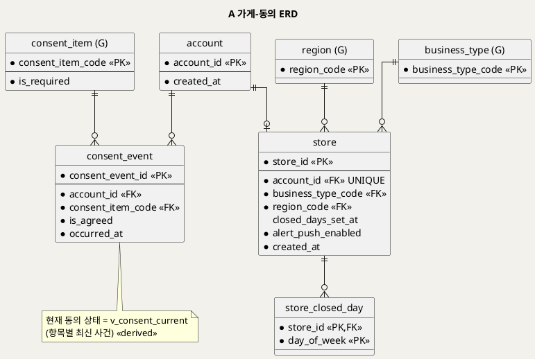
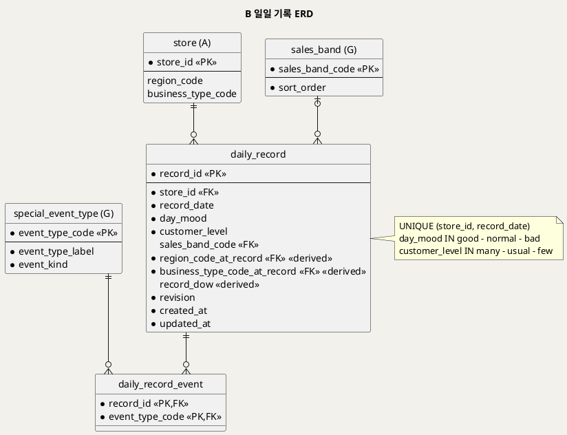
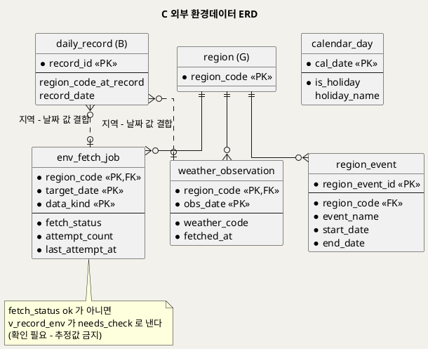
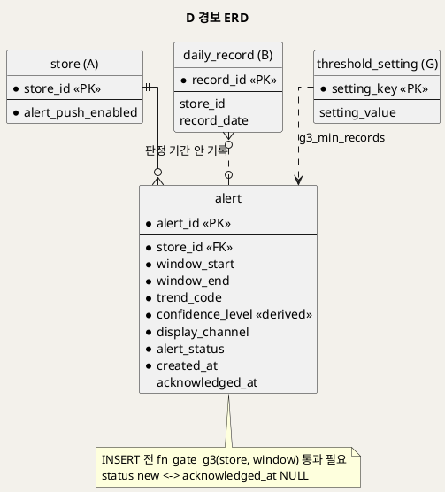
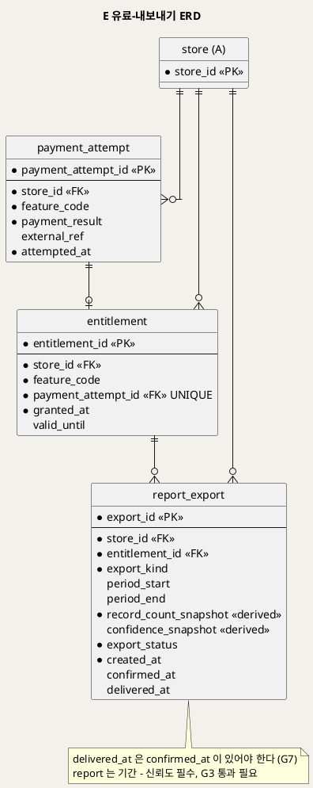
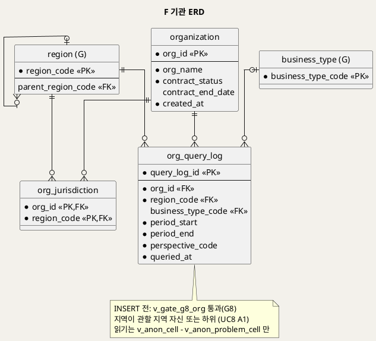
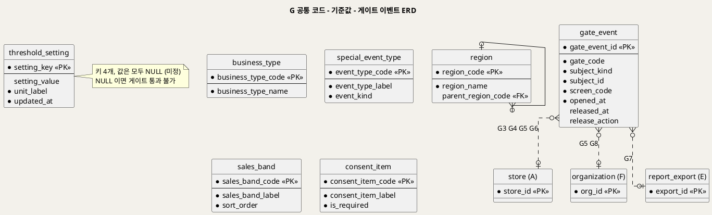
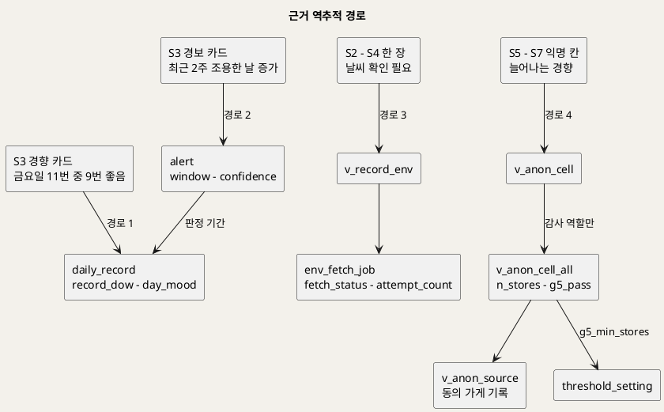

# SD_03 데이터베이스 설계서 — 하루한장
**하루한장 · 논리·물리 데이터 모델 · 표준 SQL DDL (MariaDB 12.0.2 실행 검증)**

---

> **문서 식별**: `design/SD_03_데이터베이스설계서_하루한장.md`
> **부속 파일**: `design/hrh_ddl.sql`(DDL 전문) · `design/hrh_ddl_verify.py`(위반 거부 검증 35건)
> **작성일**: 2026-10-02
> **입력**: `SD_02_UIUX설계서_하루한장.md`(영역별 설계의 데이터 바인딩) · `SD_01_프로세스설계서_하루한장.md`(IPO Output · 게이트 맵 · 인계 계약) · `UC_01`~`UC_08`(사후조건 · BR-HRH-01~22) · 원천 `Intent-Specify.md`
> **작성 프롬프트**: `design/분석설계 프롬프트 - 데이터베이스.md`
> **다이어그램**: 10개 전부 렌더 검증 완료(HTTP 200 · image/svg+xml · Syntax Error 없음 · 링크 복호 소스 = 코드블록 일치 · URL 4096자 이하).
> **실행 검증**: 빈 DB 무오류 실행 · 재실행 멱등(빈 DB·데이터 있는 DB 모두) · 위반 시도 35건 기대대로 거부·통과(§15-2).

---

## 목차

1. 설계 원칙
2. 표출 항목과 유도 속성
3. 영역 구분과 개념 모델
4. 전체 ERD
5. A 가게·동의
6. B 일일 기록
7. C 외부 환경데이터
8. D 경보
9. E 유료·내보내기
10. F 기관
11. G 공통 코드·기준값·게이트 이벤트
12. 근거 역추적 구현
13. 게이트의 데이터 표현
14. IPO·UI 대 테이블 사상
15. 무결성 제약과 인덱스
16. 보존·마스킹·감사
17. DDL 전문
18. 미해결·확인 필요

---

## 1. 설계 원칙

| # | 원칙 | 근거 | 구현 |
|:--:|---|---|---|
| D1 | **화면·IPO·사후조건에 없는 컬럼을 만들지 않는다.** 가입 수단이 미정이라 계정 테이블에는 식별 정보 컬럼이 없다 | 프롬프트 근거 규율 1, BR-HRH-01 | `account` 는 `account_id`·`created_at` 뿐 |
| D2 | **계산 가능한 값은 저장하지 않고 한 곳에서만 계산한다.** 고정이 필요한 값만 근거를 적고 저장한다 | 프롬프트 절차 2 | 유도값은 뷰·생성 컬럼·함수(§2-3). 저장하는 유도값 5개는 고정 근거 명시 |
| D3 | **게이트 판정은 함수·뷰 한 곳에서만 한다.** 트리거·화면·API는 그 판정을 호출만 한다 | SD_01 §12, SD_02 §11 규칙 ④ | `fn_gate_g3`·`fn_gate_g5`·`v_gate_g4_store`·`v_gate_g6_store`·`v_gate_g8_org` |
| D4 | **기준값이 없으면 막는다.** 원천에 없는 수치는 키만 두고 값을 비우며, 비어 있으면 게이트는 통과하지 않는다 | 근거 규율 4, BR-HRH-08·14 | `threshold_setting.setting_value = NULL` → 판정 FALSE |
| D5 | **비어 있는 이유를 데이터로 구분한다.** 외부 조회 실패는 값이 아니라 `needs_check` 상태로, 쉬는 요일 미입력은 0행이 아니라 시각 NULL로 | BR-HRH-13, SD_02 U4 | `env_fetch_job`·`v_record_env`·`store.closed_days_set_at` |
| D6 | **동의는 덮어쓰지 않고 사건으로 쌓는다.** 현재 상태는 최신 사건에서 유도한다 | BR-HRH-02·16, 인계 계약 "동의 철회 가게 제외" | `consent_event` + `v_consent_current` |
| D7 | **익명 집계는 개별 기록을 밖으로 내보내지 않는다.** 공개 뷰에는 가게 ID·가게 수가 없고, 기관 역할은 공개 뷰만 읽는다 | BR-HRH-14·15·21 | `v_anon_cell`·`v_anon_problem_cell` + 역할 `hrh_org_reader` |

### 1-1 명명·타입 규약

| 대상 | 규약 | 예 |
|---|---|---|
| 테이블 | 영문 소문자 단수 snake_case | `daily_record`, `consent_event` |
| PK | `<테이블>_id` BIGINT 자동 증가([M1]) 또는 자연키 | `record_id`, `region_code` |
| 코드 | `_code` VARCHAR, 값 목록은 CHECK 또는 코드 테이블 FK | `day_mood`(CHECK), `business_type_code`(FK) |
| 불리언 | `is_` 접두 또는 `_enabled`·`_pass` 접미, BOOLEAN | `is_agreed`, `alert_push_enabled`, `g3_pass` |
| 시각·날짜 | 시각 `_at` TIMESTAMP, 날짜 `_date` DATE | `occurred_at`, `record_date` |
| 고정 스냅숏 | `_at_record`·`_snapshot` 접미 | `region_code_at_record`, `confidence_snapshot` |
| 제약 | `pk_`·`fk_`·`uq_`·`chk_`·`ix_` + 테이블 약어 | `chk_rx_confirm_before_deliver` |
| 뷰·함수·트리거 | `v_`·`fn_`·`trg_<테이블>_<bi/bu>` | `v_anon_cell`, `fn_gate_g3`, `trg_store_bi` |
| 문자 집합 | utf8mb4(한글 라벨) | — |

DBMS 전용 구문은 DDL 머리 주석 [M1]~[M6]에 이유와 함께 모았다(§17).

## 2. 표출 항목과 유도 속성

### 2-1 화면 표출 항목 전수

SD_02 각 화면 `N-2 영역별 설계`와 공통 컴포넌트에서 화면에 뜨는 값을 모두 모았다. 성격: **저장**(컬럼) · **유도**(§2-3) · **상수**(고정 문구·코드 목록·요청 파라미터) · **클라이언트**(기기 로컬 상태, 서버 스키마 밖).

| 화면 | 영역 | 표시 항목 | 성격 | 근거(IPO·UC) |
|---|---|---|---|---|
| S1 | 단계 표기 | 단계 1/2 | 상수 | P1 화면 내부 상태 |
| S1 | 수집 안내 | 받는 정보·지키는 방법 문구 | 상수 | P1 1.1 |
| S1 | 필수 동의 | 동의 여부 | 저장 `consent_event`(service) | P1 1.2, UC1 사후 2 |
| S1 | 익명 참여 | 동의 여부 | 저장 `consent_event`(anon_stats) | P1 1.3, UC1 사후 4 |
| S1 | G0 차단 블록 | 체크 상태 | 클라이언트 | P1 1.2 |
| S1 | 업종 버튼 | 업종 목록 / 선택값 | 상수 `business_type` / 저장 `store.business_type_code` | P1 1.4 |
| S1 | 지역 선택 | 지역 목록 / 선택값 | 상수 `region` / 저장 `store.region_code` | P1 1.4 |
| S1 | 쉬는 요일 칩 | 선택 요일 / 미입력 여부 | 저장 `store_closed_day` / 저장 `store.closed_days_set_at` | P1 1.4, UC1 A2 |
| S1 | 완료 버튼 | 활성 여부·이유(G1) | 클라이언트 | P1 1.4 |
| S2·S3·S4·S5·S6 | C2 레일 2칸 | 오늘 기록 여부 | 유도 `v_store_rail.today_recorded` | P2 2.6 |
| S2·S4 | C2 레일 2칸 / C8 | 전송 대기 | 클라이언트(기기 송신 대기열) | UC2 E3, P0 0.1 |
| S2~S6 | C2 레일 3칸 | 기록 일수 · G3 통과 | 유도 `v_store_rail.record_count`·`g3_pass` | P3 3.3 |
| S2~S6 | C2 레일 4칸 | G4 통과 · 이번 주 G5 통과 | 유도 `v_store_rail.g4_pass`·`g5_pass_this_week` | P5 5.1·5.3 |
| S2 | 머리 | 오늘 날짜 | 상수(기기 날짜) | P2 2.1 |
| S2 | 오늘장사 | 선택값 | 저장 `daily_record.day_mood` | P2 2.2 |
| S2 | 손님 수 | 선택값 | 저장 `daily_record.customer_level` | P2 2.2 |
| S2 | 특별한 일 | 칩 목록 / 선택값 | 상수 `special_event_type` / 저장 `daily_record_event` | P2 2.3 |
| S2 | 매출 구간 | 구간 목록 / 선택값 | 상수 `sales_band` / 저장 `daily_record.sales_band_code` | P2 2.4 |
| S2 | 저장 버튼 | 활성 여부·이유(G2) | 클라이언트 | P2 2.5 |
| S2 | 완료 카드 | C11 표식 | 유도(애플리케이션, `day_mood` 표시 변환) | P2 2.7 |
| S2·S4 | 완료 카드 / 한 장 | 날씨 · 공휴일 · 지역행사 / 확인 필요 | 유도 `v_record_env` | P2 2.6, UC2 E1 |
| S2 | 수정 상태 | 기존 선택값 | 저장 `daily_record`·`daily_record_event` | UC2 A2 |
| S2·S3 | C10 경보 카드 | 판정 기간 | 저장 `alert.window_start`·`window_end` | P2 2.9 |
| S2·S3 | C10 | 감지 흐름 문장 | 유도(애플리케이션 문장 모듈, `alert.trend_code`) | P3 3.1 |
| S2·S3 | C10 | 신뢰도 | 저장 `alert.confidence_level`(고정) | P3 3.1 |
| S2·S3 | C10 | 확인함 여부 | 저장 `alert.alert_status`·`acknowledged_at` | P3 3.2 |
| S3 | C10 | 경보 받지 않기 | 저장 `store.alert_push_enabled` | UC6 A1 |
| S3 | 관점 탭 | 요일별·날씨별·특별한 일·반복 문제 | 상수 | P3 3.4 |
| S3 | C6 경향 카드 | 경향 문장 | 유도(애플리케이션, 기기 내) | P3 3.4 |
| S3 | C6 | 근거 수치(예: 금요일 11번 중 9번 좋음) | 유도(애플리케이션, `daily_record` 집계) | P3 3.4 |
| S3·S5 | C7 신뢰도(개인) | 높음·보통·낮음·기록 부족 | 유도(애플리케이션, 기준 미정) | P3 3.3 |
| S3 | 제외된 날 | 날씨 확인 필요 일수 | 유도 `v_record_env` 집계 | P0 0.3, UC3 E3 |
| S3 | 전후 차이 | 특별한 일 전후 경향 | 유도(애플리케이션) | P3 3.5 |
| S3 | 반복 문제 | 현장 문제 빈도·요일 | 유도(애플리케이션, `daily_record_event` × `special_event_type.event_kind='problem'`) | P3 3.6 |
| S3 | G3 차단 블록 | 기록 일수 · 기준 N | 유도 `v_gate_g3_store` / 저장 `threshold_setting` | P3 3.3 |
| S3 | 요일 입력 요청 | 쉬는 요일 미입력 | 저장 `store.closed_days_set_at` IS NULL | UC3 A1 |
| S3·S4 | 근거 날짜 | 근거 날짜 목록 | 유도(질의, `daily_record`) | P3 3.7 |
| S4 | 날짜 칸 | C11 표식 | 저장 `daily_record.day_mood` | P4 4.1 |
| S4 | 날짜 칸 | 쉼 | 유도(애플리케이션, `store_closed_day` × 요일) | P4 4.1 |
| S4 | 날짜 칸 | 기록 안 한 날 | 유도(애플리케이션, 해당 날짜 행 없음) | UC4 A1, E1 |
| S4 | 한 장 | 손님수 · 특별한 일 | 저장 `daily_record`·`daily_record_event` | P4 4.3 |
| S4 | 한 장 | 매출 구간 / 입력 안 함(선택) | 저장 `sales_band_code` / 유도(NULL) | P4 4.3 |
| S4 | 월간 요약 | 좋음·보통·나쁨 날 수 | 유도 `v_store_month_summary` | P4 4.4 |
| S4 | 월간 요약 | 자주 있던 특별한 일 | 유도(질의, `daily_record_event`) | P4 4.4 |
| S4 | 오프라인 표시 | 최신 아닐 수 있음 | 클라이언트 | UC4 E3 |
| S5 | 조건 바 | 지역 · 업종 | 저장 `store.region_code`·`business_type_code` | P5 5.3 |
| S5·S7 | 조건 바 | 기간 · 관점 | 상수(요청 파라미터) | P5 5.3, P7 7.2 |
| S5 | G4 차단 블록 | 익명 동의 여부 | 유도 `v_gate_g4_store` | P5 5.1 |
| S5 | G5 차단 블록 | 표본 충족 여부 | 유도 `v_anon_cell` 행 없음 | P5 5.3 |
| S5 | C6 나란히 | 동네 경향 수치 | 유도 `v_anon_cell.good_ratio`·`few_ratio` | P5 5.4 |
| S5·S7 | C6 | 동네 경향 문장 · 신뢰도(익명) | 유도(애플리케이션 문장 모듈, `n_records`) | P5 5.4, P7 7.3 |
| S5 | C6 나란히 | 내 경향 | 유도(애플리케이션, S3과 같은 모듈) | P5 5.2 |
| S6 | 기능 선택 | 상세보고서 / 백업·내보내기 | 상수(요청 파라미터) | P6 6.2 |
| S6 | 이용 조건 | 가격 · 기간 | 상수(미정) | P6 6.1 |
| S6 | G6 차단 블록 | 결제 결과 · 권한 여부 | 저장 `payment_attempt.payment_result` / 유도 `v_gate_g6_store` | P6 6.3 |
| S6 | 보고서 머리 | 기간 · 신뢰도 · 기록 일수 | 저장 `report_export.period_*`·`confidence_snapshot`·`record_count_snapshot`(고정) | P6 6.4 |
| S6 | 포함 정보 목록 | 파일에 들어가는 항목 | 상수(`export_kind` 별 고정 목록) | P6 6.5 |
| S6 | 확인 체크 | 확인 여부 | 저장 `report_export.confirmed_at` | P6 6.5, G7 |
| S6 | 받기 | 전달 여부 | 저장 `report_export.export_status`·`delivered_at` | P6 6.5 |
| S7 | 상단 | 기관명 | 저장 `organization.org_name` | P7 7.1 |
| S7 | 조건 바 | 관할 지역 목록 | 저장 `org_jurisdiction` + `region` | P7 7.1, UC8 A1 |
| S7 | G8 차단 | 계약 유효 여부 | 유도 `v_gate_g8_org` | P7 7.1 |
| S7 | 경향 표 | 칸별 좋은 날·손님 경향 | 유도 `v_anon_cell` | P7 7.2 |
| S7 | 경향 표 | 표시 불가 - 표본 부족 | 유도 `v_anon_cell` 행 없음 | P7 7.2, G5 |
| S7 | 관점 탭 | 요일·날씨·지역행사별 경향 | 유도 `v_anon_cell.dim_kind` | P7 7.3 |
| S7 | 반복 문제 탭 | 업종별 현장 문제 비율 | 유도 `v_anon_problem_cell` | P7 7.4 |
| S7 | 정책 문구 | 원자료 미제공 | 상수 | P7 7.5 |

화면에 뜨지 않지만 사후조건이 요구해 저장하는 값: `org_query_log`(UC8 사후 3 조회 이력), `consent_event.occurred_at`(UC1 사후 2 동의 시각), `daily_record.revision`(UC2 A2 판본), `gate_event`(SD_01 게이트 이력, 프롬프트 절차 6).

### 2-2 저장/유도 판정

§2-1 표 67행을 실측 집계했다(한 행에 두 판정이 있으면 앞의 판정으로 셌다).

| 판정 | 행 수 | 대표 |
|---|:--:|---|
| 저장 | 21 | 동의 사건, 가게 정보, 기록 값, 경보, 결제·권한, 보고서 확인·전달, 기관·관할 |
| 유도 | 28 | 진행 레일, 날씨 결합 상태, 월간 요약, 익명 경향, 게이트 통과 여부, 경향 문장 |
| 상수 | 13 | 코드 목록, 고정 문구, 요청 파라미터 |
| 클라이언트 | 5 | 체크·버튼 활성 상태, 전송 대기, 오프라인 표시 |

유도 값 가운데 **저장하는 것은 5개**다: `daily_record.region_code_at_record`, `daily_record.business_type_code_at_record`, `alert.confidence_level`, `report_export.record_count_snapshot`, `report_export.confidence_snapshot`. 고정 근거는 §2-3에 있다. 동의 현재 상태는 저장하지 않고 사건에서 유도한다.

**클라이언트 상태의 경계**: 전송 대기(UC2 E3)와 오프라인 달력(UC4 E3)은 기기 로컬 저장소(송신 대기열·기록 캐시)에 있다. 서버 스키마는 **전송이 끝난 기록만** 안다. 기기 로컬 저장소의 구조는 SD_04(모듈 설계) 범위로 넘긴다(§18).

### 2-3 유도 속성 총괄표

| 유도 속성 | 산출식 | 입력 컬럼 | 산출 시점 | 구현 위치 | 저장 여부와 근거 |
|---|---|---|---|---|---|
| 요일 `record_dow` | `WEEKDAY(record_date)+1` (1=월) | `daily_record.record_date` | 조회 시 | 생성 컬럼(VIRTUAL) | 저장 안 함 |
| 기록 시점 지역·업종 `*_at_record` | 저장 시점의 `store.region_code`·`business_type_code` | `store` | 기록 INSERT 시 | 트리거 `trg_daily_record_bi` | **저장**. 고정 근거: 인계 계약 "업종·지역이 바뀌면 이후 비교 기준이 바뀐다" — 과거 기록이 새 지역 집계에 섞이지 않게 기록 시점 값을 고정한다. 재계산 금지(`trg_daily_record_bu` 가 변경을 거부) |
| 동의 현재 상태 | 항목별 최신 `consent_event` | `consent_event` | 조회 시 | 뷰 `v_consent_current` | 저장 안 함(사건 이력이 원본) |
| G3 통과·기록 일수 | `COUNT(daily_record) >= g3_min_records` (기준 NULL → FALSE) | `daily_record`, `threshold_setting` | 조회·INSERT 시 | 함수 `fn_gate_g3` → 뷰 `v_gate_g3_store`·트리거 | 저장 안 함 |
| G4 통과 | 최신 anon_stats 동의 = 참 | `v_consent_current` | 조회 시 | 뷰 `v_gate_g4_store` | 저장 안 함 |
| G5 통과 | `COUNT(DISTINCT store) >= g5_min_stores` (기준 NULL → FALSE) | `v_anon_source`, `threshold_setting` | 조회 시 | 함수 `fn_gate_g5` ← 뷰 `v_anon_cell_all` | 저장 안 함 |
| G6 통과 | 유효 `entitlement` 존재 | `entitlement` | 조회·INSERT 시 | 뷰 `v_gate_g6_store`·트리거 | 저장 안 함 |
| G8 통과 | `active` 이고 만료일 이전 | `organization` | 조회·INSERT 시 | 뷰 `v_gate_g8_org` | 저장 안 함 |
| 날씨·공휴일·행사 결합과 확인 필요 | 지역·날짜로 결합, 조회 ok 아니면 `needs_check` | `daily_record`, `env_fetch_job`, `weather_observation`, `calendar_day`, `region_event` | 조회 시 | 뷰 `v_record_env` | 저장 안 함. P0 재조회가 성공하면 자동 반영 |
| 확인 필요로 제외된 날 수 | `COUNT(weather_status='needs_check')` | `v_record_env` | 조회 시 | 뷰 질의 | 저장 안 함 |
| 오늘 기록 여부 | 오늘 날짜 기록 존재 | `daily_record` | 조회 시 | 뷰 `v_store_rail` | 저장 안 함 |
| 월간 좋음·보통·나쁨 날 수 | 월별 `day_mood` 집계 | `daily_record` | 조회 시 | 뷰 `v_store_month_summary` | 저장 안 함 |
| 익명 좋은 날 비율·손님 적음 비율 | 칸별 평균 | `v_anon_source` | 조회 시 | 뷰 `v_anon_cell_all` → `v_anon_cell` | 저장 안 함. 인계 계약의 "재집계"가 필요 없도록 항상 최신 |
| 익명 반복 문제 비율 | 문제 있는 기록 수 / 칸 기록 수 | `v_anon_source`, `daily_record_event` | 조회 시 | 뷰 `v_anon_problem_cell` | 저장 안 함 |
| 개인 경향 문장·근거 수치·전후 차이·반복 문제 | 기기 내 통계(BR-HRH-10) | `daily_record`, `daily_record_event`, `v_record_env` | 화면 진입 시 | 애플리케이션(기기 내 분석 모듈) | 저장 안 함(UC3 사후 3) |
| 개인 신뢰도 | 기록 수·표본 대비 기준(미정) | `daily_record`, `threshold_setting` | 화면 진입 시 | 애플리케이션(기기 내 분석 모듈) | 저장 안 함 |
| 경보 신뢰도 `alert.confidence_level` | 위 개인 신뢰도와 같은 식 | 판정 기간 기록 | 경보 생성 시 | 애플리케이션(같은 모듈) | **저장**. 고정 근거: 경보는 생성 시점 판정의 증빙이다. 이후 기록이 늘어도 당시 경보의 신뢰도를 바꾸면 "왜 그때 경보가 왔는가"를 설명할 수 없다. 재계산 금지 |
| 보고서 기록 수·신뢰도 `*_snapshot` | 기간 기록 수, 개인 신뢰도 식 | `daily_record` | 보고서 생성 시 | 애플리케이션(같은 모듈) | **저장**. 고정 근거: 사장님이 받은 파일과 서버 기록이 일치해야 한다(외부 반출 감사, BR-HRH-20). 재계산 금지 |
| 경향 문장(동네·기관) | 비율 → "~하는 경향" 템플릿(BR-HRH-09) | `v_anon_cell` | 화면 진입 시 | 애플리케이션(문장 모듈, 개인 문장과 같은 모듈) | 저장 안 함 |
| 쉼 · 기록 안 한 날 · 입력 안 함 | 요일 대조 / 행 없음 / NULL | `store_closed_day`, `daily_record` | 화면 진입 시 | 애플리케이션(달력 그리기) | 저장 안 함 |

**중복 계산 점검**: 신뢰도 식은 기기 내 분석 모듈 하나에만 있다(개인 화면 · 경보 스냅숏 · 보고서 스냅숏이 같은 모듈 호출). 경향 문장 템플릿도 문장 모듈 하나다. G3·G5 판정은 각각 함수 하나에만 있고 뷰·트리거가 그 함수를 부른다. 같은 유도값을 두 곳에서 계산하는 경우는 없다.

## 3. 영역 구분과 개념 모델

쓰기 주체와 생애주기로 7개 영역을 나눴다.

| 영역 | 이름 | 쓰기 주체 | 생애주기 | 프로세스 | 테이블 |
|:--:|---|---|---|---|---|
| A | 가게·동의 | 사장님(P1), 동의는 이후에도 추가 | 가입 시 1회 생성, 동의 사건은 계속 쌓임 | P1 | `account`, `consent_event`, `store`, `store_closed_day` |
| B | 일일 기록 | 사장님(P2), P0 재전송 | 매일 1건, 같은 날 재저장 시 갱신 | P2, P0 | `daily_record`, `daily_record_event` |
| C | 외부 환경데이터 | 서버 배치(P2 2.6, P0) | 지역·날짜별, 재조회로 상태 갱신 | P2, P0 | `calendar_day`, `weather_observation`, `region_event`, `env_fetch_job` |
| D | 경보 | 기기 내 판정(P2 2.8) → 서버 기록, 사장님 확인(P3) | 생성 → 확인함 | P2, P3 | `alert` |
| E | 유료·내보내기 | 사장님 결제, 서버 생성 | 결제 → 권한 → 생성 → 확인 → 전달 | P6 | `payment_attempt`, `entitlement`, `report_export` |
| F | 기관 | 운영(계약 등록, 미정), 기관 조회 | 계약 기간, 조회 이력 누적 | P7 | `organization`, `org_jurisdiction`, `org_query_log` |
| G | 공통 코드·기준값·게이트 이벤트 | 운영·데이터 담당자, 애플리케이션(게이트 이력) | 코드는 드물게 변경, 게이트 이력은 누적 | 전체 | `region`, `business_type`, `special_event_type`, `sales_band`, `consent_item`, `threshold_setting`, `gate_event` |



**[「개념 모델」 PlantUML 뷰어로 열기](https://plantuml.sumzip.com/plantuml/svg/eNp1VFFP01AUfu-vOJkv8DAikmjiA0GQ-coP8OXSlTop7WyLYoxJgWGUlIhKdTOdKQGySTSpa4czkT_Ue_sfPPe2g27MZCyHnO_c75zvO2cLlk1Me3NDk6z1ml4nJtmAVSKvq6axqVeXDM0w4VZlrjK7vFhAWE9I1XhR01VYI5qlSHbN1hRIQp_uHQI979KDAZQh9Zr0pJt6Pvt2BvQgZO04bYTAmtvsy0-pjixEVaD0AAudpOeW6fsWazdhamV2ugSvJABTkW2iq_h0KYkaLPBKQCwgsjyay-vYzo_kVywgsjJWLQhEyrKl19fci8Daf_EDySCkx23kvoONr9y-2cAITrxUNUcR6f4fGjVwXP5mjlCKZEvAWgN64UDaaia9y2tF_s9KdwJ21MVkEvVTP-YdlIF1HBQw_fwOJxY8iv58rNnjMP3qAtvdTnd9AXlqrBZbeQi8gSgeUs9NUFwAMsW1Yu0yMD-gJy7W3p1UFrLA5x1fuKiFqK-Tl2NjRXESBazBcXQnxn_xG6UVaHOryFbhkiexg2z3JrBlOWSLndQLRL1hqpPVaMc0OMsgz0YmeiTkfdO_afrlEf0khhmE7NRJwo_ZehnV8QXrudzL_YFg6Z1iJJAqX4CRLerT8z108AMu9GN9iv4OuaGBw0-EeW_xZrrTmea6oUu46lAuz_N9Hoa4v5YtIty_qplHCg9nZub5KsD9fEOEuAHr-Gh2mHrfJVyCIWj4CFqbVxINC1P3EM9MSB42hhhuH_6JGM3J8eYW4jNgfhVXL2HrmMvPMrs92nElWblKS2hSEZvZl_ctkpyM28S1FkgcV80ilCCPuNULil7F369_cPsEUg==)** — 클릭 시 브라우저로 연결됩니다.

## 4. 전체 ERD

24개 엔티티를 PK·FK·식별 컬럼만으로 줄였다. 상세는 영역별 ERD에 있다. 다형 참조(`gate_event`)는 점선이다.



**[「전체 ERD」 PlantUML 뷰어로 열기](https://plantuml.sumzip.com/plantuml/svg/eNqVVs9u0zAYv-cprHGb6CTEDU3TBKwXLogXsJz4a-o2jTPbXVfW3XiFSRwQQkJInBFvte0d-BI7sZ2k3bi09vf_n39fzrVhyqxXRTIXHEgmVFZAopeirJhiK5KybJkruS75O1lIRV5MX09fXbwNJPSccbkRZU5mrNChbiFKMNsKiFRmLhMjTAHk4ceXhz9_ycWn92RCHu--3v_8_Xj37eH7rwRKlNiSI5Zl6M8cEaaJO5ObhJDj9kYFJ6enHz-cnSW3nVYmS41nClfgdDNwahErUCZkMsGfyOrUMloVYWBFM4mVcSzvUBupoHHUnJyv5vw8H-laY4G0pnWNIieEKMiFLA95plkhNXDK2dYGkfGxEF46g8cEBamc0Q3Aclg9zkSxpQoyqXhjjitnzdKGGQVeupgbSc4M1HxWgKYpK_n-1CgzzuehqgylxuMOWs-7fsTh-2rYWQgr33K98Q0wMwdFZapBXTGDYTfWN7IzHnYpNI8qTSFG5hTrUnKmusZ1fUPOHh3nx-cXpOc5wx4dnCIor-gMTDanC5k2VmG2eDIxRIscTBSnHS7DKD78kYeJ-Sr3mOtT-5Tr89NT5c1UbLuqk2QGn2RlDVbMWesx_8du81_Aqi0tdGgTcJ4z_qMxTPuNrBALKVzXf7aT1623hvYcR4O4ek6kylkpPvt5RYJzgqdR8Kzpi7USmovMqy2GWn4QxkckNnm5BrWlhcytvcvCGezow3Q7X_uB8BBy9t-Mey31cc9oe9e4tOqSHnw0kefGeNqOy2hQvTrrCjKBz9yjj8Vu6GZuBJZiCx2sWs20Bf0B3O7Zj_VGs7gjeusx3HU9ZTNXoOey4BRDNbjrGwtGt84tkS5hO9TNESoC6Mpb6PL0kaFfpwvITIMowVVwtNt-Eux2k4m8wS2fYCb-ErF39vkkdkM7IdyUMYGrBNddd0FxMNE1JTvZSrph8qppINvjWudewN5jmY3sEQYSCMsdRTqR-hYn0QBqTKpYggjpCoF1jrk1AXwd1XXMxnuNG-4mF72gkBCyL4s-Hyl14rK7YeNv5clJ2xPypm1rwKlNjtERJT35HPcnfrD-AwDcg2o=)** — 클릭 시 브라우저로 연결됩니다.

`calendar_day`·`threshold_setting` 은 FK 없이 값(날짜·키)으로 참조된다. `daily_record` ↔ C 영역 결합은 FK가 아니라 `(region_code_at_record, record_date)` 값 결합이다(외부 데이터가 기록보다 늦게 오거나 오지 않을 수 있으므로 FK를 걸 수 없다).

## 5. A 가게·동의

### 5-1 ERD



**[「A 가게-동의 ERD」 PlantUML 뷰어로 열기](https://plantuml.sumzip.com/plantuml/svg/eNqNlE1vEzEQhu_-FaNyaRF7QFxLVT4ShJAQIPVsee1JYmVjB9ubKkqQgPYGUk9IRSpVr6Ai8fmnks1_wLvrTXbTPXCb8div33k8u4fWMePSUUIGUiBwaXiCxA6lGjPDRhAzPuwbnSrxSCfawK3uve7dzsPaDjtgQh9L1YceS2z9bCIVuukYQRs30MRJlyA8gMWPt4tfH6Pl2efsyzl0Xj0mqHxtCjuMc3-T2wFmIcQwIwC3q4xKAfv7L54dHPjVKCpK3CBzKChz5M1aiWtlfUxxgkGPY5BqlNoEG3d1y9LmmHQ4olx7VrWitJT1DaIoMs15asy2Jeu0wcJKEQU3RfxfLuDo-dOXR52iGKfWs7WW5nhvuDHYl1ptLfNEW29JsKmlFl3urbgmQePoOLUDiorFSWihFWrpdSNUNsNFWyt31m78Rqp79BhxWDV5851yqrD7ZK98Krn1VHXmTUoevMHXqfS0a6olgLVeSGctcLbsNLiuz8fVFLZiDxLVvM7nUaRnftyIb2OTNMrzkhUpByFs8iBJcFqtFJti18yVdgixdk6PQPdybYDV-Wl2eQ3hk8pO3q1OLuA-TGhFsBhIlT_57urT9-W3r8vfp5D9vcg-XEH2_nrx88-eb0WgkRMUvh9UAvKLyKGP_N_hH1_Ra9M=)** — 클릭 시 브라우저로 연결됩니다.

### 5-2 엔티티 명세

| 엔티티 | 용도 | 핵심 컬럼 | 쓰기 주체 | 생애주기 |
|---|---|---|---|---|
| `account` | 사장님 계정 | `account_id` | P1 1.5 | 가입 시 생성. 탈퇴 프로세스 없음(§18) |
| `consent_event` | 동의 사건 이력 | `consent_item_code`, `is_agreed`, `occurred_at` | P1 1.2·1.3, P5 G4 해제 | 계속 추가, 수정·삭제 없음 |
| `store` | 가게 프로필 v1 | `business_type_code`, `region_code`(G1 NOT NULL), `closed_days_set_at`, `alert_push_enabled` | P1 1.5, S3 경보 받지 않기 | 가입 시 생성. 수정 프로세스 없음(§18) |
| `store_closed_day` | 쉬는 요일 | `day_of_week` 1~7 | P1 1.4 | 가게와 함께 |

### 5-3 핵심 컬럼 설계 판단

- **동의를 사건 테이블로 둔 이유**: UC1은 "동의 항목·동의 시각 기록"을, 인계 계약은 "동의 철회 가게는 집계에서 제외"를 요구한다. 현재 상태 컬럼 하나로 덮어쓰면 언제 동의했고 언제 철회했는지가 사라진다. 사건으로 쌓고 현재 상태는 `v_consent_current` 에서 유도한다. 검증 T29에서 철회 사건 1건 추가로 G4가 즉시 FALSE가 되는 것을 확인했다.
- **G0을 트리거로 강제한 이유**: "필수 동의가 있어야 가게를 만들 수 있다"는 다른 테이블의 최신 행을 봐야 하는 다중 행 조건이라 CHECK로 표현할 수 없다. `trg_store_bi` 가 거부한다(T01). P1 1.5는 `account` → `consent_event` → `store` 를 한 트랜잭션으로 저장해야 한다(SD_01 §4-3).
- **G0 거부를 기록하지 않는 이유**: 동의를 거부한 사람의 흔적을 남기면 "동의 전 어떤 정보도 저장하지 않는다"(BR-HRH-02) 위반이다. `gate_event` 의 게이트 코드에 G0이 없다.
- **쉬는 요일 미입력 vs 쉬는 날 없음**: 0행만으로는 두 경우가 구분되지 않는다(SD_02 U4). `closed_days_set_at` NULL = 미입력, 값 있음 + 0행 = 쉬는 날 없음.
- **`account` 에 식별 정보가 없는 이유**: 가입 수단이 정해지지 않았다(UC1 특별 요구사항). 화면에도 표시 항목이 없어 컬럼을 만들지 않았다(D1).

## 6. B 일일 기록

### 6-1 ERD



**[「B 일일 기록 ERD」 PlantUML 뷰어로 열기](https://plantuml.sumzip.com/plantuml/svg/eNqFU0tu2zAQ3esUg2TjFNGi6DYI0qR2ERQI2gJZEyNxLBOhOAZJ2RDiHiWL3qDLLnqitofo6Gu5NhBAEDkzj28-fLwJEX2sSpusjCbIjc8tJeHJuDV6LCHD_KnwXDl9x5Y9nC_eLd7ObyeIsELNW-MKWKIN07PWOIr1moB9XHESTbQEt_D35Zd88Pvnjz_fX2D-9UNCTmI1nIXInmD2_uIMMEBnPScAb7q9Mhqurj5_ur4WX5rKz1Nh2KmcNYmVVUEyhqCapJ3z28it0dhaecrZ65Ze-5678x2TH2RddIERrTFSa2usVcmsWyOv5EhJXlnakBVXQEtBZeh0W88h0Vi7wthX1gNk0eTNhnQPPm7ttTNDnbw9IvO0MUFydyV7kla00LVmtdaDeXp2SjpzsZ8gnRzh5dhji93XPInuycOacoNW7bEw-9grgGKf4BTR9KYmcYtZO_rBKXLU03TjjezTZIPKjm7rPz2IkJU0Sl4IO3nudmnKzzKKRPQ0GvIKpPSpmcGOB6TjSOBNsYrAy8YB8Phw_-VxDrNBcZdTnV0IYJAZ3D9A0awpOPYlWtlk2KjvUHsNrkRXS7gKVQtb0lamoKFJn9zITl79P31nUd8=)** — 클릭 시 브라우저로 연결됩니다.

### 6-2 엔티티 명세

| 엔티티 | 용도 | 핵심 컬럼 | 쓰기 주체 | 생애주기 |
|---|---|---|---|---|
| `daily_record` | 일일 기록 v1 | `day_mood`·`customer_level`(G2 NOT NULL + CHECK), `sales_band_code`(선택), `*_at_record`(고정), `revision` | P2 2.6, P0 0.1(재전송), UC2 A2(재저장) | 날짜당 1건. 재저장 시 갱신·판본 증가 |
| `daily_record_event` | 특별한 일 다중 선택 | `event_type_code` | P2 2.3 | 기록과 함께(CASCADE) |

### 6-3 핵심 컬럼 설계 판단

- **날씨 컬럼을 기록 행에 두지 않은 이유**: BR-HRH-07은 날씨·공휴일·행사를 사장님이 입력하지 않고 자동 결합한다고 정했고, UC2 E1은 결합 실패 시 '확인 필요'로 저장한 뒤 P0이 나중에 보완한다고 정했다. 기록 행에 날씨를 복사하면 P0이 기록 행을 고쳐야 하고 판본이 흔들린다. 날씨는 지역·날짜 단위 사실이므로 C 영역에 한 번만 두고 `v_record_env` 에서 결합한다.
- **기록 시점 지역·업종 고정**: §2-3 참조. 트리거가 채우고(T07), 갱신 트리거가 변경을 거부한다(T09).
- **판본(`revision`)**: SD_01 인계 계약 "같은 날짜 재저장 시 이전 값을 대체"(UC2 A2). 이전 값 이력은 화면·사후조건에 없어 저장하지 않고 판본 번호만 올린다(T08).
- **매출 금액 컬럼이 없는 이유**: BR-HRH-06 — 구간 코드만, 선택 입력. 구간 값은 미정이라 `sales_band` 는 빈 테이블이다.
- **미래 날짜 금지를 트리거로 둔 이유**: CHECK에 `CURRENT_DATE` 를 쓸 수 없다(MariaDB 비결정 함수 거부, DDL 이탈 기록 1). 과거 날짜는 허용한다(UC2 A3, UC4 A1).

## 7. C 외부 환경데이터

### 7-1 ERD



**[「C 외부 환경데이터 ERD」 PlantUML 뷰어로 열기](https://plantuml.sumzip.com/plantuml/svg/eNqFVE1r20AQvetXDOnFCXWg9FZCCEnjHnop_QPLWju2NpZ2zWptY-KAKT4EQi8lpnVJIIVCyKFgQgi-9A9Z8n_oaKW4st2Pm2bmzZs3bwcdxJYb24lCL5ACwZfGD9GLW1K1ueER1LnfahrdUeJIh9rAs9rL2ovjwxIiDrjQPama0OBhXO4NpULbbyNoYwPtWWlDhCNIJ7PkcQiLyZf5_c_k4zS9fliMpnD8_rWHikB92DLYlFpB5c32FvAYivDUA9gpAuZrkru39-7t_r53tmzsIbcBGqbrMZout4R0DD39l-7ntYwgq1ALE9wuSQGqVVd44sx6XKKB1g9QMG5Lk30eohLcEEffjfRFMZIqfyaWMQt0KKmBwuKLKR5hibbQi11KFF6sbuIqTIoN9tVNl2vmeDclC93zO3l5VYk8-K0AVZe5jdmJrjsJ2Dj5r5tE20S7tvcOUMwZHcim3HwEybGd2CW4tRi1LZF3lHWZkMeWPaVXzBdchn1m0NdGQOUwvxphliqz_KZHJfVEV7S7vMMXPhTHNxhUq_qUDmktYXAtQe54NPpM7-7qgfPqFaS3w_TzD6hC8uEmvb2C-fQTzO-ni_FdCUo3-k-k0uRlXVurI9ANNwdWbAPdIvwQ0vEouThP7h6o3i3WYvSMrqgQRczofv0WJN-uaM4sufhOyMpiMk6vZ7AYj9Kvl6QgfbxMb8ZOwOycdG2T3QIyFd4BfdE_4xcY94Zm)** — 클릭 시 브라우저로 연결됩니다.

### 7-2 엔티티 명세

| 엔티티 | 용도 | 핵심 컬럼 | 쓰기 주체 | 생애주기 |
|---|---|---|---|---|
| `weather_observation` | 지역·날짜별 날씨 | `weather_code`(값 체계 미정) | 서버 배치(P2 2.6, P0 0.2) | 1회 적재 |
| `calendar_day` | 공휴일 | `is_holiday`, `holiday_name` | 서버 배치 | 1회 적재 |
| `region_event` | 지역행사 | `event_name`, 기간(CHECK) | 서버 배치 | 행사 단위 |
| `env_fetch_job` | 외부 조회 결과 상태 | `fetch_status`(ok/failed), `attempt_count` | P2 2.6(첫 조회), P0 0.2·0.3(재조회) | 지역·날짜·종류별 1행, 재조회 시 갱신 |

### 7-3 핵심 컬럼 설계 판단

- **조회 상태를 별도 테이블로 둔 이유**: "행사가 없는 날"과 "행사 조회에 실패한 날"은 둘 다 `region_event` 행이 없어 구분되지 않는다. BR-HRH-13(추정값 금지)과 SD_02 U4(비어 있는 이유 구분)를 지키려면 조회 성공 여부를 따로 남겨야 한다. `v_record_env` 는 `fetch_status = 'ok'` 일 때만 값을 내고, 아니면 `needs_check` 를 낸다(T30·T31).
- **공휴일도 지역별 조회 상태를 갖는 이유**: 공휴일 값 자체는 전국 공통(`calendar_day`)이지만, 조회 작업은 기록이 생길 때 그 기록의 지역 단위로 돈다. 상태 키를 하나로 맞춰 P0 재조회 로직을 단순하게 했다.

## 8. D 경보

### 8-1 ERD



**[「D 경보 ERD」 PlantUML 뷰어로 열기](https://plantuml.sumzip.com/plantuml/svg/eNptU01vEzEQvftXjMolrdhIKDcURaU0QYiqQgXOlrOe7FpxPJHtTRQ1vUWIAwcOzQUJqfyDioLEAf5QmvwHvOttWRVu8-X35r2RD50X1hcTzXIlEVJlU43MjZWZCismMBTpOLNUGPmcNFl4NOgMnvSPGhMuF5LmymQwEto132pl0C-mCGR9TswrrxGOYfPt9-3Nd-ifHTM0obiAPefJIrSe7e-BcBCzcwZwEGOuJHS7r1_1eqGWJFVDaLSeTwuXczRiqFGyi3u8qllhVVGNFZ_8B6tBMoiNAwiKgixe2dMsoJFV6m2IeEoSqzQlMwoGmhS5xhnqACXRqhnKGk8qN9ViwdNcGIO6sVCg8IWLKBaFR8lFSRmcNzQPwrJY-StPCqUX3GJKVkLrKLombS0z1v_VeacyhPWIDGQNWJ9bdDlpyR16X1609SJie3d3jtjgY1w8RK87M6GLEjQecblMEjqPQlnY8ILabVrWV3kKu4-ftldr2Py83lyvYLv-UIa3X7-wQNhu9-7nsg6fKFMrdsyQRxiS9zQBGtXoAC9P3_TP3sL2agUjw7MgjmedVrXI4_p8-7B7_2Nz8wt269X282XlSuk-GJxDN-k9NB1O352cBIMklJzsMEThr_wBmE8b6g==)** — 클릭 시 브라우저로 연결됩니다.

### 8-2 엔티티 명세

| 엔티티 | 용도 | 핵심 컬럼 | 쓰기 주체 | 생애주기 |
|---|---|---|---|---|
| `alert` | 경보 v1/v2 | 판정 기간, `trend_code`(decline), `confidence_level`(고정), `display_channel`(push/in_app), `alert_status` | P2 2.9(생성), P3 3.2(확인) | `new` → `acknowledged` |

### 8-3 핵심 컬럼 설계 판단

- **상태 머신**: `new` → `acknowledged` 한 방향. `chk_alert_ack` 가 상태와 확인 시각의 짝을 강제한다(T13). 인계 계약의 "새 판정이 나오면 이전 경보는 대체 [추론]"은 상류에서 확정되지 않아 `superseded` 상태를 만들지 않았다(§18).
- **판정 기준 컬럼이 없는 이유**: 하락 판정 기간·폭(BR-HRH-17)은 `threshold_setting` 의 `alert_window_days`·`alert_min_decline` 키로 두고 값을 비웠다. 판정은 기기 내 모듈이 하므로 DB는 G3(기록 충분성)만 강제한다(T10~T12).
- **판정 보류(UC6 E2)·알림 권한 없음(UC6 E3)**: 보류는 경보를 만들지 않으므로 행이 없다. 권한 없음은 `display_channel = 'in_app'` 으로 남는다.

## 9. E 유료·내보내기

### 9-1 ERD



**[「E 유료-내보내기 ERD」 PlantUML 뷰어로 열기](https://plantuml.sumzip.com/plantuml/svg/eNqlU1Fr1EAQfs-vGNqX9jAP0gdfSqnauyKCqNDnsM1O7kI3u2F3U-_oCSKHFFvwpRWRKkX7Aw56BR_6iy7pf3CyybVJRRB8ye43883MNzuTTWOZtlkivEHMEcJYhwI9sxfLlGmWwC4L9_paZZI_VUJpWO6t9R52nzQYZsC4ehPLPkRMmGasiCXaUYqgtB0oz8ZWIHShODvPfx77-ftZfjmj7_zXFLqvtzyUxBjBkrFKI6w8Xl0CZqBCBx5Ap7oHMYf19ZfPNza8t7cxKRsldA-YtZik1kWmrA6752wkAPD9-5l7laMDETKbkTVUHFt5NJpMWDLh0KKWTJAlcoy6AnKq1VDnToFlsFNGZy2t4flvWa32SjrsvHj2aqfrSH3NZK0LYJ-JmAcZ1RYNlRpTGlSAw_JwOvVwIdPZ_lXhH03deao8tCGccIo6VjxwG3gH0fk6oDFUmlObpDMwkqVmoCwl40TbR-4yhkpGtLYyxL8xbmtSFZsZZwk1PeHiLVwKnSwgR0GxejHBavvGY99XB_TQbUz9ebRkDo0dKgdbO_WwTSYslUXYVdaqBFRUWtr1oPj2rqWHDDMovh8Wn2fF6TXcnJ7lRxewsv1olSKrcUH-8QToD5pPJ-BDcXSe_5jmnybEnRSHXx7A9hrcfLiaX147y9cTksihFOJt0o3--9_KT21U)** — 클릭 시 브라우저로 연결됩니다.

### 9-2 엔티티 명세

| 엔티티 | 용도 | 핵심 컬럼 | 쓰기 주체 | 생애주기 |
|---|---|---|---|---|
| `payment_attempt` | 결제 시도 결과 | `feature_code`, `payment_result`(success/failed/canceled) | P6 6.3 | 시도마다 1행 |
| `entitlement` | 유료 이용 권한 | `payment_attempt_id`(UNIQUE), `valid_until`(미정) | P6 6.3 | 성공 결제 1건당 1건 |
| `report_export` | 보고서·백업·내보내기 파일 | `export_kind`, 기간, 스냅숏 2개, `confirmed_at`, `delivered_at`, `export_status` | P6 6.4·6.5 | `generated` → `delivered` 또는 `declined` |

### 9-3 핵심 컬럼 설계 판단

- **결제 시도와 권한을 나눈 이유**: G6 미통과(결제 실패·취소, UC7 E1)도 사장님 화면에 표시해야 하므로 실패 시도가 남아야 한다. 권한은 성공 시도에서만 생긴다(`trg_entitlement_bi`, T14·T15). 결제 시스템이 미정이라 외부 참조 번호는 NULL 허용이다.
- **G7을 CHECK로 강제**: "확인 없이 전달하지 않는다"(BR-HRH-20)는 한 행 안의 조건이라 CHECK로 표현된다(`chk_rx_confirm_before_deliver`, T17·T18). 이 문서에서 가장 강한 형태의 게이트다.
- **스냅숏 저장**: §2-3 참조. 파일은 기기 밖으로 나가므로 생성 당시 값을 고정한다.
- **무료 기능이 권한에 의존하지 않음**: A~D 영역 어떤 테이블도 E 영역을 참조하지 않는다(UC7 사후 3, BR-HRH-19).

## 10. F 기관

### 10-1 ERD



**[「F 기관 ERD」 PlantUML 뷰어로 열기](https://plantuml.sumzip.com/plantuml/svg/eNp1U8tuEzEU3c9XXJVNGnUWFZsIVVWhJBVCQlWBteWZcSduPfbE9gSFBKmLigWw6IKKLlqUXVdISBSJBfxQMvkH7jw6M03Tne-5j3PPsb1jLNU2iYTT5wEDn2tfMMcccxlTTSPwqH8capXIYFcJpeFR73Fvs_usUWH6NFDvuAzhkArT7BVcMjuKGSht-8qx3AoGPZj9-Tm7OYHuwXOHSQRHsKZ0SCV_Ty1Xcg2owY4Qxg5AOzsRHsDW1v7L7W1EXLeCJY1YHvhKWk19S1CMTQxiFcJkQAJqyzrN8BgQap0PTW5ylGhuAu7X_Ef36Td6xQZt0CzEQuIrdKzO3B05SJgeEaHCYt5AlAMr_CFVOfwAVQl7iUFrjSGZu0u5NsRMcxWQ_GKbAFpxG5qYodZh0VutxZetKcihtbeeiyjD8UoPahl4-TiArNi8nnxHQUXg2XL4SoH7xYjsaUwmrqvGeEtOuVMNNNMDsZxHBEkm6l6-QIrIkcoy8JS1KgJ1mNcBvHj1unvwBtLp6RMYkhAfEgk7JKNbfPw9-_W3tddZx7L0-iT99iO9ugF85IvzaQlA-v0s_TyF-cXZ_NNXWJxfpJen0Hq724Gnm3nf1T_8GFluSKjMjGNCgHsbxVp5gkUFOr_-gk4GkO3p7OAJ_-9_RypUDQ==)** — 클릭 시 브라우저로 연결됩니다.

### 10-2 엔티티 명세

| 엔티티 | 용도 | 핵심 컬럼 | 쓰기 주체 | 생애주기 |
|---|---|---|---|---|
| `organization` | 지자체·상인회 | `contract_status`, `contract_end_date`(미정) | 운영(계약 등록 프로세스 미정) | 계약 단위 |
| `org_jurisdiction` | 관할 지역 | `region_code` | 운영 | 계약과 함께 |
| `org_query_log` | 조회 이력(감사) | 조회 조건, `queried_at` | P7 7.2 | 누적 |

### 10-3 핵심 컬럼 설계 판단

- **관할 판정을 2단 지역으로 한정**: S7은 "마포구 전체 → 망원동·합정동" 2단만 보인다. 트리거는 관할 지역 자신 또는 그 직속 하위만 허용한다(T21·T22). 지역 체계가 3단 이상으로 정해지면 재귀 조회로 바꿔야 한다(§18).
- **기관이 개별 기록에 닿을 경로가 없음**: 역할 `hrh_org_reader` 는 `v_anon_cell`·`v_anon_problem_cell` 두 뷰만 읽는다(T35). 뷰는 정의자 권한으로 실행되어 원천 테이블 권한을 주지 않아도 된다.

## 11. G 공통 코드·기준값·게이트 이벤트

### 11-1 ERD



**[「G 공통 ERD」 PlantUML 뷰어로 열기](https://plantuml.sumzip.com/plantuml/svg/eNptlEtv00AQgO_-FaNySRGphFoeqqqqPJocqBBC4myt7amzZLMbdteloa1UcUAIceB5ayUOPQAXoj5QDvCH8vgPzNpOvSk5eZ77zeyMd8NYpm3WEUGLJwgx17HAwLS57DLNOhCxuJ1qlcnkgRJKw7XGcuPm5n0vwrRYol5ymcI2E8bPFVyi7XURlLYtFVhuBUIThmcXkzcXMP77ZfT5COowHPTHJ4fD_icnn74fH59P3g2APqPTEydtPn0YoKTsHixoTLmSC8AMFCLsBQDXSyWMFfWwtvbk0fo6met13ydZB0mn0uiwcDah4RIOLilRZqh0Y0JXfQ6LbAmacc3nzYbk2Opo08WYMxHijqvi8nyDU0DlmH-65xcsQuEZ6eITH8UEmjBiMikQUUmo7PMJnr8iGJphqHSC2iPEShoH5hY7OSPmJcP3zKfMRFQcbmg0LzKu0W_FtjSalhJJSBdladdymjXTjgpj2MbeFc7Us8NEhnlsJrn1eFk3YRaTkFkPl5KpmFDOSbHkVPaQJ_91lHtdr0VNWfQc43IovoGXaqwRZRWvuiiLOoA2ViAzV7SQxZZW1h-wVRqhdm-xmG-ulRfiZK_GKkfplEn-irmjoNYoUslYJpI0N01j1y0A7roP1DaLPL07XdrcPpNZ_p77ql5Xe-U_GNBNHqilJbVfVrsKzWVorkDzFjRve15X0GpuvetZCUfGO4FUFkHztGVBbdMWUAmT1yewMuwf3QB6R8bHhzD6-X308QM8fra1BbXRr8H429dFist197T8OPfeGnqOhmd_YPT77bB_SD0n4BDBBkn0Mv4DCM_IjQ==)** — 클릭 시 브라우저로 연결됩니다.

### 11-2 엔티티 명세

| 엔티티 | 용도 | 기준 데이터 | 쓰기 주체 | 생애주기 |
|---|---|---|---|---|
| `region` | 지역(상위·하위) | 없음(목록 미정) | 운영 | 드물게 변경 |
| `business_type` | 업종 | 없음(목록 미정) | 운영 | 드물게 변경 |
| `special_event_type` | 특별한 일 7종 | UC2 기본흐름 4 그대로 적재 | 운영 | 고정 |
| `sales_band` | 매출 구간 | 없음(값 미정) | 운영 | 고정 |
| `consent_item` | 동의 항목 2종 | service(필수), anon_stats(선택) | 운영 | 고정 |
| `threshold_setting` | 게이트 기준값 | 키 4개, 값 NULL | 데이터 담당자(원천 `[핵심 인적자원]`) | 기준 확정 시 갱신 |
| `gate_event` | 게이트 차단·해제 이력 | — | 애플리케이션(API 계층) | 차단 시 생성, 해제 시 갱신 |

### 11-3 핵심 컬럼 설계 판단

- **게이트 이벤트를 1급 엔티티로**: 판정은 함수·뷰가 하고(D3), `gate_event` 는 "언제 막혔고 언제 무엇으로 풀렸는가"의 이력만 남긴다. API가 차단 응답을 낼 때 열고, 같은 대상이 통과할 때 `released_at`·`release_action` 을 채운다. 둘은 함께 있어야 한다(`chk_ge_release`, T33).
- **다형 참조**: 대상이 가게·기관·보고서 셋이라 FK를 걸 수 없다. 게이트-대상 종류 짝을 CHECK로 묶고(`chk_ge_pair`, T32), 고아 참조는 §15-3 점검 쿼리로 찾는다.
- **G0·G1·G2가 없는 이유**: 입력 완결성 게이트는 화면 버튼이 막고 NOT NULL·트리거가 최종 거부하므로 서버에 차단 이벤트가 생기지 않는다. G0은 BR-HRH-02 때문에 기록해서도 안 된다.

## 12. 근거 역추적 구현

"화면의 이 숫자가 어디서 왔는가"를 네 경로로 설계했다.



**[「근거 역추적 경로」 PlantUML 뷰어로 열기](https://plantuml.sumzip.com/plantuml/svg/eNp1U11v0zAUfc-vuBrPfUjbCcEDmpjYH9hrpMhL3Daba1exW7Q3qIY0jUoM0Y5ualA7GF8CKZQOilT-UOL-B66Tbm0FPMX33HPOtY-dLalIqJp1ZsmDgDdISOqwR7yDaiia3N8WTIRwZ6e0Yz96uMKQNeKLxwGvQoUwSS0VKEYh-TlLvsWgX3_VP7p6-BSS8e90NLBC6inCq8jY2C0ZcH52BfrXJH01cHgyPdYXXR3NwLbT8THody_hXra4fK6jzgYQCdT-2yP9Prn10NcDnA1F_XYGehTri0_z3gDS9hD0-yiJn-QmxTWTIhRgtwyGqN9cORzZuvsR5uc9HU0RPsJd5brSmm7T6O6Cjq7Tz89wB1OUnvT12SRt99OT7uJ4ubK8qvRJwA5dBEToOzz_upgi-vnk0K0L4WcqP1xVEUZD5XDMOqd6glcCn3KPZmTCVsmthb1LeSvfAW-t9rF0K1R5NXdf7Dk8X-IDUE2J1kQpWm8o18ObV5kcWev2hAvuepSxfLj3n65LGHM4R2sRUmNd3XQbRMqFivxDJkUz9Chm-eJcR33AS0vGHUimcTqKMpkM16apGjrXBPNdSZXCl5iRlLSoDYXCA0wR7i_eH9gWLWYgYUuwaGF1y5x3TvWwZ-Yl8ZFFS1kH41ryS5YpDWxSoeXc0FsSyhZWOUgMGp_q9hfzM8x7w_RDxzKwaZuD3KyVRCaGUw9uwrK2KPfxd_wDAuB_lA==)** — 클릭 시 브라우저로 연결됩니다.

**경로 1 — S3 경향 카드 근거 수치 → 기록 행** (UC3 기본흐름 5 "근거 보기")

```sql
-- :store_id 가게의 금요일(record_dow = 5) 기록과 좋음 수
SELECT r.record_date, r.day_mood, r.customer_level
  FROM daily_record r
 WHERE r.store_id = :store_id AND r.record_dow = 5
 ORDER BY r.record_date;

SELECT COUNT(*) AS fridays,
       SUM(CASE WHEN r.day_mood = 'good' THEN 1 ELSE 0 END) AS good_fridays
  FROM daily_record r
 WHERE r.store_id = :store_id AND r.record_dow = 5;
```

**경로 2 — 경보 → 판정 기간의 기록** (UC6 기본흐름 3 "근거 보기")

```sql
SELECT a.alert_id, a.window_start, a.window_end, a.confidence_level,
       r.record_date, r.day_mood, r.customer_level
  FROM alert a
  JOIN daily_record r
    ON r.store_id = a.store_id
   AND r.record_date BETWEEN a.window_start AND a.window_end
 WHERE a.alert_id = :alert_id
 ORDER BY r.record_date;
```

**경로 3 — '날씨: 확인 필요' → 외부 조회 상태** (UC2 E1, P0)

```sql
SELECT e.record_id, e.weather_status, e.weather_code,
       j.fetch_status, j.attempt_count, j.last_attempt_at
  FROM v_record_env e
  JOIN daily_record r ON r.record_id = e.record_id
  LEFT JOIN env_fetch_job j
    ON j.region_code = r.region_code_at_record
   AND j.target_date = r.record_date
   AND j.data_kind = 'weather'
 WHERE e.record_id = :record_id;
```

**경로 4 — 익명 칸 → 집계 근거** (감사 전용. 기관·사장님 역할에는 권한 없음)

```sql
-- 칸의 가게 수와 G5 판정(공개 뷰에는 없는 값)
SELECT a.n_stores, a.n_records, a.good_ratio, a.g5_pass,
       fn_threshold('g5_min_stores') AS g5_min_stores
  FROM v_anon_cell_all a
 WHERE a.region_code = :region AND a.business_type_code = :bt
   AND a.week_start = :week_start AND a.dim_kind = 'overall';

-- 그 칸에 들어간 기록(동의 가게만)
SELECT s.store_id, s.record_id, s.record_date, s.day_mood
  FROM v_anon_source s
 WHERE s.region_code = :region AND s.business_type_code = :bt
   AND s.week_start = :week_start;
```

## 13. 게이트의 데이터 표현

| 게이트 | 판정 근거 데이터 | 차단 구현(단일 판정 지점) | 해제 기록 | 검증 |
|:--:|---|---|---|---|
| G0 필수 동의 | `v_consent_current`(service) | 트리거 `trg_store_bi` | 동의 사건 행 자체. `gate_event` 기록 안 함(BR-HRH-02) | T01 |
| G1 기본정보 | `store.business_type_code`·`region_code` | NOT NULL + FK | 가게 행 생성 | T02 |
| G2 기록 필수 항목 | `daily_record.day_mood`·`customer_level` | NOT NULL + CHECK | 기록 행 생성 | T03·T04 |
| G3 분석 충분성 | `daily_record` 수 vs `g3_min_records` | 함수 `fn_gate_g3` ← `v_gate_g3_store`, `trg_alert_bi`, `trg_report_export_bi` | `gate_event`(G3, store) — 해제 행동 `records_accumulated` | T10~T12·T16 |
| G4 익명 동의 | `v_consent_current`(anon_stats) | 뷰 `v_gate_g4_store`(집계 원천 `v_anon_source` 도 같은 뷰로 거름) | `gate_event`(G4, store) — 해제 행동 `anon_consent` + `consent_event` 행 | T25·T29 |
| G5 최소 가게 수 | 칸별 동의 가게 수 vs `g5_min_stores` | 함수 `fn_gate_g5` ← `v_anon_cell_all` → `v_anon_cell` | `gate_event`(G5, store 또는 org) — 자동 해제 `participants_reached` | T24·T26~T28 |
| G6 유료 권한 | `entitlement`, `payment_attempt.payment_result` | 뷰 `v_gate_g6_store`, 트리거 `trg_entitlement_bi`·`trg_report_export_bi` | `gate_event`(G6, store) — 해제 행동 `payment_success` | T14·T15·T19 |
| G7 내보내기 확인 | `report_export.confirmed_at` | CHECK `chk_rx_confirm_before_deliver` | `confirmed_at` 값 + `gate_event`(G7, report_export) | T17·T18 |
| G8 기관 권한 | `organization.contract_status`·`contract_end_date` | 뷰 `v_gate_g8_org`, 트리거 `trg_org_query_log_bi` | `gate_event`(G8, org) — 해제 행동 `contract_renewed`(절차 미정) | T20 |
| 정책 경계(UC8 E2) | — | 역할 권한(공개 뷰만) | 해제 없음(의도) | T35 |

기준값이 NULL인 동안 G3·G5는 항상 막힌다(T10·T24). 이것은 결함이 아니라 D4 원칙의 의도된 결과다. 기준이 확정되기 전에 서비스를 열면 분석·비교·경보·보고서가 모두 막힌 채로 보인다.

## 14. IPO·UI 대 테이블 사상

### 14-1 IPO 단계 → 테이블

| IPO | 읽기 | 쓰기 |
|---|---|---|
| 0.1 전송 대기 재전송 | — | `daily_record`, `daily_record_event` |
| 0.2 외부 데이터 재조회 | `env_fetch_job` | `env_fetch_job`, `weather_observation`, `calendar_day`, `region_event` |
| 0.3 확인 필요 유지 | `env_fetch_job` | `env_fetch_job.attempt_count`·`last_attempt_at` |
| 1.1 수집 목적 안내 | `consent_item` | — |
| 1.2 필수 동의 | — | (임시, 클라이언트) |
| 1.3 익명 참여 | — | (임시, 클라이언트) |
| 1.4 가게 기본정보 | `business_type`, `region` | (임시, 클라이언트) |
| 1.5 가게 프로필 저장 | — | `account`, `consent_event`, `store`, `store_closed_day` (한 트랜잭션) |
| 2.1 기록 화면 | `special_event_type`, `sales_band`, `daily_record`(오늘) | — |
| 2.2~2.4 선택 | — | (클라이언트) |
| 2.5 저장 요청·필수 확인 | — | `daily_record` NOT NULL·CHECK |
| 2.6 외부 데이터 결합·저장 | `store` | `daily_record`, `daily_record_event`, `env_fetch_job`, C 영역 |
| 2.7 완료 표시 | `v_record_env`, `v_store_rail` | — |
| 2.8 하락 판정 | `daily_record`, `threshold_setting` | — |
| 2.9 경보 생성 | `store.alert_push_enabled` | `alert` |
| 3.1 경보 열어 보기 | `alert` | — |
| 3.2 경보 확인 | — | `alert.alert_status`·`acknowledged_at` |
| 3.3 분석 충분성 | `v_gate_g3_store` | `gate_event`(G3) |
| 3.4~3.6 경향·전후·반복 문제 | `daily_record`, `daily_record_event`, `special_event_type`, `v_record_env` | — |
| 3.7 근거 날짜 | `daily_record` | — |
| 4.1~4.3 달력·한 장 | `daily_record`, `daily_record_event`, `v_record_env`, `store_closed_day` | — |
| 4.4 월간 요약 | `v_store_month_summary`, `daily_record_event` | — |
| 5.1 동의 확인 | `v_gate_g4_store` | `gate_event`(G4), 해제 시 `consent_event` |
| 5.2 내 기록 충분성 | `v_gate_g3_store` | — |
| 5.3 익명 집계 | `v_anon_cell`, `v_store_rail` | `gate_event`(G5) |
| 5.4·5.5 나란히·관점 | `v_anon_cell` | — |
| 6.1 안내 | — | — |
| 6.2 권한 확인 | `v_gate_g6_store` | — |
| 6.3 결제 | — | `payment_attempt`, `entitlement`, `gate_event`(G6) |
| 6.4 생성 | `daily_record`, `fn_gate_g3` | `report_export` |
| 6.5 받기·확인 | — | `report_export.confirmed_at`·`delivered_at`·`export_status`, `gate_event`(G7) |
| 7.1 로그인·권한 | `organization`, `org_jurisdiction`, `v_gate_g8_org` | `gate_event`(G8) |
| 7.2 지역·업종·기간 조회 | `v_anon_cell` | `org_query_log` |
| 7.3 관점별 | `v_anon_cell` | — |
| 7.4 반복 문제 | `v_anon_problem_cell` | — |
| 7.5 원자료 거부 | (역할 권한) | — |

### 14-2 UI 컴포넌트 → 테이블

| 컴포넌트 | 테이블·뷰 |
|---|---|
| C1 하단 탭바 | — |
| C2 진행 레일 | `v_store_rail` |
| C3 차단 블록 · C4 이유 붙은 비활성 버튼 | `v_gate_g3_store`, `v_gate_g4_store`, `v_anon_cell`, `v_gate_g6_store`, `v_gate_g8_org`, `threshold_setting`, `gate_event` |
| C5 기록 선택 버튼·칩 | `special_event_type`, `sales_band`, `business_type`, `region`, `daily_record`, `daily_record_event` |
| C6 경향 카드 | `daily_record`(개인, 애플리케이션), `v_anon_cell`(익명) |
| C7 신뢰도 배지 | `alert.confidence_level`, `report_export.confidence_snapshot`, 그 밖은 애플리케이션 |
| C8 데이터 상태 표지 | `v_record_env`(확인 필요), `daily_record` 행 없음(기록 안 한 날), `sales_band_code` NULL(입력 안 함), `v_anon_cell` 행 없음(표시 불가), 클라이언트(전송 대기) |
| C9 확인 시트 | `consent_event`, `report_export.confirmed_at` |
| C10 경보 카드 | `alert`, `store.alert_push_enabled` |
| C11 장사 상태 표식 | `daily_record.day_mood` |

### 14-3 UC 사후조건 → 컬럼 변화

| UC | 사후조건 | 테이블·컬럼 |
|:--:|---|---|
| UC1 | 1 계정 생성·로그인 | `account` 행 생성(로그인 세션은 애플리케이션) |
| UC1 | 2 동의 항목·시각 | `consent_event.consent_item_code`·`occurred_at` |
| UC1 | 3 업종·지역·영업 요일 암호화 저장 | `store.business_type_code`·`region_code`, `store_closed_day`, `store.closed_days_set_at` (암호화는 서버 설정 §16) |
| UC1 | 4 익명 동의 여부 | `consent_event`(anon_stats) |
| UC2 | 1 기록 암호화 저장 | `daily_record`, `daily_record_event`, `daily_record.sales_band_code` |
| UC2 | 2 외부 정보 결합 또는 확인 필요 | `env_fetch_job.fetch_status` + C 영역 행 → `v_record_env` |
| UC2 | 3 달력 칸 채움 | (유도) `daily_record` 행 존재 |
| UC3 | 1 경향·신뢰도 표시 / 2 부족 안내 | (유도) 애플리케이션, `v_gate_g3_store` |
| UC3 | 3 기록 변경 없음 | 쓰기 없음(`gate_event` 만) |
| UC4 | 1·2 표시 / 3 변경 없음 | (유도) 쓰기 없음 |
| UC5 | 1 경향 나란히 표시 | (유도) `v_anon_cell` |
| UC5 | 2 식별 정보 미표시·미전송 | `v_anon_cell` 에 `store_id`·`n_stores` 없음, 역할 권한 |
| UC5 | 3 변경 없음 | 쓰기 없음 |
| UC6 | 1 경보 기록 | `alert` 행 생성 |
| UC6 | 2 확인함 | `alert.alert_status = 'acknowledged'`, `acknowledged_at` |
| UC6 | 3 판정 불가 시 미발송 | `trg_alert_bi` 거부 → 행 없음 |
| UC7 | 1 권한 확인·기록 | `payment_attempt`, `entitlement` |
| UC7 | 2 파일 생성·전달 | `report_export` (`created_at` → `confirmed_at` → `delivered_at`) |
| UC7 | 3 무료 기능 불변 | A~D 영역이 E 영역을 참조하지 않음 |
| UC8 | 1 익명 경향 표시 | (유도) `v_anon_cell`, `v_anon_problem_cell` |
| UC8 | 2 식별 정보 미표시 | 역할 `hrh_org_reader` 권한 |
| UC8 | 3 조회 이력 | `org_query_log` 행 생성 |

## 15. 무결성 제약과 인덱스

### 15-1 업무규칙 → 제약

| BR | 규칙 | 대응 제약 | 강제 위치 |
|---|---|---|---|
| BR-HRH-01 | 최소 정보 수집 | `account` 에 식별 컬럼 없음, `store` 3개 정보만 | 스키마 구조 |
| BR-HRH-02 | 동의 전 저장 금지 | `trg_store_bi`, G0 이벤트 미기록 | 트리거 + 애플리케이션(1.5 한 트랜잭션) |
| BR-HRH-03 | 암호화 | — | **서버 설정**(저장 데이터 암호화) · 전송 구간 암호화. DDL로 표현 불가(키 관리 미정, DDL 이탈 기록 2) |
| BR-HRH-04 | 큰 글씨·쉬운 표현 | — | **애플리케이션**(화면) |
| BR-HRH-05 | 3 묶음 버튼, 오늘장사·손님수 필수 | `chk_dr_mood`, `chk_dr_customer`, NOT NULL, `special_event_type` 코드 | CHECK + FK. 30초는 애플리케이션 |
| BR-HRH-06 | 매출은 구간·선택 | `sales_band_code` NULL 허용 FK, 금액 컬럼 없음 | FK + 구조 |
| BR-HRH-07 | 외부 데이터 자동 결합 | 기록 행에 날씨 컬럼 없음, C 영역 + `v_record_env` | 구조 + 뷰 |
| BR-HRH-08 | 충분한 기록일 때만 분석 | `fn_gate_g3`, `trg_alert_bi`, `trg_report_export_bi` | 함수 + 트리거. 화면 분석은 애플리케이션이 `v_gate_g3_store` 를 따른다 |
| BR-HRH-09 | 경향·참고정보 표현 | — | **애플리케이션**(문장 모듈) |
| BR-HRH-10 | AI 없이 기기 내 통계 | — | **애플리케이션**(기기 내 분석 모듈) |
| BR-HRH-11 | 경험과 함께 판단 안내 | — | **애플리케이션**(화면) |
| BR-HRH-12 | 달력에 상태·공휴일·행사 | `v_record_env`, `daily_record.day_mood` | 뷰 |
| BR-HRH-13 | 추정값 금지 | `v_record_env` 의 `needs_check`, 기록 없는 날 행 없음 | 뷰 + 구조 |
| BR-HRH-14 | 최소 참여 가게 수 | `fn_gate_g5` ← `v_anon_cell_all` | 함수 + 뷰 |
| BR-HRH-15 | 순위 표시 금지 | 공개 뷰에 순위·가게 수 컬럼 없음 | 뷰 구조. 표시 금지는 애플리케이션 |
| BR-HRH-16 | 동의 가게만 집계 | `v_anon_source` 가 `v_gate_g4_store` 로 거름 | 뷰 |
| BR-HRH-17 | 경보 기준 | `threshold_setting` 키 2개(값 NULL) + G3 트리거 | 기준 저장 + **애플리케이션 판정**(기기 내) |
| BR-HRH-18 | 경보 수신 끄기 | `store.alert_push_enabled` | 컬럼 |
| BR-HRH-19 | 무료/유료 경계 | `trg_entitlement_bi`, `trg_report_export_bi`, `feature_code` CHECK, A~D가 E 미참조 | 트리거 + CHECK + 구조 |
| BR-HRH-20 | 내보내기 전 확인 | `chk_rx_confirm_before_deliver`, `chk_rx_delivered_state` | CHECK |
| BR-HRH-21 | 기관에는 익명 집계만 | 역할 `hrh_org_reader`(공개 뷰 2개만) | 권한 |
| BR-HRH-22 | 불리한 목적 이용 금지 약관 | — | **약관·계약**(데이터 구조 밖) |

CHECK로 표현할 수 없어 트리거·애플리케이션으로 보낸 규칙과 그 이유:
- BR-HRH-02·08·19, G8: 다른 테이블의 행을 봐야 하는 다중 행 조건 → 트리거.
- 미래 날짜 금지: 시점 의존(CURRENT_DATE) → 트리거.
- BR-HRH-04·09·10·11·17(판정): 표현·계산 규칙 → 애플리케이션. DB는 결과(경보 행)의 전제조건(G3)만 강제한다.
- BR-HRH-03: 저장 형식이 아니라 저장소 설정 → 서버 설정.
- BR-HRH-22: 계약 → 데이터 밖.

### 15-2 실행 검증

MariaDB 12.0.2(임시 인스턴스)에서 수행했다.

| 검증 | 방법 | 결과 |
|---|---|---|
| ① 무오류 실행 | 빈 DB에 `hrh_ddl.sql` 실행 | 성공. 테이블 24 · 뷰 12 · 함수 3 · 트리거 7 · 역할 1 |
| ② 멱등 | 같은 DB에 재실행, 테스트 데이터가 있는 DB에 재실행 | 둘 다 성공. 기준 데이터 중복 없음(특별한 일 7 · 동의 항목 2 · 기준값 4), 기존 기록 유지 |
| ③ 위반 거부 | `hrh_ddl_verify.py` 35건 | **35건 모두 기대대로**(거부 기대 19건 거부 · 통과 기대 16건 통과) |

| # | 시도 | 기대 | 결과 | 제약 |
|:--:|---|:--:|---|---|
| T01 | 동의 없이 가게 생성 | 거부 | 거부 1644 | `trg_store_bi` (G0) |
| T02 | 지역 NULL 가게 | 거부 | 거부 1048 | NOT NULL (G1) |
| T03 | 손님수 NULL 기록 | 거부 | 거부 | NOT NULL (G2) |
| T04 | 오늘장사 'great' | 거부 | 거부 4025 | `chk_dr_mood` |
| T05 | 같은 날짜 중복 | 거부 | 거부 1062 | `uq_dr_store_date` |
| T06 | 내일 날짜 기록 | 거부 | 거부 1644 | `trg_daily_record_bi` |
| T07 | 기록 시점 지역·업종 자동 고정 | 통과 | MW · B1 | `trg_daily_record_bi` |
| T08 | 재저장 시 판본 증가 | 통과 | 2 | `trg_daily_record_bu` |
| T09 | 기록 날짜 변경 | 거부 | 거부 1644 | `trg_daily_record_bu` |
| T10 | 기준 미정 상태에서 경보 | 거부 | 거부 1644 | `trg_alert_bi` (G3, D4) |
| T11 | 기준 2일 설정 후 기록 2일 가게 경보 | 통과 | 1건 | — |
| T12 | 기록 1일 가게 경보 | 거부 | 거부 1644 | `trg_alert_bi` (G3) |
| T13 | 확인함인데 확인 시각 없음 | 거부 | 거부 4025 | `chk_alert_ack` |
| T14 | 실패한 결제로 권한 생성 | 거부 | 거부 1644 | `trg_entitlement_bi` (G6) |
| T15 | 성공한 결제로 권한 생성 | 통과 | 1건 | — |
| T16 | 기록 없는 기간 보고서 | 거부 | 거부 1644 | `trg_report_export_bi` (G3) |
| T17 | 확인 없이 전달 | 거부 | 거부 4025 | `chk_rx_confirm_before_deliver` (G7) |
| T18 | 확인 후 전달 | 통과 | 1건 | — |
| T19 | 다른 가게 권한으로 보고서 | 거부 | 거부 1644 | `trg_report_export_bi` (G6) |
| T20 | 계약 만료 기관 조회 | 거부 | 거부 1644 | `trg_org_query_log_bi` (G8) |
| T21 | 관할 밖 지역 조회 | 거부 | 거부 1644 | `trg_org_query_log_bi` (UC8 A1) |
| T22 | 관할 하위 지역 조회 기록 | 통과 | 1건 | — |
| T23 | 지역행사 종료일 < 시작일 | 거부 | 거부 4025 | `chk_re_period` |
| T24 | 기준 미정 상태 익명 집계 | 통과(0행) | 0행 | `fn_gate_g5` (D4) |
| T25 | 미동의 가게 제외 | 통과 | 가게 4곳 중 3곳 집계 | `v_anon_source` (BR-HRH-16) |
| T26 | 기준 3곳 → 공개(동·구 × 업종·전체 롤업 4칸) | 통과 | 4칸 | `fn_gate_g5` |
| T27 | 기준 4곳 → 다시 비공개 | 통과(0행) | 0행 | `fn_gate_g5` |
| T28 | 반복 문제 비율 | 통과 | 0.50(이번 주 동의 가게 기록 4건 중 재료 부족 2건) | `v_anon_problem_cell` |
| T29 | 익명 동의 철회 즉시 반영 | 통과 | g4_pass 0 | `v_consent_current` |
| T30 | 외부 조회 없음 → 확인 필요 | 통과 | needs_check · NULL | `v_record_env` (BR-HRH-13) |
| T31 | 재조회 성공 → 값 결합 | 통과 | ok · rain | `v_record_env` (P0) |
| T32 | G7 이벤트를 가게 대상으로 | 거부 | 거부 4025 | `chk_ge_pair` |
| T33 | 해제 행동 없이 해제 시각 | 거부 | 거부 4025 | `chk_ge_release` |
| T34 | 진행 레일 뷰 | 통과 | 오늘 기록 1 · 기록 2 · G3 1 · G4 1 | `v_store_rail` |
| T35 | 기관 역할 권한 범위 | 통과 | `v_anon_cell`, `v_anon_problem_cell` 만 | 역할 권한 (BR-HRH-21) |

검증 중 고친 것: 첫 실행에서 `SELECT ... INTO NEW.col` 이 MariaDB에서 거부되어(ERROR 1327) `SET NEW.col = (SELECT ...)` 로 바꿨다(DDL 이탈 기록 3). T28은 처음에 기대값을 0.67로 잘못 적었다. 어제 기록이 같은 주에 포함되어 분모가 4건이므로 0.50이 맞고, 기대값을 바로잡았다.

### 15-3 다형 참조 점검

`gate_event.subject_id` 는 FK가 없다. 아래 쿼리를 주기적으로 실행해 0건이어야 한다.

```sql
SELECT g.gate_event_id, g.gate_code, g.subject_kind, g.subject_id
  FROM gate_event g
 WHERE (g.subject_kind = 'store'         AND NOT EXISTS (SELECT 1 FROM store s         WHERE s.store_id  = g.subject_id))
    OR (g.subject_kind = 'org'           AND NOT EXISTS (SELECT 1 FROM organization o  WHERE o.org_id    = g.subject_id))
    OR (g.subject_kind = 'report_export' AND NOT EXISTS (SELECT 1 FROM report_export r WHERE r.export_id = g.subject_id));
```

### 15-4 인덱스

| 인덱스 | 대상 | 쓰는 곳 |
|---|---|---|
| `uq_dr_store_date` | `daily_record (store_id, record_date)` | 오늘 기록 여부, 기간 기록 수(G3), 달력, 근거 날짜 |
| `ix_dr_anon` | `daily_record (region_code_at_record, business_type_code_at_record, record_date)` | 익명 집계 |
| `ix_ce_account_item` | `consent_event (account_id, consent_item_code, occurred_at)` | 현재 동의 상태 |
| `ix_re_region_period` | `region_event (region_code, start_date, end_date)` | 지역행사 결합 |
| `ix_alert_store` | `alert (store_id, alert_status, created_at)` | 새 경보 조회 |
| `ix_ge_subject` | `gate_event (subject_kind, subject_id, gate_code, released_at)` | 열린 게이트 조회 |
| PK·UNIQUE 들 | `env_fetch_job`, `weather_observation`, `org_jurisdiction` 등 | 지역·날짜 결합, 관할 판정 |

익명 집계 뷰는 조회할 때마다 계산한다. 참여 가게가 많아져 느려지면 주 단위 집계를 저장하는 방식(유도인데 저장)으로 바꿀 수 있으나, 그때는 갱신 시점과 동의 철회 반영 규칙을 함께 정해야 한다(§18).

## 16. 보존·마스킹·감사

| 구분 | 방침 | 근거 |
|---|---|---|
| 개인 식별 정보 | **저장하는 컬럼 0개.** 가입 수단이 정해지면 식별자는 단방향 해시로만 두고 마스킹 뷰를 추가한다 | BR-HRH-01, D1 |
| 장사 기록(민감 영업정보) | 사장님 본인 API는 `store_id` 로 한정. 기관·익명 비교는 공개 뷰만(가게 ID·가게 수 없음) | BR-HRH-15·16·21, 원천 `[부정적 영향]` 개인정보 유출 |
| 저장 암호화 | 서버의 저장 데이터 암호화 + 전송 구간 암호화. 키 관리 방식 미정 | BR-HRH-03, DDL 이탈 기록 2 |
| 마스킹 | 화면 예시의 기관명(`○○구청 ○○과`)은 표시 예시일 뿐 개인정보가 아니다. 현재 마스킹 대상 컬럼은 없다 | SD_02 S7 |
| 외부 반출 감사 | `report_export` 의 `created_at`·`confirmed_at`·`delivered_at`·`export_kind`·기간·스냅숏 | BR-HRH-20, 원천 `[부정적 영향]` 데이터 악용 |
| 기관 조회 감사 | `org_query_log` 전건 | UC8 사후 3 |
| 동의 감사 | `consent_event` 이력(수정·삭제 없음) | UC1 사후 2 |
| 게이트 감사 | `gate_event` | SD_01 게이트 맵 |
| 집계 근거 감사 | `v_anon_cell_all`·`v_anon_source` 는 감사 역할 전용(§12 경로 4) | BR-HRH-14 |
| 보존 기간 | **원천에 없음** — 기록·동의·조회 이력·내보내기 이력 모두 미정(§18) | 근거 규율 4 |

## 17. DDL 전문

DDL 전문은 부속 파일 `design/hrh_ddl.sql` 이다(721줄). 구성 순서는 FK 위상 정렬을 따른다.

1. **G 공통 코드·기준값**: `region` → `business_type` → `special_event_type` → `sales_band` → `consent_item` → `threshold_setting`
2. **A**: `account` → `consent_event` → `store` → `store_closed_day`
3. **B**: `daily_record` → `daily_record_event`
4. **C**: `calendar_day` → `weather_observation` → `region_event` → `env_fetch_job`
5. **D**: `alert`
6. **E**: `payment_attempt` → `entitlement` → `report_export`
7. **F**: `organization` → `org_jurisdiction` → `org_query_log`
8. **G 게이트 이벤트**: `gate_event`
9. 함수 3: `fn_threshold`, `fn_gate_g3`, `fn_gate_g5`
10. 뷰 12: `v_consent_current`, `v_gate_g4_store`, `v_gate_g3_store`, `v_gate_g6_store`, `v_gate_g8_org`, `v_record_env`, `v_store_month_summary`, `v_anon_source`, `v_anon_cell_all`, `v_anon_cell`, `v_anon_problem_cell`, `v_store_rail`
11. 트리거 7: `trg_store_bi`, `trg_daily_record_bi`, `trg_daily_record_bu`, `trg_alert_bi`, `trg_entitlement_bi`, `trg_report_export_bi`, `trg_org_query_log_bi`
12. 역할: `hrh_org_reader`
13. 기준 데이터: 특별한 일 7종, 동의 항목 2종, 기준값 키 4개(값 NULL)

대표 제약 발췌:

```sql
-- BR-HRH-20 / G7: 확인 없이 전달하지 않는다
CONSTRAINT chk_rx_confirm_before_deliver CHECK (delivered_at IS NULL OR confirmed_at IS NOT NULL),

-- G5 / BR-HRH-14: 참여 가게 수가 기준 이상이어야 통과. 기준 미정(NULL)이면 통과 불가
CREATE FUNCTION fn_gate_g5(p_store_count INT) RETURNS BOOLEAN
  READS SQL DATA
BEGIN
  DECLARE v_min DECIMAL(10,2);
  SET v_min = fn_threshold('g5_min_stores');
  IF v_min IS NULL THEN RETURN FALSE; END IF;
  RETURN p_store_count >= v_min;
END
```

DBMS 전용 구문([M1] AUTO_INCREMENT, [M2] DELIMITER·SIGNAL, [M3] 트리거·함수 본문, [M4] WEEKDAY·INTERVAL, [M5] VIRTUAL 생성 컬럼, [M6] CREATE ROLE IF NOT EXISTS)과 이탈 기록 3건은 파일 머리 주석에 이유와 함께 있다.

**실행 방법**: `mariadb --default-character-set=utf8mb4 hrh < hrh_ddl.sql` (두 번 실행해도 된다). 검증은 빈 DB에 DDL을 두 번 실행한 뒤 `HRH_MARIADB="mariadb -uroot --default-character-set=utf8mb4" python3 hrh_ddl_verify.py`. 검증 스크립트는 테스트 행을 넣으므로 운영 DB에서 실행하지 않는다.

## 18. 미해결·확인 필요

**기준값(비워 둠 — 값이 없으면 해당 게이트는 계속 막힌다)**

| 키 | 막히는 것 | 출처 |
|---|---|---|
| `g3_min_records` | S3 분석, 경보, 보고서 | BR-HRH-08 |
| `g5_min_stores` | S5 비교, S7 대시보드 | BR-HRH-14 |
| `alert_window_days`, `alert_min_decline` | 경보 판정(기기 내 모듈) | BR-HRH-17 |

**코드·값 목록(빈 테이블)**: `region`(지역 체계·단계 수 — 3단 이상이면 관할 판정 트리거를 재귀로 바꿔야 함), `business_type`, `sales_band`, 날씨 코드 체계(`weather_code`).

**보존·보안**
- 기록·동의·조회 이력·내보내기 이력의 보존 기간.
- 저장 데이터 암호화 키 관리 방식(BR-HRH-03).
- 가입 수단과 식별자 저장 형태(해시·마스킹 뷰).
- 서버 시간대: `CURRENT_DATE` 를 쓰는 판정(오늘 기록, 미래 날짜 금지, 계약 만료)은 서버 세션 시간대를 따른다. 원천에 시간대가 없으므로 운영 시 세션 시간대를 명시해야 한다.

**상류에 프로세스가 없어 스키마에 반영하지 않은 것**
- 동의 철회 화면·탈퇴: `consent_event` 구조는 철회를 받을 수 있으나(T29) 이를 쓰는 프로세스가 없다.
- 가게 정보 수정: 수정 시 `*_at_record` 스냅숏이 비교 기준을 지킨다.
- 기관 계약 체결·갱신(G8 해제 경로)과 계약 기간 체계.
- 유료 권한 이용 기간·만료·환불(`valid_until` NULL).
- 경보 대체 규칙("새 판정이 나오면 이전 경보는 대체" [추론]) — `superseded` 상태 미도입.
- 외부 조회 최대 재시도 횟수·재조회 주기.

**설계 판단이 필요한 것**
- **칸 차감 공격**: S7에서 지역 합계 칸과 공개된 하위 칸으로 숨긴 칸을 역산할 수 있다(SD_01 §10-3). 현재 뷰는 칸마다 G5를 따로 판정하므로 이 위험이 남아 있다. 합계 행 억제 규칙을 정해야 한다.
- **익명 집계의 저장 전환**: 규모가 커지면 주 단위 집계 저장이 필요할 수 있다. 그때 동의 철회 반영 시점을 정해야 한다.
- **기기 로컬 저장소**: 전송 대기열·기록 캐시·기기 내 분석 입력의 구조는 SD_04에서 정한다.

---

*하루한장 SD_03 데이터베이스 설계서 · 입력 SD_02 · SD_01 · UC_01~UC_08 · 원천 `Intent-Specify.md` · DDL `hrh_ddl.sql`*
