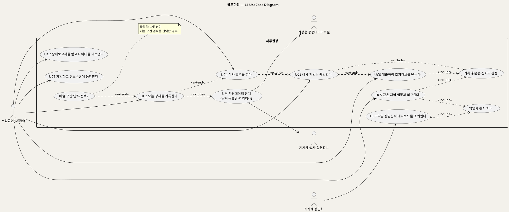

# UseCase 개요 — 하루한장 (소상공인 일일 장사기록·분석 서비스)
**하루한장 · UC 개요 · UML 2.5.1 표준 (L1 UseCase Diagram + 유스케이스 목록)**

---

> **문서 식별**: `design/UC_00_개요_하루한장.md`
> **작성일**: 2026-10-02 · **표준**: UML 2.5.1 (OMG)
> **원천(SoT)**: `Intent-Specify.md` — 하루한장 서비스 의도명세(개요·미션·핵심활동·장벽·가치제안·부정적영향·데이터·수익)
> **작성 프롬프트**: `design/분석설계 프롬프트 - 유스케이스.md` (PlantUML 형식·렌더 규칙 적용)
> **갱신**: 2026-10-02 3단계 — 개별 UC 문서 8건 생성 결과 반영, UC 간 «extend» 관계 3건 L1 다이어그램에 추가
> **다이어그램**: PlantUML 소스는 렌더 검증 완료(HTTP 200 · image/svg+xml · Syntax Error 없음 · 링크 복호 소스 = 코드블록 일치).

---

## 목차

1. 시스템 목적·개요
2. 주요 기능
3. 유스케이스 목록
4. Actor 카탈로그
5. L1 UseCase Diagram
6. 시스템 경계 (하지 않는 것)
7. 생성 결과
8. 결론

---

## 1. 시스템 목적·개요

**하루한장**은 소상공인이 하루 장사를 버튼 몇 번으로 기록하고, 쌓인 기록을 요일·날씨·이벤트별로 분석해 쉬운 문장과 달력으로 돌려받는 서비스다. 미션은 "소상공인이 기억에 의존하지 않고 자신의 장사를 이해하며, 더 나은 결정을 돕는 것"이다(원천 `[미션]`).

서비스는 AI를 사용하지 않고 무료 공공데이터와 기기 내 분석을 활용하며(원천 `[핵심 장벽]`), 같은 지역·업종의 익명 통계를 통해 "나만 어려운 것이 아니다"라는 현실적 기준을 제공한다(원천 `[미션]` 6, `[핵심 활동]`).

| 항목 | 값 |
|---|---|
| 대상 시스템 | 하루한장 |
| 원천 근거 | `Intent-Specify.md` 전 절 |
| 핵심 UseCase | 8개 (L1 기준 공통 include 3개·extend 1개, 개별 문서까지 포함 시 include 5개·extend 2개·Generalization 1건) |
| 주요 액터 | 소상공인(사장님), 지자체·상인회 |
| 외부 연계 | 기상청·공공데이터포털, 지자체 지역행사·상권정보 |

## 2. 주요 기능

| 기능 | 내용 | 원천 근거 |
|---|---|---|
| 30초 일일 기록 | 오늘장사(좋은/보통/나쁜), 손님수(많은/평소/적은), 특별한일(비·할인행사·신메뉴·SNS게시·단체손님 등)을 버튼으로 입력 | `[핵심 활동]` 1, `[핵심 장벽]` 기록 중단 |
| 장사 패턴 분석 | 요일·날씨·이벤트별 반복 패턴 도출, 신뢰도 함께 표시 | `[핵심 활동]` 2, `[핵심 장벽]` 기록 부정확성 |
| 익명 비교 | 같은 지역·업종 익명 통계 제공 | `[핵심 활동]` 3, `[미션]` 6 |
| 쉬운 표현 | 분석 결과를 쉬운 문장과 달력으로 표현 | `[핵심 활동]` 4 |
| 조기 경보 | 매출 하락 조기 경보 알림 | `[가치제안]`, `[비용]` 알림 기능 |
| 유료 기능 | 상세보고서, 데이터 백업·내보내기 | `[수익]` 선택형 유료 기능 |
| 기관 대시보드 | 지자체·상인회 대상 익명 상권분석 대시보드 | `[수익]` 기관 이용료 |

## 3. 유스케이스 목록

| UC ID | 유스케이스명 | 주액터 | 우선순위 | 원천 근거 | 문서 | 상태 |
|:--:|---|---|:--:|---|---|:--:|
| UC1 | 가입하고 정보수집에 동의한다 | 소상공인 | High | `[핵심 이네이블러]` 간단한 가입, `[핵심 장벽]` 사용자 동의, `[핵심 데이터]` 업종·지역·영업요일 | `UC_01_가입및동의.md` | 완료 |
| UC2 | 오늘 장사를 기록한다 | 소상공인 | High | `[핵심 활동]` 1, `[핵심 데이터]` 30초 일일 기록 | `UC_02_오늘장사기록.md` | 완료 |
| UC3 | 장사 패턴을 확인한다 | 소상공인 | High | `[핵심 활동]` 2, `[핵심 데이터]` 도출 가능한 인사이트 | `UC_03_장사패턴확인.md` | 완료 |
| UC4 | 장사 달력을 본다 | 소상공인 | Medium | `[핵심 활동]` 4, `[비용]` 달력 기능 | `UC_04_장사달력조회.md` | 완료 |
| UC5 | 같은 지역·업종과 비교한다 | 소상공인 | Medium | `[핵심 활동]` 3, `[미션]` 6 공감과 연결 | `UC_05_지역업종비교.md` | 완료 |
| UC6 | 매출하락 조기경보를 받는다 | 소상공인 | Medium | `[가치제안]` 매출 하락 조기 경보, `[혜택]` 폐업 위험 조기 발견 | `UC_06_매출하락조기경보.md` | 완료 |
| UC7 | 상세보고서를 받고 데이터를 내보낸다 | 소상공인 | Low | `[수익]` 선택형 유료 기능 | `UC_07_상세보고서및내보내기.md` | 완료 |
| UC8 | 익명 상권분석 대시보드를 조회한다 | 지자체·상인회 | Low | `[수익]` 기관 이용료 | `UC_08_기관대시보드조회.md` | 완료 |

**공통 하위 유스케이스**

| 구분 | 명칭 | 관계 | 원천 근거 |
|---|---|---|---|
| «include» | 외부 환경데이터 연계(날씨·공휴일·지역행사) | UC2 → 항상 | `[핵심 데이터]` 기상청·공공데이터포털, 지자체 행사·상권정보 |
| «include» | 기록 충분성·신뢰도 판정 | UC3·UC5·UC6 → 항상 | `[핵심 장벽]` "충분한 기록이 쌓인 경우에만 분석하고 신뢰도를 함께 표시" |
| «include» | 익명화 통계 처리 | UC5·UC8 → 항상 | `[핵심 장벽]` 암호화·익명화, `[비용]` 익명 통계 처리 |
| «extend» | 매출 구간 입력(선택) | UC2 확장 | `[핵심 데이터]` "선택적으로 입력하는 매출 구간" |

우선순위 근거: [추론] 미션·핵심활동에 직접 명시된 기록·분석은 High, 핵심활동·가치제안의 보조 표현(달력·비교·경보)은 Medium, 수익모델에서만 나타나는 기능은 Low로 판정했다.

## 4. Actor 카탈로그

| 액터 | 구분 | 설명 | 원천 근거 |
|---|---|---|---|
| 소상공인(사장님) | Primary | 매일 장사 상태와 현장 문제를 기록하고 분석 결과를 받아 의사결정에 활용 | `[핵심 파트너]` |
| 지자체·상인회 | Primary | 이용료를 내고 익명 상권분석 대시보드를 조회 | `[수익]` 기관 이용료 |
| 기상청·공공데이터포털 | Secondary (외부시스템) | 날씨·공휴일 무료 데이터 제공 | `[핵심 데이터]` 데이터 획득 방법 |
| 지자체 지역행사·상권정보 | Secondary (외부시스템) | 지역행사·상권정보 제공 | `[핵심 데이터]` 데이터 획득 방법 |

참고: 원천의 `현장 운영자`(소상공인 모집과 사용 지원)는 시스템 밖 인적자원으로 판단해 액터에서 제외했다. [추론] 운영자용 관리 기능이 필요하면 별도 UC로 추가해야 하며 현재 `자료 없음 — 확인 필요`.

## 5. L1 UseCase Diagram

**[「하루한장 L1 UseCase Diagram」 PlantUML 뷰어로 열기](https://plantuml.sumzip.com/plantuml/svg/eNqNVV1LG0EUfZ9fcUlf7INiPhURkfoBgrR9qNCHgqzJJgbjbkk2WCiFNG6kNSmmVGu0WYlWqy0pbPNlCvriT-njzux_6J3djWa0QmEfdvbcc-bee-7MTmY0Ka1lV1OQjS7aOxX69czeqbKDk8XhYZJZSSovpbS0CktSdCWRVrNKbEpNqWl4MBuc9c886ovILEsxdS2pJCAupTIySclxDTQV0snEsgaxZFqOaklVIVpSS8nQvxP8yW3DvB8WMvKUlJFhOiklUJEQKarhVj62UWLrb61mmxndAZavI4UWKw99IGXgyZoip68DT3PsoMwaratzJGC0vV9yo9KJXozVNTnW-Hl1jor40A8mM1q2btpbdVvvOvFPs0vTkibd0QX783tMwJG3OiVW26HNlsOYV6NSak6Jq4TwQiUlgUX6-qv0wWsCkM3IUV6jb2HKD5aJugUMspo1cMXYuwo7_ch2y0C39phRQS4tHjtbIEMUCACrHNPNCqA6ZkVPLgCro4eGQAqIpKAXDXbpzNZbzNDB3tvhveonBUVSqEeixTqtnXASbXZvwkNieBgrw-RzwBu3i51muwV2VLCaF0B_61a7LOwVFskRoKfHrFPlvTMugR2aWJTVuMTm8Aqp-YVubt-wIyJ7BLi7ehejsalMr3oc3uFrp51v-RZXzPdVMSJKjQIz2vRHAVyzaUdnugG0lGPFKqd-crQxP5wyoaDRfh2216WdHPa4wmvoZQBs17Sa-gtlgOZrbPvMGUa7inZcYLecrrmj5k753GPRe9dmYJ3vTla_kFOs0SOTbqGbpTKOUo8muO_WY-9tg72Bo68Da1Tot3ovVjDdNQGsdt0yMfCggL4PML1mrxtuTjPPn_nJG0KcEwiDgxPOgPavAsIqKKxCwiosrCLCaoTg6fXeRwnhYz80NOG0BMZgfDypRFPZmDwxQfhwe1DgDhS-H4r8Byt4Bxq9D-KNcbAFT1B-pclKzCEFPCB0Gwh5QPA2EPSAiAgQp37eld5ddf2h7ypSVE32LmA17joGznHH01wrj8H1ZYpTici_POdn3bUdZxxwhtm-STAH4NpkEt_w3_EXTfjJxw==)** — 클릭 시 브라우저로 연결됩니다.

#### 다이어그램 쉽게 읽기 (유저 관점)

1. **누가 쓰나** — 왼쪽의 사장님이 주로 쓰고, 지자체·상인회는 대시보드만 본다. 오른쪽 기상청·지자체 정보는 사람이 아니라 날씨·행사 데이터를 보내 주는 외부 시스템이다.
2. **무슨 순서로** — 가입·동의(UC1) → 매일 기록(UC2) → 기록이 쌓이면 패턴·달력·비교·경보(UC3~UC6)를 받는다. 더 깊은 보고서가 필요하면 유료 기능(UC7)을 쓴다.
3. **«include» = 항상 함께** — 기록하면 날씨·공휴일 정보가 자동으로 붙고, 분석·비교·경보를 볼 때는 "기록이 충분한지, 얼마나 믿을 만한지"를 반드시 먼저 따진다. 남과 비교할 때는 항상 익명으로 처리된다.
4. **«extend» = 특정 상황에서만** — 매출 구간 입력은 사장님이 원할 때만 덧붙는 선택 항목이다. 유스케이스끼리도 이어진다: 달력에서 빈 날짜를 누르면 기록(UC2)으로, 패턴 화면에서 근거를 보면 달력(UC4)으로, 경보에서 근거를 보면 패턴(UC3)으로 넘어간다.
5. **Generalization(◁)** — 이 다이어그램에는 쓰지 않았다(유형별 변형 UC가 원천에 없음).

| 기호 | 의미 |
|---|---|
| 사람 모양(actor) | 시스템을 쓰는 사람 또는 외부 시스템 |
| 타원(usecase) | 액터가 이루려는 목표 |
| 사각형(rectangle) | 시스템 경계 — 안쪽이 하루한장의 책임 |
| 실선 화살표 | 액터와 유스케이스의 연관 |
| 점선 «include» | 기본 UC가 항상 포함하는 하위 행위 |
| 점선 «extend» | 조건부로 기본 UC에 덧붙는 행위 |

## 6. 시스템 경계 (하지 않는 것)

| 하지 않는 것 | 근거 |
|---|---|
| AI 모델을 사용한 분석·예측 | `[핵심 장벽]` "AI를 사용하지 않고", `[핵심 인적자원]` "AI 없이 통계 분석" |
| 장사 변화의 원인 단정 — '경향'과 '참고정보'로만 안내 | `[핵심 장벽]` 분석 결과의 오해 |
| 기록이 부족할 때의 분석 결과 제공 | `[핵심 장벽]` 기록의 부정확성과 부족 |
| 필요 이상의 개인정보·정확한 매출액 수집 (매출은 선택적 구간만) | `[핵심 장벽]` 최소한의 정보, `[핵심 데이터]` 선택적 매출 구간 |
| 개별 가게를 식별할 수 있는 데이터의 외부 제공 | `[핵심 장벽]` 익명화, `[수익]` "익명" 상권분석 |
| [추론] 평가·대출·보험 심사 목적의 데이터 제공 | `[부정적 영향]` 데이터 악용 — 정책 확정 필요 |

## 7. 생성 결과

실측일 2026-10-02. 분량은 파일 바이트 크기, 14속성은 `validate_usecase.py` 기계 점검 결과다.

| UC ID | 유스케이스명 | 문서 | 분량 | 14속성 | 예외흐름 | 다이어그램 |
|:--:|---|---|:--:|:--:|:--:|:--:|
| UC1 | 가입하고 정보수집에 동의한다 | `UC_01_가입및동의.md` | 12.8KB | 14/14 | E1~E3 | 2 (렌더 200) |
| UC2 | 오늘 장사를 기록한다 | `UC_02_오늘장사기록.md` | 14.0KB | 14/14 | E1~E3 | 2 (렌더 200) |
| UC3 | 장사 패턴을 확인한다 | `UC_03_장사패턴확인.md` | 12.5KB | 14/14 | E1~E3 | 2 (렌더 200) |
| UC4 | 장사 달력을 본다 | `UC_04_장사달력조회.md` | 10.8KB | 14/14 | E1~E3 | 2 (렌더 200) |
| UC5 | 같은 지역·업종과 비교한다 | `UC_05_지역업종비교.md` | 12.6KB | 14/14 | E1~E3 | 2 (렌더 200) |
| UC6 | 매출하락 조기경보를 받는다 | `UC_06_매출하락조기경보.md` | 12.4KB | 14/14 | E1~E3 | 2 (렌더 200) |
| UC7 | 상세보고서를 받고 데이터를 내보낸다 | `UC_07_상세보고서및내보내기.md` | 12.7KB | 14/14 | E1~E3 | 2 (렌더 200) |
| UC8 | 익명 상권분석 대시보드를 조회한다 | `UC_08_기관대시보드조회.md` | 12.2KB | 14/14 | E1~E3 | 2 (렌더 200) |

모든 렌더 링크는 HTTP 200 · image/svg+xml · Syntax Error 없음 · 링크 복호 소스와 코드블록 일치를 확인했다.

## 8. 결론

### 8.1 도출 결과

- 유스케이스 8개(High 3 · Medium 3 · Low 2), 공통 하위 UC 5개(include 5: 외부 환경데이터 연계, 기록 충분성·신뢰도 판정, 익명화 통계 처리, 유료 이용 권한 확인, 기관 이용 권한 확인), extend 2개(매출 구간 입력, 익명 통계 제공 동의), Generalization 1건(UC7)
- 액터 4개 확정(Primary 2: 소상공인, 지자체·상인회 / Secondary 2: 기상청·공공데이터포털, 지자체 지역행사·상권정보). 결제 시스템은 근거 없어 미확정
- 업무규칙 22개(BR-HRH-01~22), 이 중 `[추론]` 규칙 6개(BR-HRH-11·15·16·18·20·22)
- 예외흐름 24개(UC당 3개)

### 8.2 원천 커버리지

§2 주요 기능 7개 중 7개가 UC로 전환됐다(100%). 원천 전체 기준으로 UC로 전환하지 못했거나 부분 전환된 항목은 다음과 같다.

| 원천 항목 | 상태 | 사유 |
|---|---|---|
| `[핵심 데이터]` 인사이트 "장사가 잘되는 **시간**" | 미전환 | UC2 기록 항목에 시간대가 없어 도출 불가. 시간대 기록 추가 여부 결정 필요 |
| `[핵심 이네이블러]` 데이터 제공에 대한 명확한 보상 | 미전환 | 보상 방식이 원천에 없음. UC5 비고에 [추론]으로만 언급 |
| `[핵심 인적자원]` 현장 운영자(모집·사용 지원) | 미전환 | 시스템 밖 인적 활동으로 판단. 운영자용 관리 기능 필요 여부 미정 |
| `[핵심 이네이블러]` 업종별 현장 전문가·데이터 분석가 협업 | 미전환 | 조직 활동이며 시스템 기능 아님 |
| `[가치제안]` 영업시간·휴무일 최적화, 재고·인력 운영 효율화 | 부분 전환 | UC3 패턴 정보로 판단을 돕는 수준. 별도 추천 기능은 원천에 없음 |
| `[비용]` 알림 기능 | 부분 전환 | UC6 경보로 전환. 기록 알림은 UC2 A4에 [추론]으로만 반영 |

### 8.3 미해결 사항 (자료 없음 — 확인 필요)

| 항목 | 관련 UC·BR |
|---|---|
| 가입 수단(휴대폰·간편로그인 등)과 "연동" 대상 | UC1 |
| 전체 가입 규모·UC별 사용빈도 | UC1, UC3~UC8 |
| 매출 구간의 구간 값 | UC2, BR-HRH-06 |
| 분석 최소 기록 수(신뢰도 기준) | UC3, UC5, UC6, BR-HRH-08 |
| 시간대 기록 여부("잘되는 시간" 인사이트) | UC2, UC3 |
| 비교 지역 범위(동·구 등) | UC5, UC8 |
| 익명 통계 최소 참여 가게 수 | UC5, UC8, BR-HRH-14 |
| 조기경보 판정 기간·하락 폭, 알림 수단 | UC6, BR-HRH-17 |
| 유료 기능 가격·결제 수단·보고서 구성·파일 형식 | UC7 |
| 기관 이용 계약·요금, 기관 화면 형태 | UC8 |
| 현장 운영자용 관리 기능 필요 여부, 데이터 제공 보상 방식 | 개요 |

### 8.4 다음 단계 권고

1. 위 미해결 수치(최소 기록 수, 최소 참여 가게 수, 경보 기준)를 데이터 담당자가 먼저 확정한다. 분석·비교·경보 UC 3개(UC3·UC5·UC6)가 이 값에 묶여 있다.
2. `[추론]`으로 표기한 설계 판단 — 익명 통계 별도 동의(UC1 EXT), 비교 순위 미표시(BR-HRH-15), 기기 임시 저장(UC2 E3), 데이터 악용 금지 약관(BR-HRH-22) — 을 현업과 검토해 확정하거나 삭제한다.
3. 개인정보 수집·동의·익명화 규칙(BR-HRH-01~03, 14, 16, 21)은 구현 전에 법률 검토를 거친다(원천 `[비용]` 보안·법률비).

---

*하루한장 UseCase 개요 · UML 2.5.1 · 원천 `Intent-Specify.md`*
