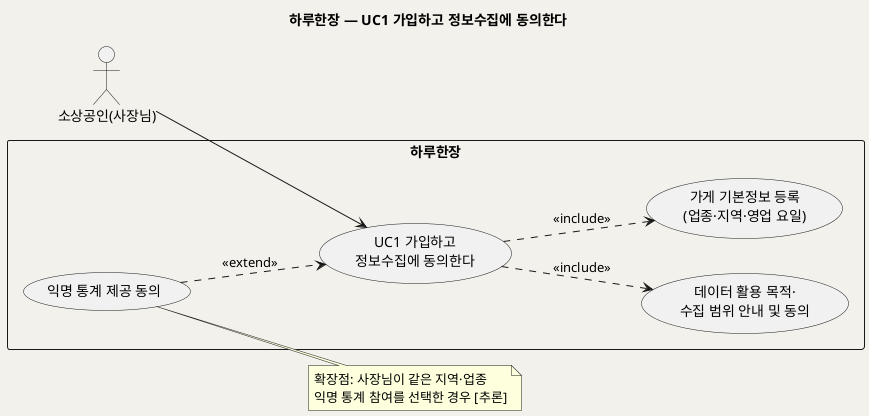
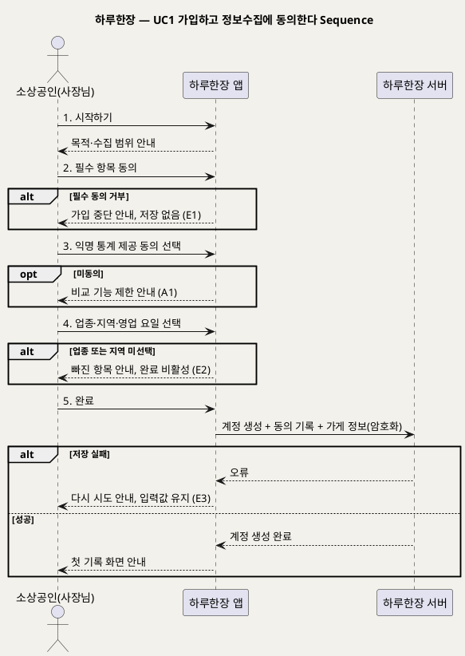

# UseCase 명세 — #1 가입하고 정보수집에 동의한다 (하루한장 시작 단계)
**하루한장 · UC1 · UML 2.5.1 표준 (UseCase Diagram + UseCase 기술 + Sequence Diagram)**

---

> **문서 식별**: `design/UC_01_가입및동의.md`
> **작성일**: 2026-10-02 · **표준**: UML 2.5.1 (OMG)
> **원천(SoT)**: `Intent-Specify.md` — 하루한장 서비스 의도명세
> **개요 문서**: `design/UC_00_개요_하루한장.md` §3 UC1 행
> **다이어그램**: 모든 PlantUML 소스는 렌더 검증 완료(HTTP 200 · image/svg+xml). 아래 링크로 브라우저에서 열 수 있다.

---

## 목차

1. 범위·개요
2. UseCase Diagram
3. Actor 카탈로그
4. UseCase 목록 (원천 매핑)
5. UseCase 기술 + Sequence Diagram
6. 업무규칙 종합
7. UML 표준 준수 노트

---

## 1. 범위·개요

사장님이 하루한장을 처음 쓰기 시작하는 단계다. 데이터를 왜, 어디까지 모으는지 안내받고 동의한 뒤, 분석과 비교의 기준이 되는 가게 기본정보(업종·지역·영업 요일)를 버튼으로 등록한다.

원천은 "간단한 가입·연동 절차"와 "데이터 활용 목적과 수집 범위에 대한 투명한 안내"를 핵심 이네이블러로, "최소한의 정보만 수집하고 암호화·익명화하며 사용자 동의를 받는다"를 개인정보 장벽의 해결책으로 제시한다. 이 UC는 그 약속을 사용자가 처음 만나는 지점이다.

| 항목 | 값 |
|---|---|
| 대상 시스템 | 하루한장 |
| 상위 프로세스 | 서비스 시작(온보딩) |
| 원천 근거 | `[핵심 이네이블러]` 1·5, `[핵심 장벽]` 개인정보 유출 우려·디지털 사용의 어려움, `[핵심 데이터]` 업종·지역·영업 요일 |
| 핵심 UseCase | 1개 (+ include 2, extend 1) |
| 주요 액터 | 소상공인(사장님) |

## 2. UseCase Diagram

**[「UC1 가입·동의 UseCase Diagram」 PlantUML 뷰어로 열기](https://plantuml.sumzip.com/plantuml/svg/eNp9klFL21AUx9_vpzjUF31QVvcmUmSisJftZcJgDsmStAbjzUhucDAGrbYi6NCxhsbSSHQTpzjImnb2wb34UfaYe_Iddho7yfqwp1zyv-f3_59z7oIjFFu4mya46lrq-fLLt9Tr4Mn52qMiczYM_laxlU14o6gbFdtyubZomZYNE8uPl4tLT3I3nHVFs7YMXoGyYjo6M_WyAGGBbVTWBWiGravCsDgThjB1yDvB72oTVhaLkERVPGmQlMQhYOjJuId7Pl58wtYRyMNjDHyqkPtfGVNUQSkKuHuAO7Uk7mMwmMTta6LJfX-qAIoDz7e4bjM29FV4hTwLedMCvGcArqOrikPSuP0q_59_xqeSPEF-jDDopfUI0uMOti9BXl1iWLu7IVQGAdltYqcO6O3J7R7I6HDEzGhPn_2LozBJ9wCSQSTjwX0WkJ9_yNNglU9iq4FnjbsbvKhi6zt9_Rr9Amw3Mbid-subzfMw6MurBqS7_SSmDGGHhpb3X3r5osg-MJZNDaanS1l_w7HMzJSydDAH8_MGV01X00ulvDQ7Jg1ZmbYyqtLfCZ1rpDBuCX30JKzyvSnQwDzaCIZHc_CwQ5olLYTiVeGhy6xruj_WSzTA1rU8vwWsh-lOQCuCpPsL2xG8wp9NeRq-ZuQOQ2u2QCd67H8AlAFudA==)** — 클릭 시 브라우저로 연결됩니다.

#### 다이어그램 쉽게 읽기 (유저 관점)

1. **누가 쓰나** — 사장님 혼자 쓴다. 이 단계에는 외부 기관이 끼지 않는다.
2. **무슨 순서로** — 앱을 열면 먼저 "무엇을 왜 모으는지" 안내를 보고 동의한 다음, 업종·지역·영업 요일을 버튼으로 고른다.
3. **«include» = 항상 함께** — 안내·동의와 가게 기본정보 등록은 가입할 때 빠짐없이 거친다.
4. **«extend» = 특정 상황에서만** — 익명 통계에 내 기록을 보태는 것은 사장님이 원할 때만 덧붙는다.
5. **Generalization(◁)** — 이 다이어그램에는 쓰지 않았다.

| 기호 | 의미 |
|---|---|
| 사람 모양(actor) | 시스템을 쓰는 사람 |
| 타원(usecase) | 액터가 이루려는 목표 |
| 사각형(rectangle) | 시스템 경계 |
| 점선 «include» | 항상 포함되는 하위 행위 |
| 점선 «extend» | 조건부로 덧붙는 행위 |

## 3. Actor 카탈로그

| 액터 | 구분 | 이 UC에서의 역할 | 원천 근거 |
|---|---|---|---|
| 소상공인(사장님) | Primary | 안내를 확인하고 동의하며 가게 기본정보를 등록한다 | `[핵심 파트너]` |

## 4. UseCase 목록 (원천 매핑)

| ID | 명칭 | 관계 | 원천 근거 |
|---|---|---|---|
| UC1 | 가입하고 정보수집에 동의한다 | 기본 | `[핵심 이네이블러]` 간단한 가입·연동 절차 |
| INC1 | 데이터 활용 목적·수집 범위 안내 및 동의 | «include» | `[핵심 장벽]` 사용자 동의, `[핵심 이네이블러]` 투명한 안내 |
| INC2 | 가게 기본정보 등록 | «include» | `[핵심 데이터]` 업종·지역·영업 요일 |
| EXT1 | 익명 통계 제공 동의 | «extend» | `[핵심 활동]` 익명 통계, `[부정적 영향]` 업체 간 비교 스트레스 — [추론] 별도 동의로 분리 |

## 5. UseCase 기술 + Sequence Diagram

### 5.1 UC1 가입하고 정보수집에 동의한다

> **쉽게 말하면** — 처음 앱을 열면 "어떤 정보를 왜 모으는지"를 쉬운 말로 먼저 보여주고, 사장님이 동의해야 시작된다. 그 다음 업종·지역·쉬는 요일을 큰 버튼으로 고르면 바로 첫 기록을 할 수 있다.

#### 유스케이스 기술

| 속성 | 내용 |
|---|---|
| **ID** | UC1 (원천 `[핵심 이네이블러]` 1) |
| **유스케이스명** | 가입하고 정보수집에 동의한다 |
| **액터** | 주: 소상공인(사장님) / 보조: 없음 |
| **사전조건** | 1) 사장님 스마트폰에 하루한장 앱이 설치되어 있다. 2) 해당 사장님으로 가입된 계정이 없다. 3) [추론] 서버와 통신 가능하다 |
| **사후조건** | 1) 사장님 계정이 생성되어 로그인 상태다. 2) 필수 동의 항목·동의 시각이 기록된다. 3) 업종·지역·영업 요일이 암호화되어 저장된다. 4) 익명 통계 제공 동의 여부가 기록된다 |
| **기본흐름** | ↓ 별도 기본흐름표 |
| **대체흐름** | A1. 익명 통계 제공에 동의하지 않음 → 가입은 완료되고 개인 기록·분석은 사용 가능, [추론] 같은 지역·업종 비교(UC5)는 동의 전까지 이용 제한 안내. A2. [추론] 영업 요일을 나중에 입력 선택 → 기본값 없이 가입 완료, 첫 분석(UC3) 전 입력 요청 |
| **예외흐름** | E1. 필수 동의 거부 → 어떤 정보도 저장하지 않고 가입 중단, 동의해야 쓸 수 있다는 안내 표시(원천 `[핵심 장벽]` 사용자 동의). E2. 업종 또는 지역 미선택 → 완료 버튼 비활성, 빠진 항목을 큰 글씨로 안내(원천 `[핵심 데이터]` 업종·지역은 비교의 필수 기준). E3. 저장 실패(통신 오류) → 입력값 유지 후 다시 시도 안내, 동의 기록 미생성(원천 `[핵심 장벽]` 개인정보 유출 우려 — 부분 저장 금지 [추론]) |
| **포함/확장** | «include» 데이터 활용 목적·수집 범위 안내 및 동의 / «include» 가게 기본정보 등록 / «extend» 익명 통계 제공 동의 |
| **우선순위** | High — 모든 기록·분석의 전제이며 개인정보 장벽의 해결 지점 |
| **사용빈도** | 사장님당 1회(가입 시). 전체 가입 규모는 자료 없음 — 확인 필요 |
| **업무규칙** | BR-HRH-01, BR-HRH-02, BR-HRH-03, BR-HRH-04 |
| **특별 요구사항** | 큰 글씨·쉬운 표현·단순 버튼(접근성), 저장 정보 암호화(보안), 이용약관·개인정보 법률 검토(원천 `[비용]` 보안·법률비). 가입 수단(휴대폰·간편로그인 등)과 "연동" 대상은 자료 없음 — 확인 필요 |
| **비고** | 원천 추적성: `[핵심 이네이블러]` "간단한 가입·연동 절차", "데이터 활용 목적과 수집 범위에 대한 투명한 안내" / `[핵심 장벽]` "최소한의 정보만 수집하고, 암호화·익명화하며 사용자 동의를 받는다", "큰 글씨, 쉬운 표현, 단순한 버튼" / `[핵심 데이터]` "업종·지역·영업 요일" |

#### 기본흐름 (Basic Flow)

| 단계 | 액터 행위 | 시스템 행위 |
|:--:|---|---|
| 1 | 사장님이 앱을 열고 시작하기를 누른다 | 데이터 활용 목적과 수집 범위를 쉬운 문장으로 보여준다 |
| 2 | 안내를 읽고 필수 항목에 동의한다 | 동의 항목과 시각을 임시 보관하고 다음 화면으로 넘어간다 |
| 3 | 익명 통계 제공 동의 여부를 고른다 | 선택 결과를 임시 보관한다 |
| 4 | 업종·지역·영업 요일을 버튼으로 고른다 | 필수 항목(업종·지역) 선택 여부를 확인한다 |
| 5 | 완료를 누른다 | 계정을 만들고 동의 기록과 가게 정보를 암호화해 저장한 뒤 첫 기록 화면으로 안내한다 |

#### Sequence Diagram

**[「UC1 가입·동의 Sequence Diagram」 PlantUML 뷰어로 열기](https://plantuml.sumzip.com/plantuml/svg/eNp9VF9v0lAUf--nOMEXiEJk6Msels1lezVx0delQp1krDAo2WsZhSyDZGBKKIaS6iCw6SJ_FROf_Cg-9p5-B8-lBTcgvvSm9_7u-f05p93OKGJayZ4kICOdHjo1g133nFoTW53Dp2EhcxyXU2JaPIG3YvT4KJ3MyrHdZCKZhkf7kf3w3ot7iMx7MZY8i8tH8E5MZCRBiSsJCe5XhD-qDq93w2D3VWwV6MgeWYBWjY3GeGFgt4r1CrCrBpoG3WClNhxIp1lJjkqCIEYVovVhsYz5nD2aoDn14_lXKstKRsAHYgZenslSWiA1SjwaT4myAr4H9FgbzHA7qdT_UFqTDbUZ8ODNK0GYVYXgFr8GmxAOAZYIWOXyp32B7wbp1IVtAru9QSv3-4drCNhQx6ZG1BfsfLxcayNE-WiEpOWOLnreBTGhzA_cHbAHffZdFQCW6dwoAdtVVup5NE8oU3VmpV5Eswz-vXBAkOTYMn2ErJgTdlsApzixR6TSalKyc07ULCdvCsmUAuzb1JO2qoD91OxJBSgLdtnhJShHTwj4d9YzPyPmegE_Fyinror1O1qNHG0BftTR_DXn5kG4QGBGhV3q4MK5IA-yTpCFXW0e6SKShsauy1yt02iiNqBUNtZqex7ysG5rt_gU8KBHGk0qYN7klx8vGkO2P5n0To2wh2Vvmv1Y0x1j6jT0gOvB60ep7ZR7JJmXDC4Y0WizztpoS22aNT5v7Er756RVYFbH7n8AbJJTlZxEyAl9cxTbgBq4QvBQu-dulQ6HX-Z-SDm7Gc_Hlqe0TQ_6TfwF0-4HPg==)** — 클릭 시 브라우저로 연결됩니다.

## 6. 업무규칙 종합

| BR ID | 규칙 | 적용 UC | 근거 |
|---|---|---|---|
| BR-HRH-01 | 가입 시 수집 정보는 업종·지역·영업 요일로 한정한다. 매출은 수집하지 않는다(선택 입력은 UC2) | UC1 | `[핵심 장벽]` "최소한의 정보만 수집", `[핵심 데이터]` |
| BR-HRH-02 | 데이터 활용 목적·수집 범위를 안내하고 동의를 받기 전에는 어떤 정보도 저장하지 않는다 | UC1 | `[핵심 장벽]` "사용자 동의를 받는다", `[핵심 이네이블러]` 투명한 안내 |
| BR-HRH-03 | 저장되는 가게 정보와 기록은 암호화한다 | UC1 (전 UC 공통) | `[핵심 장벽]` "암호화·익명화" |
| BR-HRH-04 | 모든 입력 화면은 큰 글씨·쉬운 표현·단순 버튼으로 구성한다 | UC1 (전 UC 공통) | `[핵심 장벽]` 디지털 사용의 어려움 |

## 7. UML 표준 준수 노트

- UseCase Diagram은 System Boundary(`rectangle`) 안에 UC를 두고 액터를 경계 밖에 배치했다(UML 2.5.1 §18.1).
- «include»는 base → included 방향, «extend»는 extension → base 방향으로 표기하고 확장점 조건을 note로 명시했다.
- Sequence Diagram의 액터 발신 메시지 1~5는 기본흐름 단계 1~5와 1:1 대응한다. 예외·대체흐름은 `alt`/`opt` 결합 프래그먼트로 표현하고 ID(E1~E3, A1)를 병기했다.

---

*하루한장 UseCase 명세 · UC1 · UML 2.5.1 · 원천 `Intent-Specify.md`*
