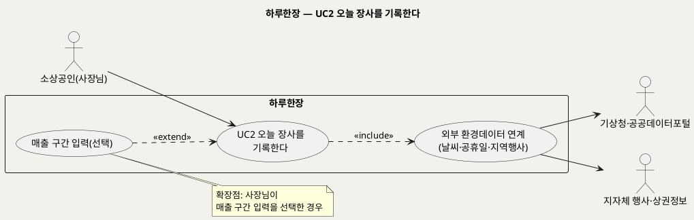
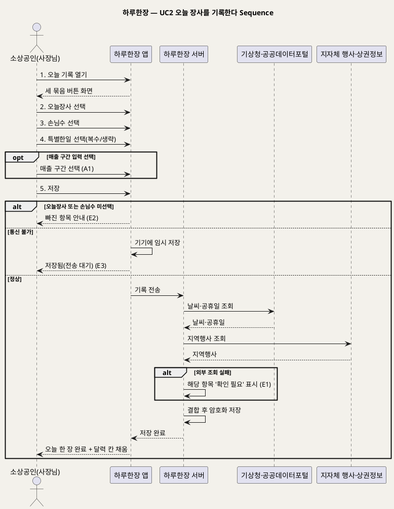

# UseCase 명세 — #2 오늘 장사를 기록한다 (하루한장 일일 기록 단계)
**하루한장 · UC2 · UML 2.5.1 표준 (UseCase Diagram + UseCase 기술 + Sequence Diagram)**

---

> **문서 식별**: `design/UC_02_오늘장사기록.md`
> **작성일**: 2026-10-02 · **표준**: UML 2.5.1 (OMG)
> **원천(SoT)**: `Intent-Specify.md` — 하루한장 서비스 의도명세
> **개요 문서**: `design/UC_00_개요_하루한장.md` §3 UC2 행
> **다이어그램**: 모든 PlantUML 소스는 렌더 검증 완료(HTTP 200 · image/svg+xml). 아래 링크로 브라우저에서 열 수 있다.

---

## 목차

1. 범위·개요
2. UseCase Diagram
3. Actor 카탈로그
4. UseCase 목록 (원천 매핑)
5. UseCase 기술 + Sequence Diagram
6. 업무규칙 종합
7. UML 표준 준수 노트

---

## 1. 범위·개요

하루한장의 핵심 가치 창출 활동이다. 영업을 마친 사장님이 오늘장사·손님수·특별한일 세 묶음의 버튼만 눌러 하루를 기록하고, 시스템은 그날의 날씨·공휴일·지역행사 정보를 자동으로 붙여 저장한다.

원천은 "피로에 지친 소상공인의 일일 장사 상태를 가장 간편하게 입력할 수 있는 인터페이스"와 "입력 항목을 최소화하고 30초 이내에 기록"을 명시한다. 이 UC의 품질은 기록 지속률, 곧 서비스 전체의 데이터 양을 좌우한다.

| 항목 | 값 |
|---|---|
| 대상 시스템 | 하루한장 |
| 상위 프로세스 | 일일 기록 |
| 원천 근거 | `[핵심 활동]` 1, `[핵심 장벽]` 사장님의 기록 중단, `[핵심 데이터]` 필요한 데이터·데이터 획득 방법 |
| 핵심 UseCase | 1개 (+ include 1, extend 1) |
| 주요 액터 | 소상공인(사장님), 기상청·공공데이터포털, 지자체 지역행사·상권정보 |

## 2. UseCase Diagram

**[「UC2 오늘 장사 기록 UseCase Diagram」 PlantUML 뷰어로 열기](https://plantuml.sumzip.com/plantuml/svg/eNptUkFLG0EYvc-v-Egv6UFp7E0kSFMFobQ9tNCDIOPuJC6uM2V3FgulkGpaaLXUg6lrycqWJughwpLEmIO9-FN63Jn9D_12UsMehD0M8733vvfezrIvqSeDHRcCayNrh-r3Rdbu6LPexqMF4m87_C316A5sUmu74YmA2zXhCg8erD5eraw8KSD8LWqLXYc3oE5dnxGX1SVIAZ7T2JJgOx6zpCM4kY50GRQ3wd_mMbyuLYAOu-prCHil9_qqdwPpJFG_IkSpgy4h1JK4uaQ_H-r9j-nwSkeTMgIRrg7ChyWgPrzY5cy7AyIbgXpweXuNaPzUt0RHo6yVZN_7WWtiGC-DzadU0pn4eVOfHenBCLIfX1D89jrfNT7UcVsNR4bxTFjUXeN1QUieifIG5ikVA5XgPQEIfGZRH0f3RVvnxWxGF2FFlj6dqHETstMwHfyZOQd9kqTD1jovq71YH1-YaFlnpKMbtIrmTy6nxqd9rD2vVYqi6ryrxx1Ir_pp0kI3n1TcK-tWnO1HU8LKm1cV8oEQUyTMzVWNrTzB_HzVyMEiLC053HIDm1WrJCeYWY7JR-ydZNzGiQHnCncVzy4KDXIh2f8nIurT7YCZ23lR8dEizP4vxsfJff51hCcTAcsELEv_TAhagFybLOMJX_c_9zpgrA==)** — 클릭 시 브라우저로 연결됩니다.

#### 다이어그램 쉽게 읽기 (유저 관점)

1. **누가 쓰나** — 사장님이 기록한다. 오른쪽 기상청·지자체는 사람이 아니라 날씨·공휴일·행사 정보를 보내주는 외부 시스템이다.
2. **무슨 순서로** — 오늘 장사 → 손님 수 → 특별한 일 순서로 버튼을 누르고 저장하면 끝난다.
3. **«include» = 항상 함께** — 저장할 때마다 그날 날씨·공휴일·지역행사가 자동으로 붙는다. 사장님이 따로 적지 않는다.
4. **«extend» = 특정 상황에서만** — 매출 구간은 사장님이 원할 때만 고른다.
5. **Generalization(◁)** — 이 다이어그램에는 쓰지 않았다.

| 기호 | 의미 |
|---|---|
| 사람 모양(actor) | 시스템을 쓰는 사람 또는 외부 시스템 |
| 타원(usecase) | 액터가 이루려는 목표 |
| 사각형(rectangle) | 시스템 경계 |
| 실선 화살표 | 연관(데이터를 주고받음) |
| 점선 «include» | 항상 포함되는 하위 행위 |
| 점선 «extend» | 조건부로 덧붙는 행위 |

## 3. Actor 카탈로그

| 액터 | 구분 | 이 UC에서의 역할 | 원천 근거 |
|---|---|---|---|
| 소상공인(사장님) | Primary | 하루 장사 상태를 버튼으로 기록한다 | `[핵심 파트너]` "매일 장사 상태와 현장 문제 기록" |
| 기상청·공공데이터포털 | Secondary | 날씨·공휴일 데이터를 제공한다 | `[핵심 데이터]` 데이터 획득 방법 |
| 지자체 지역행사·상권정보 | Secondary | 지역행사 정보를 제공한다 | `[핵심 데이터]` 데이터 획득 방법 |

## 4. UseCase 목록 (원천 매핑)

| ID | 명칭 | 관계 | 원천 근거 |
|---|---|---|---|
| UC2 | 오늘 장사를 기록한다 | 기본 | `[핵심 활동]` 1 |
| INC1 | 외부 환경데이터 연계 | «include» | `[핵심 데이터]` 날씨·공휴일·지역행사, 기상청·공공데이터포털·지자체 |
| EXT1 | 매출 구간 입력(선택) | «extend» | `[핵심 데이터]` "선택적으로 입력하는 매출 구간" |

## 5. UseCase 기술 + Sequence Diagram

### 5.1 UC2 오늘 장사를 기록한다

> **쉽게 말하면** — 가게 문을 닫고 앱을 열어 "오늘 장사 어땠나요?", "손님은요?", "특별한 일 있었나요?"에 버튼으로 답하면 끝이다. 30초면 충분하고, 날씨나 공휴일은 앱이 알아서 붙여준다.

#### 유스케이스 기술

| 속성 | 내용 |
|---|---|
| **ID** | UC2 (원천 `[핵심 활동]` 1) |
| **유스케이스명** | 오늘 장사를 기록한다 |
| **액터** | 주: 소상공인(사장님) / 보조: 기상청·공공데이터포털, 지자체 지역행사·상권정보 |
| **사전조건** | 1) UC1 가입이 완료되어 로그인 상태다. 2) 필수 동의가 기록되어 있다. 3) 업종·지역이 등록되어 있다(지역행사 결합의 기준) |
| **사후조건** | 1) 해당 날짜의 기록(오늘장사·손님수·특별한일, 선택 시 매출 구간)이 암호화되어 저장된다. 2) 날씨·공휴일·지역행사 정보가 기록에 결합된다(조회 실패 시 '확인 필요' 상태로 표시). 3) 달력(UC4)의 해당 날짜가 채워진다 |
| **기본흐름** | ↓ 별도 기본흐름표 |
| **대체흐름** | A1. 매출 구간 입력 선택(«extend») → 구간 버튼 중 하나를 고른 뒤 저장. 구간 값은 자료 없음 — 확인 필요. A2. [추론] 오늘 기록이 이미 있음 → 기존 선택이 채워진 화면을 보여주고 수정 후 저장. A3. [추론] 지난 날짜 기록 누락 → 달력에서 날짜를 골라 같은 화면으로 기록. A4. [추론] 기록 알림(원천 `[비용]` 알림 기능)을 눌러 진입 → 1단계 화면으로 바로 이동 |
| **예외흐름** | E1. 날씨·공휴일·행사 데이터 조회 실패 → 사장님 기록은 그대로 저장하고 해당 정보는 '확인 필요'로 표시, [추론] 다음 접속 시 재조회(원천 `[핵심 장벽]` 무료 공공데이터 활용 — 외부 의존). E2. 오늘장사 또는 손님수 미선택 → 저장 버튼 비활성, 빠진 항목 안내(원천 `[핵심 장벽]` 기록의 부정확성). E3. 통신 불가 → [추론] 기기에 임시 저장하고 연결 시 전송(원천 `[핵심 장벽]` 기기 내 분석 활용), 사장님에게 '저장됨(전송 대기)' 표시 |
| **포함/확장** | «include» 외부 환경데이터 연계 / «extend» 매출 구간 입력(선택) |
| **우선순위** | High — 핵심 가치 창출 활동 1번이며 모든 분석의 유일한 1차 데이터 원천 |
| **사용빈도** | 사장님당 1일 1회(원천 "매일", "30초 일일 기록") |
| **업무규칙** | BR-HRH-03, BR-HRH-04, BR-HRH-05, BR-HRH-06, BR-HRH-07 |
| **특별 요구사항** | 기록 완료까지 30초 이내(원천 `[핵심 장벽]`). 큰 글씨·단순 버튼(접근성). 저장 데이터 암호화(보안). 외부 데이터 조회가 사장님 입력을 지연시키지 않을 것 [추론] |
| **비고** | 원천 추적성: `[핵심 활동]` "오늘장사(좋은,보통,나쁜), 손님수(많은,평소,적은), 특별한일(비,할인행사,신메뉴,SNS게시,단체손님 등)을 간단한 버튼으로 입력" / `[핵심 데이터]` "재료 부족, 직원 결근 등 현장 문제", "선택적으로 입력하는 매출 구간", "기상청·공공데이터포털의 무료 데이터", "지자체의 지역행사·상권정보" / `[핵심 장벽]` "30초 이내에 기록" |

#### 기본흐름 (Basic Flow)

| 단계 | 액터 행위 | 시스템 행위 |
|:--:|---|---|
| 1 | 사장님이 영업을 마치고 앱에서 오늘 기록을 연다 | 오늘 날짜와 세 묶음의 버튼(오늘장사·손님수·특별한일)을 한 화면에 보여준다 |
| 2 | 오늘장사(좋은/보통/나쁜) 중 하나를 누른다 | 선택을 강조 표시한다 |
| 3 | 손님수(많은/평소/적은) 중 하나를 누른다 | 선택을 강조 표시한다 |
| 4 | 특별한일(비·할인행사·신메뉴·SNS게시·단체손님·재료 부족·직원 결근 등) 중 해당하는 것을 누른다(여러 개 가능, 없으면 넘어감) | 선택을 강조 표시한다 |
| 5 | 저장을 누른다 | 날씨·공휴일·지역행사를 조회해 기록에 결합하고 암호화 저장한 뒤 "오늘 한 장 완료"와 달력 칸 채움을 보여준다 |

#### Sequence Diagram

**[「UC2 오늘 장사 기록 Sequence Diagram」 PlantUML 뷰어로 열기](https://plantuml.sumzip.com/plantuml/svg/eNp9VE1PGlEU3c-vuLELIY22Yrtx0fgRXTWxqbFbM8WpJeKAMMYt1SmhQFOaMGVUMGOEiA2mIw44JK78KV1y3_sPvfNGPm2bEALvnnPveeeemfmkJie0vZ0oJJXdDW6YeF7nRpmd1jaeh6TkdkSNywl5B97L4e2tRGxP3VyKRWMJeLIyuzKzvDiESH6UN2P7EXULPsjRpCJpES2qwHBH-J0qwvpSCJhZxawJdMQOGli7g65r41mFUJirwpqyu6eoYUWS5LBGoyZYOs8OP3VvWqziBohBPMyZwQmQk7C6ryoJiRRokXAkLqsaTIyMZMa1wC3E4_9D6WVs6gK49u7tKJC00XTWvLq_JQn0wa82qzhct_m3BtddwXqzvjjKYhcpdlpgTQf4jy-k-f7Wu0I7zywDbxzBeb26JElCP0y98gTCHMxM98zxLQFWcuiX5FWnCOXD50iwC9hos0oeSDjP3gE_KuKlM94v1Ovne008ix9WxlGzhEoXyFOWMf8BeTENPNvBG91zrHL3gAogLSVjPmOHFTxtBaVYXAO8qLJ2GbqtRtfWacef0ar1mgKMtR0DCxQEFmaCkqJujmt4STItsrUmyVFt9F5oFjBbHLoF_nL7M8fNw47FLnSK5hX-vKSEZPDAgcByiIZScIGnWyxnAbYzXTvVo_c00DK8QJQKdDOd5co9RY-n-AUs1APM0ln6DDCfImqQJs0-TKIwUCoGIyh7_gixecGiondKRYqYp_3AYsW6iCIvO2ITZzY_zhPOA0z1uzwCDjpR8Dx9lNDSlZ_OQROvNmgyjKGisP3IxXbqgQAsV-X5OpX6zX0iNxzMdXoWT_Ijg55d-quz4-Ik8O9lz7rAMu0ZwNv0GL3btLlxCfyEMmEUuelSugdOC2h_I_4x6dLxPP-3PfjPE-UWBjh4CphriGR2XGDXOjtJicjN0xe9Df8Adfxx8g==)** — 클릭 시 브라우저로 연결됩니다.

## 6. 업무규칙 종합

| BR ID | 규칙 | 적용 UC | 근거 |
|---|---|---|---|
| BR-HRH-03 | 저장되는 가게 정보와 기록은 암호화한다 | UC2 (UC1에서 정의) | `[핵심 장벽]` "암호화·익명화" |
| BR-HRH-04 | 모든 입력 화면은 큰 글씨·쉬운 표현·단순 버튼으로 구성한다 | UC2 (UC1에서 정의) | `[핵심 장벽]` 디지털 사용의 어려움 |
| BR-HRH-05 | 일일 기록은 오늘장사(3단계)·손님수(3단계)·특별한일(복수 선택) 버튼 입력으로 구성하며 30초 이내 완료 가능해야 한다. 오늘장사·손님수는 필수 | UC2 | `[핵심 활동]` 1, `[핵심 장벽]` "30초 이내에 기록" |
| BR-HRH-06 | 매출은 정확한 금액이 아닌 구간으로만, 사장님이 선택한 경우에만 입력받는다 | UC2 | `[핵심 데이터]` "선택적으로 입력하는 매출 구간", `[핵심 장벽]` 최소 정보 |
| BR-HRH-07 | 날씨·공휴일·지역행사는 사장님이 입력하지 않고 무료 공공데이터에서 자동 결합한다 | UC2 | `[핵심 데이터]` 데이터 획득 방법, `[핵심 장벽]` 무료 공공데이터 활용 |

## 7. UML 표준 준수 노트

- 외부시스템(기상청·공공데이터포털, 지자체)은 System Boundary 밖 Secondary actor로, Sequence에서는 별도 lifeline으로 분리했다.
- «include»(INC1)는 저장 시 항상 수행되므로 include로, 매출 구간은 사장님 선택 시에만 발생하므로 extend로 판정했다.
- Sequence Diagram의 액터 발신 메시지 1~5는 기본흐름 단계 1~5와 1:1 대응한다. 분기는 `alt`/`opt`로 표현하고 E1~E3, A1을 병기했다.

---

*하루한장 UseCase 명세 · UC2 · UML 2.5.1 · 원천 `Intent-Specify.md`*
