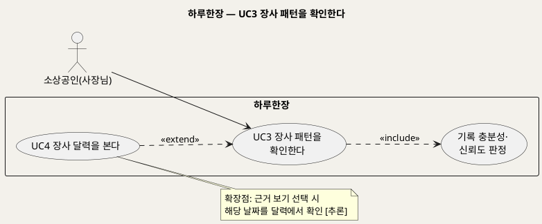
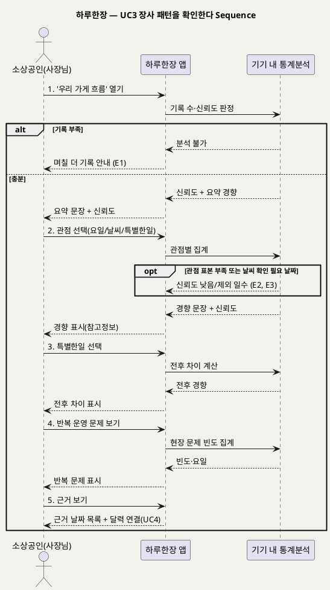

# UseCase 명세 — #3 장사 패턴을 확인한다 (하루한장 분석 단계)
**하루한장 · UC3 · UML 2.5.1 표준 (UseCase Diagram + UseCase 기술 + Sequence Diagram)**

---

> **문서 식별**: `design/UC_03_장사패턴확인.md`
> **작성일**: 2026-10-02 · **표준**: UML 2.5.1 (OMG)
> **원천(SoT)**: `Intent-Specify.md` — 하루한장 서비스 의도명세
> **개요 문서**: `design/UC_00_개요_하루한장.md` §3 UC3 행
> **다이어그램**: 모든 PlantUML 소스는 렌더 검증 완료(HTTP 200 · image/svg+xml). 아래 링크로 브라우저에서 열 수 있다.

---

## 목차

1. 범위·개요
2. UseCase Diagram
3. Actor 카탈로그
4. UseCase 목록 (원천 매핑)
5. UseCase 기술 + Sequence Diagram
6. 업무규칙 종합
7. UML 표준 준수 노트

---

## 1. 범위·개요

쌓인 일일 기록을 요일·날씨·특별한일(할인·광고·신메뉴 등)별로 묶어 반복되는 장사 패턴을 사장님에게 쉬운 문장으로 보여준다. 분석은 AI 없이 기기 안에서 통계로 수행한다.

원천은 이 기능의 위험도 함께 명시한다. 기록이 부족하면 잘못된 결론이 나올 수 있으므로 "충분한 기록이 쌓인 경우에만 분석하고 신뢰도를 함께 표시"하고, 원인을 단정하지 않고 "경향과 참고정보로 안내"해야 한다.

| 항목 | 값 |
|---|---|
| 대상 시스템 | 하루한장 |
| 상위 프로세스 | 기록 분석 |
| 원천 근거 | `[핵심 활동]` 2·4, `[핵심 데이터]` 도출 가능한 인사이트, `[핵심 장벽]` 기록의 부정확성·분석 결과의 오해·운영비 부담 |
| 핵심 UseCase | 1개 (+ include 1) |
| 주요 액터 | 소상공인(사장님) |

## 2. UseCase Diagram

**[「UC3 장사 패턴 확인 UseCase Diagram」 PlantUML 뷰어로 열기](https://plantuml.sumzip.com/plantuml/svg/eNptks9Kw0AQxu_7FEO96EFR60mkiEXBi548qciabNtg3EiyQUEE_wQvKdiDwQqtpGpRwUPFWit48lE8djfv4GxQjOBt4PtmfvPN7qwnqCv8bRt8YyOJ6vLmPoka6qq9MZ4n3pbFd6hLt2GTGltl1_G5WXRsx4WhhfzCxPxcxuFVqOnsWrwMJWp7jNisJEA44FrligDTcpkhLIcTYQmbQZYEn4fnsFLMA9bq-BGS6n0SdFUzgOQyUs0-umR4Swg1BJJz6rSqTo4Gzy8oDaMfu2RYH8kB9WB5lzOXEM2ivIycXBaUg30C4HvMoB5K_yHXeJaZzkRbtmvQ78hWE1TvQfYCFTx9vK5xFcbyuiPPcONqTcVR2re4VJz8i5v6wcnwUcZtnVA-9385U-SAkDQCjI4WUrDecWyskA6DaZiZsbhh-yYrFIiepyVt0QrbE4ybKBDuCPZ9d6eUzoX0lAiPa9MweH0fPHUQ3cUsoII4OcE8YUO7oq4M30Aex-quIdvvP5te1FTQ-H4OWFW9c9mK1wniQLPILFb4hb4AAhQQyw==)** — 클릭 시 브라우저로 연결됩니다.

#### 다이어그램 쉽게 읽기 (유저 관점)

1. **누가 쓰나** — 사장님이 "우리 가게는 어떤 날 잘되나"를 볼 때 쓴다.
2. **무슨 순서로** — 메뉴를 열고, 요일·날씨·특별한일 중 보고 싶은 관점을 고르면 결과 문장이 나온다.
3. **«include» = 항상 함께** — 결과를 보여주기 전에 "기록이 충분한지, 얼마나 믿을 만한지"를 반드시 따진다.
4. **«extend» = 특정 상황에서만** — 결과의 근거가 된 날짜를 보고 싶을 때만 달력(UC4)으로 이어진다.
5. **Generalization(◁)** — 이 다이어그램에는 쓰지 않았다.

| 기호 | 의미 |
|---|---|
| 사람 모양(actor) | 시스템을 쓰는 사람 |
| 타원(usecase) | 액터가 이루려는 목표 |
| 사각형(rectangle) | 시스템 경계 |
| 점선 «include» | 항상 포함되는 하위 행위 |
| 점선 «extend» | 조건부로 덧붙는 행위 |

## 3. Actor 카탈로그

| 액터 | 구분 | 이 UC에서의 역할 | 원천 근거 |
|---|---|---|---|
| 소상공인(사장님) | Primary | 패턴 결과를 보고 영업 결정을 참고한다 | `[미션]` 쉬운 의사결정 |

## 4. UseCase 목록 (원천 매핑)

| ID | 명칭 | 관계 | 원천 근거 |
|---|---|---|---|
| UC3 | 장사 패턴을 확인한다 | 기본 | `[핵심 활동]` 2 "요일·날씨·이벤트별로 분석" |
| INC2 | 기록 충분성·신뢰도 판정 | «include» | `[핵심 장벽]` "충분한 기록이 쌓인 경우에만 분석하고 신뢰도를 함께 표시" |
| UC4 | 장사 달력을 본다 | «extend» (근거 보기) | `[핵심 활동]` 4 "쉬운 문장과 달력으로 표현" |

## 5. UseCase 기술 + Sequence Diagram

### 5.1 UC3 장사 패턴을 확인한다

> **쉽게 말하면** — 그동안 기록한 걸 모아서 "비 오는 날은 손님이 적은 경향이 있어요", "신메뉴 낸 뒤로 좋은 날이 늘었어요" 같은 문장으로 알려준다. 기록이 적으면 아직 판단하지 않고, 얼마나 믿을 만한지도 함께 보여준다.

#### 유스케이스 기술

| 속성 | 내용 |
|---|---|
| **ID** | UC3 (원천 `[핵심 활동]` 2) |
| **유스케이스명** | 장사 패턴을 확인한다 |
| **액터** | 주: 소상공인(사장님) / 보조: 없음 |
| **사전조건** | 1) 로그인 상태다. 2) UC2로 저장된 일일 기록이 1건 이상 있다. 3) 업종·지역·영업 요일이 등록되어 있다 |
| **사후조건** | 1) 선택한 관점의 경향 문장과 신뢰도가 표시된다. 2) 기록이 부족하면 분석 결과 대신 부족 안내가 표시된다. 3) 기록 데이터는 변경되지 않는다 |
| **기본흐름** | ↓ 별도 기본흐름표 |
| **대체흐름** | A1. 영업 요일 미등록(UC1 A2) → 요일 분석 전 영업 요일 입력을 요청. A2. 매출 구간 기록(UC2 A1)이 있는 경우 → [추론] 매출 구간 경향도 함께 표시 |
| **예외흐름** | E1. 전체 기록이 분석 최소 수 미만 → 결과를 보여주지 않고 "며칠 더 기록하면 볼 수 있어요"와 남은 일수 안내. 최소 기록 수는 자료 없음 — 확인 필요(원천 `[핵심 장벽]` 기록의 부정확성과 부족). E2. 특정 관점의 표본 부족(예: 비 온 날 기록이 적음) → 해당 관점은 '신뢰도 낮음'으로 표시하거나 숨김(원천 `[부정적 영향]` 잘못된 분석). E3. 날씨 정보가 '확인 필요'(UC2 E1)인 날짜 → [추론] 날씨 관점 분석에서 제외하고 제외 일수 표시 |
| **포함/확장** | «include» 기록 충분성·신뢰도 판정 / «extend» UC4 장사 달력을 본다(근거 보기) |
| **우선순위** | High — 핵심 활동 2번, "매출 변화의 원인을 쉽게 파악" 가치제안의 직접 구현 |
| **사용빈도** | 자료 없음 — 확인 필요. [추론] 사장님당 주 1~수회 |
| **업무규칙** | BR-HRH-08, BR-HRH-09, BR-HRH-10, BR-HRH-11 |
| **특별 요구사항** | AI 미사용·기기 내 통계 분석(운영비). 쉬운 문장·큰 글씨(접근성). 원천 인사이트 "장사가 잘되는 요일과 시간" 중 **시간**은 UC2 기록 항목에 없어 도출 불가 — 자료 없음 — 확인 필요 |
| **비고** | 원천 추적성: `[핵심 활동]` "기록을 요일·날씨·이벤트별로 분석을 통해 반복되는 장사 패턴 제공", "분석 결과를 쉬운 문장과 달력으로 표현" / `[핵심 데이터]` 도출 가능한 인사이트(요일, 날씨·행사, 할인·광고·신메뉴 전후, 반복 운영 문제) / `[핵심 장벽]` 기록의 부정확성, 분석 결과의 오해, 운영비 부담 / `[부정적 영향]` 잘못된 분석, 과도한 의존 |

#### 기본흐름 (Basic Flow)

| 단계 | 액터 행위 | 시스템 행위 |
|:--:|---|---|
| 1 | 사장님이 '우리 가게 흐름' 메뉴를 연다 | 기록 수와 신뢰도를 판정하고 핵심 경향 요약 문장을 보여준다 |
| 2 | 보고 싶은 관점(요일·날씨·특별한일)을 버튼으로 고른다 | 기기 안에서 관점별 좋은/보통/나쁜·손님수 분포를 집계해 경향 문장과 신뢰도를 보여준다 |
| 3 | 특별한일 중 하나(예: 할인행사·신메뉴)를 고른다 | 그 일이 있었던 날의 전후 기록 차이를 경향 문장으로 보여준다 |
| 4 | 반복 운영 문제 보기를 고른다 | 재료 부족·직원 결근 등 반복된 현장 문제의 빈도와 요일을 보여준다 |
| 5 | 결과의 근거 보기를 누른다 | 해당 경향의 근거가 된 날짜 목록을 보여주고 달력(UC4)으로 이어준다 |

#### Sequence Diagram

**[「UC3 장사 패턴 확인 Sequence Diagram」 PlantUML 뷰어로 열기](https://plantuml.sumzip.com/plantuml/svg/eNp9VE1PGlEU3c-vuLELIVasYjddNFqj2y7UtZni1BJxQBjjFnFiiNCICVNHyzRjWxUb0ozMiJDopj-ly3n3_Yfe-QARsAkBMvfcc887576ZyyliVtnZSkFO2l7jms5-1LlWw28Xa6_iQm4zKWfErLgFH8TE5kY2vSOvL6RT6Sy8WIovTS--60PkPonr6d2kvAEfxVROEpSkkpKgnxH-5quwuhAH-o-FBvBynasOGirwUw2NNqFY6ScsS9s7kpyQBEFMKDRqDA_KuL_n2reEiVAjtbOSHh0DMQfvd2UpK5ACJZlIZkRZgbEnI1G78XHzmcxTlNu26AOs4AA_uHVtlbVUVA0fvLwyvyIIPjVMvvV64Q1Mx2Aczyx22QDXyrvNMnCjwi7VccATh6gED0Zor5ng9ISdG4BF_c8dlkz23WJHdNByBU1NEFNKF8BaeTy_ESDom-yNC-TQT5GmUdlnp2qgiurXFnZMYJ-rvVFa0TtNZHE6KkiUAGDrmliGqR_lTACeVVF7ALf5wL9cjBgT1lmj7bk58dhL2AGDZmLgOnk0K4CqyfeNiNdr3E-xgonV-hQ_7DBb9WIx7qPdSY92-Z0EALw6pjQIkM4oXUJ-XGN2O_QKmF5hh1UIeMPdoUVTaZ7_8KpG3f85NSv8RqM8hWYNT9tAcigksm3mJSzGPWWSvD5sWuDQaCMGTQuxpBpLtQhabdc2KXZmO9Fh2-Ix6LcmNG_IIDRV_pXcsepoOEAOYcEaEW2Aej7OJyyBwGFJszFgls7sW4rfQX3PP7VZAzqAt-iD0riuep50QZ2iZ3IvxsG99st0J_zlGLXYweSQ7TmJr2nZ7u7dG2tAVH8KYd3fCGC_rr1LMgGs1GAmvRhOLLdpRVYXZum2UOBz9EWvwX_oA2Wf)** — 클릭 시 브라우저로 연결됩니다.

## 6. 업무규칙 종합

| BR ID | 규칙 | 적용 UC | 근거 |
|---|---|---|---|
| BR-HRH-08 | 분석은 충분한 기록이 쌓인 경우에만 제공하고, 모든 결과에 신뢰도를 함께 표시한다. 최소 기록 수는 자료 없음 — 확인 필요 | UC3, UC5, UC6 | `[핵심 장벽]` 기록의 부정확성과 부족 |
| BR-HRH-09 | 분석 결과는 원인을 단정하지 않고 '경향'과 '참고정보'로 표현한다 | UC3, UC5, UC6 | `[핵심 장벽]` 분석 결과의 오해 |
| BR-HRH-10 | 분석은 AI를 사용하지 않고 통계 기준으로 기기 내에서 수행한다 | UC3, UC4 | `[핵심 장벽]` 운영비 부담, `[핵심 인적자원]` "AI 없이 통계 분석 기준 설계" |
| BR-HRH-11 | [추론] 결과 화면에 "사장님의 경험과 함께 판단하세요" 취지의 안내를 둔다 | UC3, UC5 | `[부정적 영향]` 과도한 의존 |

## 7. UML 표준 준수 노트

- "기기 내 통계분석"은 앱 내부 구성요소지만 분석 책임을 드러내기 위해 별도 lifeline으로 분리했다.
- UC4 달력은 독립 UC이면서 근거 보기 상황에서만 UC3에 덧붙으므로 «extend»로 표기했다.
- Sequence Diagram의 액터 발신 메시지 1~5는 기본흐름 단계 1~5와 1:1 대응한다. E1~E3은 `alt`/`opt`로 표현했다.

---

*하루한장 UseCase 명세 · UC3 · UML 2.5.1 · 원천 `Intent-Specify.md`*
