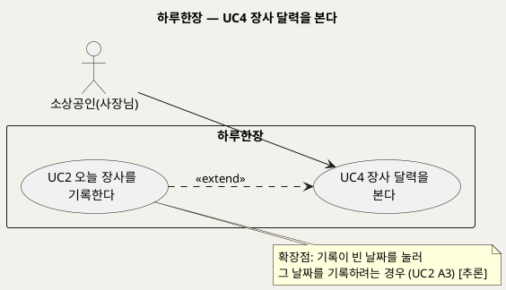
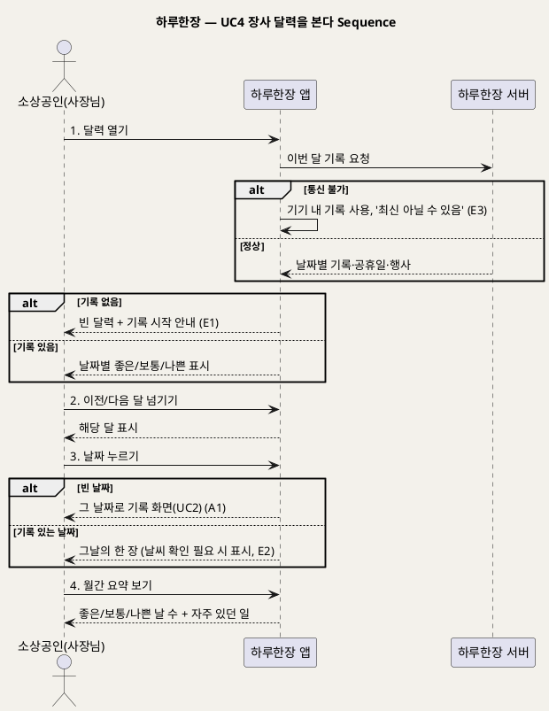

# UseCase 명세 — #4 장사 달력을 본다 (하루한장 조회 단계)
**하루한장 · UC4 · UML 2.5.1 표준 (UseCase Diagram + UseCase 기술 + Sequence Diagram)**

---

> **문서 식별**: `design/UC_04_장사달력조회.md`
> **작성일**: 2026-10-02 · **표준**: UML 2.5.1 (OMG)
> **원천(SoT)**: `Intent-Specify.md` — 하루한장 서비스 의도명세
> **개요 문서**: `design/UC_00_개요_하루한장.md` §3 UC4 행
> **다이어그램**: 모든 PlantUML 소스는 렌더 검증 완료(HTTP 200 · image/svg+xml). 아래 링크로 브라우저에서 열 수 있다.

---

## 목차

1. 범위·개요
2. UseCase Diagram
3. Actor 카탈로그
4. UseCase 목록 (원천 매핑)
5. UseCase 기술 + Sequence Diagram
6. 업무규칙 종합
7. UML 표준 준수 노트

---

## 1. 범위·개요

사장님이 쌓아온 하루하루의 기록을 달력 한 장으로 보는 기능이다. 날짜마다 그날 장사가 좋았는지·보통이었는지·나빴는지가 표시되고, 공휴일·지역행사·날씨가 함께 보이며, 날짜를 누르면 그날의 한 장을 다시 볼 수 있다.

원천의 슬로건 "10분 기록, 쌓이면 우리 가게의 역사", "사장님의 하루를 한 장으로"와 핵심 활동 "분석 결과를 쉬운 문장과 달력으로 표현"을 구현한다.

| 항목 | 값 |
|---|---|
| 대상 시스템 | 하루한장 |
| 상위 프로세스 | 기록 조회 |
| 원천 근거 | `[핵심 활동]` 4, `[개요]` 슬로건, `[미션]` 기억과 학습, `[비용]` 달력 기능 |
| 핵심 UseCase | 1개 (+ extend 1) |
| 주요 액터 | 소상공인(사장님) |

## 2. UseCase Diagram

**[「UC4 장사 달력 UseCase Diagram」 PlantUML 뷰어로 열기](https://plantuml.sumzip.com/plantuml/svg/eNptkc9LAkEcxe_zV3yxix6UUk8SYkleO3XKkGkddXGdjd1ZDCIoi5D00EFhC7dWUurgQbIfBvXPdNwZ_4dmVyODbo-Z997nMZMxGTaYVdPAUgqzrs3vH2fdnrgdFlaTyKyq9AAbuAb7WKmWDd2ixayu6Qas5BK5ta3NJYdZwUW9rtIylLBmEqSREgOmg6GWKwyKqkEUpuoUMZVpBJZJ8HXSgZ1sEqQWjRHw1oi7Q-GcA59MeWuAEFaYZIbERVucnXqTF-FMw9Ip_bxlR0KATdiuU2Ig5FMwLUtCaBkRgiMEYJlEwaa8-g-Wp3Na0CYNf_1xEPaAX9qLGB9-5Kk3HfO-IwG_qTg6RiiYAtFoOqjxs7FYoCEF6-vkkBFaTKcRojoji-fRS0EYYHbd9QnuVQrm9cJ5Bv7eBN5wxUNPcoE32_xuJL3e23Tp-GeNzV05tAPe06e4GUPY528kIrArXju87-4hSQcfjTJSyY__BgoC70E=)** — 클릭 시 브라우저로 연결됩니다.

#### 다이어그램 쉽게 읽기 (유저 관점)

1. **누가 쓰나** — 사장님이 지난 장사를 한눈에 돌아볼 때 쓴다.
2. **무슨 순서로** — 달력을 열고, 달을 넘기고, 궁금한 날짜를 누른다.
3. **«include» = 항상 함께** — 이 UC에는 없다.
4. **«extend» = 특정 상황에서만** — 기록을 빼먹은 날을 누르면 그 날짜로 기록(UC2)을 이어서 할 수 있다.
5. **Generalization(◁)** — 이 다이어그램에는 쓰지 않았다.

| 기호 | 의미 |
|---|---|
| 사람 모양(actor) | 시스템을 쓰는 사람 |
| 타원(usecase) | 액터가 이루려는 목표 |
| 사각형(rectangle) | 시스템 경계 |
| 점선 «extend» | 조건부로 덧붙는 행위 |

## 3. Actor 카탈로그

| 액터 | 구분 | 이 UC에서의 역할 | 원천 근거 |
|---|---|---|---|
| 소상공인(사장님) | Primary | 달력으로 지난 기록을 돌아본다 | `[미션]` 기억과 학습 |

## 4. UseCase 목록 (원천 매핑)

| ID | 명칭 | 관계 | 원천 근거 |
|---|---|---|---|
| UC4 | 장사 달력을 본다 | 기본 | `[핵심 활동]` 4 "쉬운 문장과 달력으로 표현" |
| UC2 | 오늘 장사를 기록한다 | «extend» (빈 날짜 기록) | `[핵심 장벽]` 사장님의 기록 중단 — [추론] 누락일 보충 경로 |

## 5. UseCase 기술 + Sequence Diagram

### 5.1 UC4 장사 달력을 본다

> **쉽게 말하면** — 한 달 달력에 날마다 "좋은 날·보통·나쁜 날"이 표시되어 우리 가게의 한 달이 한눈에 보인다. 날짜를 누르면 그날 날씨와 있었던 일까지 다시 볼 수 있다.

#### 유스케이스 기술

| 속성 | 내용 |
|---|---|
| **ID** | UC4 (원천 `[핵심 활동]` 4) |
| **유스케이스명** | 장사 달력을 본다 |
| **액터** | 주: 소상공인(사장님) / 보조: 없음 |
| **사전조건** | 1) 로그인 상태다. 2) [추론] 기록이 없어도 달력은 열린다(빈 달력) |
| **사후조건** | 1) 선택한 달의 날짜별 기록 상태와 공휴일·지역행사가 표시된다. 2) 선택한 날짜의 기록 상세가 표시된다. 3) 기록 데이터는 변경되지 않는다(UC2로 넘어간 경우 제외) |
| **기본흐름** | ↓ 별도 기본흐름표 |
| **대체흐름** | A1. 기록이 빈 날짜를 누름(«extend» UC2) → 그 날짜로 기록 화면을 연다. A2. UC3 근거 보기에서 진입 → 근거 날짜들이 강조된 달력을 연다 |
| **예외흐름** | E1. 해당 달에 기록이 하나도 없음 → 빈 달력과 "오늘부터 한 장씩 채워보세요" 안내(원천 `[핵심 장벽]` 사장님의 기록 중단). E2. 날씨가 '확인 필요'(UC2 E1)인 날짜 → 날씨 칸을 '확인 필요'로 표시하고 추정값을 채우지 않음(원천 `[부정적 영향]` 잘못된 분석). E3. 통신 불가 → [추론] 기기에 있는 기록으로 달력을 그리고 '최신 아닐 수 있음' 표시(원천 `[핵심 장벽]` 기기 내 분석) |
| **포함/확장** | «extend» UC2 오늘 장사를 기록한다(빈 날짜 기록) |
| **우선순위** | Medium — 핵심 활동 4의 표현 수단. 기록·분석(UC2·UC3)이 선행되어야 의미가 있음 |
| **사용빈도** | 자료 없음 — 확인 필요. [추론] 기록 직후 1일 1회 수준 |
| **업무규칙** | BR-HRH-04, BR-HRH-10, BR-HRH-12, BR-HRH-13 |
| **특별 요구사항** | 큰 글씨·단순 표시(접근성). [추론] 색만으로 구분하지 않고 글자(좋은/보통/나쁜)를 함께 표시 |
| **비고** | 원천 추적성: `[핵심 활동]` "분석 결과를 쉬운 문장과 달력으로 표현" / `[개요]` "10분 기록, 쌓이면 우리 가게의 역사", "사장님의 하루를 한 장으로" / `[미션]` 4 기억과 학습 / `[비용]` "기록·분석·달력·알림 기능 개발" |

#### 기본흐름 (Basic Flow)

| 단계 | 액터 행위 | 시스템 행위 |
|:--:|---|---|
| 1 | 사장님이 달력 메뉴를 연다 | 이번 달 달력에 날짜별 오늘장사 표시(좋은/보통/나쁜)와 공휴일·지역행사를 보여준다 |
| 2 | 이전 달 또는 다음 달로 넘긴다 | 해당 달의 기록 상태를 같은 방식으로 보여준다 |
| 3 | 궁금한 날짜를 누른다 | 그날의 한 장(오늘장사·손님수·특별한일·날씨·공휴일·행사, 매출 구간 입력 시 포함)을 보여준다 |
| 4 | 월간 요약 보기를 누른다 | 그 달의 좋은/보통/나쁜 날 수와 자주 있었던 특별한일을 쉬운 문장으로 보여준다 |

#### Sequence Diagram

**[「UC4 장사 달력 Sequence Diagram」 PlantUML 뷰어로 열기](https://plantuml.sumzip.com/plantuml/svg/eNp9lFFP2lAUx9_vpzhhD5aoMISnPSw6gq9LZtyr6aBzRCxIS3xF1pBudYkm7excu-AcmSYuYVAGJuzFj7JH7u132LmXQhwjJn1o7znnf_7n19Oua7pc1Wv7JdCUg53QcenlVeh47Et753GGaHtFtSJX5X14Jef3dqvlmlrIlkvlKjzaTG-mcs_uZWhv5EL5sKjuwmu5pClEL-olBe4rwp-6DdvZDOA9a9wAtW5oq818A2hvSK1vsKUc1BQ1rxAi53VsEmPNY_b2aNzrM38oYQkWUsuNx0DW4PmhqlQJ9taL-WJFVnWI_dOMOT9F3kal8lCW4dGuIRK3Xr4gRKjC6lNeBk8glYhcAjsLxsMO4ccYxVyMMj-gXZNnAMbohQ_s3GbdH0Qu6RA2-8xqAf1ljjt1AhBVTnQxHS-gjWBWidOdX6_AEut7vI45BrVOgJku4jKZf7wEUi4dJwqyBdZykAuKch-rM1XaaLHvHu0ZkejdANGFXsD80d0g_PgOexBFLQh707ZnTdSe2kOlCQDUujWnoy_Pki1kdorWTG5cyqUiO9Ow8LlIa-aLfbWYX0_SXoB4krThsiMPwlOc2BPO5vCvJThj1jKSuB6oLVBTw53gI_N9Qieg1q1IijTn9NKJyAtQ06Bt8UY5DDGsCCxwPx4MpxNceNNZw082vQ6k7exaHKSN_0HQ9_aDijzmu-jY418DSPzZvkJZB1cdjw3cJM47GmQFcmvxRYQySOizPe4YYvWc3_gpBYvQLASPTcWCLaOHE3Y5EsY_4ML5I7KOzfC38BcrXgFS)** — 클릭 시 브라우저로 연결됩니다.

## 6. 업무규칙 종합

| BR ID | 규칙 | 적용 UC | 근거 |
|---|---|---|---|
| BR-HRH-04 | 모든 화면은 큰 글씨·쉬운 표현·단순 버튼으로 구성한다 | UC4 (UC1에서 정의) | `[핵심 장벽]` 디지털 사용의 어려움 |
| BR-HRH-10 | 분석은 AI 없이 통계 기준으로 기기 내에서 수행한다 | UC4 (UC3에서 정의) | `[핵심 장벽]` 운영비 부담 |
| BR-HRH-12 | 달력의 각 날짜는 그날 기록한 오늘장사 3단계와 공휴일·지역행사를 함께 표시한다 | UC4 | `[핵심 활동]` 4, `[핵심 데이터]` 날씨·공휴일·지역행사 |
| BR-HRH-13 | 기록이 없거나 외부 데이터가 '확인 필요'인 날은 비워 두거나 그대로 표시하고, 추정값으로 채우지 않는다 | UC4 | `[부정적 영향]` 잘못된 분석, `[핵심 장벽]` 기록의 부정확성 |

## 7. UML 표준 준수 노트

- UC2는 독립 UC이면서 빈 날짜를 누른 경우에만 달력 조회에 덧붙으므로 «extend»로 표기했다(extension → base).
- 이 UC는 외부시스템과 직접 통신하지 않는다. 날씨·행사 정보는 UC2에서 결합된 값을 읽는다.
- Sequence Diagram의 액터 발신 메시지 1~4는 기본흐름 단계 1~4와 1:1 대응한다. E1~E3, A1은 `alt`로 표현했다.

---

*하루한장 UseCase 명세 · UC4 · UML 2.5.1 · 원천 `Intent-Specify.md`*
