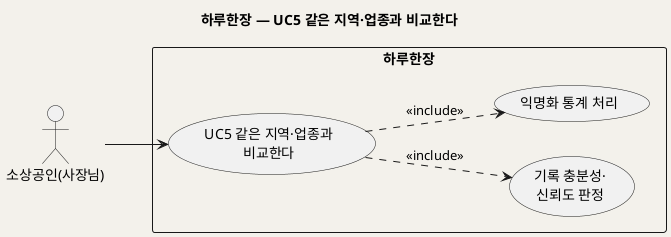
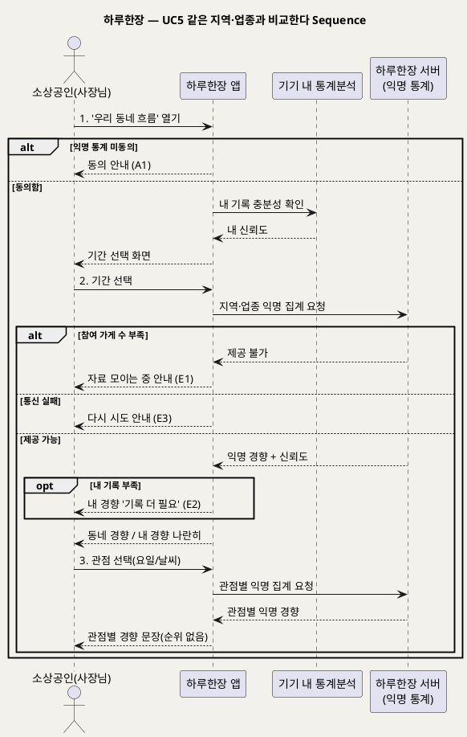

# UseCase 명세 — #5 같은 지역·업종과 비교한다 (하루한장 익명 비교 단계)
**하루한장 · UC5 · UML 2.5.1 표준 (UseCase Diagram + UseCase 기술 + Sequence Diagram)**

---

> **문서 식별**: `design/UC_05_지역업종비교.md`
> **작성일**: 2026-10-02 · **표준**: UML 2.5.1 (OMG)
> **원천(SoT)**: `Intent-Specify.md` — 하루한장 서비스 의도명세
> **개요 문서**: `design/UC_00_개요_하루한장.md` §3 UC5 행
> **다이어그램**: 모든 PlantUML 소스는 렌더 검증 완료(HTTP 200 · image/svg+xml). 아래 링크로 브라우저에서 열 수 있다.

---

## 목차

1. 범위·개요
2. UseCase Diagram
3. Actor 카탈로그
4. UseCase 목록 (원천 매핑)
5. UseCase 기술 + Sequence Diagram
6. 업무규칙 종합
7. UML 표준 준수 노트

---

## 1. 범위·개요

사장님이 "우리 가게만 어려운 걸까?"라는 막연한 불안을 덜도록, 같은 지역·업종 가게들의 익명 통계와 내 가게 흐름을 나란히 보여준다. 개별 가게는 드러나지 않으며, 익명 통계 제공에 동의한 가게의 기록만 집계한다.

원천은 이 기능의 목적을 "나만 어려운 것이 아니다라는 안도감과 현실적인 기준"으로 정의하는 동시에, 부정적 영향으로 "업체 간 비교 스트레스"와 "개인정보 유출"을 꼽는다. 따라서 비교는 경쟁·순위가 아니라 흐름의 공유로 설계한다.

| 항목 | 값 |
|---|---|
| 대상 시스템 | 하루한장 |
| 상위 프로세스 | 익명 비교 |
| 원천 근거 | `[핵심 활동]` 3, `[미션]` 2·6, `[핵심 데이터]` 같은 지역·업종 비교, `[핵심 장벽]` 개인정보 유출 우려, `[부정적 영향]` 업체 간 비교 스트레스 |
| 핵심 UseCase | 1개 (+ include 2) |
| 주요 액터 | 소상공인(사장님) |

## 2. UseCase Diagram

**[「UC5 지역·업종 비교 UseCase Diagram」 PlantUML 뷰어로 열기](https://plantuml.sumzip.com/plantuml/svg/eNp9kc9LwmAYx-_vX_FglzoolXgJGZIkdKlTN0HetjmH811s7_AQgdX0opAHRYUWZr_DwJKpQSf_lI573_0PzUEwOnT-_vh8H56MSbFBrYoGlljwu3129-x3r_nNQ2EzhcyySk6wgStwjMWyYugWkbK6phuwlkvmtvZ2Iw6zhCW9qhIFilgzZaTJRQpUB0NVShQk1ZBFquoEUZVqMkRJ8F3rwFE2Bd5kwJ0a8Kca770t57xX56O6N_0C9ml7bjtws-Y9QlikwYIYb7T45bk3dbmzWOcX46CJNfsbMcAmHFaJbCC0YmKiBLxYFBiDUwRgmbKIzUD6D50nUXbYHdijaW8xYbcO8NkLm9ncfl_O84Q3h2w0YVc2-K02H3bD3P5Bdjsa5I7LXuv-oAN-w_WmNvCPPnsc_3qT6Ayh8A6Ix4WQuhqaSAhhE-xAOq0SUbMkWRCiUvKPlJGJFPz3B_me3uQ=)** — 클릭 시 브라우저로 연결됩니다.

#### 다이어그램 쉽게 읽기 (유저 관점)

1. **누가 쓰나** — 사장님이 우리 동네 같은 업종 가게들의 흐름이 궁금할 때 쓴다.
2. **무슨 순서로** — 비교 메뉴를 열고 기간과 관점을 고르면 동네 흐름과 내 흐름이 나란히 나온다.
3. **«include» = 항상 함께** — 비교할 때마다 "믿을 만큼 자료가 모였는지" 따지고, 다른 가게 정보는 반드시 익명으로 묶어서만 보여준다.
4. **«extend» = 특정 상황에서만** — 이 UC에는 없다.
5. **Generalization(◁)** — 이 다이어그램에는 쓰지 않았다.

| 기호 | 의미 |
|---|---|
| 사람 모양(actor) | 시스템을 쓰는 사람 |
| 타원(usecase) | 액터가 이루려는 목표 |
| 사각형(rectangle) | 시스템 경계 |
| 점선 «include» | 항상 포함되는 하위 행위 |

## 3. Actor 카탈로그

| 액터 | 구분 | 이 UC에서의 역할 | 원천 근거 |
|---|---|---|---|
| 소상공인(사장님) | Primary | 동네·업종 흐름과 내 흐름을 비교해 본다 | `[미션]` 6 공감과 연결 |

## 4. UseCase 목록 (원천 매핑)

| ID | 명칭 | 관계 | 원천 근거 |
|---|---|---|---|
| UC5 | 같은 지역·업종과 비교한다 | 기본 | `[핵심 활동]` 3 "같은 지역·업종의 익명 통계 제공" |
| INC2 | 기록 충분성·신뢰도 판정 | «include» | `[핵심 장벽]` 기록의 부정확성과 부족 |
| INC3 | 익명화 통계 처리 | «include» | `[핵심 장벽]` "암호화·익명화", `[비용]` 익명 통계 처리 |

## 5. UseCase 기술 + Sequence Diagram

### 5.1 UC5 같은 지역·업종과 비교한다

> **쉽게 말하면** — "이번 주 우리 동네 같은 업종 가게들도 손님이 적었대요"처럼 동네 전체 흐름을 보여줘서, 나만 힘든 게 아닌지 확인할 수 있다. 어느 가게인지는 절대 알 수 없고, 등수도 매기지 않는다.

#### 유스케이스 기술

| 속성 | 내용 |
|---|---|
| **ID** | UC5 (원천 `[핵심 활동]` 3) |
| **유스케이스명** | 같은 지역·업종과 비교한다 |
| **액터** | 주: 소상공인(사장님) / 보조: 없음 |
| **사전조건** | 1) 로그인 상태다. 2) 업종·지역이 등록되어 있다. 3) 익명 통계 제공에 동의했다(UC1 «extend») [추론]. 4) 내 일일 기록이 있다 |
| **사후조건** | 1) 같은 지역·업종의 익명 경향과 내 경향이 신뢰도와 함께 나란히 표시된다. 2) 다른 가게를 식별할 수 있는 정보는 표시·전송되지 않는다. 3) 기록 데이터는 변경되지 않는다 |
| **기본흐름** | ↓ 별도 기본흐름표 |
| **대체흐름** | A1. 익명 통계 제공 미동의(UC1 A1) → [추론] 비교 대신 동의 안내 화면을 보여주고, 동의하면 1단계로 돌아간다. A2. [추론] 관점 선택 없이 기본 기간(이번 주) 결과만 보고 종료 |
| **예외흐름** | E1. 같은 지역·업종의 참여 가게 수가 최소 기준 미만 → 개별 가게가 드러날 수 있으므로 비교를 제공하지 않고 "아직 우리 동네 자료가 모이는 중이에요" 안내. 최소 가게 수는 자료 없음 — 확인 필요(원천 `[핵심 장벽]` 익명화, `[부정적 영향]` 개인정보 유출). E2. 내 기록이 비교 최소 수 미만 → 동네 경향만 보여주고 내 경향은 "기록이 더 필요해요" 표시(원천 `[핵심 장벽]` 기록의 부족). E3. 서버 통신 실패 → 다시 시도 안내, 기기 내 개인 분석(UC3)으로 이동 제안 [추론] |
| **포함/확장** | «include» 기록 충분성·신뢰도 판정 / «include» 익명화 통계 처리 |
| **우선순위** | Medium — 미션 2·6의 직접 구현이지만 참여 가게 수가 모여야 동작 |
| **사용빈도** | 자료 없음 — 확인 필요. [추론] 사장님당 주 1회 수준 |
| **업무규칙** | BR-HRH-08, BR-HRH-09, BR-HRH-11, BR-HRH-14, BR-HRH-15, BR-HRH-16 |
| **특별 요구사항** | 익명화(보안). 서버 측 익명 통계 처리(원천 `[비용]` 서버 운영비). 비교 화면에 순위·등수·개별 가게 수치 노출 금지. 비교 지역의 범위(동·구 등) 정의는 자료 없음 — 확인 필요 |
| **비고** | 원천 추적성: `[핵심 활동]` "같은 지역·업종의 익명 통계 제공" / `[미션]` 2 불확실성 해소("우리 가게만 어려운 걸까?"), 6 공감과 연결 / `[핵심 데이터]` "같은 지역·업종과 비교한 장사 흐름" / `[가치제안]` "경쟁 상권과의 객관적 비교" / `[부정적 영향]` 업체 간 비교 스트레스, 개인정보 유출 / `[핵심 이네이블러]` "데이터 제공에 대한 명확한 보상" — [추론] 비교 열람을 데이터 제공의 보상으로 볼 수 있으나 확정 필요 |

#### 기본흐름 (Basic Flow)

| 단계 | 액터 행위 | 시스템 행위 |
|:--:|---|---|
| 1 | 사장님이 '우리 동네 흐름' 메뉴를 연다 | 익명 통계 제공 동의 여부와 내 기록 충분성을 확인한다 |
| 2 | 비교 기간(이번 주/이번 달)을 고른다 | 서버에 같은 지역·업종의 익명 집계를 요청하고, 참여 가게 수 기준을 충족하면 동네 경향과 내 경향을 신뢰도와 함께 나란히 보여준다 |
| 3 | 관점(요일·날씨)을 고른다 | 같은 조건에서의 동네 경향과 내 경향을 경향 문장으로 보여준다(순위 없음) |

#### Sequence Diagram

**[「UC5 지역·업종 비교 Sequence Diagram」 PlantUML 뷰어로 열기](https://plantuml.sumzip.com/plantuml/svg/eNp9VE9PGnEQve-nmNgDkEatGi8ejNbotYlaT03MFreWiAvCGq8UV0OERkygoNklqKhoMEUESxN76UfpcWf2O3T2tyB_umkCHJg3b957M7tzcU2OabvbYYgrO-t2voiXVTtvUOlq_c20FN8KqVE5Jm_DRzm4tRmL7KobC5FwJAavlqaWJhbf9iHin-WNyF5I3YRPcjiuSFpICyvQzwh_Ejl4vzANVv2UzATQTYIK979_UOGALg6sx2fAn7rVyjIa0xVYUXZ2FTWoSJIc1HjkCB1maP-L9dgis-2nZI0pMV0MjIAch3d7qhKTWIkWCoaisqrByMBoyj8I3Hw0Ooiy2nX-ACabYB-2rEcdn3TSTQFeWZ1f_R-nbmBD_6D6yWzh3UGn39WzsrYsSUIUjM46U2EGJsbAR2d1vK4BHp-iXgHbzOK17gMqNFmEJIc1GOAC_N5mKJlFCQTJKJO5rDPgFthZyhHvn58ISAoH3_nfzle7PbPCiNPBOJ6D5ybQ060w-gD2aZ7zZKwAjb6odcCULuNFHY91j_FOcHWdQyjb-yaz5PC2ybAhz5Njg8A-TWvLXB-8ga57ujlx3NNZjhr33CKCqbepUOPbSViNDFCqCPiUoPMHLoMg60mnssFXwvUUo0V9WDyVsniZAbyrktnEoxxQ5eQlyUVOEkBkyWvgDDiHip2pejLxpVLaYITBMfUopl4oOmJYCR5deYl1LVuNX_a3K3g9kDlAJKr1r63PsocUB-fS-Lr4rzl-BHUO0seiJgOiU1E3vK24R9mhGO_nw2QRSwm7lBKNQzue4h03E1TOdnbsd_ZmPo9jsky5aqA3q7t0F43Ohr33PZzRPw2uLE8XPWxXe63NT6ufUgYZTFA4JDMjtsMxON85_uEX4F9Yo15c)** — 클릭 시 브라우저로 연결됩니다.

## 6. 업무규칙 종합

| BR ID | 규칙 | 적용 UC | 근거 |
|---|---|---|---|
| BR-HRH-08 | 충분한 기록이 있을 때만 분석하고 신뢰도를 함께 표시한다 | UC5 (UC3에서 정의) | `[핵심 장벽]` 기록의 부정확성과 부족 |
| BR-HRH-09 | 결과는 원인을 단정하지 않고 '경향'·'참고정보'로 표현한다 | UC5 (UC3에서 정의) | `[핵심 장벽]` 분석 결과의 오해 |
| BR-HRH-11 | [추론] 결과 화면에 사장님 경험과 함께 판단하라는 안내를 둔다 | UC5 (UC3에서 정의) | `[부정적 영향]` 과도한 의존 |
| BR-HRH-14 | 익명 통계는 같은 지역·업종 참여 가게 수가 최소 기준 이상일 때만 제공한다. 기준 수치는 자료 없음 — 확인 필요 | UC5, UC8 | `[핵심 장벽]` 익명화, `[부정적 영향]` 개인정보 유출 |
| BR-HRH-15 | [추론] 비교 결과에 순위·등수·개별 가게 수치를 표시하지 않는다 | UC5 | `[부정적 영향]` 업체 간 비교 스트레스 |
| BR-HRH-16 | [추론] 익명 통계 집계에는 익명 통계 제공에 동의한 가게의 기록만 포함한다 | UC5, UC8 | `[핵심 장벽]` "사용자 동의를 받는다" |

## 7. UML 표준 준수 노트

- 내 기록 분석은 "기기 내 통계분석", 동네 집계는 "하루한장 서버(익명 통계)"로 lifeline을 분리해 개인 데이터와 익명 데이터의 처리 위치를 구분했다.
- 두 include(신뢰도 판정·익명화)는 비교할 때 항상 수행되므로 «include»로 표기했다.
- Sequence Diagram의 액터 발신 메시지 1~3은 기본흐름 단계 1~3과 1:1 대응한다. E1~E3, A1은 `alt`/`opt`로 표현했다.

---

*하루한장 UseCase 명세 · UC5 · UML 2.5.1 · 원천 `Intent-Specify.md`*
