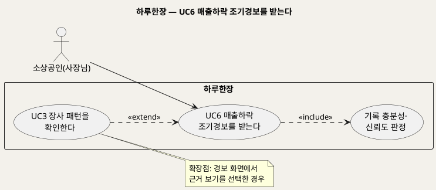
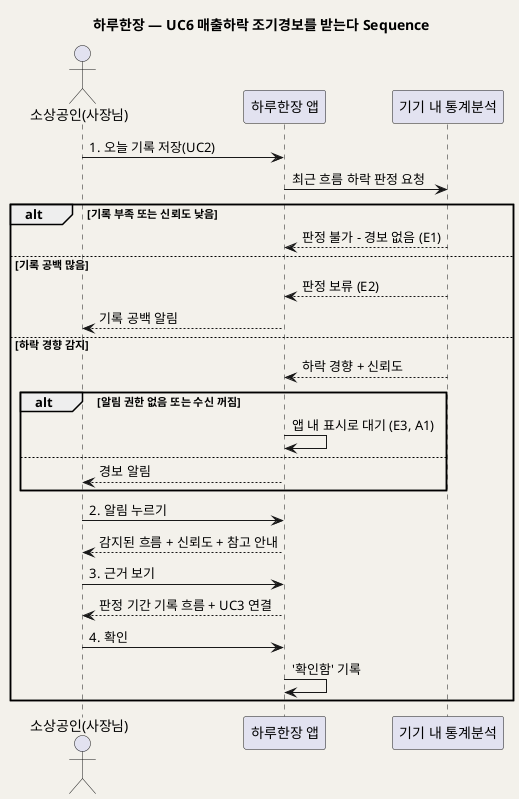

# UseCase 명세 — #6 매출하락 조기경보를 받는다 (하루한장 경보 단계)
**하루한장 · UC6 · UML 2.5.1 표준 (UseCase Diagram + UseCase 기술 + Sequence Diagram)**

---

> **문서 식별**: `design/UC_06_매출하락조기경보.md`
> **작성일**: 2026-10-02 · **표준**: UML 2.5.1 (OMG)
> **원천(SoT)**: `Intent-Specify.md` — 하루한장 서비스 의도명세
> **개요 문서**: `design/UC_00_개요_하루한장.md` §3 UC6 행
> **다이어그램**: 모든 PlantUML 소스는 렌더 검증 완료(HTTP 200 · image/svg+xml). 아래 링크로 브라우저에서 열 수 있다.

---

## 목차

1. 범위·개요
2. UseCase Diagram
3. Actor 카탈로그
4. UseCase 목록 (원천 매핑)
5. UseCase 기술 + Sequence Diagram
6. 업무규칙 종합
7. UML 표준 준수 노트

---

## 1. 범위·개요

최근 기록에서 장사가 나빠지는 경향이 이어지면 사장님에게 미리 알려주는 기능이다. 사장님은 알림을 눌러 어떤 흐름이 감지되었는지와 그 근거를 확인한다.

원천은 가치제안에 "매출 하락 조기 경보"를, 사회적 이점에 "폐업 위험을 조기에 발견하고 대응"을 둔다. 다만 하루한장은 정확한 매출액을 수집하지 않으므로(매출 구간은 선택), [추론] 하락 판정은 오늘장사·손님수 기록을 기본으로 하고 매출 구간이 있으면 보조로 쓴다. 판정 기준(기간·폭)은 원천에 없다.

| 항목 | 값 |
|---|---|
| 대상 시스템 | 하루한장 |
| 상위 프로세스 | 기록 분석 · 알림 |
| 원천 근거 | `[가치제안]` 매출 하락 조기 경보, `[혜택]` 폐업 위험 조기 발견, `[비용]` 알림 기능, `[핵심 장벽]` 기록의 부정확성·분석 결과의 오해 |
| 핵심 UseCase | 1개 (+ include 1, extend 1) |
| 주요 액터 | 소상공인(사장님) |

## 2. UseCase Diagram

**[「UC6 조기경보 UseCase Diagram」 PlantUML 뷰어로 열기](https://plantuml.sumzip.com/plantuml/svg/eNp1kktLw0AUhffzKy51owtFLbgQKWJRcKMrd4KMybQG04kkExRE8BFcWMEuWnw1Ul_YgotUa3WhG3-Ky8zkP3gnClbB3ZBz7vnOncykJ6gr_JINvrGU1E7kdTOp1dXF7dLwGPFWLb5GXVqCZWqsFl3H52besR0X-mayMyPTUz0Ob4WazrrFi1CgtseIzQoChAOuVVwRYFouM4TlcCIsYTPoJcHHdhUW8mMg725Ut66l8A3UZRS_RPHDm3zsyNtXkNG5PKjK8g0h1BBYIaP2D9XeTvz4pMKXfrV7j1GyfDKQAerB_DpnLiEaSnkRgZleYgY2CYDvMYN6KP1lL_J_4Wk4-nvH0SkvQ1DdluwGKmi_P2NAuSGvInkUQHJYUY1aOjc7lx_9zc0CtsHq6GomQUeFwSJPTmu4EBb9wWXJFiHpSjA4mEv5uvPQUC7NhHGYmLC4Yfsmy-WIjtWStmiFbQjGTRQIdwT7_iFOIc0F0Djs0KiMw9e--KUqWx11XFFBHQ3x82vcjgAVvShehgoayV6IBfWAOosIpoOOJpN4wqf0Cc31G4A=)** — 클릭 시 브라우저로 연결됩니다.

#### 다이어그램 쉽게 읽기 (유저 관점)

1. **누가 쓰나** — 사장님이 알림을 받는다. 경보는 앱이 기록을 보고 스스로 판단해 보낸다.
2. **무슨 순서로** — 기록을 저장하면 앱이 최근 흐름을 살피고, 나빠지는 경향이 이어지면 알림을 보낸다. 사장님은 알림을 눌러 내용을 본다.
3. **«include» = 항상 함께** — 경보를 보내기 전에 "기록이 충분해서 믿을 만한지"를 반드시 따진다. 기록이 적으면 경보를 보내지 않는다.
4. **«extend» = 특정 상황에서만** — 더 자세히 보고 싶을 때만 장사 패턴 화면(UC3)으로 이어진다.
5. **Generalization(◁)** — 이 다이어그램에는 쓰지 않았다.

| 기호 | 의미 |
|---|---|
| 사람 모양(actor) | 시스템을 쓰는 사람 |
| 타원(usecase) | 액터가 이루려는 목표 |
| 사각형(rectangle) | 시스템 경계 |
| 점선 «include» | 항상 포함되는 하위 행위 |
| 점선 «extend» | 조건부로 덧붙는 행위 |

## 3. Actor 카탈로그

| 액터 | 구분 | 이 UC에서의 역할 | 원천 근거 |
|---|---|---|---|
| 소상공인(사장님) | Primary | 경보를 받고 근거를 확인해 대응을 결정한다 | `[핵심 파트너]`, `[미션]` 1 생존과 안정 |

## 4. UseCase 목록 (원천 매핑)

| ID | 명칭 | 관계 | 원천 근거 |
|---|---|---|---|
| UC6 | 매출하락 조기경보를 받는다 | 기본 | `[가치제안]` "매출 하락 조기 경보" |
| INC2 | 기록 충분성·신뢰도 판정 | «include» | `[핵심 장벽]` 기록의 부정확성과 부족 |
| UC3 | 장사 패턴을 확인한다 | «extend» (근거 보기) | `[핵심 활동]` 2 |

## 5. UseCase 기술 + Sequence Diagram

### 5.1 UC6 매출하락 조기경보를 받는다

> **쉽게 말하면** — 요즘 '나쁜 날'이나 '손님 적은 날'이 계속 늘면 앱이 "최근 장사가 내려가는 경향이 보여요"라고 미리 알려준다. 단정하지 않고 참고로 알려주며, 기록이 적을 때는 괜히 겁주지 않도록 알리지 않는다.

#### 유스케이스 기술

| 속성 | 내용 |
|---|---|
| **ID** | UC6 (원천 `[가치제안]` 매출 하락 조기 경보) |
| **유스케이스명** | 매출하락 조기경보를 받는다 |
| **액터** | 주: 소상공인(사장님) / 보조: 없음 (스마트폰 알림 수단은 자료 없음 — 확인 필요) |
| **사전조건** | 1) 로그인 상태다. 2) 경보 판정에 필요한 최근 기록이 쌓여 있다. 3) [추론] 경보 수신이 켜져 있다(기본값 켜짐) |
| **사후조건** | 1) 하락 경향이 판정되면 경보가 기록·표시된다. 2) 사장님이 확인한 경보는 '확인함'으로 기록된다. 3) 판정이 불가하면 경보를 보내지 않는다 |
| **기본흐름** | ↓ 별도 기본흐름표 |
| **대체흐름** | A1. [추론] 사장님이 경보 수신을 끔 → 이후 판정은 하되 알림은 보내지 않고 앱 안에서만 표시. A2. 경보 화면에서 근거 보기(«extend» UC3) → 최근 기간이 선택된 장사 패턴 화면으로 이동 |
| **예외흐름** | E1. 기록이 판정 최소 수 미만이거나 신뢰도 낮음 → 경보를 보내지 않음(원천 `[핵심 장벽]` "충분한 기록이 쌓인 경우에만 분석", `[부정적 영향]` 잘못된 분석). E2. 판정 기간에 기록 공백이 많음 → 판정 보류, [추론] 기록 공백 알림으로 대체(원천 `[핵심 장벽]` 사장님의 기록 중단). E3. 스마트폰 알림 권한 거부 → [추론] 앱을 열 때 경보를 표시 |
| **포함/확장** | «include» 기록 충분성·신뢰도 판정 / «extend» UC3 장사 패턴을 확인한다(근거 보기) |
| **우선순위** | Medium — 가치제안·사회적 이점에 명시되나 판정 기준이 원천에 없어 확정 후 구현 가능 |
| **사용빈도** | 판정은 기록 저장 시마다(1일 1회). 경보 발생 빈도는 자료 없음 — 확인 필요 |
| **업무규칙** | BR-HRH-08, BR-HRH-09, BR-HRH-10, BR-HRH-17, BR-HRH-18 |
| **특별 요구사항** | 기기 내 판정(운영비·개인정보). 경보 문구는 불안을 키우지 않는 쉬운 표현(원천 `[부정적 영향]` 비교 스트레스·과도한 의존). 하락 판정 기간·폭은 자료 없음 — 확인 필요 |
| **비고** | 원천 추적성: `[가치제안]` "매출 하락 조기 경보" / `[혜택]` 사회적 이점 "폐업 위험을 조기에 발견하고 대응" / `[비용]` "기록·분석·달력·알림 기능 개발" / `[핵심 장벽]` 기록의 부정확성과 부족, 분석 결과의 오해 / `[핵심 데이터]` "선택적으로 입력하는 매출 구간" — [추론] 매출액 미수집이므로 오늘장사·손님수 중심 판정 |

#### 기본흐름 (Basic Flow)

| 단계 | 액터 행위 | 시스템 행위 |
|:--:|---|---|
| 1 | 사장님이 오늘 기록을 저장한다(UC2) | 기기 안에서 최근 기록의 신뢰도와 하락 경향을 판정하고, 기준을 넘으면 경보를 만들어 알림을 보낸다 |
| 2 | 알림을 누른다 | 감지된 흐름("최근 나쁜 날·손님 적은 날이 늘어나는 경향")과 신뢰도, 참고정보 안내를 보여준다 |
| 3 | 근거 보기를 누른다 | 판정에 쓰인 기간의 기록 흐름을 보여주고 장사 패턴(UC3)으로 이어준다 |
| 4 | 확인을 누른다 | 경보를 '확인함'으로 기록한다 |

#### Sequence Diagram

**[「UC6 조기경보 Sequence Diagram」 PlantUML 뷰어로 열기](https://plantuml.sumzip.com/plantuml/svg/eNp9VN9v0mAUff_-iht8GItCZJg97MEMCXv1YeN5qVAnGSsMSvaKsyFkEMWEatViQGHsQU0ZPySG_TM-9n79H7wfbTdgxJem6XfuOfec03a3qEoFtXSShaJ8eujoBn6_cnSTf-0dPt5mxeOMkpcK0gm8kFLHR4VcSUnHc9lcAR7sRfciiWcLiOIrKZ07yyhH8FLKFmWmZtSsDIuM8LfchGR8G7Df5RNTHLVugHcse2rZ1zc4HGFvBmh9wYsm1rqwL5-WZCUlMyalVNIM8Eqdv3ltD8e8NQ3y8x_EiTVjMwBSEZ6fKXKB0SpqJpXJS4oKgSVtrg_muFg-v4wS4lML8HwETmVsDzWcaFxrzcH7B7EDxubUEHoqZmEHImHgRhcvDKA57LSAt8ukEEzGtzaZgBBSDBKUj0379wycVgMvNfAMO_UGb-vAPzf59U8mZVWfBydl3hkAGg0KAHitjd8sfKfRar94q87AZQ3dLuIR4aRqW2UIgZsh8I8VgkMwEdlkMjXh01NuaBF9_-1_2UQLBk2TGZgfCYgbwc4KFdfreDlzRTxztIPzoQe21eD98hqRJdTDO5MEFUm4jGBP6lSb78QPpGoQHOw_M95vEN7bzqemgt0S35u8ZmLHBKyXRbPBRPQRxCLCjtj0bnLRlxeda4iASpquK8Vvhf39sKphb0Tk6yKaW8eG6de-4FLcW1N72CaiKi17XyMaBnpj7IElilgv4BUl3ltL8xu51UrGo5QbfU_WffInYXA-6fTxsJXsNtzHjn614REykcAuXejX8A8im_ey)** — 클릭 시 브라우저로 연결됩니다.

## 6. 업무규칙 종합

| BR ID | 규칙 | 적용 UC | 근거 |
|---|---|---|---|
| BR-HRH-08 | 충분한 기록이 있을 때만 분석하고 신뢰도를 함께 표시한다 | UC6 (UC3에서 정의) | `[핵심 장벽]` 기록의 부정확성과 부족 |
| BR-HRH-09 | 결과는 원인을 단정하지 않고 '경향'·'참고정보'로 표현한다 | UC6 (UC3에서 정의) | `[핵심 장벽]` 분석 결과의 오해 |
| BR-HRH-10 | 분석은 AI 없이 통계 기준으로 기기 내에서 수행한다 | UC6 (UC3에서 정의) | `[핵심 장벽]` 운영비 부담 |
| BR-HRH-17 | 하락 경보는 정해진 기간 동안 오늘장사·손님수(매출 구간 입력 시 포함)가 기준 이상 나빠진 경우에만 발생한다. 기간·폭 수치는 자료 없음 — 확인 필요 | UC6 | `[가치제안]` 매출 하락 조기 경보, `[핵심 인적자원]` 데이터 담당자의 통계 분석 기준 설계 |
| BR-HRH-18 | [추론] 사장님은 경보 수신을 끌 수 있으며, 끈 경우 앱 안에서만 표시한다 | UC6 | `[부정적 영향]` 기록 부담·비교 스트레스 |

## 7. UML 표준 준수 노트

- 경보는 시스템이 시작하지만 UC1~5와 같은 목표 단위로 보기 위해, 계기(trigger)를 사장님의 기록 저장 행위(1단계)로 두었다.
- 판정은 "기기 내 통계분석" lifeline에서 수행하며, 알림 수단(OS 푸시 등)은 원천에 없어 별도 lifeline으로 만들지 않았다.
- Sequence Diagram의 액터 발신 메시지 1~4는 기본흐름 단계 1~4와 1:1 대응한다. E1~E3, A1은 `alt`로 표현했다.

---

*하루한장 UseCase 명세 · UC6 · UML 2.5.1 · 원천 `Intent-Specify.md`*
