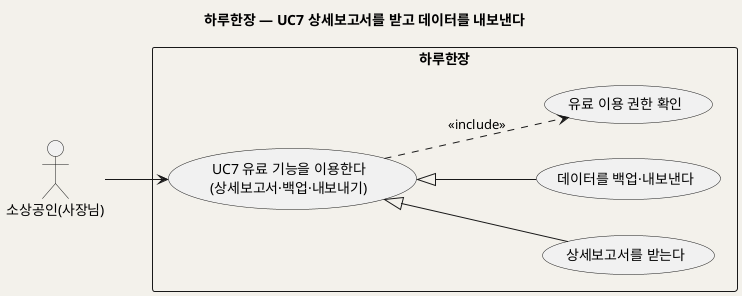
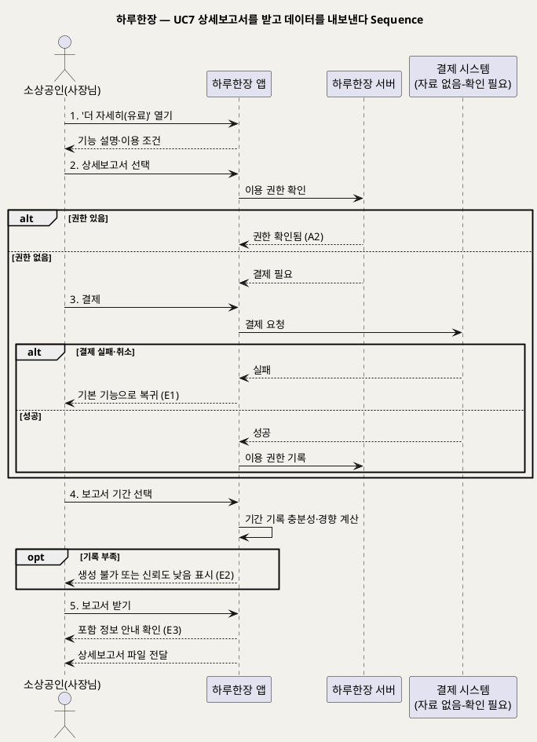

# UseCase 명세 — #7 상세보고서를 받고 데이터를 내보낸다 (하루한장 유료 기능 단계)
**하루한장 · UC7 · UML 2.5.1 표준 (UseCase Diagram + UseCase 기술 + Sequence Diagram)**

---

> **문서 식별**: `design/UC_07_상세보고서및내보내기.md`
> **작성일**: 2026-10-02 · **표준**: UML 2.5.1 (OMG)
> **원천(SoT)**: `Intent-Specify.md` — 하루한장 서비스 의도명세
> **개요 문서**: `design/UC_00_개요_하루한장.md` §3 UC7 행
> **다이어그램**: 모든 PlantUML 소스는 렌더 검증 완료(HTTP 200 · image/svg+xml). 아래 링크로 브라우저에서 열 수 있다.

---

## 목차

1. 범위·개요
2. UseCase Diagram
3. Actor 카탈로그
4. UseCase 목록 (원천 매핑)
5. UseCase 기술 + Sequence Diagram
6. 업무규칙 종합
7. UML 표준 준수 노트

---

## 1. 범위·개요

기본 서비스는 무료로 쓰되, 더 깊은 분석이 필요한 사장님은 선택형 유료 기능으로 상세보고서를 받거나 자신의 기록을 백업·내보내기 할 수 있다.

원천의 수익모델은 "선택형 유료 기능: 상세보고서, 데이터 백업·내보내기 제공"이고, 가치 획득 방식은 "기본 서비스를 무료로 제공해 기록을 축적하고, 이를 개인용 고급분석"으로 연결하는 것이다. 가격·결제 수단·보고서 구성·파일 형식은 원천에 없다.

| 항목 | 값 |
|---|---|
| 대상 시스템 | 하루한장 |
| 상위 프로세스 | 유료 기능 |
| 원천 근거 | `[수익]` 선택형 유료 기능·가치 획득 방식, `[부정적 영향]` 개인정보 유출·데이터 악용 |
| 핵심 UseCase | 1개 (추상) + 구체 2개 (Generalization) + include 1 |
| 주요 액터 | 소상공인(사장님) |

## 2. UseCase Diagram

**[「UC7 유료 기능 UseCase Diagram」 PlantUML 뷰어로 열기](https://plantuml.sumzip.com/plantuml/svg/eNptkkFLAkEUx-_zKR52sYNSFAghiyQJXerULZBxd9XFdTZ2Z_FQQZl1ULspWWkIJhR02NBqD536KB2d8Tv0XAtW6TS8mf___X_vMSmHU5u7ZRNcNTttd8Tgadruyodhdi1BnJLBjqhNy5CjaqlgWy7T0pZp2bCS2cis72yHFE6RalbFYAXIU9PRiannOXALbKNQ5KAZtq5yw2KEG9zUIZwE32ctOEgnQF6cy5ovRuPJqC9rXTH8BOHdYwHi2pO98bTmBXfVMWpE1ReNR0KoypEnIq-aaJ-M3mTPj8rqC_YVjc5qBKgD-xWm24TMCCgrYHokHB-BYwLgOrpKHXwKQLp9MWjCxPdEfSh7NcBwefeMeow8ZNEl0K8P4b3Km0s8f9HGaJ1nY7tw9_9HFPUWNv7T07BhcfKlGD_kyi3EzAeYY8PkvYnoML1t43IC_e5eepOcEhJsBmIxJeCcjZ48icXmEOEqF1TxuBI4YQuSSYOppqvpikJSOtPwA_0AgHIZnA==)** — 클릭 시 브라우저로 연결됩니다.

#### 다이어그램 쉽게 읽기 (유저 관점)

1. **누가 쓰나** — 더 자세한 정리가 필요한 사장님이 선택해서 쓴다.
2. **무슨 순서로** — 유료 기능 메뉴를 열고, 보고서 또는 백업·내보내기를 고른 뒤, 이용 확인을 거쳐 결과를 받는다.
3. **«include» = 항상 함께** — 어떤 유료 기능이든 먼저 "이용 권한이 있는지" 확인한다.
4. **«extend» = 특정 상황에서만** — 이 UC에는 없다.
5. **Generalization(◁)** — "유료 기능 이용"이라는 큰 묶음 아래 "보고서 받기"와 "백업·내보내기" 두 종류가 있다는 뜻이다. 두 기능은 권한 확인 같은 공통 절차를 함께 쓴다.

| 기호 | 의미 |
|---|---|
| 사람 모양(actor) | 시스템을 쓰는 사람 |
| 타원(usecase) | 액터가 이루려는 목표 |
| 사각형(rectangle) | 시스템 경계 |
| 점선 «include» | 항상 포함되는 하위 행위 |
| 속이 빈 삼각형 화살표(◁) | Generalization — 상위 UC의 구체적 변형 |

## 3. Actor 카탈로그

| 액터 | 구분 | 이 UC에서의 역할 | 원천 근거 |
|---|---|---|---|
| 소상공인(사장님) | Primary | 유료 기능을 선택·이용한다 | `[수익]` 선택형 유료 기능 |
| 결제 시스템 | 자료 없음 — 확인 필요 | 원천에 결제 수단·외부 결제시스템이 없어 액터로 확정하지 않음 | — |

## 4. UseCase 목록 (원천 매핑)

| ID | 명칭 | 관계 | 원천 근거 |
|---|---|---|---|
| UC7 | 유료 기능을 이용한다 | 기본(추상) | `[수익]` 선택형 유료 기능 |
| UC7a | 상세보고서를 받는다 | Generalization | `[수익]` "상세보고서" |
| UC7b | 데이터를 백업·내보낸다 | Generalization | `[수익]` "데이터 백업·내보내기" |
| INC4 | 유료 이용 권한 확인 | «include» | `[수익]` 선택형 유료 — [추론] 이용 권한 확인 필요 |

## 5. UseCase 기술 + Sequence Diagram

### 5.1 UC7 상세보고서를 받고 데이터를 내보낸다

> **쉽게 말하면** — 기본 기능은 무료이고, 원하면 돈을 내고 한 달·한 분기 장사를 정리한 상세보고서를 받거나 내 기록을 파일로 백업할 수 있다. 내보내는 파일에는 내 장사 정보가 들어 있으니 꺼내기 전에 한 번 더 확인시켜 준다.

#### 유스케이스 기술

| 속성 | 내용 |
|---|---|
| **ID** | UC7 (원천 `[수익]` 선택형 유료 기능) |
| **유스케이스명** | 상세보고서를 받고 데이터를 내보낸다 |
| **액터** | 주: 소상공인(사장님) / 보조: 결제 시스템(자료 없음 — 확인 필요) |
| **사전조건** | 1) 로그인 상태다. 2) 일일 기록이 1건 이상 있다. 3) 유료 기능의 가격·이용 조건이 정의되어 있다(자료 없음 — 확인 필요) |
| **사후조건** | 1) 유료 이용 권한이 확인·기록된다. 2) 상세보고서 또는 백업·내보내기 파일이 생성되어 사장님에게 전달된다. 3) 기본 무료 기능의 이용 상태는 변하지 않는다 |
| **기본흐름** | ↓ 별도 기본흐름표 |
| **대체흐름** | A1. 백업·내보내기 선택(UC7b) → 4단계에서 기간 대신 백업/파일 내보내기 중 하나를 고르고, 5단계에서 포함 정보 확인 후 파일을 받는다. A2. 이미 이용 권한이 있음 → 3단계를 건너뛴다 |
| **예외흐름** | E1. 결제 실패 또는 취소 → 유료 기능을 제공하지 않고 기본 기능으로 돌아감, 무료 기능은 영향 없음(원천 `[수익]` 기본 서비스 무료). E2. 선택 기간의 기록 부족 → 보고서를 만들지 않거나 '신뢰도 낮음'을 표지에 표시(원천 `[핵심 장벽]` 기록의 부정확성과 부족). E3. 내보낸 파일이 외부에 노출될 위험 → 내보내기 전에 포함 정보를 안내하고 확인을 받음, 확인하지 않으면 중단(원천 `[부정적 영향]` 개인정보 유출, 데이터 악용) |
| **포함/확장** | «include» 유료 이용 권한 확인 / Generalization: UC7a 상세보고서를 받는다, UC7b 데이터를 백업·내보낸다 |
| **우선순위** | Low — 수익모델에만 등장, 기본 기록·분석이 쌓인 뒤 의미 있음 |
| **사용빈도** | 자료 없음 — 확인 필요 |
| **업무규칙** | BR-HRH-08, BR-HRH-09, BR-HRH-19, BR-HRH-20 |
| **특별 요구사항** | 보고서 내용도 경향·참고정보 표현과 신뢰도 표시(원천 `[핵심 장벽]`). 백업 데이터 암호화(BR-HRH-03). 가격·결제 수단·보고서 구성·파일 형식은 자료 없음 — 확인 필요 |
| **비고** | 원천 추적성: `[수익]` "선택형 유료 기능: 상세보고서, 데이터 백업·내보내기 제공", 가치 획득 방식 "기본 서비스를 무료로 제공해 기록을 축적하고, 이를 개인용 고급분석" / `[비용]` 서버 운영비(데이터 저장, 백업) / `[부정적 영향]` 개인정보 유출, 데이터 악용(평가·대출·보험) |

#### 기본흐름 (Basic Flow)

| 단계 | 액터 행위 | 시스템 행위 |
|:--:|---|---|
| 1 | 사장님이 '더 자세히(유료)' 메뉴를 연다 | 상세보고서와 백업·내보내기 기능의 설명과 이용 조건을 보여준다 |
| 2 | 상세보고서를 고른다 | 이용 권한이 있는지 확인한다 |
| 3 | 이용 조건을 확인하고 결제한다 | 결제 결과를 받아 이용 권한을 기록한다 |
| 4 | 보고서 기간을 고른다 | 해당 기간 기록의 충분성을 확인하고 경향·신뢰도를 포함한 상세보고서를 만든다 |
| 5 | 보고서 받기를 누른다 | 보고서에 담긴 정보를 안내하고 파일로 전달한다 |

#### Sequence Diagram

**[「UC7 유료 기능 Sequence Diagram」 PlantUML 뷰어로 열기](https://plantuml.sumzip.com/plantuml/svg/eNp9VE1PGlEU3b9fcUMXwgJStI2JC6M1um1T0yZNmpgpTi0RB4QxbimOhsgYaQKttTMEKibY0Gb4EFjQjT-ly3n3_YfemQGRj7hgMe-ec965597HSkqVkurBXgxS8v6WKF7wq5ooGli63nq6yFK7USUhJaU9-CBFdneS8QNley0eiyfhycbCRnj9xQNE6pO0HT-MKjvwUYqlZKZG1ZgMDxXhX7oAb9YWAY8-o9bjrbbdKqNm8Os-cOsHfQA_s9BsC81yzzJtwvBMj-eqsCnvH8hKRGZMiqhkwIcnOunYrVs0e37M1OkCnrsI-EBKwctDRU4y8qVGI9GEpKjgGzOCxYaLW00kHkORtabmAjffvh4H2k0LywZgzsDTqjg23it-LOX5lQ747QRNPSi-F8kY9a_hZcFz9Wr1HWOuNQguO3fDEoRDMMfPCkBkikSUsn40yiQTmCOhtt2zmIMLEt4jLgGd8VPHXJX_Or7rUlx4eQNYsexGe1J9PjSZNfHK4sj0VJedvgg20LA7OnUOnnMmxdThCZay1BIDFx68Vx_D83wN_KvzASbT8O-JbhbTRC88LxuqTrheCA0QVBr4pOhGPCJh8zcVXYvDQVSFXqM4ujVaDKqByxnd6QHcwqxEW71BsGj0ecUA3rq1u2nwr4cDxHF7Qq1B2zZLelR4JFZHvmI6Yso2c34TXT8LwWhKBLYtbWJYg_C8kicH2LnhHY0c3HXt5l_x9RrsloYZi8UT6hDDO2msNNh043hkEpPqWdtKA7_I81PaxFyZ_7T4uUbv7w9ND8QXg9aconCGO-37-UPfzjOesbPivC6KNcBykaD0-rL0tAd7Q7oLATbtbHxrha6j2ScBjefqbIVs0F_Wf6LHRpI=)** — 클릭 시 브라우저로 연결됩니다.

## 6. 업무규칙 종합

| BR ID | 규칙 | 적용 UC | 근거 |
|---|---|---|---|
| BR-HRH-08 | 충분한 기록이 있을 때만 분석하고 신뢰도를 함께 표시한다 | UC7 (UC3에서 정의) | `[핵심 장벽]` 기록의 부정확성과 부족 |
| BR-HRH-09 | 결과는 원인을 단정하지 않고 '경향'·'참고정보'로 표현한다 | UC7 (UC3에서 정의) | `[핵심 장벽]` 분석 결과의 오해 |
| BR-HRH-19 | 기록·기본 분석·달력·비교는 무료로 제공하고, 유료 기능은 상세보고서와 데이터 백업·내보내기로 한정한다. 유료 결제 실패가 무료 기능을 막지 않는다 | UC7 | `[수익]` 선택형 유료 기능, 가치 획득 방식 |
| BR-HRH-20 | [추론] 데이터를 기기 밖으로 내보내기 전에 포함 정보를 안내하고 사장님의 확인을 받는다 | UC7 | `[부정적 영향]` 개인정보 유출, 데이터 악용 |

## 7. UML 표준 준수 노트

- 상세보고서와 백업·내보내기는 같은 목적(유료 고급 기능)의 변형이므로 추상 UC7 아래 Generalization(◁)으로 통합했다.
- 결제 시스템은 원천에 근거가 없어 Actor로 확정하지 않고, Sequence에서만 '자료 없음 — 확인 필요' 표지를 단 lifeline으로 두었다.
- Sequence Diagram의 액터 발신 메시지 1~5는 기본흐름 단계 1~5와 1:1 대응한다(3단계는 권한 없음 분기 안). E1~E3, A2는 `alt`/`opt`로 표현했다. 백업·내보내기(A1)는 4~5단계의 선택만 달라 같은 구조를 따른다.

---

*하루한장 UseCase 명세 · UC7 · UML 2.5.1 · 원천 `Intent-Specify.md`*
