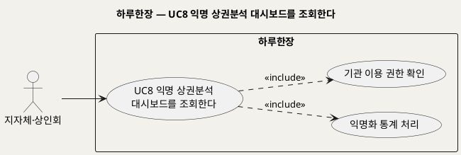
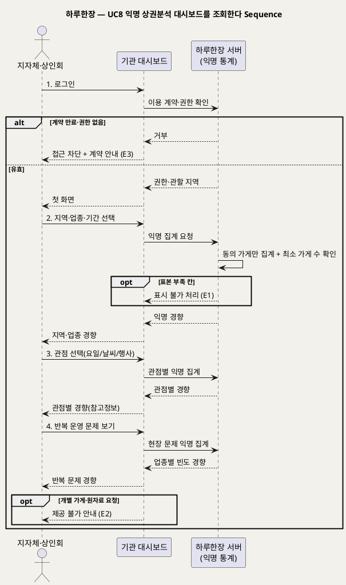

# UseCase 명세 — #8 익명 상권분석 대시보드를 조회한다 (하루한장 기관 서비스 단계)
**하루한장 · UC8 · UML 2.5.1 표준 (UseCase Diagram + UseCase 기술 + Sequence Diagram)**

---

> **문서 식별**: `design/UC_08_기관대시보드조회.md`
> **작성일**: 2026-10-02 · **표준**: UML 2.5.1 (OMG)
> **원천(SoT)**: `Intent-Specify.md` — 하루한장 서비스 의도명세
> **개요 문서**: `design/UC_00_개요_하루한장.md` §3 UC8 행
> **다이어그램**: 모든 PlantUML 소스는 렌더 검증 완료(HTTP 200 · image/svg+xml). 아래 링크로 브라우저에서 열 수 있다.

---

## 목차

1. 범위·개요
2. UseCase Diagram
3. Actor 카탈로그
4. UseCase 목록 (원천 매핑)
5. UseCase 기술 + Sequence Diagram
6. 업무규칙 종합
7. UML 표준 준수 노트

---

## 1. 범위·개요

이용료를 낸 지자체·상인회가 관할 지역의 업종별 장사 흐름을 익명 통계로 보는 대시보드다. 개별 가게는 드러나지 않으며, 지역·업종 단위의 경향과 반복 운영 문제만 제공한다.

원천은 수익모델로 "지자체·상인회에 익명 상권분석 대시보드 제공"을, 사회적·경제적 이점으로 "지역·업종별 문제를 반영한 맞춤형 지원", "효과적인 공공지원 예산 집행"을 든다. 동시에 부정적 영향으로 "기관·기업이 평가, 대출, 보험 등에 불리하게 활용할 가능성"을 경고하므로, 제공 범위를 익명 집계로 엄격히 제한한다.

| 항목 | 값 |
|---|---|
| 대상 시스템 | 하루한장 |
| 상위 프로세스 | 기관 서비스 |
| 원천 근거 | `[수익]` 기관 이용료, `[혜택]` 맞춤형 지원·공공지원 예산 집행, `[부정적 영향]` 데이터 악용·개인정보 유출 |
| 핵심 UseCase | 1개 (+ include 1) |
| 주요 액터 | 지자체·상인회 |

## 2. UseCase Diagram

**[「UC8 기관 대시보드 UseCase Diagram」 PlantUML 뷰어로 열기](https://plantuml.sumzip.com/plantuml/svg/eNp9kU1LAkEYx-_zKR62s1KIICGLJAld6tQtkGl3XQfX2didpUMEG1kXPQQpqKggZW90EF3NQ6c-Ssed2e_QuBEsQZ3_L7__w1NwGXaYV7fA08pRp8vvnqLOQIwm5c0ccmuEnmAH1-EYazXTsT2qF23LdmCjlClt7e4kHG4V6_YpoSZUsOUayDIqDJgNDjGrDHTiGBojNkWMMMuAJAk-_TYcFnMghgv-cgXi8iJctviyIRpD4C1fNAd8HvDbAZ-8gxhPo35LBnnzHiGsMTlGEY--GN2IWfDxJsNiuJIWBbALB46J0JqMqSmpShKrwBkC8FxDw66U_hhwRP9bEENkMln0XRL12hBdL8J5A8Ssyx9eY-vefjGT9IaraRj4khuI_jNIqKyFqNeRJ_z4s-gcIXkHpFJqjFoPTafVuAu2IZ8nVLM83VDVpJT9JRUMqssvfwGAYuRN)** — 클릭 시 브라우저로 연결됩니다.

#### 다이어그램 쉽게 읽기 (유저 관점)

1. **누가 쓰나** — 지자체나 상인회 담당자가 지역 상권 흐름을 볼 때 쓴다. 사장님 개인용 화면이 아니다.
2. **무슨 순서로** — 대시보드에 들어가 지역·업종·기간을 고르고, 관점별 경향과 반복 문제를 본다.
3. **«include» = 항상 함께** — 들어올 때마다 이용 계약이 유효한지 확인하고, 보여주는 모든 숫자는 익명으로 묶은 통계뿐이다.
4. **«extend» = 특정 상황에서만** — 이 UC에는 없다.
5. **Generalization(◁)** — 이 다이어그램에는 쓰지 않았다.

| 기호 | 의미 |
|---|---|
| 사람 모양(actor) | 시스템을 쓰는 사람(기관 담당자) |
| 타원(usecase) | 액터가 이루려는 목표 |
| 사각형(rectangle) | 시스템 경계 |
| 점선 «include» | 항상 포함되는 하위 행위 |

## 3. Actor 카탈로그

| 액터 | 구분 | 이 UC에서의 역할 | 원천 근거 |
|---|---|---|---|
| 지자체·상인회 | Primary | 이용료를 내고 익명 상권분석을 조회해 지원 정책에 참고한다 | `[수익]` 기관 이용료 |

## 4. UseCase 목록 (원천 매핑)

| ID | 명칭 | 관계 | 원천 근거 |
|---|---|---|---|
| UC8 | 익명 상권분석 대시보드를 조회한다 | 기본 | `[수익]` "지자체·상인회에 익명 상권분석 대시보드 제공" |
| INC3 | 익명화 통계 처리 | «include» | `[핵심 장벽]` 익명화, `[비용]` 익명 통계 처리 |
| INC5 | 기관 이용 권한 확인 | «include» | `[수익]` 기관 이용료 — [추론] 계약 기관만 접근 |

## 5. UseCase 기술 + Sequence Diagram

### 5.1 UC8 익명 상권분석 대시보드를 조회한다

> **쉽게 말하면** — 구청이나 상인회가 "우리 동네 음식점들은 요즘 어떤 흐름인지, 어떤 문제가 반복되는지"를 묶음 통계로 보는 화면이다. 어느 가게 이야기인지는 절대 알 수 없게 되어 있다.

#### 유스케이스 기술

| 속성 | 내용 |
|---|---|
| **ID** | UC8 (원천 `[수익]` 기관 이용료) |
| **유스케이스명** | 익명 상권분석 대시보드를 조회한다 |
| **액터** | 주: 지자체·상인회 / 보조: 없음 |
| **사전조건** | 1) 기관이 이용 계약을 맺고 계정을 받았다(계약·요금 조건은 자료 없음 — 확인 필요). 2) 기관 계정으로 로그인 상태다. 3) 조회 범위(관할 지역)가 계정에 정해져 있다 [추론] |
| **사후조건** | 1) 선택한 지역·업종·기간의 익명 경향이 표시된다. 2) 개별 가게 식별 정보는 표시·전송되지 않는다. 3) [추론] 조회 이력이 기록된다 |
| **기본흐름** | ↓ 별도 기본흐름표 |
| **대체흐름** | A1. [추론] 관할 밖 지역 선택 → 선택 불가로 표시하고 관할 지역만 고르게 한다. A2. 업종을 고르지 않음 → 지역 전체 업종 합계 경향을 보여준다 |
| **예외흐름** | E1. 선택한 지역·업종 조합의 참여 가게 수가 최소 기준 미만 → 해당 칸을 '표시 불가(표본 부족)'로 처리(원천 `[핵심 장벽]` 익명화, BR-HRH-14). E2. 개별 가게·원자료(가게별 기록) 요청 → 거부하고 제공 범위를 안내(원천 `[부정적 영향]` 데이터 악용). E3. 이용 계약 만료·권한 없음 → 접근 차단과 계약 안내 |
| **포함/확장** | «include» 익명화 통계 처리 / «include» 기관 이용 권한 확인 |
| **우선순위** | Low — 수익모델이지만 참여 가게가 충분히 쌓인 뒤에만 가치가 생김 |
| **사용빈도** | 자료 없음 — 확인 필요 |
| **업무규칙** | BR-HRH-09, BR-HRH-14, BR-HRH-16, BR-HRH-21, BR-HRH-22 |
| **특별 요구사항** | 익명 집계만 제공(보안·개인정보). 기관용 화면(웹 등) 형태는 자료 없음 — 확인 필요. 이용약관 법률 검토(원천 `[비용]` 보안·법률비) |
| **비고** | 원천 추적성: `[수익]` "기관 이용료: 지자체·상인회에 익명 상권분석 대시보드 제공" / `[혜택]` "지역·업종별 문제를 반영한 맞춤형 지원 가능", "효과적인 공공지원 예산 집행" / `[핵심 데이터]` 반복되는 운영 문제, 같은 지역·업종과 비교한 장사 흐름 / `[부정적 영향]` 데이터 악용, 개인정보 유출 |

#### 기본흐름 (Basic Flow)

| 단계 | 액터 행위 | 시스템 행위 |
|:--:|---|---|
| 1 | 기관 담당자가 대시보드에 로그인한다 | 이용 계약과 권한·관할 지역을 확인하고 대시보드 첫 화면을 보여준다 |
| 2 | 지역·업종·기간을 고른다 | 익명 통계 동의 가게의 기록만 모아 최소 가게 수 기준을 확인하고 익명 경향(좋은/보통/나쁜 비율, 손님수 경향)을 보여준다 |
| 3 | 관점(요일·날씨·지역행사)을 고른다 | 관점별 익명 경향을 '경향'·'참고정보' 표현으로 보여준다 |
| 4 | 반복 운영 문제 보기를 고른다 | 재료 부족·직원 결근 등 현장 문제의 업종별 빈도 경향을 익명으로 보여준다 |

#### Sequence Diagram

**[「UC8 기관 대시보드 Sequence Diagram」 PlantUML 뷰어로 열기](https://plantuml.sumzip.com/plantuml/svg/eNqFVDFP22AQ3f0rTnRJhIACHVCHipaCulUqaqdKyA0ujQgOJEZdDRiUCksENQaT2siUUkILkkkcEiRY-Ckdv-_8H3p27IQ0QR2S4bt37969u_NkXhFzyupSBvLSypxvmPy44hsWHp7MPZ4Q8otpeVnMiUvwQUwtLuSyq_L8VDaTzcGjmfGZ0ekX9xD5T-J89nNaXoCPYiYvCUpayUhwnxH-qCV4OzUBaNf5r03AjTV2pfMrDTUbuK7itsVrHv9q8ZMbwCPXL-uUyLd_wKy0sirJKUkQxJRC1QfwVMXDIla9uwaxoN0k7ACIeXidWxBIj5JOpZdFWYEB1nSZp3bRh8CXz2dfdSO7pKJm8ar2Xk5EWv2tOqtpyTB19t0bQaBCMPQspIGnMDoM_MhijSZJEcI3ihGOQmh7WD4Dykbj9q5BHVMJ8A-MACpmlCgC_FTnx3obgPtbaOsChCxDnUrs0uVXKr23qlAgUEJlnF3WINvcCt-uwGDMikaBr3uQmB5PChKNBdBy_HKlD29Ylsp7qm84EBi8f9GnTPU3aS_xM49i3R6MDUdZNJP9Tfy-SWRkvquRmY6_YbfJOs601uB0l8QClktYvYiFxRi-c4C2CcxVWVUni2L0IGDdwi09igAWzNhTgOyyAv4uTbsJ5BUeXQJeB-89TROItoJABaKh3kz-85y8Gk0SWJLne12KJLPqrb930sedrv47sG6jxoeBXEanGBmTCFq3b0b4uoOlyoi_9wXXz5M9drVyeGDVfeP6jLINfEjnv4gEuk1Wc9Ax6EKSPYKf0Ha7Jq_VaUgemmvAz5vokG81jybcI9Q3teCEItB_xLasCqTw6wLfeVhzpCBibaOCWTPXCnsJV4Hc_1akjwMdU2en-pyLxQK2aPLxlYzFkw9-k_RHX8a_p4ZwRg==)** — 클릭 시 브라우저로 연결됩니다.

## 6. 업무규칙 종합

| BR ID | 규칙 | 적용 UC | 근거 |
|---|---|---|---|
| BR-HRH-09 | 결과는 원인을 단정하지 않고 '경향'·'참고정보'로 표현한다 | UC8 (UC3에서 정의) | `[핵심 장벽]` 분석 결과의 오해 |
| BR-HRH-14 | 익명 통계는 참여 가게 수가 최소 기준 이상일 때만 제공한다(수치 자료 없음 — 확인 필요) | UC8 (UC5에서 정의) | `[핵심 장벽]` 익명화 |
| BR-HRH-16 | [추론] 익명 통계 집계에는 동의한 가게의 기록만 포함한다 | UC8 (UC5에서 정의) | `[핵심 장벽]` 사용자 동의 |
| BR-HRH-21 | 기관에는 지역·업종 단위 익명 집계만 제공하고, 개별 가게 기록·식별 정보·원자료는 제공하지 않는다 | UC8 | `[수익]` "익명 상권분석", `[부정적 영향]` 개인정보 유출 |
| BR-HRH-22 | [추론] 기관 이용약관에 평가·대출·보험 등 소상공인에게 불리한 목적의 이용 금지를 명시한다 | UC8 | `[부정적 영향]` 데이터 악용 |

## 7. UML 표준 준수 노트

- 지자체·상인회는 이 UC를 시작하는 주체이므로 Primary actor로 두었다(외부 데이터 제공 기관인 "지자체 지역행사·상권정보" Secondary actor와 구분).
- 집계 책임을 드러내기 위해 "하루한장 서버(익명 통계)"를 별도 lifeline으로 분리했다.
- Sequence Diagram의 액터 발신 메시지 1~4는 기본흐름 단계 1~4와 1:1 대응한다. E1~E3은 `alt`/`opt`로 표현했다.

---

*하루한장 UseCase 명세 · UC8 · UML 2.5.1 · 원천 `Intent-Specify.md`*
