# 하루한장 사용자 매뉴얼

**하루 장사, 한 장에 담다** — 마감 후 30초, 버튼 세 묶음으로 오늘 장사를 남기면 쌓인 기록을 쉬운 문장과 달력으로 돌려드립니다.

> 접속 주소: **https://p2.sumzip.com**
> 기준일: 2026-10-03 · 현재 공개 주소는 **체험용**이며 모든 가게와 기록은 가상의 데이터입니다.

---

## 목차

1. 처음 시작하기 (누가 무엇을 쓰나요)
2. 사장님 — 가게 시작하기
3. 사장님 — 오늘 장사 30초 기록
4. 사장님 — 장사 달력
5. 사장님 — 우리 가게 흐름(패턴)
6. 사장님 — 장사 흐름 조기 경보
7. 사장님 — 동네 흐름 비교
8. 사장님 — 더 자세히(유료): 상세보고서·내보내기
9. 사장님 — 설정·탈퇴
10. 지자체·상인회 — 상권 대시보드
11. 운영자 — 운영 콘솔
12. 화면이 막혔을 때 (막힘 안내 한눈에 보기)
13. 자주 묻는 질문
14. 체험 계정 안내 (아이디·비밀번호 전체)

---

## 1. 처음 시작하기

하루한장은 세 종류의 사용자가 씁니다.

| 사용자 | 하는 일 | 쓰는 기기 | 들어가는 곳 |
|---|---|---|---|
| **사장님** | 매일 장사를 기록하고, 흐름·달력·동네 비교를 봅니다 | 스마트폰 · 태블릿 · PC | 첫 화면 아래 「사장님 아이디로 로그인」(또는 체험 가게 버튼) |
| **지자체·상인회 담당자** | 관할 지역의 익명 상권 흐름을 봅니다 | 컴퓨터 | 첫 화면 아래 「지자체·상인회 로그인」 |
| **운영자** | 기준값·코드·기관 계약·감사·운영 인력을 관리합니다 | 컴퓨터 | 첫 화면 아래 「운영자 로그인」 |

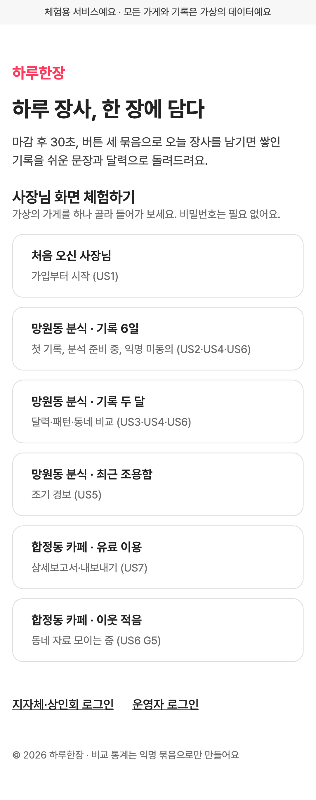

> 체험용 아이디·비밀번호 전체는 [14. 체험 계정 안내](#14-체험-계정-안내-아이디비밀번호-전체)에 있습니다. 모든 계정의 비밀번호는 `hrh1234` 입니다.

### 화면 크기에 맞춰 바뀌어요 (반응형)

| 화면 | 메뉴 위치 | 배치 |
|---|---|---|
| 스마트폰 (744px 미만) | 아래쪽 탭바(오늘 · 달력 · 패턴 · 비교) | 한 줄로 쌓기 |
| 태블릿 (744~1127px) | 위쪽 메뉴(오늘 기록 · 장사 달력 · 우리 가게 흐름 · 동네 비교 · 더 자세히) | 카드 2열, 달력과 상세를 나란히 |
| PC (1128px 이상) | 위쪽 메뉴 | 오늘 기록은 입력과 「고른 내용 · 저장」 패널을 나란히, 흐름 카드 3열, 내용 폭 최대 1280px |

### 스마트폰 홈 화면에 추가하기 (권장)

하루한장은 앱처럼 설치해 쓸 수 있습니다. 설치하면 인터넷이 끊겨도 기록을 저장할 수 있습니다.

- **안드로이드(크롬)**: 주소창 오른쪽 메뉴(⋮) → 「홈 화면에 추가」 또는 「앱 설치」
- **아이폰(사파리)**: 아래쪽 공유 버튼 → 「홈 화면에 추가」

### 화면 위쪽 진행 표시 읽는 법

사장님 화면 맨 위에는 지금 어디까지 왔는지 보여 주는 네 칸이 있습니다.

`1 시작 완료 › 2 오늘 기록 › 3 돌아보기 › 4 비교`

- 검은 글자: 완료되었거나 쓸 수 있는 칸
- **빨간 글자**: 아직 막혀 있는 칸 (예: `기록 6일 - 준비 중 G3`, `비교 - 잠김 G4`)
- 테두리가 있는 칸: 지금 보고 있는 화면
- 막힌 칸을 누르면 그 화면으로 가서 **왜 막혔는지, 어떻게 풀리는지** 볼 수 있습니다.

---

## 2. 사장님 — 가게 시작하기

처음 들어오면 두 단계를 거칩니다. 마지막에 「완료」를 누를 때 **한 번에** 저장되며, 그 전에는 아무 정보도 저장하지 않습니다.

### 단계 1 — 안내 확인과 동의

1. 「이런 정보만 받아요」「이렇게 지켜요」를 읽습니다.
2. **위 내용을 확인했고 동의해요 (필수)** 에 체크합니다.
3. 같은 동네 익명 통계에 참여하려면 **(선택)** 항목에도 체크합니다. 나중에 설정에서 바꿀 수 있습니다.
4. 「동의하고 시작」을 누릅니다.

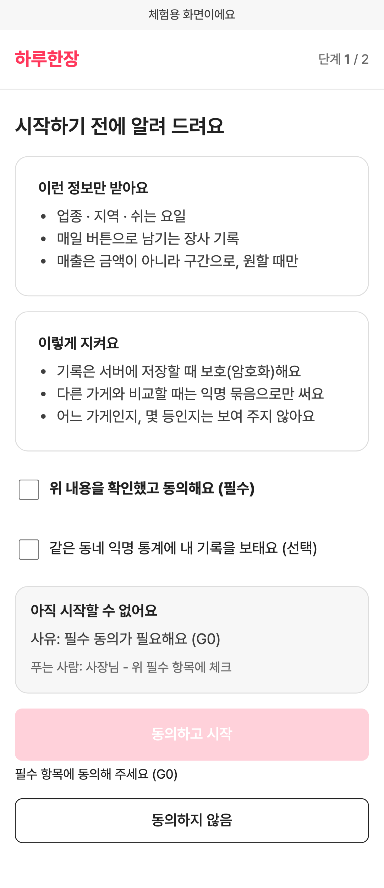

- 필수 동의를 하지 않으면 「동의하고 시작」 버튼이 꺼져 있고, 바로 아래에 이유가 표시됩니다.
- 「동의하지 않음」을 누르면 가입이 멈추고 **아무 정보도 남지 않습니다**.

### 단계 2 — 가게 정보

1. **업종**을 큰 버튼에서 하나 고릅니다.
2. **지역**은 시·구를 먼저 고른 뒤 동을 고릅니다.
3. **쉬는 요일**은 여러 개 고를 수 있고, 나중에 해도 됩니다.
4. 「완료」를 누르면 바로 오늘 기록 화면으로 갑니다.

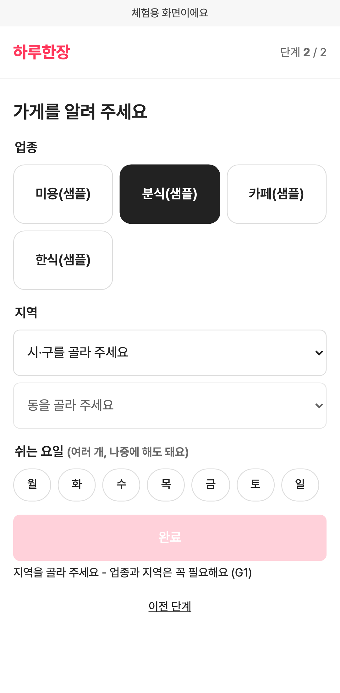

- 업종과 지역은 꼭 필요합니다. 빠지면 「완료」가 꺼지고 "지역을 골라 주세요" 같은 안내가 나옵니다.
- 저장에 실패하면 입력한 내용은 그대로 남아 있으니 「다시 시도」를 누르세요.

---

## 3. 사장님 — 오늘 장사 30초 기록

앱을 열면 바로 오늘 기록 화면입니다. 버튼만 누르면 됩니다.

| 묶음 | 고르는 것 | 필수 |
|---|---|:--:|
| 오늘장사 | 좋음 ● / 보통 ○ / 나쁨 – 중 하나 | 필수 |
| 손님 수 | 많음 / 평소 / 적음 중 하나 | 필수 |
| 특별한 일 | 비 · 할인행사 · 신메뉴 · SNS 게시 · 단체손님 · 재료 부족 · 직원 결근 (여러 개, 없으면 넘어감) | 선택 |
| 매출 구간 | 「매출 구간도 남길래요」를 눌러 구간 하나 (금액이 아니라 구간) | 선택 |

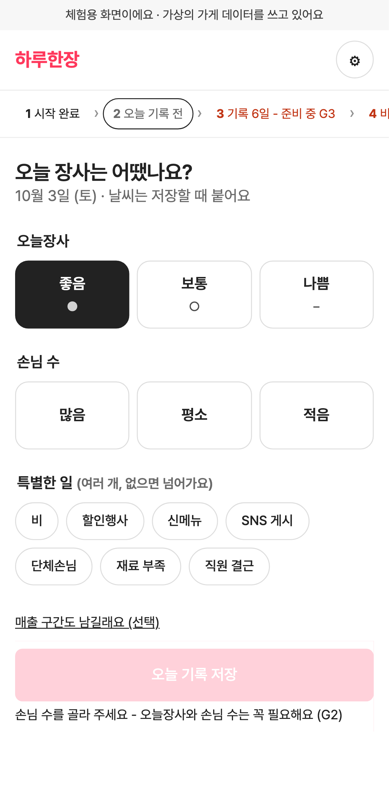

「오늘 기록 저장」을 누르면 곧바로 **「오늘 한 장 완료」** 가 나옵니다.

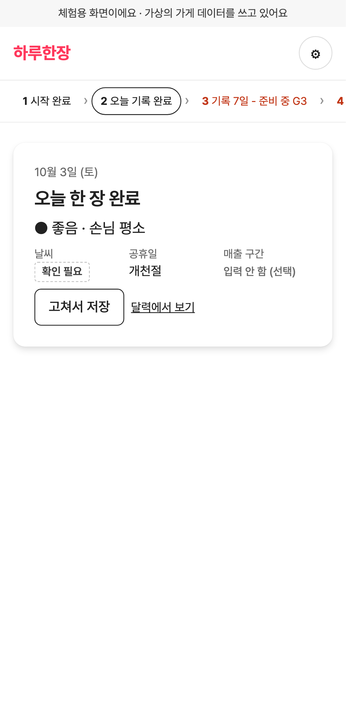

- **날씨·공휴일·지역행사는 입력하지 않아도** 자동으로 붙습니다.
- 날씨 정보는 기상청 자료가 다음 날 나오기 때문에 처음에는 **'확인 필요'** 로 보이다가, 하루 두 번(오전 6시 30분, 낮 12시 30분) 자동으로 다시 확인해 채워집니다. 추측한 값으로 채우지 않습니다.
- 이미 기록한 날에 다시 들어오면 고른 내용이 채워져 있고, 「고쳐서 저장」으로 바꿀 수 있습니다.
- 지난 날짜를 빼먹었다면 달력에서 그 날을 누르면 그 날짜로 기록할 수 있습니다. 미래 날짜는 기록할 수 없습니다.

### 인터넷이 끊겼을 때

화면 맨 위에 "인터넷 연결이 없어요…" 가 보여도 그대로 저장하세요. **기기에 보관**했다가 연결되면 자동으로 보냅니다.

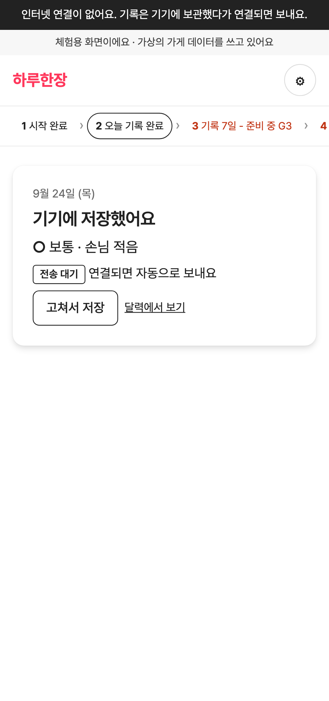

- 저장하면 **「기기에 저장했어요」** 와 **전송 대기** 표시가 나옵니다.
- 연결되면 저절로 전송되고, 진행 표시 2칸이 「오늘 기록 완료」로 바뀝니다.
- 주의: 전송되기 전에 앱을 지우거나 기기를 바꾸면 그 기록은 사라질 수 있습니다.

---

## 4. 사장님 — 장사 달력

아래 탭에서 **달력**을 누릅니다. 기록이 적어도 언제든 볼 수 있습니다.

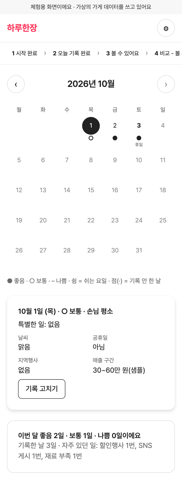

| 날짜 아래 표시 | 뜻 |
|---|---|
| ● | 좋음 |
| ○ | 보통 |
| – | 나쁨 |
| 쉼 | 쉬는 요일 |
| · (점) | 기록 안 한 날 |
| 휴일 / 행사 | 공휴일 또는 지역행사가 있던 날 |

- **기록한 날짜를 누르면** 그날의 한 장(손님 수·특별한 일·날씨·공휴일·지역행사·매출 구간)이 보입니다. 「기록 고치기」로 수정할 수 있습니다.
- **기록 안 한 날을 누르면** 그 날짜로 기록 화면이 열립니다.
- 「이번 달 요약 보기」를 누르면 좋음·보통·나쁨 날 수와 자주 있었던 특별한 일을 알려 줍니다.
- 인터넷이 끊겼을 때는 기기에 남아 있는 기록으로 보여 주며 "최신 아닐 수 있어요" 가 함께 표시됩니다.

---

## 5. 사장님 — 우리 가게 흐름(패턴)

아래 탭에서 **패턴**을 누릅니다.

### 기록이 아직 적을 때

기록이 기준(현재 체험 기준 14일)보다 적으면 결과 대신 안내가 나옵니다. 관점 탭도 눌리지 않습니다.

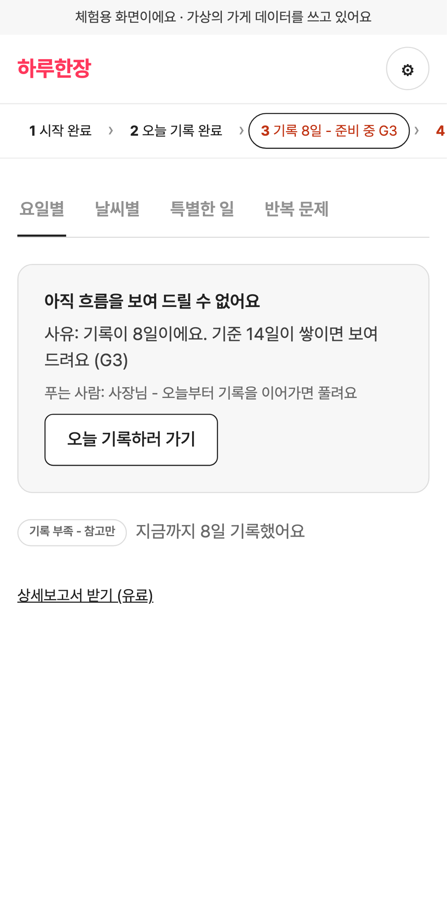

「오늘 기록하러 가기」로 기록을 이어 가면 기준을 넘는 날 자동으로 열립니다.

### 기록이 충분할 때

네 가지 관점으로 흐름을 볼 수 있습니다.

| 관점 | 알려 주는 것 |
|---|---|
| 요일별 | 좋은 날이 많은 요일 (예: "금요일에 좋은 날이 많은 경향이 있어요") |
| 날씨별 | 비 오는 날 손님 흐름 (날씨 '확인 필요'인 날은 빼고 계산) |
| 특별한 일 | 할인행사·신메뉴 등이 있던 날과 다른 날의 차이 |
| 반복 문제 | 재료 부족·직원 결근이 되풀이되는 요일 |

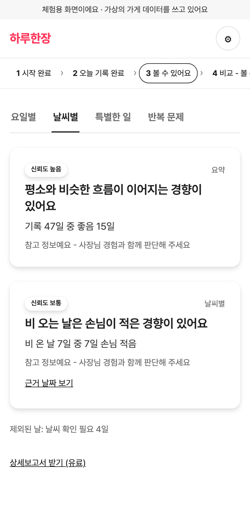

각 카드에는 항상 세 가지가 함께 나옵니다.

1. **경향 문장** — "~하는 경향이 있어요" 처럼 말합니다. 원인을 단정하지 않습니다.
2. **신뢰도 배지** — 신뢰도 높음 / 보통 / 낮음 / 기록 부족 - 참고만
3. **참고 안내** — "참고 정보예요 - 사장님 경험과 함께 판단해 주세요"

「근거 날짜 보기」를 누르면 그 경향의 근거가 된 날짜가 달력에 테두리로 표시됩니다.

- 표본이 너무 적은 관점은 결과를 숨기거나 "신뢰도 낮음"으로 보여 줍니다.
- 요일별을 처음 볼 때 쉬는 요일을 입력하지 않았다면 입력을 요청합니다.

---

## 6. 사장님 — 장사 흐름 조기 경보

기록을 저장할 때마다 최근 흐름을 기기 안에서 살펴, **'나쁨'이나 '손님 적음'이 이전보다 눈에 띄게 늘어나는 경향**이 보이면 알려 드립니다.

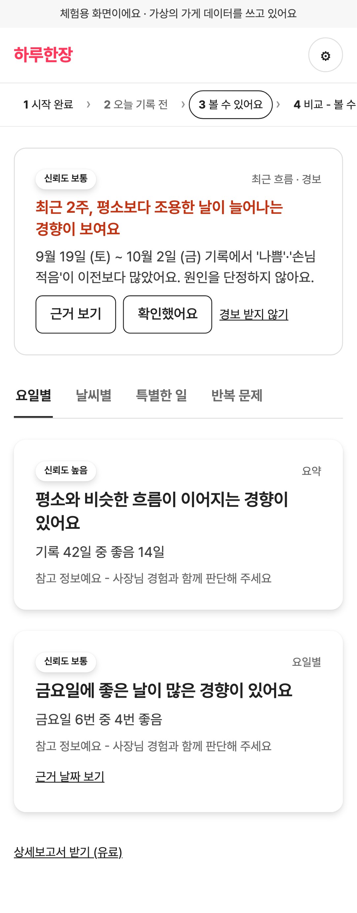

- 경보는 **알림** 또는 **앱 안 카드**로 옵니다. 알림을 끄셨거나 휴대폰이 알림을 지원하지 않으면 패턴 화면 위쪽에 카드로 보입니다.
- 「근거 보기」: 판정에 쓰인 기간을 달력에서 보여 줍니다.
- 「확인했어요」: 카드가 접히고 다시 새 경보로 뜨지 않습니다.
- 「경보 받지 않기」: 이후에는 알림을 보내지 않고 앱 안에서만 보여 줍니다.
- 기록이 기준보다 적거나 빼먹은 날이 많으면 경보를 보내지 않고, 대신 "기록이 이어지면 흐름을 더 잘 볼 수 있어요" 라고 안내합니다.

---

## 7. 사장님 — 동네 흐름 비교

아래 탭에서 **비교**를 누릅니다. 같은 동네·같은 업종 가게들의 흐름을 **익명 묶음**으로 내 가게와 나란히 보여 줍니다. **어느 가게인지, 몇 등인지는 절대 보여 주지 않습니다.**

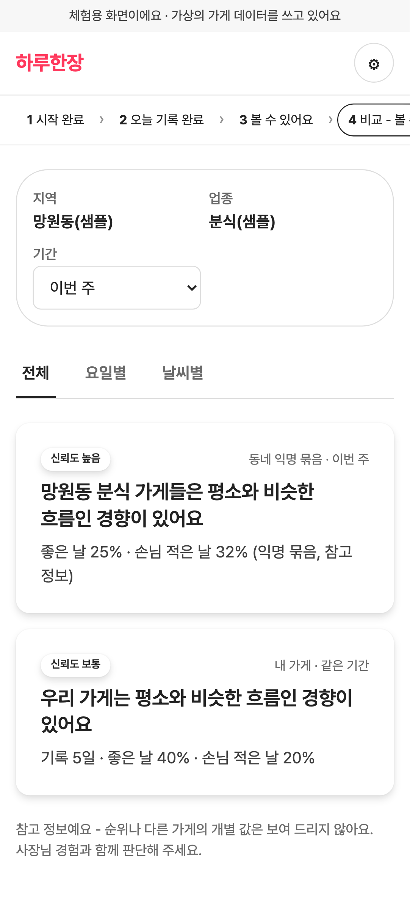

- 기간(이번 주 / 이번 달)과 관점(전체 / 요일별 / 날씨별)을 고를 수 있습니다.
- 왼쪽은 동네 익명 묶음, 오른쪽은 내 가게의 같은 기간 흐름입니다.

### 비교가 막혀 있을 때

| 표시 | 이유 | 푸는 방법 |
|---|---|---|
| "동네 흐름을 보려면 익명 참여가 필요해요" (G4) | 익명 통계 참여에 동의하지 않았어요 | 「익명 참여 동의하기」 → 체크 → 동의 |
| "아직 우리 동네 자료가 모이는 중이에요" (G5) | 같은 동네 같은 업종 참여 가게가 기준보다 적어요 | 참여 가게가 늘면 **자동으로** 풀려요 (직접 풀 수 없음) |

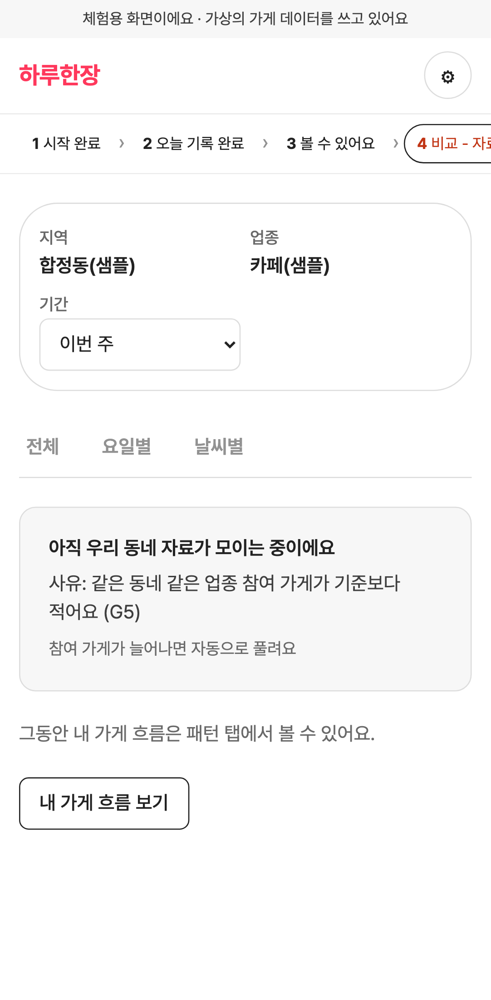

- 자료가 모이는 동안에는 「내 가게 흐름 보기」로 패턴 화면을 이용하세요.
- 익명 참여를 그만두면(설정) 이후 동네 묶음에서 내 기록이 바로 빠집니다.

---

## 8. 사장님 — 더 자세히(유료): 상세보고서·내보내기

패턴 화면 아래 「상세보고서 받기 (유료)」를 누릅니다. 기본 기능(기록·달력·패턴·비교)은 결제와 상관없이 무료입니다.

1. **상세보고서 받기** 또는 **기록 백업 · 내보내기** 를 고릅니다.
2. 이용 권한이 없으면 「결제하기」를 누릅니다. (체험에서는 결제 결과를 성공·실패·취소 중에서 고를 수 있습니다.)
3. 보고서는 **기간**(최근 2주 / 4주 / 8주)을 고르고 「보고서 만들기」를 누릅니다. 그 기간 기록이 기준보다 적으면 만들 수 없습니다.
4. **이 파일에 들어가는 정보**를 읽고 「들어가는 정보를 확인했어요」에 체크해야 「보고서 받기」가 켜집니다.
5. 받지 않으려면 「받지 않기」를 누르면 됩니다.

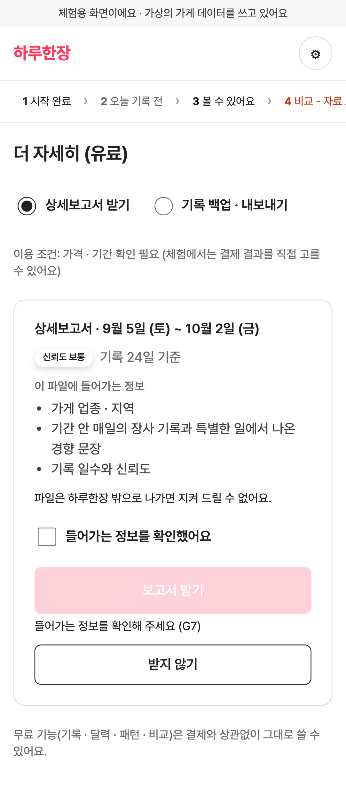

- 보고서는 인쇄용 웹 문서(HTML), 백업·내보내기는 엑셀에서 열 수 있는 CSV 파일입니다. (파일 형식은 정식 서비스 전에 바뀔 수 있습니다.)
- 파일은 하루한장 밖으로 나가면 보호해 드릴 수 없으니 보관에 주의하세요.
- 이미 받은 파일은 같은 화면 「지난 파일」에서 다시 받을 수 있습니다.

---

## 9. 사장님 — 설정·탈퇴

화면 오른쪽 위 **⚙** 를 누릅니다.

| 항목 | 할 수 있는 것 |
|---|---|
| 가게 | 업종·지역 확인 (바꾸기는 아직 지원하지 않음) |
| 쉬는 요일 | 요일을 고르고 「저장」 |
| 경보 알림 | 켜면 알림 권한을 묻습니다. 끄면 앱 안에서만 보여 줍니다 |
| 동네 익명 통계 참여 | 켜기 / 그만두기 (그만두면 동네 묶음에서 바로 빠짐) |
| 로그아웃 | 이 기기에 남은 기록 사본도 지웁니다 |
| 탈퇴하기 | 확인 체크 후 「탈퇴」 — 계정·가게 정보·모든 기록·경보·보고서 이력이 **바로 지워지고 되돌릴 수 없습니다** |

---

## 10. 지자체·상인회 — 상권 대시보드

첫 화면 아래 「지자체·상인회 로그인」에서 발급받은 아이디·비밀번호로 들어갑니다. 컴퓨터 화면에 맞춰져 있습니다.

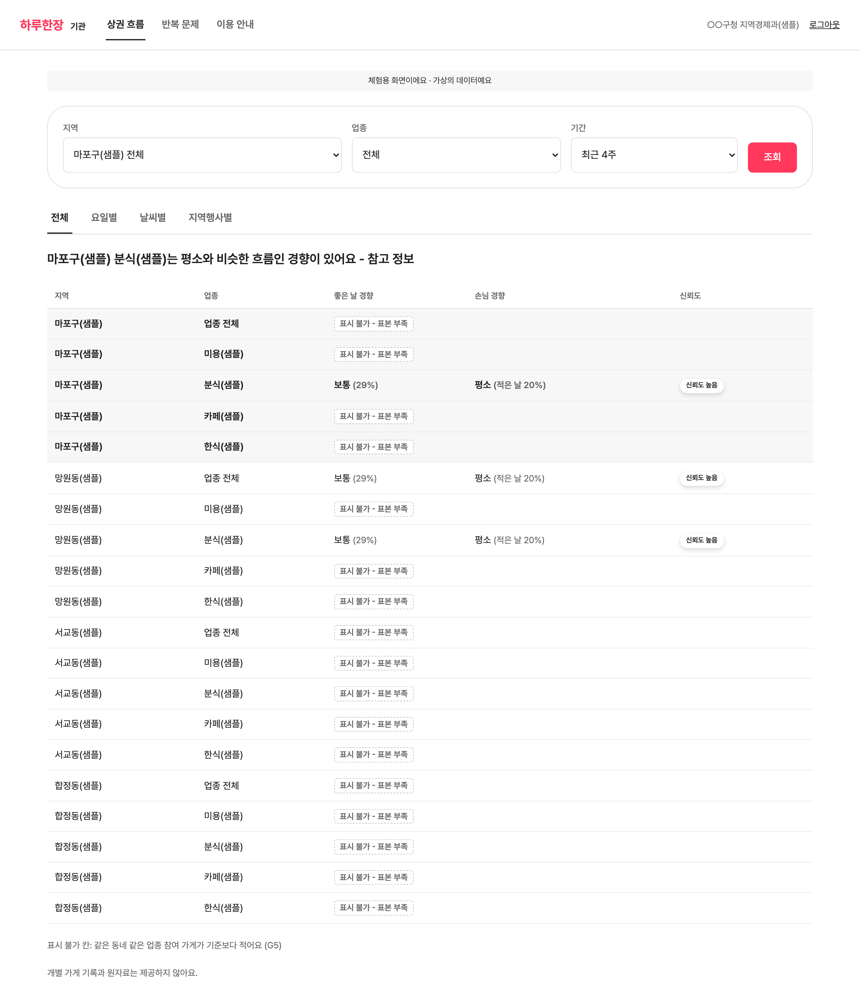

### 상권 흐름

1. **지역**(관할 구 전체 또는 동), **업종**(전체 또는 하나), **기간**(1주 / 4주 / 8주)을 고르고 「조회」를 누릅니다.
2. 지역 × 업종 표에서 칸마다 **좋은 날 경향**, **손님 경향**, **신뢰도**를 봅니다.
3. 관점 탭(전체 / 요일별 / 날씨별 / 지역행사별)으로 나눠 볼 수 있습니다.

- **"표시 불가 - 표본 부족"**: 그 칸에 참여한 가게가 기준보다 적어 가린 칸입니다. 가린 칸을 합계에서 거꾸로 계산할 수 없도록, **가린 칸이 들어 있는 합계 칸도 함께 가립니다.**
- 모든 수치는 익명 통계 참여에 동의한 가게의 기록만 묶은 것입니다.
- **개별 가게 기록과 원자료는 제공하지 않습니다.** 평가·대출·보험 심사 등 소상공인에게 불리한 목적으로 쓸 수 없습니다.
- 조회할 때마다 조건과 시각이 기록됩니다.

### 반복 문제

관할 지역·업종에서 재료 부족·직원 결근 같은 현장 문제가 기록 중 얼마나 되풀이되는지 주 평균 비율로 보여 줍니다.

### 계약이 만료되었을 때

"대시보드를 열 수 없어요 — 이용 계약이 만료됐거나 권한이 없어요 (G8)" 가 나오고 모든 조회가 꺼집니다. 하루한장 운영자에게 계약 갱신을 요청하세요.

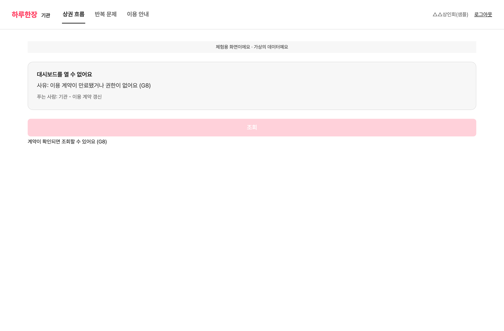

---

## 11. 운영자 — 운영 콘솔

첫 화면 아래 「운영자 로그인」으로 들어갑니다. **내 역할에 허락된 탭만** 보입니다.

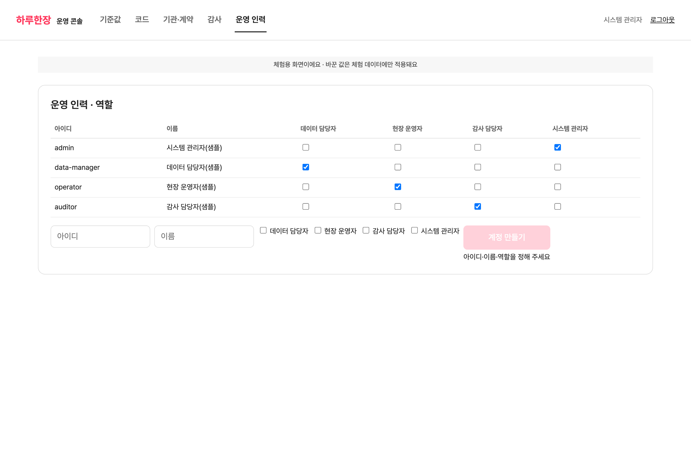

| 탭 | 볼 수 있는 역할 | 하는 일 |
|---|---|---|
| 기준값 | 데이터 담당자, 시스템 관리자 | 분석 최소 기록 수(G3), 비교 최소 참여 가게 수(G5), 경보 판정 기간, 경보 하락 폭 설정 |
| 코드 | 데이터 담당자(보기), 현장 운영자, 감사 담당자(보기), 시스템 관리자 | 지역(상위·관측소 포함), 업종, 매출 구간 추가·수정 |
| 기관·계약 | 현장 운영자, 시스템 관리자 | 기관 등록, 관할 지역, 기관 계정 발급, 계약 유효/만료 전환 |
| 감사 | 감사 담당자, 시스템 관리자 | 막힘(게이트) 이력, 파일 반출, 기관 조회, 익명 칸 가게 수, 역할 변경 이력 |
| 운영 인력 | 시스템 관리자 | 운영 인력 계정 만들기, 역할 체크로 부여·회수 |

**꼭 알아 둘 점**

- **기준값을 비우면** 그 기준을 쓰는 기능(분석·비교·경보·보고서)이 **계속 막힙니다.** 비울 때 확인 창이 한 번 더 뜹니다.
- 기관 계정·운영 인력 계정을 만들면 **임시 비밀번호가 화면에 한 번만** 보입니다. 바로 전달하세요.
- 마지막 남은 시스템 관리자의 역할이나 **자기 자신의** 관리자 역할은 뺄 수 없습니다.
- 어떤 운영 역할로도 **사장님 개별 기록은 볼 수 없습니다.** 감사 화면도 이력과 칸 단위 숫자까지만 보여 줍니다.
- 처음 운영을 시작할 때 첫 관리자 계정은 서버에서 `cd backend && npm run admin:bootstrap -- --login <아이디>` 로 만듭니다(비밀번호는 실행 중에 입력).

---

## 12. 화면이 막혔을 때

하루한장은 진행이 막히면 **버튼을 끄고, 바로 아래에 이유를 계속 보여 줍니다.** 막힘 안내는 항상 "사유 · 푸는 사람 · 다음 행동" 세 줄로 나옵니다.

| 코드 | 어디서 | 이유 | 푸는 방법 |
|:--:|---|---|---|
| G0 | 가게 시작하기 | 필수 동의가 필요해요 | 필수 항목에 체크 |
| G1 | 가게 시작하기 | 업종과 지역은 꼭 필요해요 | 업종·지역 고르기 |
| G2 | 오늘 기록 | 오늘장사와 손님 수는 꼭 필요해요 | 두 가지 고르기 |
| G3 | 패턴·보고서 | 기록이 기준보다 적어요 | 기록 이어 가기(기준을 넘으면 자동으로 풀림) |
| G4 | 동네 비교 | 익명 통계 참여에 동의하지 않았어요 | 익명 참여 동의 |
| G5 | 동네 비교·기관 표 | 같은 동네 같은 업종 참여 가게가 적어요 | 참여 가게가 늘면 자동으로 풀림 |
| G6 | 유료 기능 | 결제가 완료되지 않았어요 | 결제하기 |
| G7 | 유료 기능 | 들어가는 정보를 확인해 주세요 | 확인 체크 |
| G8 | 기관 대시보드 | 이용 계약이 만료됐거나 권한이 없어요 | 기관이 계약 갱신 요청 |

---

## 13. 자주 묻는 질문

**Q. 날씨가 계속 '확인 필요'로 나와요.**
기상청 날씨 자료는 다음 날 나오기 때문에 처음에는 '확인 필요'입니다. 하루 두 번 자동으로 다시 확인합니다. 현재 체험 환경은 공공데이터 서비스 키가 연결되지 않아 새로 저장한 날의 날씨는 '확인 필요'로 남습니다.

**Q. "경향이 있어요"라고만 하고 이유를 말해 주지 않아요.**
기록만으로는 원인을 확실히 알 수 없기 때문에 일부러 단정하지 않습니다. 참고 정보로 보시고 사장님 경험과 함께 판단해 주세요.

**Q. 다른 가게가 제 기록을 볼 수 있나요?**
아니요. 비교는 익명 묶음으로만 만들고, 어느 가게인지·몇 등인지는 누구에게도 보여 주지 않습니다. 참여 가게가 적은 칸은 아예 가립니다. 지자체·상인회와 운영자도 개별 기록은 볼 수 없습니다.

**Q. 매출 금액을 적어야 하나요?**
아니요. 매출은 금액이 아니라 구간으로만, 원할 때만 고릅니다.

**Q. 알림이 오지 않아요.**
설정 → 경보 알림을 켜고 휴대폰의 알림 권한을 허용하세요. 아이폰은 하루한장을 홈 화면에 추가한 뒤에만 알림을 받을 수 있습니다. 알림을 받을 수 없을 때도 경보는 패턴 화면에서 카드로 볼 수 있습니다. (현재 체험 환경은 알림 발송이 설정되어 있지 않아 앱 안 카드로만 보입니다.)

**Q. 업종이나 지역을 바꾸고 싶어요.**
아직 지원하지 않습니다. 운영자에게 문의해 주세요.

---

## 14. 체험 계정 안내 (아이디·비밀번호 전체)

현재 공개 주소(https://p2.sumzip.com)는 체험용입니다. 아래가 체험용 계정 **전체**입니다.

### 사장님 — 로그인 주소: https://p2.sumzip.com/login (첫 화면 「사장님 아이디로 로그인」)

| 아이디 | 비밀번호 | 가게 | 체험해 볼 내용 |
|---|---|---|---|
| `owner-starter` | `hrh1234` | 망원동 분식 · 기록 6일 | 첫 기록, 패턴 준비 중(G3), 비교 잠김(G4) |
| `owner-steady` | `hrh1234` | 망원동 분식 · 기록 두 달 | 달력·패턴·동네 비교 |
| `owner-declining` | `hrh1234` | 망원동 분식 · 최근 조용함 | 조기 경보 |
| `owner-paid` | `hrh1234` | 합정동 카페 · 유료 이용 | 상세보고서 받기 전 확인(G7), 백업 결제(G6) |
| `owner-cafe-neighbor` | `hrh1234` | 합정동 카페 · 이웃 적음 | 동네 자료 모이는 중(G5) |
| `owner-neighbor-1` | `hrh1234` | 망원동 분식 이웃 1 | 동네 묶음을 채우는 가게 |
| `owner-neighbor-2` | `hrh1234` | 망원동 분식 이웃 2 | 동네 묶음을 채우는 가게 |
| `owner-neighbor-3` | `hrh1234` | 망원동 분식 이웃 3 | 동네 묶음을 채우는 가게 |
| `owner-yeonhui` | `hrh1234` | 연희동 한식(서대문구) | 기관 관할 밖 가게 |

가입 과정(가게 시작하기)을 체험하려면 아이디 없이 첫 화면의 **「처음 오신 사장님」** 버튼을 누르세요. 첫 화면의 다른 가게 버튼도 위 아이디와 같은 가게로 비밀번호 없이 들어갑니다.

### 지자체·상인회 — 로그인 주소: https://p2.sumzip.com/org/login

| 아이디 | 비밀번호 | 기관 | 체험해 볼 내용 |
|---|---|---|---|
| `mapo-econ` | `hrh1234` | ○○구청 지역경제과(샘플) · 계약 유효 · 관할 마포구 | 상권 대시보드, 표시 불가 칸, 반복 문제 |
| `expired-merchant` | `hrh1234` | △△상인회(샘플) · 계약 만료 | 계약 만료 화면(G8) |

### 운영자 — 로그인 주소: https://p2.sumzip.com/staff/login

| 아이디 | 비밀번호 | 역할 | 보이는 탭 |
|---|---|---|---|
| `admin` | `hrh1234` | 시스템 관리자 | 기준값 · 코드 · 기관·계약 · 감사 · 운영 인력 |
| `data-manager` | `hrh1234` | 데이터 담당자 | 기준값 · 코드(보기) |
| `operator` | `hrh1234` | 현장 운영자 | 코드 · 기관·계약 |
| `auditor` | `hrh1234` | 감사 담당자 | 코드(보기) · 감사 |

비밀번호를 5번 틀리면 15분 동안 잠깁니다. 운영 콘솔에서 새로 만든 계정은 임시 비밀번호가 만들 때 한 번만 화면에 보이므로 이 표에 없습니다.

> 체험 데이터는 누구나 바꿀 수 있습니다. 처음 상태로 되돌리려면 서버에서 `cd backend && npm run db:seed:dev` 를 실행합니다.

---

*하루한장 사용자 매뉴얼 · 2026-10-03 · 화면 사진은 공개 주소에서 찍은 체험 화면입니다.*
